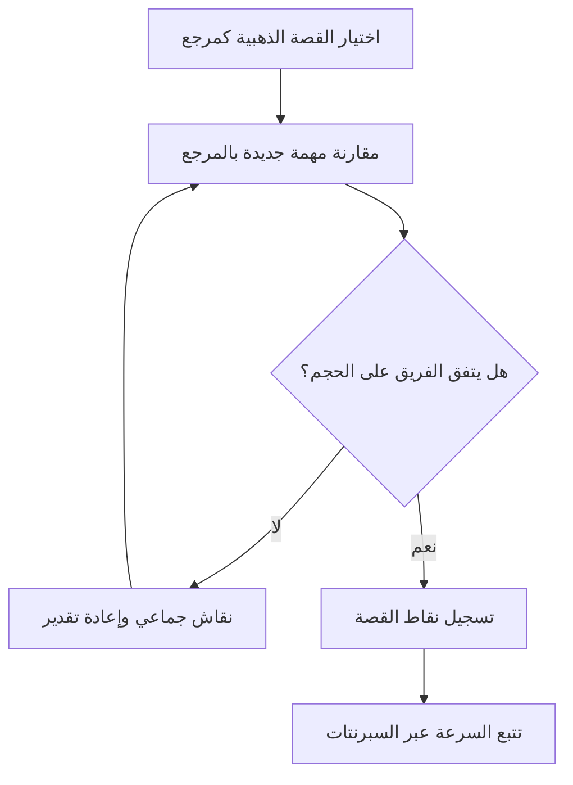

# التقدير النسبي (Relative Estimation)
> [!info] تعريف مختصر
> التقدير النسبي (Relative Estimation) هو أسلوب لتقدير حجم المهام بمقارنتها ببعضها البعض (أكبر أم أصغر؟ بكم مرة؟) بدلًا من تقدير الوقت الدقيق بالساعات، وذلك باستخدام وحدات نسبية مثل نقاط القصة (Story Points).

## الشرح العلمي والاحترافي
- الفكرة الأساسية: العقل البشري أدق في مقارنة الأشياء نسبيًا ("هذه المهمة تبدو ضعف تلك") من تقدير الزمن المطلق بدقة ("هذه المهمة ستستغرق 7.5 ساعة بالضبط")، لأن التقدير المطلق يتأثر بعوامل شخصية وتحيّزات معرفية كثيرة.
- يعتمد الفريق على مفهوم "القصة الذهبية" (Golden Story): وهي مهمة مرجعية معروفة الحجم يتفق عليها الفريق مسبقًا (مثلًا: "تسجيل الدخول البسيط = نقطة قصة واحدة")، ثم تُقارَن كل المهام الجديدة بها.
- الوحدات الشائعة للتقدير النسبي تشمل نقاط القصة (Story Points) بأرقام فيبوناتشي المعدّلة (1، 2، 3، 5، 8، 13، 20، 40، 100)، أو أحجام قمصان (T-Shirt Sizing: S, M, L, XL).
- الفجوات المتزايدة بين الأرقام (مثل الانتقال من 5 إلى 8 بدلًا من 5 إلى 6) تعكس عدم اليقين المتزايد في المهام الأكبر: كلما كبرت المهمة، صعُب تقدير حجمها بدقة، فلا داعي للتظاهر بدقة زائفة.
- يفصل التقدير النسبي بشكل متعمد بين "الحجم/التعقيد" (Size/Complexity) و"الوقت" (Time)، لأن نفس المهمة قد تستغرق وقتًا مختلفًا حسب من ينفذها، لكن تعقيدها النسبي يبقى ثابتًا نسبيًا بين أعضاء الفريق.
- بعد عدة سبرنتات، يمكن تحويل نقاط القصة إلى وقت تقريبي باستخدام [[Velocity]] الفريق التاريخية (مثلًا: الفريق ينجز 30 نقطة لكل سبرنت من أسبوعين).

## أين ومتى يُستخدم
- في جلسات [[Planning Poker]] أثناء [[Backlog Refinement]] و[[08 - Sprint Planning]] في فرق Scrum وKanban.
- عند تقدير Backlog كامل في بداية مشروع Agile قبل معرفة تفاصيل التنفيذ الدقيقة.
- مفيد بشكل خاص عندما يضم الفريق مستويات خبرة متفاوتة، لأنه يقلل تحيّز الخبير الفردي عبر النقاش الجماعي.
- أقل ملاءمة في المشاريع Waterfall الصارمة أو العقود التي تتطلب التزامًا بالساعات الدقيقة منذ البداية.

## مثال وسيناريو تطبيقي
> [!example] فريق تطوير منصة تعليمية "منارة" يقدّر Backlog جديدًا من 15 قصة مستخدم (User Story). اتفق الفريق أولًا على "القصة الذهبية": مهمة "إضافة زر مشاركة بسيط لصفحة الدورة" = نقطة قصة واحدة (1).
> - عند مناقشة قصة "بناء نظام اختبارات تفاعلي مع تصحيح تلقائي"، قارنها الفريق بالقصة الذهبية ووجدوا أنها أكبر بكثير وأكثر غموضًا، فاتفقوا على 13 نقطة.
> - قصة "تعديل نص زر تسجيل الدخول" قوّرنت بالقصة الذهبية ووُجدت أصغر بكثير، فأُعطيت نقطة واحدة (1) أيضًا.
> - بعد 3 سبرنتات، لاحظ مدير المشروع أن الفريق ينجز في المتوسط 25 نقطة لكل سبرنت (Velocity)، فاستخدم هذا الرقم للتنبؤ بأن الـ Backlog المتبقي (75 نقطة) سيُنجز خلال 3 سبرنتات إضافية تقريبًا.

## خطوات أو مخطّط
1. اختيار مهمة مرجعية معروفة الحجم يتفق عليها الفريق ("القصة الذهبية").
2. تحديد وحدة التقدير النسبي (نقاط فيبوناتشي أو أحجام قمصان).
3. مقارنة كل مهمة جديدة بالمهمة المرجعية: هل هي أكبر أم أصغر؟ بكم مرة تقريبًا؟
4. مناقشة أي خلاف كبير في التقدير بين أعضاء الفريق (كما في [[Planning Poker]]) حتى الوصول لتوافق.
5. تسجيل النقاط النهائية في Backlog.
6. تتبع [[Velocity]] الفريق عبر السبرنتات لتحويل النقاط إلى تقدير زمني تقريبي مستقبلًا.

## ⚠️ مفاهيم خاطئة شائعة
> [!warning]
> - الاعتقاد أن نقطة القصة تساوي عدد ساعات ثابت (مثل "نقطة = 4 ساعات دائمًا")؛ الصحيح أنها مقياس نسبي للتعقيد والجهد، والعلاقة بالوقت تختلف من فريق لآخر.
> - مقارنة نقاط القصة بين فرق مختلفة (مثل "فريقنا أسرع لأنه ينجز 40 نقطة وفريقهم 20")؛ هذا خطأ لأن كل فريق يبني مقياسه النسبي الخاص به.
> - الخلط بين حجم المهمة (Size) وأولويتها (Priority)؛ فالتقدير النسبي يقيس الحجم فقط، والأولوية تُحدَّد بأدوات أخرى مثل [[MoSCoW Prioritization]].

## ❌ ممارسات خاطئة في المشاريع
> [!failure]
> - تحويل نقاط القصة إلى ساعات بشكل جامد وإلزامي (مثل "كل نقطة = 6 ساعات بالضبط")، مما يفقد الأسلوب مرونته ويعيد المشكلة التي جاء لحلّها أصلًا.
> - عدم إعادة تعريف "القصة الذهبية" عند تغيّر تركيبة الفريق بشكل كبير، فتصبح المقارنات النسبية غير متسقة مع الفريق الجديد.
> - استخدام سرعة الفريق (Velocity) كأداة ضغط أو مقارنة تنافسية بين الفرق، مما يدفع الفرق لتضخيم تقديراتها بدلًا من تقديرها بصدق.

## 🔗 مصطلحات ومفاهيم ذات صلة
[[Planning Poker]] | [[T-Shirt Sizing]] | [[Estimation Variance]] | [[Original Estimate]] | [[Man-Day and Person-Day]] | [[Monte Carlo Simulation]] | [[Backlog Refinement]] | [[Little's Law]] | [[12 - Story Points]] | [[18 - Velocity]]
