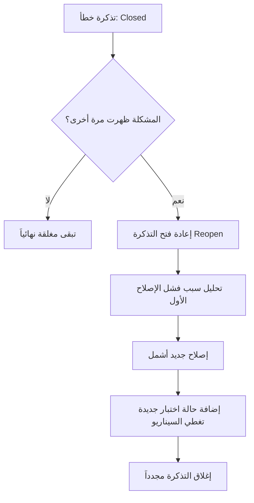

# إعادة الفتح (Reopen)
> [!info] تعريف مختصر
> إعادة الفتح (Reopen) هو تغيير حالة خطأ (Bug) أو مهمة كانت مُغلَقة أو "تم إصلاحها" (Fixed/Closed) للعودة إلى حالة نشطة، بعد اكتشاف أن الإصلاح لم يعمل فعلياً أو أن المشكلة ظهرت مرة أخرى.

## الشرح العلمي والاحترافي
- في دورة حياة الخطأ (Bug Lifecycle) النموذجية، يمرّ الخطأ بحالات مثل: New → In Progress → Fixed → In Testing → Closed. حالة "Reopen" تكسر هذا التسلسل الطبيعي وتعيد الخطأ إلى مرحلة سابقة، عادة "In Progress" أو "New" مرة أخرى.
- يحدث ذلك عادة عندما يختبر فريق ضبط الجودة (QC) الإصلاح المُقدَّم ([[QA vs QC]]) ويكتشف أن المشكلة الأصلية لا تزال موجودة، أو أن الإصلاح تسبب في مشكلة جديدة (Regression).
- معدل إعادة الفتح (Reopen Rate) مؤشر جودة مهم: نسبة عالية منه تعني أن المطوّرين يصلحون الأخطاء بسرعة دون فهم كافٍ للسبب الجذري ([[Root Cause Analysis]])، أو أن حالات الاختبار المستخدمة للتحقق من الإصلاح غير كافية.
- يختلف "Reopen" عن الخطأ المتكرر الجديد (New Bug)؛ إعادة الفتح تعني تحديداً أن نفس تذكرة الخطأ (Ticket) الأصلية عادت للحياة، وليس فتح تذكرة جديدة لمشكلة مشابهة.
- يرتبط ارتباطاً مباشراً بنسبة إعادة العمل ([[Rework Percentage]])؛ كل عملية إعادة فتح تعني عملاً إضافياً غير مخطَّط له يستهلك وقت المطوّر ووقت فريق الاختبار مرة أخرى.
- في لوحات كانبان وسكرَم، تُميَّز المهام المُعاد فتحها غالباً بعلامة أو تصنيف خاص لتتبعها بشكل منفصل عن المهام الجديدة تماماً.

## أين ومتى يُستخدم
- يُستخدم في أنظمة تتبع الأخطاء (Bug Tracking Systems) مثل Jira أو Azure DevOps، كحالة (Status) رسمية ضمن دورة حياة التذكرة.
- يظهر أثناء اختبار الانحدار ([[Regression Testing]]) عندما يتحقق فريق الاختبار من أن الإصلاح السابق لا يزال صامداً بعد تغييرات جديدة في الكود.
- يُتابَع كمؤشر (KPI) في تقارير الجودة الدورية لقياس فعالية عملية الإصلاح داخل الفريق.
- يُستخدم في اختبار قبول المستخدم ([[UAT]]) عندما يرفض العميل إصلاحاً مُقدَّماً لأنه لم يحل المشكلة من وجهة نظره فعلياً.

## مثال وسيناريو تطبيقي
> [!example] سيناريو
> في تطبيق توصيل طعام، أبلغ أحد المستخدمين عن خطأ: "زر إلغاء الطلب لا يعمل بعد مرور 5 دقائق من الطلب." أصلح المطوّر الكود، وأغلق فريق الجودة التذكرة (Closed) بعد اختبار سريع.
> بعد أسبوعين، اكتشف مستخدم آخر أن نفس المشكلة تحدث لكن فقط عندما يكون الطلب يحتوي على أكثر من عنصر واحد. أعاد فريق الجودة فتح التذكرة الأصلية (Reopen) بدلاً من إنشاء تذكرة جديدة، لأن السبب الجذري واحد.
> راجع المطوّر الكود، ووجد أن الإصلاح الأول عالج حالة واحدة فقط من حالات الشرط الفعلي، فأضاف إصلاحاً أشمل. هذه المرة، أضاف فريق الاختبار حالة اختبار إضافية تغطي "طلب متعدد العناصر" لتجنب إعادة فتح التذكرة مرة ثالثة.

## خطوات أو مخطّط
1. اكتشاف أن خطأ سابق "مغلق" لا يزال موجوداً أو ظهر من جديد بنفس السبب.
2. البحث عن تذكرة الخطأ الأصلية في نظام تتبع الأخطاء بدلاً من إنشاء تذكرة جديدة مباشرة.
3. تغيير حالة التذكرة إلى "Reopen" مع توثيق دقيق لكيفية إعادة ظهور المشكلة وأي فرق عن المرة الأولى.
4. إعادة تعيين التذكرة للمطوّر المسؤول لتحليل سبب فشل الإصلاح الأول.
5. بعد الإصلاح الجديد، إضافة حالة اختبار إضافية تحديداً للسيناريو الذي سبّب إعادة الفتح، لمنع تكراره مستقبلاً.

## ⚠️ مفاهيم خاطئة شائعة
> [!warning]
> - الاعتقاد أن أي مشكلة مشابهة يجب أن تُسجَّل كتذكرة جديدة دائماً؛ إذا كان السبب الجذري نفسه، الأصح إعادة فتح التذكرة الأصلية للحفاظ على تاريخ المشكلة الكامل.
> - الظن أن إعادة الفتح تعني بالضرورة تقصيراً من المطوّر؛ أحياناً يكون السبب حالة استخدام (Use Case) لم تكن مغطاة في الاختبار الأول أصلاً.
> - تجاهل تتبع معدل إعادة الفتح كمؤشر جودة؛ ارتفاعه المستمر يكشف مشكلة حقيقية في عملية الإصلاح أو الاختبار تستحق المعالجة الجذرية.

## ❌ ممارسات خاطئة في المشاريع
> [!failure]
> - إنشاء تذكرة جديدة تماماً لكل مشكلة مشابهة بدلاً من إعادة فتح الأصلية، مما يُفقد الفريق سياق المشكلة وتاريخها الكامل. التجنب: البحث دائماً عن تذكرة سابقة مشابهة قبل إنشاء تذكرة جديدة.
> - إغلاق التذاكر بسرعة دون اختبار كافٍ للتحقق من الإصلاح، مما يرفع معدل إعادة الفتح باستمرار. التجنب: الالتزام بحالة اختبار واضحة (Given When Then) قبل تغيير حالة أي تذكرة إلى Closed.
> - عدم تحليل سبب تكرار إعادة الفتح لنفس النوع من الأخطاء عبر الزمن. التجنب: مراجعة دورية لمعدل إعادة الفتح ([[Rework Percentage]]) وربطها بتحليل جذر المشكلة ([[Root Cause Analysis]]).

## 🔗 مصطلحات ومفاهيم ذات صلة
[[QA vs QC]] | [[Regression Testing]] | [[Rework Percentage]] | [[Root Cause Analysis]] | [[Severity vs Priority]] | [[UAT]] | [[Escaped Defect Rate]] | [[Given When Then]] | [[Expected Bug Rate]]
