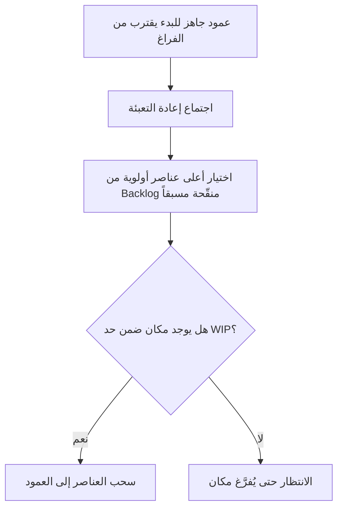

# إعادة التعبئة (Replenishment)

> [!info] تعريف مختصر
> إعادة التعبئة (Replenishment) هي العملية الدورية في كانبان (Kanban) التي يُختار فيها عدد محدود من عناصر العمل من قائمة الانتظار (Backlog) ويُضاف إلى بداية سير العمل، بما يتناسب مع السعة المتاحة فعلياً لدى الفريق.

## الشرح العلمي والاحترافي
- على عكس سكرَم الذي يخطط لكل السبرنت دفعة واحدة في اجتماع تخطيط السبرنت (Sprint Planning)، يعتمد كانبان على تدفق مستمر، فيحتاج آلية دورية "لتعبئة" أول عمود في اللوحة بعناصر جديدة فقط عند وجود مساحة.
- اجتماع إعادة التعبئة (Replenishment Meeting) يُعقد بوتيرة منتظمة (أسبوعياً مثلاً) أو عند الحاجة (Just-In-Time)، ويجمع فيه صاحب المنتج أو من يمثله مع الفريق لاختيار العناصر التالية الأكثر أولوية من الـ Backlog.
- يرتبط مباشرة بنظام السحب (Pull System): لا تُدفع مهام جديدة إلى اللوحة تلقائياً، بل تُسحب فقط عندما يفرغ مكان ضمن حد العمل الجاري (WIP Limit) في أول عمود.
- يتطلب أن تكون العناصر المرشحة للتعبئة قد خضعت مسبقاً لتنقيح قائمة الانتظار (Backlog Refinement)، أي أنها واضحة بما يكفي لتُفهَم وتُقدَّر بسرعة دون نقاش مطوّل أثناء الاجتماع نفسه.
- يمنع تكدّس عناصر عمل غير جاهزة في اللوحة، ويحافظ على تدفق صحي يتماشى مع قانون ليتل (Little's Law): إبقاء المدخلات متزامنة مع القدرة الفعلية على الإنجاز.

## أين ومتى يُستخدم
- ركيزة من ممارسات كانبان ([[03 - Kanban]])، وتحديداً في الفرق التي تتبع تدفقاً مستمراً بلا سبرنتات ثابتة.
- تُستخدم أيضاً في هجين سكرمبان (Scrum-ban) كبديل مرن لاجتماع تخطيط السبرنت التقليدي.
- تُعقد كلما اقترب أول عمود من اللوحة (مثل "التالي" أو "جاهز للبدء") من الفراغ، لا وفق تقويم صارم بالضرورة.

## مثال وسيناريو تطبيقي
> [!example] فريق تطوير في شركة "مدار السحابية" يعمل بكانبان بلا سبرنتات. لدى اللوحة عمود "التالي" بحد WIP = 5. كل يوم ثلاثاء، يجتمع مالك المنتج مع قائد الفريق لمدة 15 دقيقة فقط ("اجتماع إعادة التعبئة")، يراجعان فيه قائمة الانتظار المُنقَّحة مسبقاً ويختاران أعلى 2-3 عناصر أولوية لملء الأماكن الشاغرة في عمود "التالي" بعد أن سُحبت عناصر أخرى للتنفيذ خلال الأسبوع. لا يُدخَل أي عنصر غير مُنقَّح (بلا معايير قبول واضحة) إلى هذا العمود، فيبقى تدفق العمل سلساً دون تكدّس عناصر غامضة.

## خطوات أو مخطّط
1. راقب مستوى الامتلاء في أول عمود من سير العمل (عمود "التالي" أو "جاهز").
2. عند اقترابه من الفراغ، اعقد اجتماع إعادة تعبئة قصيراً مع صاحب المنتج أو المسؤول عن الأولويات.
3. اختر من الـ Backlog العناصر الأعلى أولوية والمُنقَّحة مسبقاً فقط.
4. أضف العدد المطلوب فقط بما يحترم حد العمل الجاري لذلك العمود، دون تجاوز.
5. كرر العملية دورياً أو عند الحاجة، دون انتظار موعد ثابت صارم إذا استدعى الأمر.

## ⚠️ مفاهيم خاطئة شائعة
> [!warning]
> - الاعتقاد أن إعادة التعبئة تعني تخطيطاً شاملاً لكل العمل القادم دفعة واحدة كما في تخطيط السبرنت؛ في الواقع هي عملية جزئية ومستمرة تملأ فقط المساحة الشاغرة.
> - الظن أنها تحدث تلقائياً دون اجتماع؛ عملياً تحتاج نقطة تنسيق بشرية قصيرة لاختيار الأولويات، حتى لو كانت غير رسمية.
> - الخلط بينها وبين تنقيح قائمة الانتظار (Backlog Refinement)؛ التنقيح يُحضِّر العناصر مسبقاً، بينما إعادة التعبئة تختار منها فقط وقت الحاجة.

## ❌ ممارسات خاطئة في المشاريع
> [!failure]
> - تعبئة اللوحة بعناصر غير منقّحة أو غامضة لمجرد ملء الفراغ، مما يوقف العمل عند وصول الدور الفعلي للتنفيذ؛ التجنب: عدم تعبئة أي عنصر لم يخضع لتنقيح كافٍ.
> - تجاهل الاجتماع الدوري وترك العمود يفرغ تماماً فيتوقف الفريق عن العمل؛ التجنب: مراقبة مستوى الامتلاء بانتظام والتعبئة قبل الفراغ الكامل.
> - إضافة عدد كبير من العناصر دفعة واحدة يتجاوز حد العمل الجاري بحجة "توفير الوقت"؛ التجنب: الالتزام الصارم بحد WIP عند كل تعبئة مهما كان الإغراء.

## 🔗 مصطلحات ومفاهيم ذات صلة
[[03 - Kanban]] | [[Pull System]] | [[Backlog]] | [[Backlog Refinement]] | [[WIP Limit]] | [[Little's Law]] | [[Scrum-ban]] | [[08 - Sprint Planning]] | [[Explicit Policies]]
