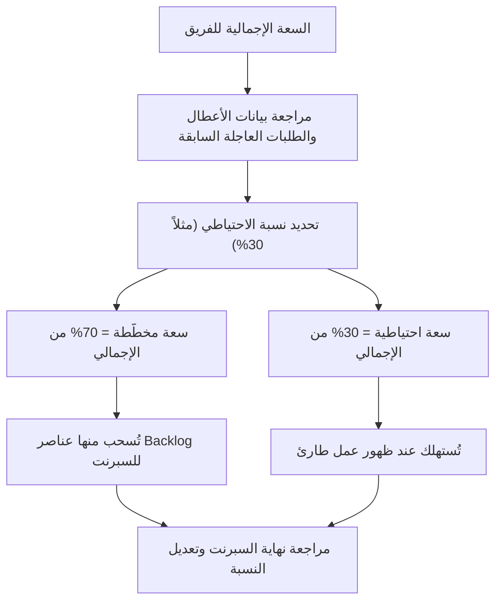

# حجز السعة (Reserve Capacity)
> [!info] تعريف مختصر
> حجز السعة (Reserve Capacity) هو تخصيص جزء من طاقة الفريق (Capacity) مسبقًا للتعامل مع الأعمال غير المخطَّطة، مثل الأعطال العاجلة (Hotfix) والدعم الفني وطلبات التغيير المفاجئة، بدلاً من التخطيط لاستهلاك 100% من الطاقة على المهام المجدولة فقط.

## الشرح العلمي والاحترافي
- **ما هو**: عند تخطيط السبرنت (Sprint) أو أي دورة عمل، لا يُخصَّص كامل وقت الفريق لعناصر الـ Backlog المخطَّطة. بل يُترك جزء - غالبًا نسبة مئوية ثابتة - كهامش احتياطي غير مشغول مسبقًا.
- **لماذا يهم**: أي فريق برمجي يتعرض دائمًا لمقاطعات غير متوقعة: أعطال إنتاج (Production Bugs)، طلبات دعم عاجلة من العملاء، اجتماعات طارئة، أو مساعدة فرق أخرى. إن لم يُحجز جزء من الطاقة لهذه الأمور، فسيتم تأخير المهام المخطَّطة أو العمل بساعات إضافية مرهقة (انظر [[Sustainable Pace]]).
- **كيف يعمل عمليًا - قاعدة 70/30 الشهيرة**: يخصَّص نحو 70% من طاقة الفريق للعمل المخطَّط (Sprint Backlog) و30% كسعة احتياطية للطوارئ وغير المتوقع. النسبة الدقيقة تختلف حسب طبيعة المشروع؛ فرق الصيانة والدعم قد تحتاج احتياطيًا أكبر (40-50%)، بينما فرق تطوير منتجات جديدة قد تكتفي بـ 10-20%.
- **العلاقة بمفاهيم أخرى**: حجز السعة هو تطبيق عملي لفكرة [[Contingency Reserve]] لكن على مستوى وقت الفريق وليس الميزانية أو الجدول الزمني فقط. كما يرتبط بمفهوم [[100 Percent Utilization Fallacy]] الذي يشرح لماذا التخطيط لاستهلاك كامل الطاقة يؤدي إلى تباطؤ النظام بأكمله (وفق [[Little's Law]]).

## أين ومتى يُستخدم
- في تخطيط السبرنت ضمن Scrum عند حساب [[Capacity]] الفريق قبل سحب عناصر من [[Backlog]].
- في فرق الدعم والصيانة وفرق DevOps/SRE حيث تكون الانقطاعات (Interrupts) جزءًا يوميًا من العمل.
- في [[Scrum-ban]] وأنظمة Kanban من خلال تخصيص مسار (Swimlane) أو حد [[WIP Limit]] خاص بالعمل العاجل، وهو ما يُعرف أحيانًا بمسار الاستعجال [[Expedite Class]].
- في التخطيط الأعلى مستوى (Program/Portfolio) عند حساب سعة فرق متعددة على مدى عدة أشهر لتفادي الالتزام الزائد (Overcommitment).

## مثال وسيناريو تطبيقي
> [!example] فريق تطوير تطبيق "متجري" التجاري
> فريق مكوَّن من 5 مطورين، وسعة كل سبرنت أسبوعين تعادل نظريًا 400 ساعة عمل (5 أشخاص × 8 ساعات × 10 أيام). في اجتماع تخطيط السبرنت، اقترح Product Owner جدولة عناصر تعادل 400 ساعة كاملة.
> اعترض Scrum Master موضحًا أن السبرنت الماضي شهد 3 أعطال إنتاج عاجلة استهلكت 90 ساعة غير مخطَّطة، مما أدى إلى تأجيل نصف الالتزامات.
> اتفق الفريق على تطبيق قاعدة 70/30: تُحجز 30% (نحو 120 ساعة) كسعة احتياطية للطوارئ والدعم، ولا يُخطَّط إلا لِـ 280 ساعة فعلية من الـ Backlog.
> في منتصف السبرنت، ظهر عطل حرج استهلك 40 ساعة. بفضل الاحتياطي، أُصلح العطل دون المساس بالتزامات السبرنت الأساسية، وانتهى السبرنت بنجاح دون تأخير.

## خطوات أو مخطّط
1. حساب السعة الإجمالية النظرية للفريق (عدد الأفراد × الساعات المتاحة × مدة الدورة)، مع خصم الإجازات والاجتماعات الثابتة.
2. مراجعة بيانات الدورات السابقة (Historical Data) لمعرفة متوسط حجم الأعمال غير المخطَّطة (أعطال، دعم، طلبات عاجلة).
3. تحديد نسبة الاحتياطي المناسبة بناءً على هذه البيانات (مثلًا 20-30%).
4. طرح نسبة الاحتياطي من السعة الإجمالية للحصول على "السعة المخطَّط لها" الفعلية.
5. الالتزام بسحب عناصر Backlog حتى حد السعة المخطَّط لها فقط، وترك الباقي كهامش.
6. عند ظهور عمل عاجل خلال الدورة، يُستهلك من الاحتياطي أولًا لا من التزامات السبرنت.
7. في نهاية الدورة، تُقارَن نسبة الاحتياطي المستهلكة فعليًا بالمخطَّط، وتُعدَّل النسبة للدورة القادمة.

## ⚠️ مفاهيم خاطئة شائعة
> [!warning]
> - **الخلط بين حجز السعة والتكاسل**: البعض يظن أن ترك 30% من الوقت "غير مستغَل" هو هدر. الحقيقة أن هذا الهامش يحمي الجدول الزمني الكلي ويمنع تراكم المهام المتأخرة، وهو استثمار في الاستقرار وليس هدرًا.
> - **اعتقاد أن النسبة ثابتة لكل الفرق**: نسبة 70/30 هي نقطة بداية إرشادية شائعة وليست قاعدة رياضية ثابتة؛ كل فريق يجب أن يقيس واقعه الفعلي ويضبط النسبة بناءً على بياناته.
> - **الظن بأن الاحتياطي يعني عدم وجود التزام**: الاحتياطي مخصَّص للطوارئ الحقيقية فقط، لا لتبرير التسويف أو تقليل الالتزام بالأهداف المخطَّطة.

## ❌ ممارسات خاطئة في المشاريع
> [!failure]
> - **التخطيط لاستهلاك 100% من الطاقة**: يؤدي إلى وقوع الفريق في فخ [[100 Percent Utilization Fallacy]]، حيث يتحول أي عطل بسيط إلى تأخير شامل لكل المشروع. التجنب: احجز نسبة احتياطية دائمًا بناءً على بيانات فعلية.
> - **عدم مراجعة النسبة دوريًا**: بعض الفرق تحدد نسبة احتياطي في بداية المشروع ولا تعيد النظر فيها رغم تغيّر طبيعة العمل (مثلًا بعد إطلاق المنتج تزداد طلبات الدعم). التجنب: راجع نسبة الاحتياطي كل بضع دورات باستخدام مقاييس مثل [[Throughput]] و[[Cycle Time]].
> - **استهلاك الاحتياطي في عمل غير عاجل**: يسمح بعض القادة باستخدام السعة الاحتياطية لمهام "تحسينية" غير طارئة، فيختفي الهامش الوقائي عند الحاجة الفعلية إليه. التجنب: ضع تعريفًا واضحًا وموثقًا (Explicit Policies) لما يُعتبر "طارئًا" يستحق استهلاك الاحتياطي.

## 🔗 مصطلحات ومفاهيم ذات صلة
[[Capacity]] | [[Contingency Reserve]] | [[Buffer]] | [[100 Percent Utilization Fallacy]] | [[WIP Limit]] | [[Expedite Class]] | [[Little's Law]] | [[Throughput]] | [[Sustainable Pace]] | [[Scrum-ban]] | [[Blocker]] | [[Bottleneck]]
