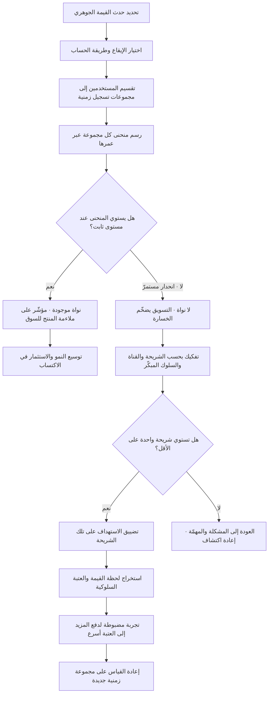

# الاحتفاظ بالمستخدمين (Retention)

> [!info] تعريف مختصر
> نسبة المستخدمين الذين عادوا إلى المنتج وأدّوا فيه فعلًا ذا قيمة بعد مرور مدّة محدَّدة على انضمامهم. وهو ليس رقمًا مفردًا بل **منحنى**: نسبة العائدين في اليوم الأول، والسابع، والثلاثين، والتسعين… محسوبة على **مجموعة تسجيل زمنية واحدة (Cohort)** يُتتبَّع مصيرها عبر الزمن. وهذا التمييز جوهري: المعدّل المفرد يخفي كل ما يهم، أما شكل المنحنى فيخبرك إن كنت تملك منتجًا يبقى الناس فيه أم دلوًا مثقوبًا تضخّ فيه ميزانية تسويق. والاحتفاظ يُعدّ عمليًّا **المؤشّر الأصدق على القيمة الحقيقية** لأنه سلوك متكرّر طوعي: المستخدم يصوّت بوقته كل مرّة، لا مرّة واحدة عند التسجيل.

## الشرح العلمي والاحترافي
- **الاحتفاظ منحنى لا نقطة**: قياس «احتفاظ اليوم السابع = 32%» بلا بقيّة المنحنى عديم الدلالة تقريبًا. المعلومة الحقيقية في **مسار الانحدار**: كل المنتجات تفقد جزءًا كبيرًا في الأيام الأولى، والفرق الحاسم هو ما يحدث بعد ذلك. لذلك يُرسم المنحنى دائمًا لعدّة مجموعات زمنية متتالية فوق بعضها، ليُقرأ الاتجاه بين المجموعات لا داخل الواحدة فقط.
- **المنحنى المسطّح مقابل المنحدر — أهم قراءة في المنتج**: إذا هبط المنحنى بحدّة ثم **استوى أفقيًّا** عند مستوى ثابت (مثلًا استقرار عند 22% من اليوم 30 إلى اليوم 120)، فهذا يعني وجود **نواة صلبة** من المستخدمين وجدت قيمة دائمة وستبقى؛ وكل مستخدم جديد تكتسبه يضيف إلى قاعدة تراكمية، فالنمو يصير مركّبًا. أما إذا استمرّ المنحنى في الانحدار نحو الصفر بلا استواء، فلا وجود لنواة أصلًا؛ وكل ريال تسويق يشتري زيارة مؤقّتة، والقاعدة الكلّية تتوقّف عن النمو في اللحظة التي يتوقّف فيها الإنفاق. الاستواء — لا الارتفاع — هو الإشارة المطلوبة، ولو كان عند مستوى متواضع.
- **العلاقة بـ[[Product-Market Fit|ملاءمة المنتج للسوق]]**: منحنى الاحتفاظ المستوي يُعدّ من أقوى الأدلّة الكمّية المتاحة على وجود ملاءمة حقيقية، وغيابه دليل مضادّ يصعب تجاهله مهما بدت أرقام التسجيل والتحميل جذّابة. والسبب منطقي: الملاءمة تعني أن المنتج يؤدّي [[Jobs to be Done|مهمّة]] حقيقية متكرّرة لشريحة محدَّدة؛ وإن أدّاها فعلًا فسيعود أصحابها. ولهذا يُنصح بعدم ضخّ ميزانيات نمو كبيرة قبل استواء المنحنى، لأن التسويق فوق منحنى منحدر يضخّم الخسارة لا الإيراد.
- **قياسه بالمجموعات الزمنية (Cohort Analysis) شرط لا خيار**: تحليل المجموعات الزمنية يعني تجميع المستخدمين بحسب فترة انضمامهم (أسبوع التسجيل مثلًا) وتتبّع كل مجموعة على حدة عبر عمرها. بدونه يختلط المستخدم الذي انضمّ أمس بمن انضمّ قبل سنتين في متوسّط واحد يتحرّك لأسباب لا علاقة لها بالمنتج — كحملة تسويقية ضخّت آلاف المسجّلين الجدد فخفضت النسبة المتوسّطة رغم أن المنتج لم يسوء. المجموعة الزمنية هي ما يجعل المقارنة **عادلة**: مجموعة يوليو في يومها الثلاثين مقابل مجموعة يونيو في يومها الثلاثين.
- **اختيار حدث الاحتفاظ نفسه قرار منتجي لا تقني**: هل «محتفَظ به» تعني فتح التطبيق؟ أم أداء الفعل الجوهري (إرسال حوالة، إصدار فاتورة، إنهاء درس)؟ الأول يُنتج رقمًا متفائلًا بلا معنى، والثاني يُنتج رقمًا أقلّ وأصدق. القاعدة المهنية: اربط الاحتفاظ بـ**الفعل الذي يمثّل القيمة**، لا بالحضور.
- **الاحتفاظ بحسب الفترة الصحيحة لإيقاع المنتج**: منتج يومي (تواصل، توصيل) يُقاس احتفاظه يوميًّا (D1/D7/D30)، ومنتج أسبوعي (إدارة مهام) أسبوعيًّا، ومنتج شهري بطبيعته (سداد فواتير، رواتب) شهريًّا. تطبيق شبكة قياس يومية على منتج شهري ينتج منحنى كارثي المظهر وسليم الواقع — وهو خطأ متكرّر في لوحات المؤشّرات الجاهزة.
- **الاحتفاظ الملساء (Rolling/Bracket) مقابل الاحتفاظ الصارم (N-day)**: الصارم يسأل «هل عاد في اليوم السابع بالضبط؟» وهو قاسٍ ومناسب للمنتجات اليومية. والملساء تسأل «هل عاد في اليوم السابع أو بعده؟» أو «هل عاد خلال الفترة 5–9؟» وهي أنسب للمنتجات ذات الاستخدام المتقطّع. اختلاف الطريقة وحده يغيّر الرقم عدّة نقاط مئوية، فذكرها بجوار الرقم واجب.
- **ثلاث مراحل متمايزة يجب فصلها**: **احتفاظ التهيئة** (الأيام 0–7) وسببه الغالب فشل الوصول إلى القيمة الأولى؛ **احتفاظ العادة** (الأسابيع 1–8) وسببه غياب دافع للعودة أو ضعف الترسّخ في روتين المستخدم؛ **احتفاظ الولاء** (بعد ذلك) وسببه المنافسة أو انتهاء الحاجة أو تراجع الجودة. علاج كل مرحلة مختلف تمامًا، ومحاولة رفع «الاحتفاظ» كرقم واحد بلا تفكيك مرحليّ تبديد للجهد.
- **علاقته العكسية المباشرة بـ[[Churn|الفقدان]]** — لكن بشرط**: الاحتفاظ والفقدان وجهان للعملة نفسها فقط حين يُحسبان بالتعريف والنافذة والمجموعة نفسها. عمليًّا تُحسب المؤشّران غالبًا بقواعد مختلفة داخل الشركة الواحدة (الفقدان بالاشتراك، الاحتفاظ بالاستخدام)، فلا يجمعان إلى 100% وليس في ذلك خطأ ما دام التعريفان معلنين.
- **حدوده كمؤشّر**: الاحتفاظ لا يميّز بين العودة الطوعية والعودة القسرية. مستخدم يعود يوميًّا لأن النظام هو البوّابة الوحيدة لصرف راتبه ليس دليلًا على قيمة بل على احتكار. لذلك يُقرأ الاحتفاظ دائمًا بجوار مؤشّرات الرضا ([[NPS]]) ونوعيّة الاستخدام، لا وحده.

## أين ومتى يُستخدم
- **في الحكم على [[Product-Market Fit|ملاءمة المنتج للسوق]] قبل التوسّع**: شكل المنحنى بوّابة قرار «هل نضخّ في النمو أم نعود إلى المشكلة؟».
- **في تقييم أثر تغييرات التهيئة (Onboarding) داخل [[User Flow|مسار المستخدم]]**: أثر تبسيط خطوة التسجيل يظهر في احتفاظ اليوم السابع لا في عدد التسجيلات.
- **كمؤشّر حماية في تجارب [[AB Testing|اختبار A/B]]**: تحسّن التحويل الفوري الذي يخفض احتفاظ الشهر الأول مكسب زائف.
- **في اختيار [[North Star Metric|المؤشّر الشمالي]]**: كثير من المنتجات تختار مؤشّرًا شماليًّا مبنيًّا على الاستخدام المتكرّر لا على التسجيل، لأنه يقاوم التلاعب.
- **في تخطيط الإيراد**: الاحتفاظ يحدّد عمر العميل، والعمر يحدّد القيمة الحياتية التي تُقارن بكلفة الاكتساب.
- **في توجيه [[Product Discovery|اكتشاف المنتج]]**: مقارنة سلوك المجموعة الباقية بالمنصرفة تكشف «لحظة القيمة» التي ينبغي دفع الجميع إليها مبكّرًا.
- **في تقييم [[Pilot Launch|الإطلاق التجريبي]]**: نجاح التجربة الأولية يُقاس بعودة المشاركين بعد انتهاء الحماس الأول، لا بمشاركتهم فيها.

## مثال وسيناريو تطبيقي
> [!example] تطبيق تعليمي إماراتي لتدريس الرياضيات لطلاب المرحلة المتوسطة. بعد حملة تسويقية في سبتمبر: **28,000 تسجيل** خلال شهر، وضجّة داخلية بأن المنتج «انطلق». طلب مدير المنتج رسم منحنى الاحتفاظ الأسبوعي (حدث القيمة = إنهاء درس كامل، لا فتح التطبيق) لثلاث مجموعات متتالية.
> **مجموعة سبتمبر**: الأسبوع 1 = 41%، الأسبوع 2 = 24%، الأسبوع 4 = 11%، الأسبوع 8 = **4%**، الأسبوع 12 = **1.5%**. المنحنى لا يستوي إطلاقًا — بل ينحدر نحو الصفر. الخلاصة القاسية: لا توجد نواة، والحملة اشترت زيارات لا مستخدمين.
> **التفكيك بحسب السلوك المبكّر** كشف نمطًا حادًّا: من أنهى **ثلاثة دروس في أول 7 أيام** كان احتفاظه في الأسبوع الثامن **37%**، ومنحناه يستوي فعلًا عند نحو 33% حتى الأسبوع 12. أما من أنهى درسًا واحدًا أو صفرًا فاحتفاظه في الأسبوع الثامن أقل من 1%. أي أن المنتج **يملك ملاءمة حقيقية لشريحة تعبر عتبة معيّنة**، والمشكلة كلها في إيصال الناس إلى تلك العتبة — لا في المنتج بعدها. نسبة من عبروا العتبة كانت 9% فقط من المسجّلين.
> **الفرضية**: العائق ليس المحتوى بل الطريق إليه. أظهرت 12 مقابلة أن الطالب يواجه اختبار تحديد مستوى من 20 سؤالًا قبل أول درس، فيغادر نصفهم أثناءه، وأن الدروس غير مربوطة بالمنهج المدرسي المحلّي فلا يعرف الطالب من أين يبدأ.
> **التغييرات**: تقصير اختبار التحديد إلى 5 أسئلة مع إمكانية تخطّيه، وفتح أول درس مباشرة عند الدخول، وربط المسار بالصفّ الدراسي المختار. أُطلقت التغييرات كتجربة مضبوطة على 50% من المسجّلين الجدد.
> **النتيجة بعد مجموعتين زمنيتين**: نسبة من عبروا عتبة الدروس الثلاثة في أول أسبوع ارتفعت من 9% إلى **21%**، واحتفاظ الأسبوع الثامن للمجموعة كاملة من 4% إلى **9.5%** — ولأول مرّة ظهر **استواء** في المنحنى بين الأسبوعين 8 و12 بدل الانحدار المستمرّ. لم يُضَف أي محتوى تعليمي جديد؛ أُزيل فقط ما كان يحول دون بلوغ القيمة.

## خطوات أو مخطّط
1. تحديد **حدث القيمة** الذي يُحتسب به الاحتفاظ (فعل جوهري لا مجرّد فتح التطبيق)، وتوثيقه.
2. اختيار إيقاع القياس المناسب لطبيعة المنتج (يومي/أسبوعي/شهري)، وطريقة الحساب (صارمة أم ملساء) وذكرها مع الرقم دائمًا.
3. تقسيم المستخدمين إلى مجموعات تسجيل زمنية متساوية العرض (أسبوع أو شهر).
4. رسم منحنى كل مجموعة على حدة، ووضع المنحنيات فوق بعضها لقراءة الاتجاه بين المجموعات.
5. فحص **الاستواء**: هل يبلغ المنحنى مستوى ثابتًا؟ عند أي نسبة وبعد كم مدّة؟ هذا هو الحكم الأساسي.
6. تفكيك المنحنى بحسب الشريحة والقناة والمنصّة وسلوك الأسبوع الأول، للعثور على الشرائح التي يستوي منحناها.
7. مقارنة سلوك الباقين بالمنصرفين لاستخراج **لحظة القيمة** والعتبة السلوكية المرتبطة بالبقاء.
8. صياغة فرضية تدخّل تدفع أكبر عدد إلى تلك العتبة أسرع، واختبارها عبر تجربة مضبوطة.
9. إعادة القياس على **مجموعة زمنية جديدة** بعد التغيير، لأن أثر التحسين لا يظهر بأثر رجعي على مجموعة قديمة.

## ⚠️ مفاهيم خاطئة شائعة
> [!warning]
> - **«الاحتفاظ رقم واحد»**: الرقم المفرد بلا منحنى ولا مجموعة زمنية ولا تعريف حدث لا يقول شيئًا. **التصحيح**: اعرض المنحنى دائمًا، وحدّد بجواره حدث القيمة والإيقاع وطريقة الحساب.
> - **«ارتفاع المنحنى أهم من استوائه»**: منحنى يبدأ عاليًا ثم ينهار نحو الصفر أسوأ من منحنى يبدأ متواضعًا ثم يستوي، لأن الثاني يبني قاعدة تراكمية والأول لا. **التصحيح**: اجعل الاستواء هو معيار الحكم الأول، والمستوى ثانيًا.
> - **«المتوسّط الكلّي يكفي»**: خلط المستخدمين القدامى بالجدد يجعل المؤشّر يتحرّك مع حجم الاكتساب لا مع جودة المنتج. **التصحيح**: احسبه بالمجموعات الزمنية حصرًا.
> - **«الاحتفاظ = 1 ناقص الفقدان دائمًا»**: صحيح فقط بتوحيد التعريف والنافذة والمجموعة؛ وغالبًا لا يتحقّق ذلك عمليًّا. **التصحيح**: أعلن قاعدة حساب كلٍّ منهما ولا تشتقّ أحدهما من الآخر تلقائيًّا.
> - **«فتح التطبيق يعني احتفاظًا»**: يمكن لتنبيهات مزعجة أن ترفع «فتح التطبيق» بلا أي قيمة، بل مع ضرر على الرضا. **التصحيح**: اربط الاحتفاظ بفعل القيمة، وراقب معه معدّل تعطيل الإشعارات وإلغاء التثبيت.
> - **«الاحتفاظ المنخفض يعني منتجًا سيّئًا»**: قد يعني استهدافًا خاطئًا أو منتجًا ذا استخدام موسمي أو لمرّة واحدة بطبيعته (عقد إيجار، إجراء حكومي سنوي). **التصحيح**: قارن المنحنى بإيقاع الحاجة الحقيقي، وفي المنتجات ذات الاستخدام النادر انتقل إلى مؤشّرات إنجاز المهمّة بدل التكرار.
> - **«تحسين الاحتفاظ يظهر فورًا في اللوحة»**: التحسين يؤثّر في المجموعات الداخلة بعده فقط، ويحتاج دورة عمر كاملة ليُقرأ. **التصحيح**: خطّط لأفق قياس يساوي طول المنحنى الذي تريد الحكم عليه، ولا تعد بنتائج داخل أسبوعين.

## ❌ ممارسات خاطئة في المشاريع
> [!failure]
> - **الخطأ: ضخّ ميزانية تسويق كبيرة قبل استواء منحنى الاحتفاظ** → **لماذا يضرّ**: يحوّل المنتج إلى دلو مثقوب، فتُنفق الأموال على مستخدمين يغادرون خلال أسابيع، وتُخفي أرقامُ التسجيل المتصاعدة غيابَ الملاءمة حتى تنفد الميزانية → **الحل**: اجعل استواء المنحنى — ولو عند نسبة متواضعة — بوّابة صريحة قبل أي توسّع في الإنفاق، ووثّقها في [[Go or No-Go Decision|قرار المضي]].
> - **الخطأ: تعريف الاحتفاظ بفتح التطبيق لأنه أسهل قياسًا** → **لماذا يضرّ**: يُنتج مؤشّرًا متفائلًا قابلًا للتضخيم بالإشعارات، فيُكافأ الفريق على إزعاج المستخدم ويتدهور المنتج بينما اللوحة خضراء → **الحل**: عرّف حدث القيمة بالاشتراك مع الأعمال، وراجعه سنويًّا، واجعل الإشعارات مقيَّدة بمقاييس حماية.
> - **الخطأ: قراءة الاحتفاظ إجماليًّا دون تفكيك بحسب الشريحة والقناة** → **لماذا يضرّ**: يُخفي أن قناة تسويقية واحدة تجلب مستخدمين لا يبقون فتُموَّل بلا داعٍ، وأن شريحة واحدة تستوي فعلًا فتُهمَل → **الحل**: افحص المنحنى بحسب القناة والشريحة والمنصّة قبل أي حكم عام، وأعد توزيع الإنفاق على القنوات ذات المنحنى المستوي.
> - **الخطأ: محاولة رفع «الاحتفاظ» كهدف عام بلا تفكيك مرحليّ** → **لماذا يضرّ**: يبعثر الجهد بين علاجات لمراحل مختلفة تمامًا (التهيئة، العادة، الولاء) فلا يتحرّك شيء → **الحل**: حدّد أين تحديدًا يقع النزيف الأكبر في المنحنى، وركّز ربعًا كاملًا على تلك المرحلة وحدها.
> - **الخطأ: إعلان نجاح تحسين بعد أسبوع من إطلاقه** → **لماذا يضرّ**: المجموعات الجديدة لم تكمل عمرها بعد، والأرقام المبكّرة متفائلة بطبيعتها بسبب حداثة الاستخدام، فيُبنى قرار على قراءة ناقصة → **الحل**: التزم بأفق قياس مساوٍ لطول المنحنى المستهدف، وأعلن النتائج المؤقّتة بوصفها مؤقّتة صراحةً.
> - **الخطأ: مقارنة منحنى المنتج بأرقام منشورة لمنتجات في قطاعات أخرى** → **لماذا يضرّ**: تختلف معايير الاحتفاظ اختلافًا جذريًّا بين الألعاب والتواصل وأدوات العمل والخدمات الحكومية، فتقود المقارنة إلى يأس أو رضا كاذبين → **الحل**: قارن كل مجموعة زمنية بسابقتها في العمر نفسه، واستخدم مراجع السوق كإطار تقريبي لا كهدف.
> - **الخطأ: إهمال دراسة الفارق بين الباقين والمنصرفين** → **لماذا يضرّ**: يبقى الفريق يخمّن أسباب البقاء بدل استخراجها من البيانات، فتُبنى التحسينات على حدس لا على العتبة السلوكية الحقيقية → **الحل**: أجرِ تحليلًا منهجيًّا للفروق السلوكية في الأيام الأولى، واستخرج منه فرضية «لحظة القيمة» ثم اختبرها.
> - **الخطأ: احتجاز المستخدم بحواجز بدل إعطائه سببًا للعودة** → **لماذا يضرّ**: يرفع الرقم مؤقّتًا ويولّد استياءً يظهر لاحقًا في التقييمات والتوصية، ويؤجّل مواجهة السبب الحقيقي → **الحل**: استثمر في تسريع بلوغ القيمة وفي أسباب عودة حقيقية، واقرأ الاحتفاظ بجوار مؤشّرات الرضا لا منفردًا.

## 🔗 مصطلحات ومفاهيم ذات صلة
[[Churn]] | [[Product-Market Fit]] | [[AB Testing]] | [[User Flow]] | [[Product Analytics]] | [[North Star Metric]] | [[Time to Value]] | [[Adoption]] | [[NPS]] | [[Jobs to be Done]] | [[Product Discovery]] | [[Pilot Launch]] | [[Go or No-Go Decision]]
