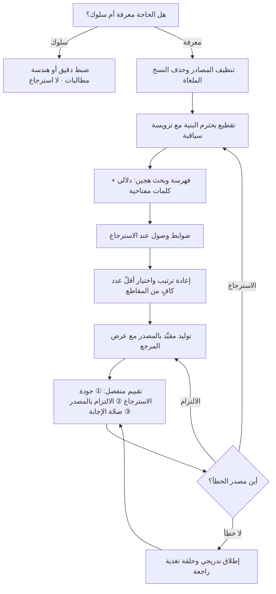

# التوليد المعزَّز بالاسترجاع (Retrieval-Augmented Generation)

> [!info] تعريف مختصر
> نمط معماري يُقيَّد فيه توليد النموذج اللغوي بمصادر تُسترجَع لحظة السؤال من قاعدة معرفية محدّدة، بدل الاعتماد على ما «يتذكّره» النموذج من بيانات تدريبه. الآلية في جوهرها ثلاث خطوات: يُبحَث عن المقاطع الأوثق صلة بسؤال المستخدم، ثم تُحقَن مع السؤال في المطالبة، ثم يُطلب من النموذج أن يجيب **مستندًا إليها** لا إلى معرفته العامّة. والفائدة المزدوجة: تقليل الهلوسة (Hallucination) بتوفير مصدر يُلزَم به، وإتاحة معرفة حديثة أو خاصّة بالمؤسسة لم يرَها النموذج أثناء التدريب — وكلّ ذلك دون لمس أوزان النموذج، وهو ما يجعله في أغلب الحالات **بديلًا أرخص وأسرع بكثير من إعادة التدريب**.

## الشرح العلمي والاحترافي
- **الأصل والتسمية**: صيغة «Retrieval-Augmented Generation» ومنهجها الموثَّق ظهرا في ورقة بحثية عام 2020 من باحثين مرتبطين بمختبر أبحاث الذكاء الاصطناعي في Meta ومتعاونين أكاديميين، ثم اتّسع استعمال المصطلح كثيرًا بعد انتشار نماذج اللغة الكبيرة ليشمل أنماطًا هندسية عملية أوسع ممّا وصفته الورقة الأصلية. لذلك حين يقول فريقان «نستخدم RAG» فقد يعنيان بنى مختلفة الدرجة والتعقيد.
- **آلية العمل بالتفصيل**: تُقطَّع الوثائق إلى مقاطع (Chunks)، ويُحوَّل كل مقطع إلى تمثيل رقمي (Embedding) يُخزَّن في قاعدة متّجهات. عند ورود السؤال يُحوَّل هو أيضًا إلى تمثيل رقمي، ويُبحَث عن أقرب المقاطع دلاليًّا، وتُرتَّب النتائج، ثم تُمرَّر أفضلها إلى النموذج ضمن المطالبة مع تعليمة صريحة بالاستناد إليها وبالامتناع عن الإجابة إن لم تكفِ.
- **لماذا يقلّل الهلوسة ولا يلغيها**: الهلوسة تنشأ حين يولّد النموذج نصًّا معقولًا لغويًّا بلا سند. تقييد الإجابة بمقاطع مسترجَعة يقلّص المساحة التي يملؤها النموذج من عندياته. لكن يبقى مصدران للخطأ: **فشل الاسترجاع** (لم يُجلب المقطع الصحيح أصلًا، فأي إجابة بعده مبنيّة على ناقص)، و**فشل الالتزام** (جُلب الصحيح لكن النموذج تجاوزه أو مزجه بمعرفته العامّة). ومن هنا القاعدة المهنية: **جودة النظام تُحدّها جودة الاسترجاع أولًا**، وأغلب فشل مشاريع RAG هو فشل بحث لا فشل توليد.
- **متى يكون بديلًا أرخص من إعادة التدريب؟** المقارنة تُحسم بأربعة معايير:
  1. **طبيعة الحاجة**: إن كانت الحاجة **معرفة** (حقائق، سياسات، وثائق، أسعار) فالاسترجاع هو الأداة الصحيحة. أمّا إن كانت الحاجة **سلوكًا** (أسلوب ثابت، صيغة مخرَج صارمة، لهجة، مهارة تصنيف دقيقة في مجال ضيّق) فالضبط الدقيق (Fine-tuning) أنسب. والخطأ الشائع محاولة تعليم النموذج حقائق عبر الضبط الدقيق — وهي طريقة مكلفة، ضعيفة الأثر، وتتقادم فورًا.
  2. **معدّل تغيّر المعرفة**: إن كانت الوثائق تتغيّر أسبوعيًّا، فإعادة التدريب مع كل تحديث غير عملية اقتصاديًّا؛ بينما يكفي في الاسترجاع تحديث الفهرس، وقد يستغرق دقائق.
  3. **الحاجة إلى الإسناد**: الاسترجاع يمنحك مراجع قابلة للعرض والتحقّق («وفق البند 4 من سياسة الإرجاع») — وهو مطلب لا غنى عنه في القطاعات المنظَّمة، ولا يوفّره نموذج مضبوط دقيقًا لأن المعرفة تذوب في أوزانه.
  4. **الحوكمة وإمكانية الحذف**: في الاسترجاع تُحذف الوثيقة من الفهرس فتختفي من الإجابات فورًا، وهو ما يخدم حقّ المحو في [[GDPR]] و[[PDPL]]. أمّا ما دخل في أوزان نموذج مدرَّب فإخراجه عمليًّا يعني إعادة تدريب.
  والخلاصة العملية: **الاسترجاع أولًا في الأغلبية الساحقة من حالات الأعمال**، والضبط الدقيق حين تثبت الحاجة إلى سلوك لا إلى معرفة، وقد يُجمَع بينهما.
- **بنية الكلفة وأثرها**: الاسترجاع يرفع رموز الإدخال في كل استدعاء لأنه يحقن مقاطع في المطالبة، فيزيد [[Inference Cost]] لكل طلب، لكنه يوفّر كلفة تدريب ضخمة وثابتة. والمفاضلة الحقيقية إذن بين كلفة رأسمالية مركّزة وكلفة تشغيلية موزّعة — وهي بعينها معادلة [[CapEx vs OpEx]]. ومن الأخطاء المكلفة حقن 15 مقطعًا في كل سؤال «للاحتياط»، فيتضاعف الإنفاق وقد تنخفض الدقّة لأن الإشارة الصحيحة تغرق في مقاطع مشتّتة.
- **البُعد الأمني والخصوصي**: قاعدة المتّجهات ليست أرقامًا مجرّدة بل تحتوي نصّ المقاطع الأصلية غالبًا، أي أنها **نسخة ثانية من وثائقك** بكل ما تحمله من بيانات شخصية، وتخضع لالتزامات [[Data Residency]] وللتوثيق في [[ROPA]]. وأخطر خلل تشغيلي فيها هو **تسريب الصلاحيات**: إن لم يُطبَّق تحكّم الوصول عند الاسترجاع، فقد يعرض النظام لموظّف مقاطع من وثائق لا يملك حقّ الاطّلاع عليها أصلًا.
- **التقييم شرط وجود لا رفاهية**: لا يمكن إدارة نظام استرجاع بلا مجموعة تقييم (Evaluation Set) من أسئلة حقيقية وإجابات مرجعية، تُقاس عليها ثلاثة أشياء منفصلة: هل جُلب المقطع الصحيح؟ وهل الإجابة مستندة إلى المصدر فعلًا؟ وهل الإجابة صحيحة وكاملة؟ فصل المقاييس ضروري لأن العلاج يختلف تمامًا: مشكلة الاسترجاع تُعالَج في التقطيع والفهرسة والبحث، ومشكلة الالتزام تُعالَج في المطالبة واختيار النموذج.

## أين ومتى يُستخدم
- **في مساعدات دعم العملاء المبنيّة على قاعدة معرفية**: للإجابة من السياسات والأدلّة المعتمدة بدل الارتجال، مع عرض المصدر لبناء الثقة.
- **في البحث الداخلي للمؤسسات**: حين تكون المعرفة موزّعة بين وثائق ومحاضر وسياسات، وتقترب الحاجة من تحقيق مبدأ [[Single Source of Truth]] عمليًّا لا شكليًّا.
- **في القطاعات المنظَّمة (مالية، صحّية، قانونية)**: حيث الإسناد إلى مرجع شرط قبول، ويرتبط ذلك مباشرة بمتطلبات [[Governance]] والامتثال.
- **إلى جانب [[MCP]]**: الاسترجاع يجلب المعرفة النصّية، وبروتوكول الأدوات يتيح الاستعلام الحيّ وتنفيذ الأفعال — والجمع بينهما هو البنية الشائعة للمساعدات المؤسسية الجادّة.
- **في نطاق [[MVP]] لمنتجات الذكاء الاصطناعي**: لأنه يتيح إثبات القيمة خلال أسابيع وبكلفة محدودة قبل أي استثمار في تدريب أو ضبط.
- **في تقليل مخاطر المشروع ([[Risk Register]])**: بجعل مصدر كل إجابة قابلًا للتتبّع، فيتحوّل خطأ النظام إلى شيء يمكن تشخيصه وإصلاحه بدل صندوق أسود.

## مثال وسيناريو تطبيقي
> [!example] شركة تأمين سعودية أرادت مساعدًا داخليًّا لموظّفي مركز الاتصال يجيب عن أسئلة وثائق التأمين: ما المشمول؟ ما الاستثناءات؟ ما مدّة معالجة المطالبة؟ القاعدة المعرفية: 4,300 صفحة موزّعة على 180 وثيقة، بينها نسخ متعدّدة من الوثيقة نفسها بتواريخ مختلفة.
> **المحاولة الأولى** بنت فهرسًا مباشرًا: تقطيع كل 500 كلمة، واسترجاع أفضل 10 مقاطع، ونموذج قوي. النتيجة على 120 سؤال اختبار: إجابات صحيحة 61% فقط. وعند تفكيك الأخطاء الـ47:
> - 29 خطأ سببه **الاسترجاع**: جُلبت مقاطع من نسخة قديمة ملغاة من الوثيقة، أو قُطع الجدول الذي يحوي الحدود المالية في منتصفه فوصل النموذج نصف جدول.
> - 12 خطأ سببه **الالتزام**: وصل المقطع الصحيح لكن النموذج أضاف تفاصيل عامّة عن التأمين من معرفته لا من الوثيقة.
> - 6 أخطاء سببها **غياب المعلومة أصلًا** من القاعدة، وكان يجب أن يقول النظام «لا أعلم» فأجاب بدلًا من ذلك.
> **المعالجة** استغرقت 5 أسابيع وركّزت على الاسترجاع قبل التوليد:
> ① تقطيع يحترم بنية الوثيقة (لا يقطع جدولًا ولا بندًا)، مع ترويسة في كل مقطع تحمل اسم الوثيقة ورقم النسخة وتاريخ السريان.
> ② حذف النسخ الملغاة من الفهرس نهائيًّا، وإضافة مرشّح يستبعد ما انتهى سريانه — وهي خطوة **تنظيمية لا خوارزمية**، وكانت الأعلى أثرًا على الإطلاق.
> ③ بحث هجين يجمع البحث الدلالي بالبحث بالكلمات المفتاحية، لأن أرقام البنود وأسماء المنتجات لا يلتقطها البحث الدلالي وحده جيّدًا.
> ④ خفض عدد المقاطع المسترجَعة من 10 إلى 4 بعد إعادة ترتيبها، فارتفعت الدقّة وانخفضت الكلفة معًا.
> ⑤ تعليمة صريحة بالامتناع عند عدم كفاية المصدر، وإلزام بعرض اسم الوثيقة ورقم البند تحت كل إجابة.
> **النتيجة**: ارتفعت الإجابات الصحيحة إلى 91% على مجموعة الاختبار نفسها، وانخفض متوسّط رموز الإدخال لكل سؤال بنحو 55% فانخفضت الكلفة التشغيلية رغم تحسّن الجودة. والأثر الأهمّ تشغيليًّا: عرض المصدر تحت كل إجابة جعل الموظّف يتحقّق في ثوانٍ، فتحوّل المساعد من أداة «يُشكّ فيها» إلى أداة تُختصر بها المكالمة.

## خطوات أو مخطّط
1. تحديد نطاق المعرفة بدقّة والإجابة عن سؤال حاسم: هل المشكلة معرفة أم سلوك؟ فإن كانت سلوكًا فالاسترجاع ليس الحلّ.
2. تنظيف مصادر المعرفة قبل أي هندسة: حذف الملغى، وتوحيد النسخ، وتحديد المالك وتاريخ السريان لكل وثيقة.
3. تصميم التقطيع بما يحترم بنية المحتوى، مع ترويسة سياقية في كل مقطع (المصدر، النسخة، التاريخ، القسم).
4. بناء الفهرس واختيار استراتيجية بحث تناسب طبيعة المحتوى، والأرجح أن يكون البحث الهجين أفضل من الدلالي وحده.
5. تطبيق ضوابط الوصول عند الاسترجاع نفسه، بحيث لا يُسترجَع للمستخدم إلا ما يملك صلاحية الاطّلاع عليه.
6. صياغة تعليمة التوليد بحيث تُلزم بالاستناد إلى المصدر وبالامتناع عند عدم الكفاية وبعرض المرجع.
7. بناء مجموعة تقييم من أسئلة حقيقية، وقياس الاسترجاع والالتزام والصحّة **منفصلة**.
8. تشخيص الأخطاء بردّ كلّ خطأ إلى سببه، ومعالجة الاسترجاع أولًا لأنه سقف كل ما بعده.
9. الإطلاق التدريجي مع حلقة تغذية راجعة تتيح للمستخدم الإبلاغ عن إجابة خاطئة مع سياقها ([[Feedback Loop]]).
10. تشغيل التقييم آليًّا عند كل تغيير في النموذج أو المطالبة أو الفهرس، ومنع النشر عند التراجع.

## ⚠️ مفاهيم خاطئة شائعة
> [!warning]
> - **«الاسترجاع يلغي الهلوسة»**: يقلّلها تقليلًا كبيرًا ولا يلغيها. يبقى النظام عرضة لفشل البحث ولخروج النموذج عن المصدر، ويظلّ إظهار المرجع والمراجعة البشرية ضروريَّين في القرارات الحسّاسة.
> - **«المشكلة في النموذج»**: في أغلب أنظمة الاسترجاع المتعثّرة تكون المشكلة في **البحث والبيانات** لا في النموذج. ترقية النموذج مع فهرس رديء تحسّن صياغة الإجابة الخاطئة ولا تصحّحها.
> - **«الضبط الدقيق أفضل لأنه يُدخل المعرفة داخل النموذج»**: تعليم النموذج حقائق بالضبط الدقيق مكلف وضعيف الأثر ويتقادم مع أول تحديث، ويفقدك القدرة على الإسناد والحذف. الضبط الدقيق للسلوك والصيغة، والاسترجاع للمعرفة.
> - **«كلّما استرجعنا مقاطع أكثر كانت الإجابة أفضل»**: بعد حدّ معيّن يضرّ التوسّع؛ ترتفع الكلفة، ويزداد التشتّت، وقد تتراجع الدقّة لأن المقطع الصحيح يغرق بين مقاطع مشابهة. الأفضل استرجاع أوسع ثم **إعادة ترتيب** واختيار أقلّ عدد كافٍ.
> - **«قاعدة المتّجهات مجرّد أرقام فلا خصوصية فيها»**: هي في العادة تحتفظ بنصّ المقاطع الأصلية، وتُعدّ نسخة كاملة من وثائقك تخضع لكل التزامات حماية البيانات وموقع التخزين.
> - **«الاسترجاع مشروع تقني لمرّة واحدة»**: القاعدة المعرفية كائن حيّ؛ وثائق تتغيّر وتُلغى وتُضاف. بلا مالك للمحتوى وعملية تحديث ومراجعة دورية، تتدهور جودة النظام تدريجيًّا حتى لو لم يتغيّر سطر واحد من الكود.

## ❌ ممارسات خاطئة في المشاريع
> [!failure]
> - **الخطأ**: بناء النظام فوق وثائق غير منظَّفة تحوي نسخًا قديمة وملغاة. **لماذا يضرّ**: النظام سيجيب بثقة من وثيقة منتهية الصلاحية، وهو أخطر من ألّا يجيب أصلًا لأن الخطأ يبدو موثّقًا. **الحل**: اجعل تنظيف المحتوى وتحديد التواريخ والمالكين مرحلة أولى إلزامية، وعامل الوثائق كبيانات مرجعية تُحكَم كما تُحكَم [[Master Data]].
> - **الخطأ**: إطلاق النظام دون مجموعة تقييم. **لماذا يضرّ**: يصبح الحكم على الجودة انطباعيًّا، ويستحيل معرفة أثر أي تغيير، وقد تُدخل تحسينًا يخفض الأداء دون أن يلاحظ أحد. **الحل**: ابنِ 100–200 سؤال حقيقي بإجابات مرجعية **قبل** البناء، واجعل اجتيازها شرطًا في تعريف الإنجاز ([[Definition of Done]]).
> - **الخطأ**: تجاهل صلاحيات الوصول في طبقة الاسترجاع. **لماذا يضرّ**: يتحوّل المساعد إلى قناة تسريب داخلية تعرض محتوى رواتب أو عقود لمن لا يملك الاطّلاع، وهي مخالفة خصوصية مكتملة الأركان. **الحل**: طبّق التصفية حسب هوية المستخدم داخل الاسترجاع نفسه، لا في طبقة العرض بعد التوليد.
> - **الخطأ**: عدم تمكين النظام من قول «لا أعلم». **لماذا يضرّ**: يُجبَر النموذج ضمنًا على إنتاج إجابة حتى حين تعجز القاعدة، فتُولَد أخطر أنواع الهلوسة. **الحل**: تعليمة امتناع صريحة، وعتبة ثقة للاسترجاع، ومسار تصعيد إلى إنسان عند عدم الكفاية.
> - **الخطأ**: إخفاء المصادر عن المستخدم لأن «الواجهة تبدو أنظف». **لماذا يضرّ**: يفقد المستخدم القدرة على التحقّق، فينهار بناء الثقة عند أول خطأ ويُهجر المنتج. **الحل**: اعرض المرجع تحت كل إجابة مع رابط للمقطع الأصلي، واعتبر ذلك جزءًا من قيمة المنتج لا تفصيلًا شكليًّا.
> - **الخطأ**: حقن مقاطع كثيرة في كل طلب احتياطًا. **لماذا يضرّ**: يرفع [[Inference Cost]] ارتفاعًا حادًّا في كل استدعاء ويشتّت النموذج. **الحل**: استرجاع أوسع ثم إعادة ترتيب واختيار أقلّ عدد كافٍ، مع قياس أثر العدد على الدقّة والكلفة معًا.
> - **الخطأ**: تسليم النظام دون مالك للمحتوى ولا عملية تحديث. **لماذا يضرّ**: تتقادم القاعدة بصمت وتتدهور الجودة بلا سبب ظاهر في الكود، فيفقد المستخدمون الثقة تدريجيًّا. **الحل**: عيّن مالكًا لكل مجال معرفي، واربط تحديث الفهرس بدورة تحديث الوثائق آليًّا، وراقب معدّل الأسئلة غير المجابة كمؤشّر إنذار مبكّر.

## 🔗 مصطلحات ومفاهيم ذات صلة
[[MCP]] | [[Inference Cost]] | [[Data Residency]] | [[GDPR]] | [[PDPL]] | [[Single Source of Truth]] | [[Master Data]] | [[Definition of Done]] | [[Feedback Loop]] | [[Governance]] | [[MVP]]
