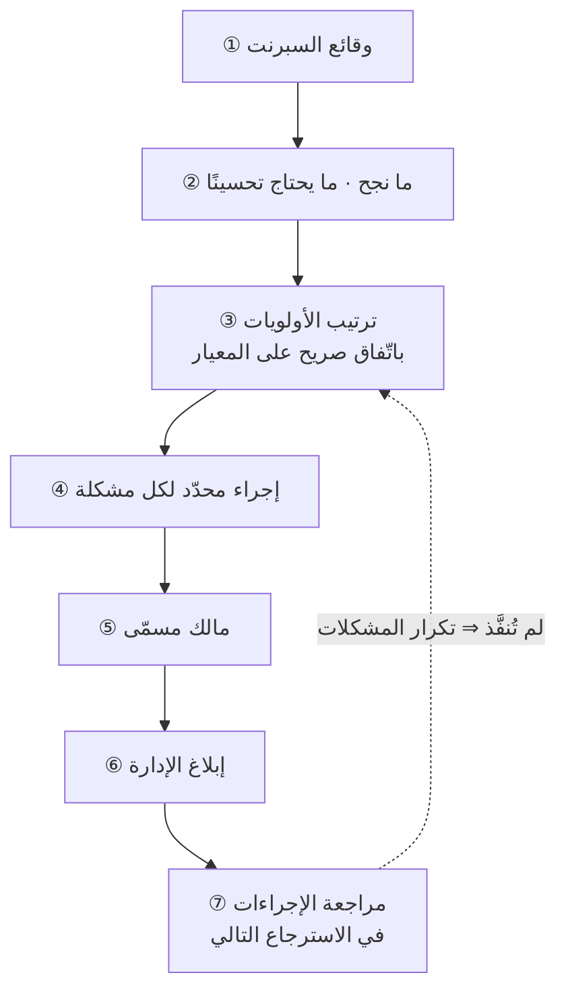

# الاسترجاع (Retrospective)

> [!info] تعريف مختصر
> الاسترجاع هو **وقفة دورية محدّدة الزمن يفحص فيها الفريق طريقة عمله لا نتاج عمله**، فيخرج بعدد محدود من **الإجراءات** لكلٍّ منها **مالك** و**أولوية**. وهو في سكرم آخر أحداث السبرنت، لكنّ جوهره ليس الحدث بل القدرة: **الفريق الذي لا يقدر على التوقّف لا يقدر على التحسّن**، لأنّه لا يملك لحظةً ينظر فيها خلفه.

## الشرح العلمي والاحترافي
- **الفرق بينه وبين المراجعة (Review)**: المراجعة تفحص **المنتج** مع أصحاب المصلحة؛ والاسترجاع يفحص **العملية والديناميكيّات** داخل الفريق. الخلط بينهما يُنتج اجتماعًا يناقش الميزات ويترك أسباب التأخير كما هي.
- **يُعقد سواء تحقّق الهدف أم لم يتحقّق.** والسبب أنّ السبرنت **دورة تخطيط لا دورة إصدار**: الخطّة مقيّدة بزمن، ومضيّ الزمن هو موجب الوقفة — لا خروج الإصدار. والفريق الذي يمدّ السبرنت حتى «ينتهي» يدخل حلقةً لا تنتهي ولا يستطيع أن يقيس شيئًا.
- **الشرط المسبق أمان نفسي لا تقنية جلسات.** بلا [[Psychological Safety|أمان نفسي]] تتحوّل الجلسة إمّا إلى صمت وإمّا إلى تقاذف اتّهامات — وكلاهما يزيد الاحتكاك بدل أن يقلّله، فيصير الاسترجاع **مصدر المشكلة** التي جاء ليحلّها.
- **خمسة عناصر تفصل الاسترجاع الفعّال عن الشكوى الجماعية**: (١) قائمة بما نجح وما لم ينجح · (٢) **ترتيب أولويات** للمشكلات · (٣) هدف لكلّ مشكلة · (٤) **إجراء** محدّد · (٥) **مالك** مسمّى للتنفيذ. وغياب العنصرين الأخيرين هو التفسير الأشيع لعبارة «الاسترجاع يُضيّع الوقت».
- **الاسترجاع أوسع من اجتماعه.** الوقفة اليومية، والمراجعة، والاجتماع الثنائي، والاستبيان المجهول، وصندوق الاقتراحات — كلّها آليّات استرجاع بدرجات. والمؤسسة التي تملك اجتماعًا واحدًا فقط للاسترجاع تعتمد على نقطة فشل واحدة.
- **قاتلاه**: **التكرار بلا تغيير** (المشكلات نفسها تُذكر كلّ مرّة لأنّ الإجراءات لم تُتتبَّع)، و**الرضا عن الذات** — الفريق الذي يبلغ أداءً مقبولًا فيتوقّف عن السؤال يدخل ركودًا يظهر لاحقًا في [[Cycle Time|زمن الدورة]].
- **تنويع الصيغة ضرورة لا ترف**: صيغة «ما الجيّد وما السيّئ» تُستهلك بعد جولات، فتُستبدل بـ**ابدأ/توقّف/استمرّ** أو **غاضب/حزين/مسرور** أو تحليل حادثة بعينها، حفاظًا على الانتباه.

## أين ومتى يُستخدم
- **بعد كلّ سبرنت** في سكرم، سواء سُلّم العمل أم لم يُسلَّم.
- في **كانبان**: عند كلّ انسداد يستحقّ الوقفة، أو دوريًّا (شهريًّا/ربعيًّا) — فالتوقيت يحكمه الحدث لا التقويم.
- بعد **حادثة إنتاج** كبيرة، وحينها يقترب من [[Blameless Postmortem|المراجعة اللاحقة بلا لوم]].
- عند **تسلّم فريق جديد**: أوّل استرجاعات سكرم ماستر الجديد أداة تشخيص لا أداة تحسين.
- عند **ارتفاع الاحتكاك** بين تخصّصين (تطوير/اختبار مثلًا) قبل أن يتحوّل إلى صراع شخصي.

## مثال وسيناريو تطبيقي
> [!example] أربع مشكلات وترتيبان مشروعان.
> **المشكلات:** متطلّبات غير واضحة · لا [[Definition of Done|تعريف اكتمال]] عند التسليم للاختبار · تأخير في عمود المراجعة · المختبِر يكتب أكثر من خطأ في بطاقة واحدة.
> **ترتيب أ (بالأثر):** المتطلّبات أوّلًا، لأنّ كلّ ما بعدها يُبنى عليها.
> **ترتيب ب (بالتقدير وعدد الملّاك):** الأسهل أوّلًا — مشكلتا المختبِر والمراجعة تُحلّان داخل الجلسة وتحتاجان تتبّعًا فقط؛ أمّا المتطلّبات وتعريف الاكتمال فيحتاجان وقتًا من مالك المنتج ومن الفريق.
> **الخلاصة:** الترتيبان صحيحان. **المشكلة ليست في أيّهما أصحّ بل في أنّ الفريق غير متوائم على أحدهما** — فبلا اتّفاق على الأولوية تعود المشكلات نفسها في الاسترجاع القادم.
> **الإجراءات الناتجة:** خطأ واحد لكلّ بطاقة (مالكها: المختبِر والمطوّر معًا) · [[WIP Limit|حدّ عمل جارٍ]] على عمود المراجعة (مالكه: الفريق، ويتتبّعه سكرم ماستر) · تعريف اكتمال لكلّ دور (مالكه: فريق سكرم).

## خطوات أو مخطّط
1. **اجمع الوقائع** قبل الآراء: أرقام السبرنت، والعوائق، والأحداث المحدّدة.
2. **أخرج قائمة** بما نجح وما يحتاج تحسينًا — بلا نقاش في هذه المرحلة.
3. **رتّب الأولويات** واتّفقوا صراحةً على معيار الترتيب (أثر؟ تقدير؟ عدد الملّاك؟).
4. **حوّل كلّ مشكلة مختارة إلى إجراء** قابل للتحقّق، لا إلى نيّة.
5. **سمِّ مالكًا** لكلّ إجراء — والمالك قد يكون شخصين إن كانت المشكلة على الحدّ بينهما.
6. **شارك الإجراءات مع الإدارة** كي لا تُهمَّش وتُعطّل ما اتّفقتم عليه.
7. **افتح الاسترجاع القادم بمراجعة إجراءات السابق** — وهذه الخطوة وحدها تفصل التحسّن عن التكرار.

## ⚠️ مفاهيم خاطئة شائعة
> [!warning]
> - **الظنّ بأنّ سكرم ماستر يُدير الاسترجاع ويقرّر**: دوره أن **ييسّر** ويضمن أنّ الجميع يتكلّم بحرّية؛ والفريق كلّه هو من يُخرج الخطّة.
> - **اعتباره اجتماع شكاوى**: الشكوى بلا إجراء ومالك تُبقي البيئة السلبية كما هي.
> - **تأجيله حتى «ينتهي» السبرنت**: هذا يقلب دورة التخطيط إلى دورة إصدار ويُلغي الوقفة أصلًا.
> - **حصره في البرمجيات**: الآلية تنطبق على أيّ عمل جماعي متكرّر، بل وعلى العلاقات الشخصية.
> - **الخلط بينه وبين [[Blameless Postmortem|المراجعة اللاحقة]]**: هذه تُعقد بعد حادثة بعينها، والاسترجاع دوري بصرف النظر عن وقوع حادثة.

## ❌ ممارسات خاطئة في المشاريع
> [!failure]
> - **حضور الإدارة العليا لتوجيه الفريق**: الدعوة مفيدة، لكن اللحظة التي توجّه فيها الإدارةُ الفريقَ يموت الاسترجاع. الحلّ: التنبيه المسبق أنّ الحضور للاستماع.
> - **الخروج بعشرة إجراءات**: لا يُنفَّذ منها شيء. الحلّ: **مشكلة واحدة إلى ثلاث**؛ وحلّ واحدة يحلّ أحيانًا أربعًا تحتها.
> - **عدم تتبّع الإجراءات**: يحوّل الجلسة إلى طقس. الحلّ: الإجراءات بنود مرئية على اللوحة كبقيّة العمل.
> - **تيسير داخلي في فريق مشحون**: الميسّر طرف في الخصومة. الحلّ: **ميسّر من خارج الفريق** لجولة أو جولتين.
> - **تكرار الصيغة نفسها عشرين مرّة**: يُنتج مللًا يُفسَّر خطأً بأنّ «الاسترجاع بلا فائدة».

## 🔗 مصطلحات ومفاهيم ذات صلة
[[Psychological Safety]] | [[Six Thinking Hats]] | [[Oblique Strategies]] | [[Definition of Done]] | [[WIP Limit]] | [[Blameless Postmortem]] | [[Feedback Loop]] | [[Kaizen]] | [[PDCA]] | [[Facilitator]] | [[15.1 الاسترجاع - لماذا يجب أن يقدر الفريق على التوقّف]] | [[15.2 من نقاط العمل إلى التتبّع]]
