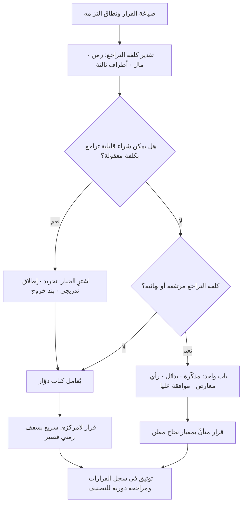

# القرارات القابلة للتراجع مقابل غير القابلة (Reversible vs Irreversible Decisions)

> [!info] تعريف مختصر
> تصنيف عملي للقرارات بحسب **كلفة العودة عنها** لا بحسب حجمها المالي أو مكانة صاحبها. القرار القابل للتراجع (يُشبَّه بـ«الباب الدوّار» — Two-Way Door) يمكن نقضه بسرعة وبكلفة محدودة إن تبيّن خطؤه، فيستحقّ قرارًا سريعًا لامركزيًّا بأقل قدر من التحليل. والقرار غير القابل للتراجع («الباب الواحد» — One-Way Door) يصعب أو يستحيل الرجوع عنه، فيستحقّ بطئًا متعمّدًا وتحليلًا أعمق ومستوى موافقة أعلى. الصياغة بهذين المصطلحين ممارسة **منشورة علنًا في رسائل أمازون السنوية إلى المساهمين**، حيث رُبطت صراحة بخطر تباطؤ المؤسسات الكبيرة حين تُعامل كل القرارات بثقل القرارات المصيرية.

## الشرح العلمي والاحترافي
- **المصدر والصياغة**: ناقشت رسائل أمازون إلى المساهمين — وأشهرها في هذا الباب رسالة عام 2015 وما تلاها — فكرة أن القرارات نوعان: قرارات من النوع الأول ثقيلة وغير قابلة للعكس عمليًّا، تستوجب تأنّيًا ومشاورة؛ وقرارات من النوع الثاني قابلة للعكس مثل باب يفتح في الاتجاهين، فإن كانت النتيجة سيئة أمكن العودة. والملاحظة التنظيمية المرافقة أن المؤسسات كلما كبرت مالت إلى تطبيق عملية النوع الأول على قرارات النوع الثاني، فتُصاب ببطء وتجنّب للمخاطرة وضعف في الابتكار.
- **المتغيّر الحاسم هو كلفة التراجع لا حجم القرار**: قرار بمليون ريال قد يكون قابلًا للتراجع (اشتراك سنوي يمكن عدم تجديده)، وقرار بلا كلفة مباشرة قد يكون غير قابل للتراجع (نشر واجهة برمجية عامة يعتمد عليها عملاء خارجيون، أو الإعلان عن سعر للسوق، أو تسريح موظف رئيسي، أو اختيار مخطّط بيانات أساسي).
- **مصادر عدم القابلية للتراجع**: أربعة مصادر متكرّرة يجدر فحصها صراحةً: (١) **التزام تعاقدي** طويل أو غرامة خروج مرتفعة؛ (٢) **أثر خارجي على أطراف ثالثة** (عملاء بنوا على واجهتك، أو سوق سمع إعلانك)؛ (٣) **بيانات لا تُستعاد** (حذف، أو ترحيل يفقد التاريخ)؛ (٤) **أثر بشري وسمعي** (الثقة إذا كُسرت لا تُستعاد بقرار مضاد).
- **القابلية للتراجع متدرّجة لا ثنائية**: الأدقّ التفكير في **سُلَّم**: تراجع فوري وشبه مجاني (تبديل إعداد، تفعيل [[Rollback]])، ثم تراجع مكلف لكنه ممكن (فسخ عقد بغرامة)، ثم تراجع نظري بكلفة تعادل بناء المشروع من جديد، ثم استحالة فعلية. وظيفة المهندس والمدير أن يسألا: **أين نحن على هذا السلّم، وهل يمكن هندسيًّا أن ننزل درجة؟**
- **إمكانية تصميم القابلية للتراجع** — وهي أهم مساهمة عملية للمفهوم: كثير من «الأبواب الواحدة» تتحوّل إلى أبواب دوّارة بقرارات تصميمية واعية. الإطلاق التدريجي، ورايات الميزات (Feature Flags)، والنشر الموازي، وإبقاء بيانات النسخة القديمة، والعقود ذات فترة تجريبية، والمراحل التعاقدية في [[SOW]] — كلها تشتري قابلية تراجع بكلفة إضافية معلومة. السؤال الإداري الصحيح ليس «هل هذا قرار نهائي؟» بل «كم يكلّفني جعله غير نهائي؟».
- **الأثر على سرعة القرار ومستوى الموافقة**: التصنيف يُترجم إلى سياسة صريحة ([[Explicit Policies]]): من يقرّر، وكم يستغرق، وما مستوى التوثيق. للأبواب الدوّارة: يقرّر أقرب شخص للمعلومة، بسقف زمني قصير، وبتوثيق سطر واحد. للأبواب الواحدة: مراجعة مكتوبة، وقائمة بدائل، ورأي معارض مسجّل، وموافقة [[Sponsor]] أو [[Steering Committee]].
- **علاقته بدرجة عدم اليقين**: قابلية التراجع هي **العلاج المنهجي** لـ[[Knightian Uncertainty]]. حين تعجز عن حساب الاحتمالات، تشتري بدلًا من اليقين خيارًا: تتحرّك بخطوات صغيرة قابلة للنقض حتى تنكشف المعلومة. وعكسه صحيح: كلما زاد يقينك، قلّت حاجتك لدفع علاوة القابلية للتراجع.
- **الخطأ المتماثل في الاتجاهين**: يُركَّز عادة على خطأ البطء (معاملة الباب الدوّار كباب واحد)، لكن الخطأ المعاكس أشدّ فتكًا وأندر ذكرًا: معاملة قرار باب-واحد كأنه قابل للتراجع — كإطلاق تسعير للسوق، أو نشر واجهة عامة، أو ترحيل بيانات دون نسخة عكسية — بحجّة «السرعة» و«الرشاقة». الأول يكلّف وقتًا، والثاني قد يكلّف المشروع كله.

## أين ومتى يُستخدم
- **في تصميم حوكمة القرار داخل الفريق** ([[Governance]], [[Explicit Policies]]): لتحديد مصفوفة من يقرّر ماذا وبأي سرعة، بدل تصعيد كل شيء إلى الأعلى.
- **في مراجعات البوّابات** ([[Go or No-Go Decision]]): لتمييز البوّابة التي تستحق توقّفًا كاملًا عن البوّابة التي يكفيها إشعار.
- **في القرارات المعمارية والتقنية** ([[Technical Debt]], [[Vendor Lock-in]], [[Rollback]]): اختيار قاعدة بيانات أو مزوّد سحابي أو مخطّط بيانات هو غالبًا باب واحد؛ بينما اختيار مكتبة داخلية قابل للتبديل.
- **في إدارة الإطلاق** ([[Pilot Launch]], [[Staging vs Production Environment]], [[Hotfix]]): الإطلاق التدريجي بحدّ ذاته أداة لتحويل قرار الإطلاق إلى باب دوّار.
- **عند تجميد النطاق أو الميزات** ([[Scope Freeze]], [[Feature Freeze]]): لتحديد أي التزامات صارت غير قابلة للنقض وأيها ما زال مفتوحًا.
- **في توثيق القرارات** ([[Decision Log]]): تسجيل تصنيف كل قرار وكلفة تراجعه المقدَّرة يجعل مراجعة الأداء لاحقًا ممكنة وعادلة.

## مثال وسيناريو تطبيقي
> [!example] بنك في الإمارات يبني تطبيقًا جديدًا للتمويل الشخصي. الفريق 24 شخصًا، والمدّة 11 شهرًا. كانت العادة أن كل قرار — من لون الزر إلى مزوّد البنية التحتية — يمرّ على لجنة أسبوعية، فبلغ **متوسّط زمن اتخاذ القرار 9 أيام**، وتراكم 40 قرارًا معلّقًا في الربع الأول، وصار الانتظار أكبر مسبّب توقّف في اللوحة.
> طبّق مدير المشروع تصنيفًا صريحًا في اجتماع واحد، فرز فيه 40 قرارًا:
> — **31 قرارًا بابًا دوّارًا**: صياغة نصوص الواجهة، ترتيب الخطوات، حدود التنبيهات، مكتبة الرسوم، آلية ترقيم الإصدارات. كلفة التراجع عن كلٍّ منها أقل من يومي عمل. فُوِّضت كاملة إلى قائد الفريق التقني ومالك المنتج بسقف 48 ساعة وتوثيق سطر واحد في [[Decision Log]].
> — **9 قرارات بابًا واحدًا**: اختيار مزوّد التحقّق من الهوية (عقد 3 سنوات بغرامة خروج)، تصميم مخطّط بيانات العملاء، صيغة أرقام الحسابات في الواجهة العامة، نطاق البيانات المرحَّلة من النظام القديم، ونموذج التسعير المعلن. لهذه أُلزم الفريق بمذكّرة مكتوبة من 3 صفحات تتضمّن بديلين على الأقل، ورأيًا معارضًا مسجّلًا بالاسم، وموافقة اللجنة التوجيهية.
> ثم جاءت الخطوة الأهم: **هندسة القابلية للتراجع** في اثنين من التسعة. مزوّد الهوية عُزل خلف طبقة تجريد داخلية بكلفة إضافية 3 أسابيع تطوير، فصار تبديله ممكنًا في شهر بدل إعادة بناء. وترحيل البيانات نُفّذ بالكتابة المزدوجة مع إبقاء النظام القديم قارئًا لستة أشهر، فصار الترحيل قابلًا للعكس.
> النتيجة بعد ربع: متوسّط زمن القرار للأبواب الدوّارة نزل إلى أقل من يومين، وبقي التأنّي مركّزًا على 9 قرارات فقط. وحين تبيّن لاحقًا أن مزوّد الهوية لا يفي بزمن الاستجابة المتعاقد عليه، استُبدل خلال 5 أسابيع — وهو ما كان مستحيلًا لولا طبقة التجريد.

## خطوات أو مخطّط
1. اكتب القرار بصيغة واضحة: ما الذي سنلتزم به بالضبط، ومتى يبدأ نفاذه؟
2. قدّر كلفة التراجع بثلاثة أرقام: زمن العودة، ومال العودة، والأثر على أطراف ثالثة.
3. صنّف القرار على السلّم: تراجع فوري · تراجع مكلف · تراجع شبه مستحيل · نهائي.
4. اسأل قبل التصنيف النهائي: **هل يمكن شراء قابلية تراجع؟** (تجريد، إطلاق تدريجي، بند خروج، فترة تجريبية) وبكم؟
5. طابق مستوى العملية مع التصنيف: من يقرّر، وسقف الزمن، وحجم التوثيق، ومن يوافق.
6. للأبواب الواحدة فقط: اكتب البدائل، وسجّل الرأي المعارض بالاسم، وحدّد معيار النجاح مسبقًا.
7. سجّل القرار وتصنيفه وكلفة تراجعه المقدَّرة في [[Decision Log]].
8. راجع دوريًّا: هل تغيّر تصنيف قرار قديم؟ (كثيرًا ما يتحوّل باب دوّار إلى باب واحد حين يبني عليه آخرون).

## ⚠️ مفاهيم خاطئة شائعة
> [!warning]
> - **مطابقة «قابل للتراجع» بـ«صغير»**: المعيار هو كلفة العودة لا حجم القرار. صفقة كبيرة بفترة تجريبية قابلة للتراجع، وتغريدة تسعير مجانية غير قابلة للتراجع.
> - **اعتبار التصنيف ثنائيًّا وثابتًا**: القابلية للتراجع متدرّجة وتتغيّر مع الزمن. قرار داخلي قابل للنقض اليوم يصبح باب واحد بعد أن يبني عليه ثلاثة فرق ومئة عميل.
> - **الظنّ بأن السرعة تعني قلّة الجودة**: تسريع الأبواب الدوّارة لا يعني قرارًا رديئًا، بل يعني **إنفاق التحليل حيث يستحقّ**. المؤسسة التي تحلّل كل شيء بالعمق نفسه تُحلّل كل شيء بعمق سطحي في الواقع.
> - **افتراض أن الأبواب الواحدة يجب تجنّبها**: بعض القرارات الحاسمة يجب اتّخاذها والالتزام بها، وتأجيلها بلا نهاية شكل من أشكال القرار السيّئ. المطلوب تأنٍّ محدود بسقف زمني، لا تأجيل مفتوح.
> - **الخلط بين قابلية التراجع التقنية وقابلية التراجع البشرية**: قد تستطيع تقنيًّا استرجاع نظام قديم، لكن الفريق الذي تفكّك، والعميل الذي فقد الثقة، والسوق الذي سمع الإعلان — هذه لا تُسترجع بزر.
> - **إسقاط التكلفة الغارقة في التقييم**: كون التراجع يعني «هدر ما أُنفق» ليس سببًا لعدم التراجع. القرار يُقاس بالكلفة المستقبلية للاستمرار مقابل الكلفة المستقبلية للعودة، لا بما دُفع سلفًا.

## ❌ ممارسات خاطئة في المشاريع
> [!failure]
> - **تمرير كل القرارات عبر لجنة أسبوعية واحدة**: يجعل الانتظار أكبر مصدر هدر في التدفّق ويحوّل اللجنة إلى [[Bottleneck]]. الحل: انشر مصفوفة صلاحيات صريحة تُفوِّض الأبواب الدوّارة بسقف زمني، واحصر اللجنة في الأبواب الواحدة.
> - **إطلاق واجهة برمجية عامة أو تسعير معلن بعقلية «سنعدّله لاحقًا»**: بمجرّد أن يعتمد عليك طرف خارجي يصبح التعديل كسرًا لالتزام. الحل: عامِل كل ما يخرج للعالم الخارجي كباب واحد افتراضيًّا، وابدأ بنسخة تجريبية معلنة الحدود ومحدودة الجمهور.
> - **ترحيل بيانات دون مسار عودة**: يُقطع الاتصال بالنظام القديم في الليلة نفسها فيصير أي خلل كارثة. الحل: كتابة مزدوجة وفترة تشغيل متوازٍ ومعيار انقطاع معلن، مع [[Data Dry Run]] قبل التنفيذ الفعلي.
> - **تجاهل بنود الخروج عند التوقيع مع مورّد**: ينتبه الفريق إلى السعر ويغفل عن كلفة الانسحاب، فينشأ [[Vendor Lock-in]] لا مخرج منه. الحل: اجعل «كلفة الخروج وزمنه» بندًا إلزاميًّا في تقييم أي عرض، وسعّرها ضمن [[TCO]].
> - **تصنيف القرار بعد اتّخاذه لتبريره**: يُقال «كان بابًا دوّارًا» عند الفشل و«كان مصيريًّا» عند النجاح. الحل: التصنيف يُكتب في [[Decision Log]] **قبل** التنفيذ مع كلفة التراجع المقدّرة، ويُراجَع بعدها بمقارنة التقدير بالواقع.
> - **إهمال شراء قابلية التراجع بحجّة الكلفة**: يُرفض أسبوعان لبناء طبقة تجريد، فتُدفع لاحقًا أشهر لإعادة البناء. الحل: قيّم علاوة القابلية للتراجع كتأمين له سعر، وقارنها بكلفة السيناريو السيّئ لا بالميزانية وحدها.
> - **الإسراف في المرونة حتى لا يُحسم شيء**: كل شيء قابل للتبديل، فلا يستقرّ أي معيار وتتضخّم طبقات التجريد بلا مستفيد. الحل: اشترِ الخيار فقط حيث احتمال التغيير معتبر وكلفة الخطأ مرتفعة، واحسم ما عداه صراحةً وسجّله.

## 🔗 مصطلحات ومفاهيم ذات صلة
[[Knightian Uncertainty]] | [[Base Rate]] | [[Calibration]] | [[First Principles Thinking]] | [[Data Informed vs Data Driven]] | [[Decision Log]] | [[Go or No-Go Decision]] | [[Rollback]] | [[Vendor Lock-in]] | [[Explicit Policies]] | [[Governance]]
