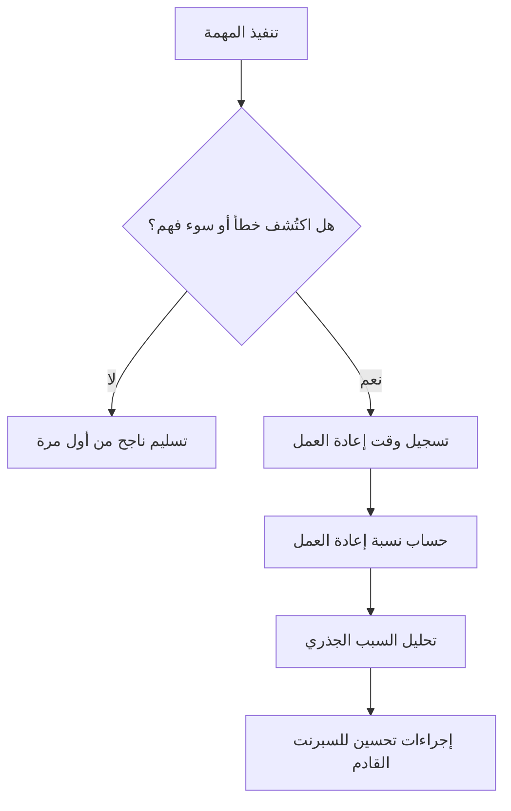

# نسبة إعادة العمل (Rework Percentage)
> [!info] تعريف مختصر
> نسبة إعادة العمل (Rework Percentage) هي مقياس يوضّح كم من الجهد أو الوقت أُنفق على إعادة عمل مهام كان يُفترض أن تُنجَز بشكل صحيح من المرة الأولى، بسبب أخطاء أو متطلبات غير واضحة أو عيوب في الجودة. تُحسب عادة كنسبة مئوية من إجمالي الجهد أو الوقت المستهلك في المشروع.

## الشرح العلمي والاحترافي
- تُحسب نسبة إعادة العمل بالمعادلة: (الوقت أو الجهد المصروف على إعادة العمل ÷ إجمالي الوقت أو الجهد المصروف على المهمة) × 100.
- ترتفع هذه النسبة غالبًا بسبب: متطلبات غامضة عند البدء، غياب معيار جاهزية واضح ([[Definition of Ready]])، ضعف اختبار الجودة قبل التسليم، تغييرات متكررة في النطاق، أو نقص خبرة الفريق في تقنية معينة.
- تُعتبر نسبة إعادة العمل مؤشرًا مهمًا على "الهدر" (Waste) في العمل، وترتبط مباشرة بمفهوم [[Muda, Mura, Muri]] في نظام إنتاج تويوتا ([[Toyota Production System]])، حيث تُصنَّف إعادة العمل كهدر واضح لأنها عمل لا يضيف قيمة (Non-Value-Added).
- تُستخدم أيضًا كمؤشر جودة (Quality KPI) يُقاس عبر السبرنتات أو المراحل لمعرفة ما إذا كانت ممارسات الجودة تتحسن أم تتدهور مع الوقت.
- تختلف عن "معدل الأخطاء المكتشفة بعد الإطلاق" ([[Escaped Defect Rate]])، فنسبة إعادة العمل تشمل أي إعادة عمل داخلية حتى لو لم يصل الخطأ للعميل أبدًا.

## أين ومتى يُستخدم
- في تقارير جودة السبرنت والمشروع لقياس مدى كفاءة الفريق في "إنجاز الصح من أول مرة" (Right First Time).
- عند تحليل السبب الجذري ([[Root Cause Analysis]]) لتحديد أسباب تكرار الأخطاء والتخطيط للتحسين.
- في مراجعات ما بعد السبرنت ([[10 - Sprint Retrospective]]) لمناقشة أسباب ارتفاع إعادة العمل ووضع خطة تحسين.
- في تقييم أداء الموردين أو الفرق الخارجية للتأكد من جودة عملهم قبل تجديد العقود.

## مثال وسيناريو تطبيقي
> [!example] فريق تطوير في شركة "بيانات الخليج" أنفق في السبرنت الأخير 400 ساعة عمل إجمالية على تطوير ميزة تسجيل الدخول بالبصمة. بعد المراجعة، تبيّن أن 80 ساعة من هذه الساعات صُرفت على إعادة كتابة الكود بسبب سوء فهم لمتطلب أمني لم يُوضَّح في بداية العمل. نسبة إعادة العمل هنا = (80 ÷ 400) × 100 = 20%. اعتبر مدير المشروع هذه النسبة مرتفعة (المعدل المقبول لدى الفريق هو أقل من 10%)، فقرروا في اجتماع الاستعراض الرجعي تفعيل معيار جاهزية أوضح ([[Definition of Ready]]) يتطلب مراجعة أمنية للمتطلبات قبل بدء أي مهمة تتعلق بالمصادقة.

## خطوات أو مخطّط
1. حدّد بوضوح ما يُعتبر "إعادة عمل" (مثلًا: إصلاح خطأ، إعادة كتابة كود، تعديل تصميم بعد الرفض).
2. سجّل الوقت أو الجهد المصروف على كل نشاط إعادة عمل بشكل منفصل عن العمل الأصلي.
3. اجمع إجمالي وقت إعادة العمل وإجمالي الوقت الكلي المصروف في الفترة المدروسة.
4. احسب النسبة المئوية باستخدام المعادلة المذكورة أعلاه.
5. حلّل الأسباب الجذرية للنسبة المرتفعة عبر تحليل السبب الجذري.
6. ضع إجراءات تحسين (تحسين المتطلبات، زيادة الاختبار المبكر، تدريب الفريق).
7. راقب اتجاه النسبة عبر السبرنتات المتتالية للتأكد من التحسن.

## ⚠️ مفاهيم خاطئة شائعة
> [!warning]
> - الاعتقاد أن نسبة إعادة العمل صفر يجب أن تكون الهدف دائمًا؛ بعض إعادة العمل طبيعية في بيئات معقدة أو استكشافية، والهدف هو التقليل المستمر لا الصفر المطلق.
> - الخلط بين إعادة العمل والتحسين التكراري الطبيعي (Iteration) في أجايل؛ التكرار المخطَّط له لتحسين منتج ناضج ليس إعادة عمل بالضرورة.
> - قياس النسبة على مستوى الفرد بدلًا من مستوى الفريق أو العملية، مما يخلق ثقافة لوم بدل ثقافة تحسين.

## ❌ ممارسات خاطئة في المشاريع
> [!failure]
> - عدم تتبع وقت إعادة العمل بشكل منفصل أصلًا، فيختفي المؤشر ولا يُكتشف الهدر إلا بعد تراكمه.
> - معاقبة الأفراد عند ارتفاع النسبة بدلًا من معالجة السبب الجذري (مثل غموض المتطلبات أو نقص الاختبار)، مما يدفع الفريق لإخفاء المشكلة.
> - تجاهل النسبة المرتفعة المتكررة في نفس المكوّن التقني، وهو غالبًا مؤشر على دين تقني ([[Technical Debt]]) يحتاج معالجة جذرية.

## 🔗 مصطلحات ومفاهيم ذات صلة
[[Escaped Defect Rate]] | [[Root Cause Analysis]] | [[Definition of Ready]] | [[Definition of Done]] | [[Muda, Mura, Muri]] | [[Value-Added vs Non-Value-Added vs Pure Waste]] | [[QA vs QC]] | [[Technical Debt]]
