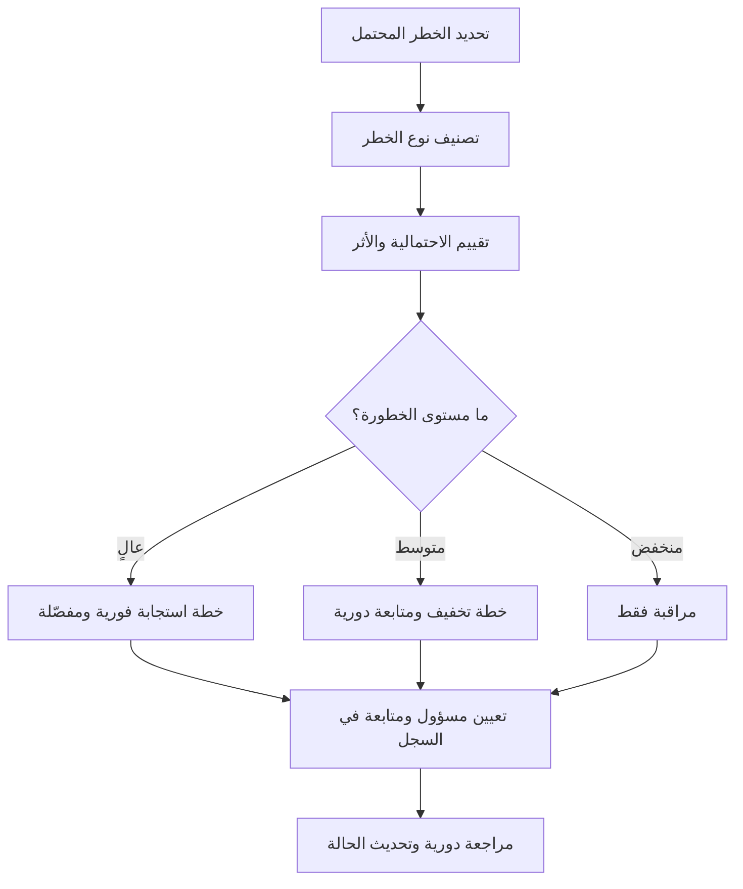

# سجل المخاطر (Risk Register)

> [!info] تعريف مختصر
> سجل المخاطر (Risk Register) هو وثيقة حيّة تُسجَّل فيها كل المخاطر المحتملة التي قد تؤثر على المشروع، مع تقييم احتمالية حدوثها وحجم أثرها، وخطة الاستجابة لكل خطر، والشخص المسؤول عن متابعته.

## الشرح العلمي والاحترافي
- سجل المخاطر ليس وثيقة تُكتَب مرة واحدة وتُنسى، بل أداة تُراجَع وتُحدَّث بانتظام طوال دورة حياة المشروع، لأن مخاطر جديدة تظهر ومخاطر قديمة تُحَل أو يتغيّر احتمالها وأثرها.
- كل صف في السجل يحتوي عادة على: وصف الخطر، فئته (تقني، مالي، تنظيمي، بشري...)، احتمالية حدوثه، حجم أثره إن حدث، درجة الخطورة الإجمالية (نتيجة ضرب الاحتمالية بالأثر)، خطة الاستجابة، الشخص المسؤول (Risk Owner)، والحالة الحالية.
- يُستخدَم [[Probability and Impact Matrix]] عادة لتصنيف كل خطر بصرياً حسب شدته، مما يساعد الفريق على تحديد أولويات المتابعة: المخاطر عالية الاحتمال وعالية الأثر تحتاج خطة استجابة فورية ومفصّلة، بينما المخاطر منخفضة الشدة قد يكتفى بمراقبتها فقط.
- استراتيجيات الاستجابة للمخاطر الأربع الأساسية هي: التجنّب (Avoid) بتغيير الخطة لإزالة سبب الخطر، التخفيف (Mitigate) بتقليل احتماليته أو أثره، النقل (Transfer) بتحويل أثره لطرف آخر مثل التأمين أو المقاول الفرعي، والقبول (Accept) بالاعتراف بالخطر دون إجراء استباقي مع الاحتفاظ بخطة طوارئ إذا وقع.
- يرتبط سجل المخاطر ارتباطاً وثيقاً بـ[[Contingency Reserve]]، حيث يُخصَّص احتياط مالي أو زمني بناءً على تحليل شدة المخاطر المسجّلة في السجل.
- في المشاريع الأكبر، يتوسّع سجل المخاطر أحياناً إلى [[RAID Log]] الذي يضيف تتبّع الافتراضات (Assumptions) والقضايا الفعلية (Issues) والاعتماديات (Dependencies) إلى جانب المخاطر.

## أين ومتى يُستخدم
- يُنشَأ سجل المخاطر في مرحلة التخطيط المبكرة لأي مشروع، فور تحديد النطاق والمتطلبات الأولية.
- يُراجَع بانتظام في اجتماعات مراجعة الحالة الأسبوعية أو الشهرية، وفي المشاريع الرشيقة يُراجَع أثناء [[Backlog Refinement]] أو مراجعة السبرنت عند ظهور مخاطر جديدة مرتبطة بمهام قادمة.
- يُستخدَم في تقييم أي [[Change Request]] كبير، إذ يُضاف التغيير المقترح أحياناً كخطر جديد يجب تقييم أثره قبل الموافقة.
- يُطلَب رسمياً كمرفق أساسي في تقارير حالة المشروع المقدَّمة لرعاة المشروع (Sponsors) وأصحاب المصلحة الرئيسيين.

## مثال وسيناريو تطبيقي
> [!example] سيناريو ملموس
> في مشروع تطوير نظام إدارة مخزون لشركة "الأفق للتجزئة"، أنشأ مدير المشروع سجل مخاطر في الأسبوع الأول يتضمن ثلاثة مخاطر رئيسية:
> الخطر الأول: اعتماد المشروع على واجهة برمجية (API) من مزوّد خارجي لم يُثبت استقرارها بعد، باحتمالية متوسطة وأثر عالٍ. خطة الاستجابة: بناء طبقة عازلة (Adapter) تسمح باستبدال المزوّد بسهولة إن تعطّل.
> الخطر الثاني: مغادرة المهندس الأول للفريق قبل انتهاء المشروع، باحتمالية منخفضة وأثر عالٍ جداً. خطة الاستجابة: توثيق القرارات التقنية أولاً بأول ومشاركة المعرفة مع مهندس آخر.
> الخطر الثالث: تأخر تسليم بيانات المخزون التاريخية من العميل، باحتمالية عالية وأثر متوسط. خطة الاستجابة: البدء بالتطوير باستخدام بيانات تجريبية مؤقتة بالتوازي مع متابعة العميل أسبوعياً.
> في الشهر الثالث، تحقّق الخطر الثالث فعلاً: تأخر العميل شهراً كاملاً في تسليم البيانات. لكن بفضل خطة الاستجابة الجاهزة مسبقاً، واصل الفريق العمل بالبيانات التجريبية دون توقف، وتلافى تأخير المشروع بأكمله.

## خطوات أو مخطّط
1. تحديد المخاطر المحتملة عبر جلسات عصف ذهني مع الفريق وأصحاب المصلحة.
2. تصنيف كل خطر حسب فئته (تقني، مالي، تنظيمي، بشري، خارجي).
3. تقييم احتمالية حدوث كل خطر وحجم أثره باستخدام [[Probability and Impact Matrix]].
4. حساب درجة الخطورة الإجمالية وترتيب المخاطر حسب الأولوية.
5. وضع خطة استجابة لكل خطر: تجنّب، تخفيف، نقل، أو قبول.
6. تعيين مسؤول (Risk Owner) لمتابعة كل خطر بعينه.
7. مراجعة السجل بانتظام، وتحديث الحالة، وإضافة مخاطر جديدة أو إغلاق مخاطر انتهت.

## ⚠️ مفاهيم خاطئة شائعة
> [!warning]
> - الاعتقاد أن سجل المخاطر وثيقة تُنشَأ مرة واحدة في بداية المشروع ولا تحتاج تحديثاً؛ في الواقع هو أداة حيّة يجب مراجعتها بانتظام طوال المشروع.
> - الظن بأن الهدف هو تسجيل أكبر عدد ممكن من المخاطر النظرية؛ القيمة الحقيقية في تحديد المخاطر ذات الاحتمالية والأثر الأعلى ووضع خطط استجابة عملية لها، لا في طول القائمة.
> - الخلط بين سجل المخاطر وسجل القضايا ([[Issue Log]]): سجل المخاطر يتعامل مع أحداث محتملة لم تقع بعد، بينما سجل القضايا يتعامل مع مشاكل وقعت فعلاً وتحتاج حلاً فورياً.

## ❌ ممارسات خاطئة في المشاريع
> [!failure]
> - إنشاء سجل المخاطر مرة واحدة في بداية المشروع ثم عدم مراجعته مطلقاً حتى النهاية، فتظهر مخاطر جديدة دون خطة استجابة جاهزة. التجنب: تخصيص وقت ثابت في كل اجتماع مراجعة حالة لتحديث السجل.
> - عدم تعيين مسؤول واضح (Risk Owner) لكل خطر، فيظن الجميع أن شخصاً آخر يتابعه ولا يتابعه أحد فعلياً. التجنب: تعيين اسم شخص محدد، لا فريق عام، مسؤولاً عن كل خطر.
> - الاكتفاء بتسجيل المخاطر دون ربطها بـ[[Contingency Reserve]] فعلي، فيُفاجَأ المشروع مالياً أو زمنياً عند تحقق أحدها. التجنب: تخصيص احتياط واقعي بناءً على تحليل شدة المخاطر المسجّلة فعلياً، لا رقم عشوائي.

## 🔗 مصطلحات ومفاهيم ذات صلة
[[Probability and Impact Matrix]] | [[RAID Log]] | [[Issue Log]] | [[Contingency Reserve]] | [[Change Request]] | [[Root Cause Analysis]] | [[19 - Risk Management]] | [[Backlog Refinement]]
