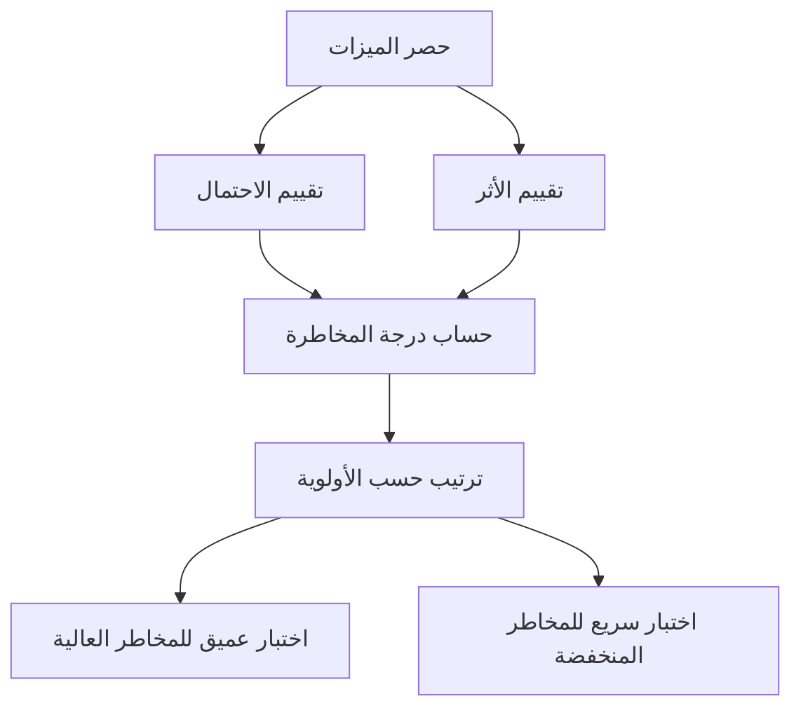

# الاختبار المبني على المخاطر (Risk-Based Testing)
> [!info] تعريف مختصر
> الاختبار المبني على المخاطر هو أسلوب لتحديد أولويات الاختبار بحيث تُختبر أولًا الأجزاء الأكثر خطورة في النظام، أي الأجزاء التي يكون احتمال فشلها مرتفعًا وأثر فشلها على العمل كبيرًا.

## الشرح العلمي والاحترافي
لا يمكن اختبار كل جزء من النظام بنفس العمق دائمًا؛ فالوقت والموارد محدودة. لذلك يقوم فريق الجودة بتحليل كل ميزة أو وحدة وظيفية وفق بُعدين:
- **احتمال حدوث الخلل (Probability)**: هل الكود جديد ومعقّد؟ هل تم تعديله كثيرًا مؤخرًا؟ هل كتبه مطوّر أقل خبرة؟
- **أثر الخلل عند حدوثه (Impact)**: هل يؤثر على الدفع (Payment)؟ هل يؤثر على بيانات حساسة؟ هل يستخدمه معظم المستخدمين يوميًا؟

يُضرب الاحتمال في الأثر لإنتاج درجة مخاطرة (Risk Score)، ثم تُرتَّب الميزات تنازليًا حسب هذه الدرجة. الميزات ذات الدرجة الأعلى تحصل على:
- اختبار أعمق وأكثر تفصيلًا (حالات حدّية، اختبارات أداء، اختبارات أمان).
- تكرار أعلى في الاختبار (كل إصدار Release).
- أولوية في التنفيذ عند ضيق الوقت (Time-boxed Testing).

الفائدة الأساسية: تعظيم قيمة الاختبار بموارد محدودة، بدلًا من توزيع الجهد بالتساوي على كل شيء بغض النظر عن أهميته. هذا مفهوم مرتبط مباشرة بـ [[Probability and Impact Matrix]] المستخدمة في إدارة المخاطر العامة للمشروع.

## أين ومتى يُستخدم
- في مشاريع **Agile** ذات دورات إصدار سريعة، حيث لا يوجد وقت كافٍ لاختبار شامل (Full Regression) في كل Sprint.
- في المشاريع الكبيرة والمعقّدة (أنظمة بنكية، صحية، حكومية) حيث تكلفة الفشل مرتفعة جدًا.
- عند التخطيط لمرحلة [[UAT]] أو [[Regression Testing]] بموارد وقت محدودة قبل الإطلاق.
- عند وجود ميزانية اختبار محدودة (Test Budget) يجب توزيعها بذكاء.

## مثال وسيناريو تطبيقي
> [!example]
> فريق في شركة "فينتك الخليج" يطوّر تطبيق محفظة إلكترونية. قبل إصدار جديد، يجتمع فريق الجودة برئاسة "سارة" لتحليل المخاطر:
> - ميزة **تحويل الأموال بين المستخدمين**: احتمال خلل متوسط (كود معدَّل حديثًا)، أثر مرتفع جدًا (خسارة مالية مباشرة) ← درجة مخاطرة عالية جدًا.
> - ميزة **تغيير الصورة الشخصية**: احتمال خلل منخفض، أثر منخفض ← درجة مخاطرة منخفضة.
> - ميزة **تسجيل الدخول بالبصمة**: احتمال خلل منخفض، لكن أثر مرتفع (منع الدخول كليًا) ← درجة مخاطرة متوسطة-عالية.
>
> بناءً على ذلك، خصّصت سارة 60% من وقت الاختبار المتاح (يومان من أصل ثلاثة) لميزة التحويلات المالية، شملت اختبار الحالات الحدّية (مبلغ صفر، رصيد غير كافٍ، انقطاع الاتصال أثناء التحويل)، بينما اكتفت باختبار سريع (Smoke Check) لميزة الصورة الشخصية.

## خطوات أو مخطّط
1. حصر جميع الميزات/الوحدات القابلة للاختبار.
2. تقييم احتمال الخلل لكل ميزة (1-5).
3. تقييم أثر الخلل لكل ميزة (1-5).
4. حساب درجة المخاطرة = الاحتمال × الأثر.
5. ترتيب الميزات تنازليًا حسب الدرجة.
6. توزيع وقت وعمق الاختبار وفق الترتيب.
7. توثيق القرار في [[Risk Register]] أو خطة الاختبار.

## ⚠️ مفاهيم خاطئة شائعة
> [!warning]
> - **"يعني تجاهل الميزات منخفضة المخاطرة تمامًا"**: خطأ، بل يعني اختبارها بعمق أقل (Smoke Check مثلًا)، وليس حذفها من خطة الاختبار.
> - **"المخاطرة تعتمد على رأي شخصي فقط"**: في الواقع يجب أن تُبنى على بيانات حقيقية (سجل الأخطاء السابقة، تعقيد الكود، شكاوى المستخدمين).
> - **"تحليل المخاطر يُجرى مرة واحدة فقط في المشروع"**: خطأ، يجب تحديثه في كل إصدار لأن الكود والاستخدام يتغيران باستمرار.

## ❌ ممارسات خاطئة في المشاريع
> [!failure]
> - تحديد المخاطر من طرف فريق الاختبار فقط دون إشراك المطورين وأصحاب المنتج؛ الحل هو ورشة عمل مشتركة لتقييم كل ميزة.
> - الاعتماد فقط على "الحدس" دون مراجعة بيانات الأخطاء السابقة (Escaped Defect Rate)؛ الحل استخدام سجل الأخطاء التاريخي كمدخل للتقييم.
> - عدم إعادة تقييم المخاطر بعد تغييرات كبيرة في الكود (Refactoring)؛ الحل ربط تحديث تحليل المخاطر بكل Change Request كبير.

## 🔗 مصطلحات ومفاهيم ذات صلة
[[Probability and Impact Matrix]] | [[Risk Register]] | [[Regression Testing]] | [[UAT]] | [[QA vs QC]] | [[Escaped Defect Rate]] | [[Severity vs Priority]] | [[19 - Risk Management]] | [[20 - Quality Management]]
