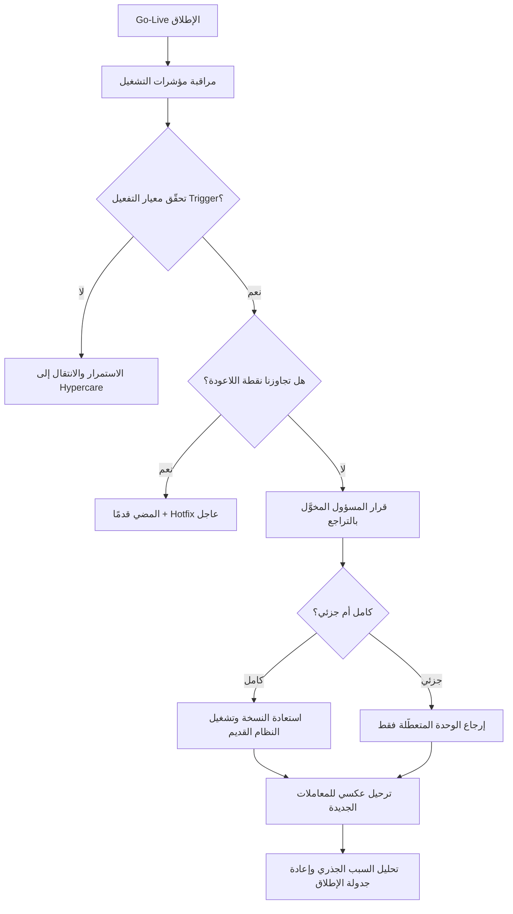

# خطة التراجع (Rollback)

> [!info] تعريف مختصر
> خطة التراجع (Rollback أو Fallback Plan) هي خطة **مُعدّة ومُجرَّبة مسبقًا** للعودة بالعمل إلى الحالة المستقرة السابقة إذا فشل الإطلاق أو ظهر خلل جسيم بعده. جوهرها أنها تُكتب **قبل** الإطلاق لا أثناء الأزمة، وأنها تُحدّد بدقة: متى نتراجع (Trigger)، ومن يملك القرار، وكم من الوقت لدينا، وحتى أي لحظة يبقى التراجع ممكنًا (Point of No Return). وجودها شرط أساسي في قائمة تدقيق الإطلاق ([[Go or No-Go Decision|Go-Live Checklist]]).

## الشرح العلمي والاحترافي
- **المبدأ الحاكم**: أي إطلاق قد يفشل مهما بلغ إتقان التحضير. الفرق بين فريق محترف وآخر ليس في تجنّب الفشل، بل في أن الفشل عنده **حدث مُخطَّط له**: خيار مكتوب يُنفَّذ خلال ساعات، لا ارتجال في الثالثة فجرًا وسط ضغط الإدارة وتوقف العمل.
- **أنواع التراجع**:
  1. **التراجع الكامل (Full Rollback)**: إيقاف النظام الجديد كليًا وإعادة تشغيل النظام القديم واستعادة نسخة البيانات الاحتياطية. الأنسب حين يكون الخلل بنيويًا شاملًا. مكلف ومربك لكنه حاسم.
  2. **التراجع الجزئي (Partial Rollback)**: إعادة وحدة أو خدمة واحدة فقط إلى وضعها السابق مع بقاء باقي النظام الجديد عاملًا — مثل إرجاع وحدة الرواتب أو بوابة الدفع دون المساس بباقي النظام. أقل كلفة، لكنه يتطلب معمارية تسمح بفصل الوحدات وتكاملات مرنة.
  3. **التشغيل المتوازي (Parallel Run)**: تشغيل النظامين القديم والجديد معًا لفترة محدّدة (أسبوعان إلى شهرين عادة)، بحيث تُسجَّل العمليات في الاثنين وتُقارن نتائجهما، ولا يُغلق القديم إلا بعد تطابق النتائج واستقرار الجديد. هذا الشكل هو **أأمن أنواع التراجع** لأنه يجعل العودة فورية بلا استعادة بيانات، لكنه الأعلى كلفة لأنه يُضاعف العمل اليدوي على الموظفين، ولذلك يُقتصر عليه في الأنظمة الحرجة (رواتب، محاسبة، تشغيل مصانع).
- **شروط صحّة خطة التراجع** — خطة لا تستوفيها ليست خطة بل وثيقة تطمين:
  - **مكتوبة ومُجرَّبة لا نظرية**: أن تكون خطواتها موثّقة بالتفصيل، وأن تكون قد **نُفِّذت فعليًا مرة على الأقل** في بيئة مطابقة للإنتاج ضمن [[Data Dry Run]] أو تجربة استعادة. خطة لم تُجرَّب هي فرضية، ونسخة احتياطية لم تُستعَد يومًا ليست نسخة احتياطية.
  - **معايير تفعيل واضحة (Trigger Criteria)**: عتبات موضوعية مكتوبة سلفًا، مثل: تعذّر إصدار الفواتير لأكثر من 4 ساعات، أو فشل أكثر من 20% من المعاملات، أو فقدان تكامل مالي حرج، أو تجاوز زمن المعالجة ضِعف المتفق عليه. من دونها يتحوّل القرار إلى جدال انطباعي بين "لنصبر قليلًا" و"لنرجع الآن".
  - **نقطة اللاعودة (Point of No Return) معلومة**: اللحظة التي يصبح بعدها التراجع أكثر ضررًا من المضي قدمًا — عادة بعد دخول حجم معتبر من المعاملات الحقيقية إلى النظام الجديد، أو بعد إغلاق النظام القديم نهائيًا. يجب تحديدها بوضوح في خطة الإطلاق وإعلانها للجميع.
  - **مسؤول مخوَّل باتخاذ القرار**: **شخص واحد** بالاسم (عادة راعي المشروع أو مدير التشغيل) يملك صلاحية إعلان التراجع دون انتظار اجتماع أو موافقات متسلسلة.
  - **نافذة زمنية محدّدة**: مدة التنفيذ المتوقعة للتراجع (مثلًا 3 ساعات) وأقصى مهلة لاتخاذ القرار قبل أن يبدأ يوم العمل.
  - **خطة تواصل**: ماذا يُقال للمستخدمين والعملاء، ومن يقوله، ومتى — فالتراجع الصامت يُنتج فوضى أشد من العطل نفسه.
- **التحدّي الأصعب: البيانات الجديدة**. أعقد ما في التراجع ليس تقنيًا بل بياناتي: ماذا نفعل بالمعاملات التي أُدخلت في النظام الجديد بعد الإطلاق؟ فواتير صدرت، وأوامر شراء اعتُمدت، وعملاء أُنشئوا. الرجوع إلى نسخة احتياطية سابقة يعني **إعدامها**، والاستمرار من دونها يعني نظامًا قديمًا ناقصًا. لذلك تشمل الخطة المحترفة صراحة: آلية **الترحيل العكسي (Reverse Migration)** أو الإدخال اليدوي المُوجَّه، وسجلًا لكل معاملة تمّت في النظام الجديد منذ لحظة الإطلاق، وتقديرًا لجهد إعادة إدخالها. وكلما طال بقاء النظام الجديد ارتفعت هذه الكلفة — وهذا بالضبط ما يجعل نقطة اللاعودة مرتبطة بالزمن.
- **علاقتها بمؤشرات التعافي**: تُصاغ خطة التراجع دائمًا في ضوء [[RTO and RPO]]: زمن التعافي المستهدف (RTO) يحدّد سرعة التنفيذ المطلوبة، ونقطة الاسترجاع المستهدفة (RPO) تحدّد كم من البيانات يمكن تحمّل فقدانه، وبالتالي وتيرة النسخ الاحتياطي أثناء نافذة الإطلاق.
- **متى يكون [[Hotfix]] أنسب من التراجع؟** إن كان الخلل معزولًا وقابلًا للإصلاح خلال مدة أقل من كلفة التراجع، فالإصلاح العاجل أفضل. التراجع خيار أخير لخلل واسع أو غامض السبب.

## أين ومتى يُستخدم
- في كل إطلاق لنظام مؤسسي (ERP / CRM / HRMS) أو ترحيل بيانات، حيث يُشترط وجودها ضمن [[Go or No-Go Decision|Go-Live Checklist]] قبل اعتماد قرار الانطلاق.
- في نشر التحديثات البرمجية (Deployment)، حيث تأخذ شكل إعادة النشر للإصدار السابق أو تبديل البيئات (Blue-Green Deployment).
- في مشاريع البنية التحتية: ترقية خوادم، تغيير قواعد بيانات، هجرة سحابية.
- في الأنظمة المالية والرواتب، حيث يُعتمد **التشغيل المتوازي** لدورة أو دورتين كاملتين قبل إغلاق النظام القديم.
- عند التكامل مع أنظمة خارجية (بنوك، هيئات ضريبية، شركات شحن)، حيث قد يفرض الطرف الآخر العودة إلى المسار السابق.
- في إدارة التغيير التنظيمي عمومًا: أي تغيير كبير في عملية عمل يحتاج مسارًا معلومًا للعودة إذا اضطرب التشغيل.

## مثال وسيناريو تطبيقي
> [!example] مصنع أطلق نظام ERP جديدًا ليلة الخميس ضمن نافذة إطلاق من 9 مساءً حتى 6 صباحًا. خطة التراجع كانت مكتوبة ومُجرَّبة مسبقًا وتنص على:
> - **معايير التفعيل**: تعذّر إصدار أوامر الإنتاج لأكثر من **4 ساعات متصلة**، أو فشل أكثر من **20%** من معاملات المخزون، أو فرق في الأرصدة يتجاوز **50,000** ريال.
> - **نقطة اللاعودة**: الساعة **2:00 ظهر السبت** (بعدها يكون قد دخل النظام حجم معاملات يصعب ترحيله عكسيًا).
> - **المسؤول المخوَّل**: مدير العمليات، منفردًا، دون حاجة لاجتماع.
> - **النافذة الزمنية للتنفيذ**: **3 ساعات** لاستعادة النسخة الاحتياطية وإعادة تشغيل النظام القديم (مُقاسة فعليًا في تجربة استعادة سابقة).
> **ما حدث**: صباح السبت الساعة 10:00 تبيّن أن تكامل النظام مع ماكينات الوزن يفشل في 34% من الحالات، وتوقف تسجيل الإنتاج فعليًا منذ 6 صباحًا — أي تجاوز عتبة الأربع ساعات وعتبة نسبة الفشل معًا.
> **القرار**: الساعة 10:40 أعلن مدير العمليات التراجع. لكن الفريق اختار **التراجع الجزئي** لا الكامل: أُعيدت وحدة الإنتاج والمخزون فقط إلى النظام القديم، بينما بقيت وحدتا المشتريات والمالية تعملان على النظام الجديد بنجاح.
> **معالجة البيانات الجديدة**: كانت **41 معاملة** قد دخلت وحدة المخزون في النظام الجديد منذ الإطلاق؛ استُخرجت من سجل المعاملات وأُعيد إدخالها يدويًا في النظام القديم خلال ساعتين وفق قائمة مطبوعة موقّعة من أمين المخزن.
> **النتيجة**: عاد التشغيل الحرج خلال **3 ساعات و15 دقيقة**، دون فقدان أي معاملة، وأُعيد إطلاق وحدة الإنتاج بعد ثلاثة أسابيع مع إصلاح التكامل و[[Data Dry Run|تجربة جافة]] إضافية. لولا الخطة المُجرَّبة لكان القرار قد استغرق يومين من الجدال وتوقف المصنع.

## خطوات أو مخطّط
1. **كتابة خطة التراجع أثناء التخطيط للإطلاق** لا بعده، واعتمادها ضمن وثائق قرار الانطلاق.
2. **تحديد نوع التراجع المناسب**: كامل، جزئي، أو تشغيل متوازٍ، بحسب حرجية النظام وكلفة الازدواج.
3. **تعريف معايير التفعيل (Trigger)** بعتبات رقمية موضوعية لا أوصاف عامة.
4. **تحديد نقطة اللاعودة** زمنيًا وبحجم المعاملات، وإعلانها لكل الأطراف.
5. **تسمية المسؤول المخوَّل** باتخاذ القرار منفردًا، وبديله عند غيابه.
6. **أخذ نسخة احتياطية كاملة والتحقق من صلاحيتها بالاستعادة الفعلية** قبل بدء الإطلاق.
7. **تجربة خطة التراجع في بيئة مطابقة للإنتاج** وقياس زمن تنفيذها الحقيقي.
8. **تسجيل كل معاملة تدخل النظام الجديد** منذ لحظة الإطلاق لتمكين الترحيل العكسي.
9. **عند تحقق معيار التفعيل**: اتخاذ القرار ضمن المهلة، وتنفيذ الخطة، وتفعيل خطة التواصل.
10. **بعد التراجع**: تحليل السبب الجذري، وتحديث [[RAID Log]]، وإعادة جدولة الإطلاق بعد معالجة السبب.

## ⚠️ مفاهيم خاطئة شائعة
> [!warning]
> - **الظن أن وجود نسخة احتياطية يعني وجود خطة تراجع**: النسخة مكوّن واحد فقط؛ الخطة تشمل المعايير والقرار والزمن والتواصل ومعالجة البيانات الجديدة.
> - **اعتبار التراجع اعترافًا بالفشل**: التراجع في الوقت الصحيح قرار احترافي يحمي التشغيل؛ الفشل الحقيقي هو الإصرار على المضي بنظام معطّل حتى تنهار الثقة.
> - **افتراض أن التراجع ممكن في أي وقت**: بعد نقطة اللاعودة يصبح التراجع أكثر ضررًا من الإصلاح؛ لذلك تُحدَّد سلفًا.
> - **الخلط بين التراجع و[[Hotfix|الإصلاح العاجل]]**: الإصلاح يعالج خللًا معزولًا داخل النظام الجديد، والتراجع يعيد الوضع كله أو جزءًا منه إلى ما قبل الإطلاق.
> - **الظن أن التشغيل المتوازي حلّ مجاني وآمن دائمًا**: يُضاعف العبء اليدوي ويستنزف الموظفين، ويجب أن تكون له مدة نهاية محدّدة وإلا صار وضعًا دائمًا.
> - **الاعتقاد بأن خطة التراجع مسؤولية الفريق التقني وحده**: قرار التراجع قرار عمل (Business Decision) بامتياز، لأن أثره على التشغيل والعملاء لا على الخوادم.

## ❌ ممارسات خاطئة في المشاريع
> [!failure]
> - **كتابة خطة التراجع كفقرة شكلية في وثيقة الإطلاق دون تجربتها**: تُكتشف استحالة تنفيذها لحظة الحاجة إليها. الحل: تنفيذ تجربة استعادة فعلية في بيئة مطابقة وقياس زمنها وتوثيق نتيجتها.
> - **غياب معايير تفعيل رقمية**: يتحول القرار إلى صراع نفوذ بين من يريد إنقاذ ماء الوجه ومن يريد إنقاذ التشغيل، فيضيع الوقت الحرج. الحل: عتبات مكتوبة ومعتمدة قبل الإطلاق بلا استثناء.
> - **توزيع صلاحية القرار على لجنة**: لا أحد يجرؤ على الإعلان ويُهدر الوقت في الاجتماعات. الحل: شخص واحد مخوَّل بالاسم مع بديل مُعلَن.
> - **إهمال مصير البيانات التي دخلت النظام الجديد**: يُنفَّذ التراجع فتضيع معاملات حقيقية ويفقد العميل الثقة نهائيًا. الحل: تسجيل كل معاملة منذ الإطلاق وتحديد آلية ترحيل عكسي أو إعادة إدخال موثّقة.
> - **إغلاق النظام القديم فور الإطلاق مباشرة**: يُلغي خيار التراجع من أساسه. الحل: إبقاء النظام القديم في وضع قابل للتشغيل (Read-only ثم متاح) حتى تجاوز فترة [[Hypercare|الرعاية المكثّفة]] واستيفاء معايير الاستقرار.
> - **عدم تحديد نقطة اللاعودة**: يستمر الجدل حول التراجع بعد أسبوعين من الإطلاق حين يكون قد أصبح مستحيلًا عمليًا. الحل: إعلان نقطة اللاعودة زمنيًا في خطة الإطلاق وتوثيق موافقة الأطراف عليها.
> - **الإطلاق في توقيت لا يترك نافذة للتراجع**: الإطلاق صباح يوم عمل مزدحم أو قبل إقفال مالي يعني أن التراجع سيقع تحت أقصى ضغط. الحل: اختيار نافذة إطلاق تسمح بزمن التراجع الكامل قبل بدء التشغيل الفعلي، مع هامش أمان.

## 🔗 مصطلحات ومفاهيم ذات صلة
[[Go or No-Go Decision]] | [[RTO and RPO]] | [[Data Dry Run]] | [[Hotfix]] | [[Staging vs Production Environment]] | [[Incident Runbook]] | [[Hypercare]] | [[RAID Log]]
