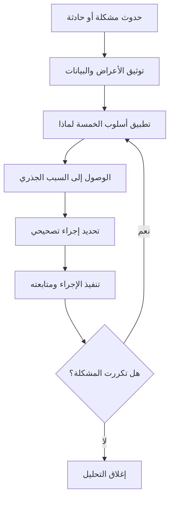

# تحليل السبب الجذري (Root Cause Analysis)
> [!info] تعريف مختصر
> تحليل السبب الجذري (يُختصر RCA) هو منهجية منظّمة للبحث عن السبب الحقيقي والعميق وراء مشكلة أو عيب، بدلًا من الاكتفاء بمعالجة أعراضها الظاهرة، بهدف منع تكرارها مستقبلًا.

## الشرح العلمي والاحترافي
- كثيرًا ما يعالج الفرق "الأعراض" فقط: يظهر خطأ فيُصلَح سطحيًا، لكن السبب الحقيقي يبقى كامنًا ويعود للظهور بأشكال مختلفة.
- RCA يفترض أن كل مشكلة لها سلسلة أسباب، وأن الوصول للسبب الجذري (وليس السبب المباشر) هو الطريقة الوحيدة لمنع تكرار المشكلة نهائيًا.
- من أشهر أدوات RCA:
  - أسلوب "الخمسة لماذا" (5 Whys): يُسأل "لماذا؟" بشكل متكرر (عادة خمس مرات) حتى الوصول للسبب الجذري.
  - مخطط عظم السمكة (Fishbone / Ishikawa Diagram): يصنّف الأسباب المحتملة حسب فئات (الأشخاص، العملية، الأدوات، البيئة... إلخ).
  - تحليل باريتو (Pareto Analysis): لتحديد الأسباب الأكثر تكرارًا أو الأكثر تأثيرًا.
- يرتبط RCA ارتباطًا مباشرًا بدورة [[PDCA]] وبمبدأ [[Kaizen]] في التحسين المستمر، وهو أيضًا جزء أساسي من ممارسات [[SRE]] عند التعامل مع الحوادث (Incidents) عبر تقارير "ما بعد الحادثة" (Postmortem).
- الهدف النهائي ليس "لوم" أحد، بل تحسين العملية (Process) نفسها كي لا يتكرر الخطأ حتى مع تغيّر الأشخاص.

## أين ومتى يُستخدم
- بعد وقوع حادثة كبيرة (Incident) في الإنتاج، خصوصًا في بيئات [[ITIL 4]] و[[SRE]].
- عند تكرار نفس نوع العيب أكثر من مرة رغم إصلاحه (انظر [[Reopen]]).
- في اجتماعات [[10 - Sprint Retrospective]] عندما يريد الفريق فهم سبب تعثّر متكرر.
- عند ارتفاع [[Escaped Defect Rate]] أو [[MTTR]] بشكل ملحوظ ويريد الفريق فهم السبب الهيكلي.
- في مرحلة إدارة المخاطر ([[19 - Risk Management]]) لفهم أسباب المخاطر المتحققة بالفعل.

## مثال وسيناريو تطبيقي
> [!example] تعرّض تطبيق توصيل طلبات لانقطاع خدمة استمر 40 دقيقة أثناء ساعة الذروة، وتسبب في فقدان نحو 1200 طلب. الحل الفوري كان إعادة تشغيل الخادم. لكن فريق SRE أجرى تحليل السبب الجذري باستخدام أسلوب الخمسة لماذا:
> 1. لماذا توقفت الخدمة؟ لأن قاعدة البيانات امتلأت اتصالاتها (Connection Pool).
> 2. لماذا امتلأت؟ لأن خدمة التوصيل الجديدة لم تُغلق الاتصالات بعد الاستخدام.
> 3. لماذا لم تُغلق؟ لأن الكود الجديد لم يتضمن معالجة الأخطاء (Error Handling) الصحيحة.
> 4. لماذا لم تُكتشف في الاختبار؟ لأن اختبارات الحمل (Load Testing) لم تُنفَّذ قبل الإصدار.
> 5. لماذا لم تُنفَّذ؟ لأن سياسة الفريق لا تفرض اختبار حمل إلزاميًا قبل كل إصدار جديد لخدمات حرجة.
> السبب الجذري الحقيقي إذًا ليس "خطأ برمجي"، بل غياب سياسة إلزامية لاختبار الحمل، فتم تحديث سياسات الفريق (Explicit Policies) لسد هذه الثغرة.

## خطوات أو مخطّط
1. توثيق المشكلة بدقة: ماذا حدث، متى، وما أثره.
2. جمع البيانات والحقائق (سجلات، شهادات، أرقام) لا الافتراضات.
3. تطبيق أداة تحليل (5 Whys أو Fishbone) للوصول للسبب الجذري.
4. التحقق من أن السبب المكتشف يفسر المشكلة فعلًا (وليس مجرد عرض آخر).
5. تحديد إجراء تصحيحي يعالج السبب الجذري لا العرض.
6. متابعة تنفيذ الإجراء والتأكد من عدم تكرار المشكلة.

## ⚠️ مفاهيم خاطئة شائعة
> [!warning]
> - الخلط بين "السبب المباشر" و"السبب الجذري": التوقف عند أول إجابة لـ"لماذا؟" غالبًا يعطي سببًا سطحيًا وليس جذريًا.
> - الاعتقاد أن الهدف من RCA هو تحديد "من المخطئ"؛ الهدف الحقيقي هو تحسين العملية، لا محاسبة الأفراد.
> - افتراض وجود سبب واحد فقط دائمًا؛ كثير من الحوادث المعقدة لها أسباب متعددة متشابكة تتطلب أكثر من مسار تحليل.

## ❌ ممارسات خاطئة في المشاريع
> [!failure]
> - الاكتفاء بإصلاح العرض (مثل إعادة تشغيل الخادم) دون تحليل السبب الجذري، فتتكرر المشكلة لاحقًا. الحل: إلزام الفريق بتحليل جذري بعد أي حادثة مؤثرة.
> - إجراء التحليل من شخص واحد بمعزل عن الفريق المعني، ما يفوّت معلومات مهمة. الحل: إشراك كل من له علاقة مباشرة بالحادثة.
> - عدم متابعة تنفيذ الإجراءات التصحيحية بعد التحليل، فيبقى RCA مجرد وثيقة نظرية. الحل: ربط كل إجراء تصحيحي بمسؤول وموعد تنفيذ ومتابعته في [[Issue Log]] أو [[RAID Log]].

## 🔗 مصطلحات ومفاهيم ذات صلة
[[Ishikawa Diagram]], [[Pareto Principle]], [[PDCA]], [[Kaizen]], [[SRE]], [[MTTR]], [[Escaped Defect Rate]], [[Issue Log]], [[RAID Log]], [[Reopen]], [[19 - Risk Management]], [[10 - Sprint Retrospective]]
