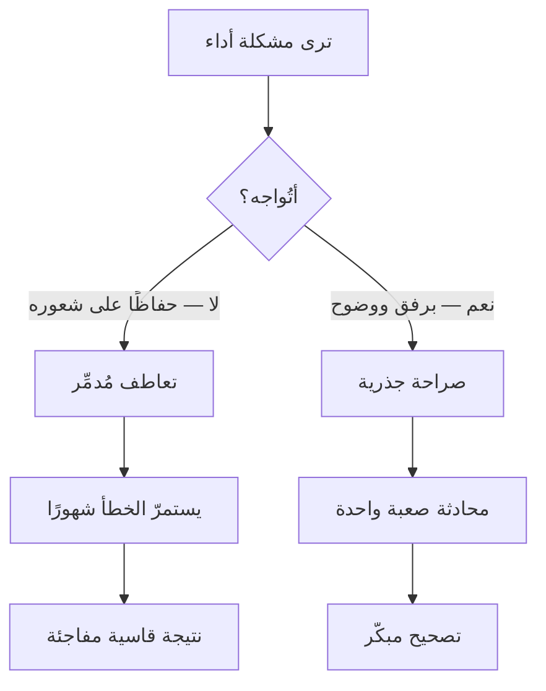

# التعاطف المُدمِّر (Ruinous Empathy)
> [!info] تعريف مختصر
> التعاطف المُدمِّر هو أن تهتمّ بالشخص إلى حدّ **حرمانه من الحقيقة التي يحتاجها**: تتجنّب التغذية الراجعة الصعبة حفاظًا على شعوره، فتضرّه هو أوّلًا — ثم النتيجة ثانيًا.

## الشرح العلمي والاحترافي
صاغته **كيم سكوت (Kim Scott)** في *Radical Candor* (2017) ضمن مصفوفة على محورين مستقلّين: **الاهتمام شخصيًّا (Care Personally)** و**المواجهة مباشرةً (Challenge Directly)**.

| | **لا تُواجه مباشرةً** | **تُواجه مباشرةً** |
|---|---|---|
| **تهتمّ شخصيًّا** | **التعاطف المُدمِّر** | **الصراحة الجذرية** ✅ |
| **لا تهتمّ شخصيًّا** | النفاق التلاعبي | العدوانية البغيضة |

**والمحوران مستقلّان — وهذا هو مفتاح النموذج.** فالخطأ الشائع افتراض أنّ اللطف والحزم طرفا محور واحد، فيتأرجح المرء بينهما: يُجامل حتى يُقرأ ضعفًا، ثم «يعتدل» بقسوة، ثم يعود. **والمخرج محور ثانٍ تمامًا:** أن تبقى الطريقة رفيقة ويصير المعيار هو الوصول إلى وضوح ونتيجة.

**والنموذج امتداد لـ«الشبكة الإدارية»** لـ**بليك وموتون** (1964) بمحورَي الاهتمام بالناس والاهتمام بالإنتاج، وأطروحتها أنّ أداء «9,9» ممكن وليس تسوية عند «5,5».

**ويتقاطع مباشرةً مع [[Tactical Empathy|التعاطف التكتيكي]]:** الحدّ الثالث في معادلته — *ولم يتغيّر النطاق بحرف* — هو بالضبط ما يمنع التعاطف من الانزلاق إلى تعاطف مُدمِّر.

## أين ومتى يُستخدم
- تشخيص سبب تكرار مشكلة أداء لدى عضو فريق «الجميع يحبّه».
- مراجعة لماذا لا تُنتج مراجعاتك ملاحظات حقيقية.
- تفسير الشكوى الشائعة: «كنتُ لطيفًا فقرأوه ضعفًا».

## مثال وسيناريو تطبيقي
> [!example] مديرة تُلاحظ منذ أربعة أشهر أنّ مطوّرًا يُسلّم متأخّرًا دائمًا، وتُغطّي عنه لأنّه إنسان طيّب ويمرّ بظرف صعب. فتُعيد توزيع مهامّه بهدوء، ولا تذكر شيئًا في تقييمه النصفي. **وبعد ستّة أشهر** يُرفَض ترشيحه لترقية كان يتوقّعها، فيسأل: «لماذا؟ لم يُخبرني أحد أنّ هناك مشكلة.» — **وهو محقّ تمامًا.** التعاطف الذي قُصد به حمايته حرمه من ستّة أشهر كان يستطيع فيها التصحيح، وحرم الفريق من توزيع عادل، وحرم المديرة من مصداقية تقييماتها. **والصراحة الجذرية كانت ستُنتج محادثة صعبة واحدة في الشهر الأوّل** بدل نتيجة قاسية في السادس.

## خطوات أو مخطّط
1. **افصل المحورين في ذهنك:** الاهتمام بالشخص لا ينقص بالمواجهة.
2. **صف السلوك بأمثلة وتواريخ** — لا سمات ولا انطباعات. انظر [[Labeling]].
3. **اذكر الأثر** على الفريق أو النتيجة لا على شعورك.
4. **اسأل عن وجهة نظره** قبل أن تقترح حلًّا.
5. **أغلِق ببند وتاريخ مراجعة** — التغذية الراجعة بلا مراجعة تُنسى.
6. **اطلب أنت تغذية راجعة على نفسك أوّلًا** — فهي أسرع طريق لجعل المواجهة مقبولة.

## ⚠️ مفاهيم خاطئة شائعة
> [!warning]
> - **علاجه ليس القسوة.** الانتقال من «التعاطف المُدمِّر» إلى «العدوانية البغيضة» استبدال خطأ بخطأ — وهو الانقلاب المضادّ الشائع بعد إدراك المشكلة.
> - **ليس مرادفًا للطف.** اللطف مطلوب؛ والمشكلة أن يصير **هدفًا** فيُقاس كلّ فعل بمعيار «هل أزعجتُ أحدًا؟» بدل «هل اقتربنا من وضوح؟».
> - **ليس حكرًا على المديرين.** يقع بين الزملاء وفي المراجعات التقنية وفي التعامل مع العملاء.

## ❌ ممارسات خاطئة في المشاريع
> [!failure]
> - **مراجعات كود بلا ملاحظات** حفاظًا على العلاقة — تُنتج «منطقة راحة»: أمان نفسي عالٍ ومعايير منخفضة. انظر [[Psychological Safety]].
> - **تقييم أداء لا يذكر ما قيل شفويًّا طوال العام** — يُنتج مفاجأة تُدمّر الثقة أكثر ممّا يُدمّرها النقد المبكّر.
> - **التغطية على عضو متعثّر بإعادة توزيع صامتة** — يدفع الفريق الثمن ولا يعلم المتعثّر أنّ ثمّة ما يُصحّحه.
> - **«لا أريد أن أُحبطه»** بوصفها سببًا لتأجيل الحقيقة — الإحباط الحقيقي أن يعرف بعد شهور أنّ الجميع كانوا يعرفون إلّاه.

## 🔗 مصطلحات ومفاهيم ذات صلة
[[Tactical Empathy]] | [[Psychological Safety]] | [[Positive Refusal]] | [[Sandwich Method]] | [[Nonviolent Communication]] | [[Servant Leadership]] | [[Intellectual Humility]] | [[Blameless Postmortem]]

> [!tip] 💡 إثراء عملي — كورس لعبة العقل
> تشخيص «قرأوا لطفي ضعفًا»، والفرق بين اللطف هدفًا واللطف أسلوبًا: [[01 - لماذا لعبة عقل - الحلبة والشروط الأربعة]].
