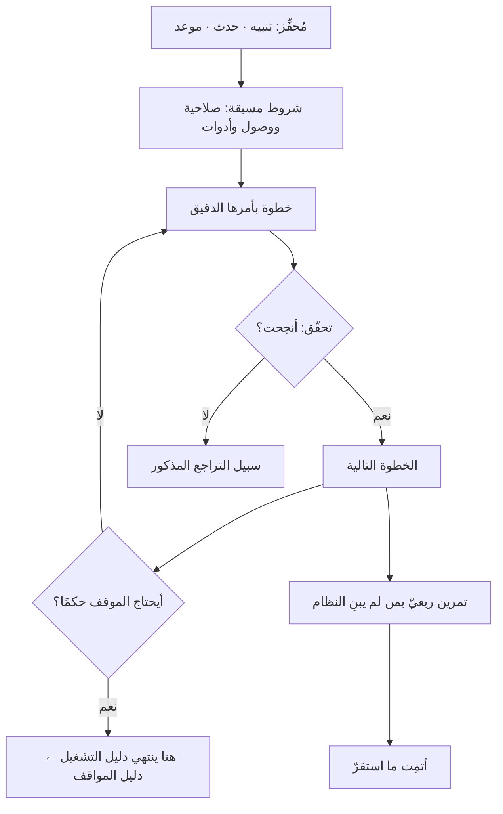

# دليل التشغيل (Runbook)

> [!info] تعريف مختصر
> **دليل التشغيل** وثيقةٌ تصف خطوات **إجراء تشغيليّ بعينه** وصفًا حاسمًا لا يحتمل الاجتهاد: ماذا تفعل، بأيّ ترتيب، وبأيّ أمر، وكيف تتحقّق أنه نجح، وماذا تفعل إن فشل. مثاله: **ما العمل عند إطلاق تنبيه امتلاء القرص؟** أو **كيف تُعاد الخدمة إلى نسختها السابقة؟**
> **ومعياره الحاسم:** أن يستطيع تنفيذَه من هو **مناوبٌ في الثالثة صباحًا ولم يبنِ النظام** — بلا أن يسأل أحدًا، وبلا أن يقرّر شيئًا. **فما احتاج قرارًا فليس دليل تشغيل**؛ ذاك موضع [[Playbook|دليل المواقف]].

## الشرح العلمي والاحترافي

**والمشكلة التي وُجد لها** أن المعرفة التشغيلية تسكن رؤوس ثلاثة أشخاص، وتُستدعى في أسوأ الأوقات: وقت الحادث، حيث الضغط عالٍ والانتباه ضيّق والذاكرة أضعف ما تكون. **فدليل التشغيل ينقل المعرفة من الرأس إلى الورق قبل الحاجة إليها**، لأن كتابتها أثناء الحادث متعذّرة.

**وخصائصه أربع، وكلّ واحدة تُختبر:**

1. **حاسم (Deterministic).** الخطوة الواحدة تعطي النتيجة نفسها لكل من نفّذها. فلا «راجع السجلّات» بل «شغّل هذا الأمر، وإن ظهر هذا النمط فانتقل إلى الخطوة السابعة».
2. **قابل للتحقّق.** بعد كل خطوة حرجة: **كيف تعرف أنها نجحت؟** — والدليل الذي ينتهي بلا تحقّق يترك المنفّذ لا يدري أفرغ أم لا.
3. **يذكر سبيل التراجع.** ماذا لو فشلت الخطوة الرابعة؟ **وأخطر ما في الأدلّة أن يكون فيها إجراء بلا رجعة غير معلَّم**.
4. **مجرَّب.** الدليل الذي لم يُنفَّذ قطّ **فرضيةٌ لا وثيقة**، وسيُكتشف خلله في اللحظة التي لا تحتمل اكتشافًا.

**والاتّجاه الذي استقرّت عليه الصناعة أن يُؤتمت ما استقرّ منه:** فالإجراء الذي تكرّر عشر مرّات بالخطوات نفسها **مرشَّحٌ لأن يصير سكربتًا أو زرًّا**، ويبقى الدليل شرحًا لما يفعله ومتى يُستدعى. **وهذا هو المسار الطبيعي: دليل ← سكربت ← أتمتة كاملة** — والوثيقة التي تبقى يدوية سنواتٍ تدلّ على عمل لم يُنظَر فيه لا على استقرار.

**وأشيع خللٍ فيه أنه يُكتب من ذاكرة من يعرف النظام**، فيسقط منه ما صار عنده بديهيًّا: الصلاحية اللازمة، والخادم المقصود، والاسم الدقيق للخدمة. **والاختبار العملي: أعطِه لمن لم يبنِ النظام ودعه ينفّذه تحت المراقبة** — وكل سؤال يسأله ثغرةٌ تُسدّ.

## أين ومتى يُستخدم

- **في الاستجابة للحوادث**: لكل تنبيه دليل يقابله، وإلّا فالتنبيه إزعاجٌ لا إشارة.
- **في العمليات الدورية**: إغلاق الشهر، والنسخ الاحتياطي، وتدوير الشهادات، وترقية النسخة.
- **في المناوبة**، فهو ما يجعل المناوبة ممكنة لمن ليس أقدم الفريق.
- **في تسليم نظام إلى فريق تشغيل جديد** ([[Closure vs Handover|الإغلاق والتسليم]]).
- **قبل الإطلاق مباشرةً**: دليل التراجع ([[Rollback]]) يُكتب ويُجرَّب **قبل** الإطلاق لا بعده.

> [!warning] متى لا يُستخدَم؟
> - **في موقفٍ يحتاج حكمًا** — «العميل غاضب» أو «تسرّبت بيانات»: فتلك مواقف متغيّرة موضعها [[Playbook|دليل المواقف]].
> - **بديلًا عن الأتمتة** حيث تكون الأتمتة ممكنة ورخيصة. **فالخطوات اليدوية العشر تُخطئ، والزرّ لا يُخطئ.**
> - **في إجراء يتغيّر كل شهر** — فسيبلى قبل أن يُقرأ، والأولى إصلاح ما يجعله يتغيّر.
> - **وثيقةً تُكتب مرّة وتُنسى.** الدليل غير المجرَّب أخطر من غيابه، لأن غيابه يدفع إلى الحذر ووجودَه يمنح ثقةً كاذبة.

## مثال وسيناريو تطبيقي

> [!example] «منصّة عافية» — الدليل موجود، والانقطاع أربعون دقيقة
> **الحادث:** توقّفت خدمة المواعيد الثانية صباحًا. والدليل موجود ومكتوب منذ ثمانية أشهر.
> **ما وقع فعلًا:** استغرقت الاستعادة **أربعين دقيقة**، منها أربع للتنفيذ وستّ وثلاثون لأمور أخرى:
> - الخطوة الثانية تقول «أعد تشغيل الخدمة» ولا تقول **أيّ خادم**، والخوادم ثلاثة.
> - الأمر في الخطوة الثالثة يحتاج صلاحية لا يملكها المناوب، **ولم يُذكر ذلك**، فاستُدعي غيره من نومه.
> - والخطوة الخامسة تشير إلى لوحة مراقبة **غُيّر اسمها منذ خمسة أشهر**.
> **ولم يكن أيّ من الثلاثة خطأً وقت الكتابة** — كلّها بديهيات عند من كتب الدليل، وكلّها تغيّرت أو لم تكن بديهية عند غيره.
> **ما فُعل:** تمرين ربعيّ نصف ساعة، ينفّذ فيه **من لم يبنِ النظام** الدليلَ في بيئة اختبار وأحدُهم يراقب ويكتب كل سؤال.
> **النتيجة:** في التمرين الأوّل سُجّل أحد عشر سؤالًا. وفي الحادث التالي كان زمن الاستعادة **ستّ دقائق**.
> **الدرس:** الدليل لا يُقاس بوجوده بل **بمن يستطيع تنفيذه**؛ والفرق بين الأربعين والستّ لم يكن في المعرفة، بل في أين كانت.

## خطوات أو مخطّط

1. **ابدأ من المُحفِّز:** أيّ تنبيه أو حدث أو موعد يستدعي هذا الدليل؟ واكتبه في أعلاه.
2. **اذكر الشروط المسبقة**: الصلاحيات، والوصول، والأدوات — **قبل** الخطوات.
3. **اكتب الخطوات بأوامرها الدقيقة** لا بوصفها.
4. **ضع تحقّقًا بعد كل خطوة حرجة**: كيف تعرف أنها نجحت؟
5. **اذكر التراجع**، وعلِّم كل إجراء لا رجعة فيه بعلامة ظاهرة.
6. **جرّبه بمن لم يبنِ النظام**، وسجّل كل سؤال يسأله فهو ثغرة.
7. **أتمِت ما استقرّ**، وأبقِ الوثيقة شرحًا لما يفعله السكربت ومتى يُستدعى.

## ⚠️ مفاهيم خاطئة شائعة

> [!warning]
> - **الخلط بينه وبين [[SOP|كتيّب العمليات التشغيلية]] و[[Playbook|دليل المواقف]].** انظر جدول التمييز في [[Playbook|دليل المواقف]]؛ والفارق **مقدار الحكم المطلوب من المنفّذ**.
> - **حسبان وجوده كافيًا.** غير المجرَّب فرضية، والثقة به ضررٌ لا نفع.
> - **الظنّ بأنه للأنظمة التقنية وحدها.** يصلح لكل إجراء حاسم متكرّر: إغلاق مالي، أو تسليم دفعة، أو تدشين موقع.
> - **كتابته بلغة الوصف** («تأكّد من سلامة الخدمة») — فالمناوب لا يعرف ماذا يفعل بهذه الجملة.
> - **الظنّ بأن الأتمتة تُلغيه.** بل تنقله من «افعل» إلى «هذا ما يفعله الأمر ومتى يُستدعى وماذا لو فشل».

## ❌ ممارسات خاطئة في المشاريع

> [!failure]
> - **كتابته من ذاكرة من بنى النظام** — فتسقط البديهيات وهي بعينها ما يعطّل غيره. **الحلّ:** يُجرَّب بمن لم يبنِه.
> - **تركه بلا مراجعة بعد تغيّر النظام** — فيشير إلى أسماء وخوادم زالت. **الحلّ:** مراجعته بندٌ في تعريف اكتمال أيّ تغيير يمسّه.
> - **تنبيهٌ بلا دليل يقابله** — فيُوقَظ الناس بلا أن يعرفوا ماذا يفعلون. **الحلّ:** لا تنبيه بلا دليل، وإلّا فأَلغِ التنبيه.
> - **خطوة لا رجعة فيها بلا تعليم** — فتُنفَّذ تحت الضغط ولا تُستدرَك. **الحلّ:** علامة ظاهرة وتأكيد مزدوج.
> - **حفظه في مكان يتعطّل مع النظام** — فيتعذّر الوصول إليه وقت الحاجة تحديدًا. **الحلّ:** نسخة مستقلّة عن البنية التي يعالجها.

## 🔗 مصطلحات ومفاهيم ذات صلة

[[Playbook]] | [[SOP]] | [[Operational Resilience]] | [[Rollback]] | [[MTTR]] | [[SRE]] | [[Blameless Postmortem]] | [[ITIL 4]] | [[Closure vs Handover]] | [[Hypercare]] | [[Knowledge Management]]
