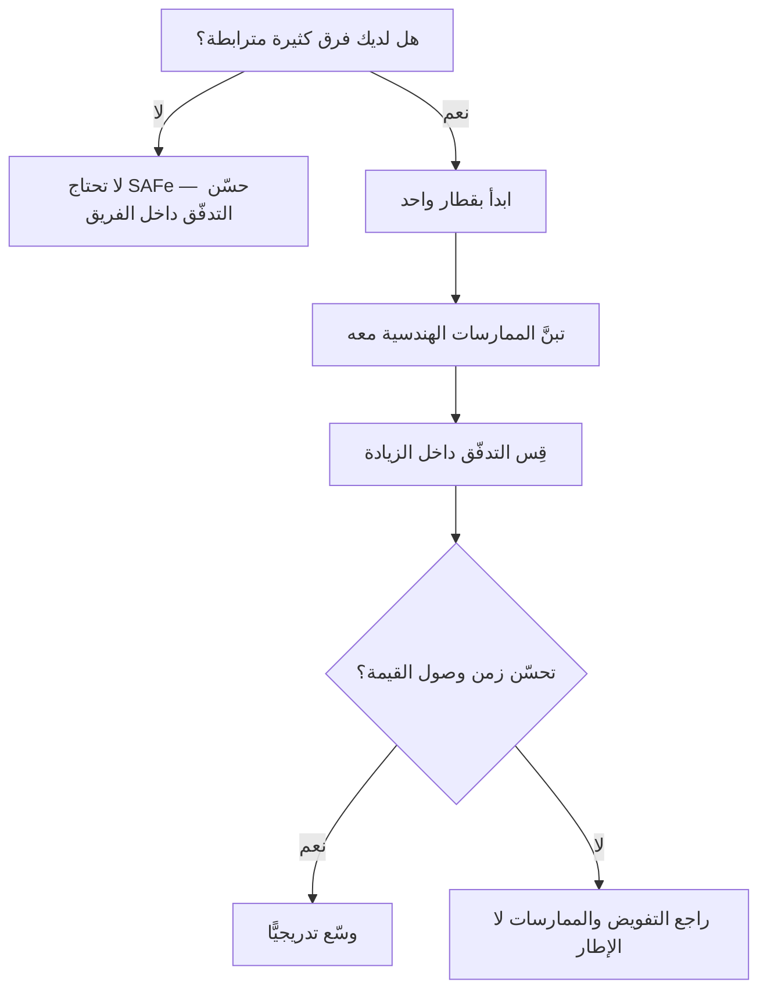

# الإطار الرشيق الموسَّع (SAFe)

> [!info] تعريف مختصر
> `SAFe` (Scaled Agile Framework) إطار عمل لتطبيق المبادئ الرشيقة على **مستوى المؤسّسة** لا الفريق الواحد، طوّره **دين ليفينغستون** ونُشِر أوّل مرّة عام 2011. يقوم على تنظيم عدّة فرق في **قطار إصدار رشيق (`Agile Release Train`)** يعمل بإيقاع مشترك، مع **تخطيط زيادة برنامج (`PI Planning`)** كلّ 8–12 أسبوعًا. وهو من أكثر الأطر انتشارًا في المؤسّسات الكبيرة، **وأكثرها إثارةً للجدل** في مجتمع أجايل.

## الشرح العلمي والاحترافي
- **مكوّناته الأساسية**:
  - **قطار الإصدار الرشيق (`ART`)**: تجمّع من 5–12 فريقًا (50–125 شخصًا) يعملون على قيمة مشتركة بإيقاع واحد.
  - **زيادة البرنامج (`PI`)**: دورة تخطيط من 8–12 أسبوعًا تضمّ عدّة تكرارات.
  - **`PI Planning`**: حدث تخطيط جماعي (يومان عادةً) يحضره القطار كلّه لمواءمة الأهداف والتبعيّات.
  - **مستويات أربعة** في النسخة الكاملة: الفريق · البرنامج · الحلّ الكبير · المحفظة.
- **ما يحلّه فعلًا**: مشكلة **التنسيق بين عشرات الفرق المترابطة** — وهي مشكلة حقيقية لا يعالجها [[02 - Scrum|سكرم]] الذي صُمِّم لفريق واحد. وتخطيط الزيادة يجعل [[Dependency|التبعيّات]] مرئية في مكان واحد، وهي فائدة يشهد بها كثير ممّن طبّقوه.
- **النقد الأساسي — «شلّال في ثوب أجايل»**: تلخّصه ثلاث مآخذ متكرّرة في مجتمع أجايل:
  1. **دورة التخطيط الطويلة** (ربع كامل) تعيد إنتاج الالتزام المسبق بنطاق واسع — أي **نقيض** [[Iron Triangle|النطاق المتغيّر]].
  2. **كثافة الأدوار والطقوس والوثائق** تُنتج طبقة تنسيق ثقيلة قد تفوق ما ألغته.
  3. **نموذج الأعمال**: الإطار مرتبط بمنظومة شهادات وتدريب مدفوعة، ما يخلق حافزًا للتوسّع والتعقيد.
- **الردّ المقابل**: يذهب مؤيّدوه إلى أنّ معظم الفشل المنسوب إليه هو **فشل تطبيق** لا فشل تصميم — تبنّي الطقوس دون تبنّي التفويض ولا الممارسات الهندسية. وأنّ الإطار نفسه ينصّ على `DevOps` والتسليم المستمرّ، لكنّ المؤسّسات تتبنّى التخطيط وتترك الهندسة.
- **الموقف المنهجي المتوازن**: **لا صواب مطلق ولا خطأ مطلق؛ الصواب والخطأ يعتمدان على حجم المعلومات المتاحة وعلى القدرة على التنفيذ.** فمؤسّسة من ألف مهندس تنتقل من شلّال صارم إلى `SAFe` قد تكون حقّقت تقدّمًا حقيقيًّا، حتى لو بدا الإطار ثقيلًا بمعايير فريق ناشئ من سبعة أشخاص.
- **العلاقة بـ[[06 - مقاييس التدفّق الستة|مقاييس التدفّق]]**: `SAFe` يتبنّى مفاهيم التدفّق صراحةً في نسخه الحديثة (`Flow Metrics`، [[WSJF]]، [[Cost of Delay|تكلفة التأخير]]). والخطر العملي أنّ دورة الربع الطويلة قد تُخفي مشكلات التدفّق داخلها: قطار يبدو ملتزمًا بأهداف الزيادة بينما [[Flow Time|زمن وصول]] العنصر إلى السوق ثلاثة أشهر.

## أين ومتى يُستخدم
- في **المؤسّسات الكبيرة** ذات الفرق المتعدّدة المترابطة والتبعيّات الكثيفة.
- في **البيئات المنظَّمة** (بنوك، اتّصالات، حكومة) التي تحتاج أثرًا حوكميًّا موثّقًا.
- بوصفه **خطوة انتقالية** من الشلّال — لا محطّة نهائية.
- عند الحاجة إلى **لغة مشتركة** بين عشرات الفرق التي تعمل بممارسات متباينة.

> [!warning] متى لا يُستخدَم؟
> في فريق واحد أو ثلاثة فرق مستقلّة نسبيًّا — يصير عبئًا تنسيقيًّا بلا مقابل. والقاعدة العملية: **إن كنت تستطيع حلّ التنسيق باجتماع أسبوعي بين قادة الفرق، فأنت لا تحتاج قطار إصدار.**

## مثال وسيناريو تطبيقي
> [!example] قطار إصدار في منتج سريع النمو — الأرقام ممتازة والمشكلة قادمة.
> **الوضع:** [[18 - Velocity|سرعة]] عند أعلى مستوى في تاريخها، [[Flow Predictability|قابلية تنبّؤ]] 95%، وأصحاب العمل مسرورون. لكنّ التوزيع **90% ميزات · 5% عيوب · 5% دَين تقني**، وطابور اختبار النظام المتكامل مرتفع جدًّا.
> **ما تُخفيه دورة الربع:** الأرقام تُقاس على ما دخل الاختبار لا على ما وصل الإنتاج؛ ولأنّ الإطلاق مرتبط بنهاية الزيادة، لا يظهر التكدّس إلّا متأخّرًا.
> **الإسقاط:** بحلول التكرار الثالث أو الرابع يصير طابور الجودة طويلًا وطابور النشر فارغًا، فيتعذّر شحن ميزة مكتملة.
> **الدرس:** `SAFe` **لا يمنع** هذا ولا يسبّبه؛ لكنّ إيقاعه الربعي **يؤخّر ظهور الإشارة**. والعلاج قياس التدفّق **داخل** الزيادة لا عند نهايتها فقط.

## خطوات أو مخطّط
1. **شخّص أوّلًا**: هل مشكلتك تنسيق بين فرق كثيرة، أم تدفّق داخل فريق؟ لا تتبنَّ إطارًا لمشكلة لا تملكها.
2. **لا تبدأ بالنسخة الكاملة**: ابدأ بقطار واحد وبالمستوى الأساسي.
3. **تبنَّ الممارسات الهندسية معه**: التكامل والتسليم المستمرّان وأتمتة الاختبار — بدونها يصير الإطار تخطيطًا بلا تنفيذ.
4. **قِس التدفّق داخل الزيادة** لا عند نهايتها فقط: زمن التدفّق وكفاءته لكلّ عنصر.
5. **احرس التفويض**: إن بقي القرار مركزيًّا فالطقوس بلا أثر.
6. **راجع بعد زيادتين**: هل تحسّن زمن وصول القيمة فعلًا، أم تحسّن التنسيق فقط؟

## ⚠️ مفاهيم خاطئة شائعة
> [!warning]
> - **اعتباره «هجينًا» بين أجايل والشلّال**: التوصيف شائع داخليًّا لكنّه غير دقيق؛ الإطار له بنية مستقلّة، ونقده الحقيقي يتعلّق بطول دورة الالتزام لا بكونه خليطًا.
> - **الظنّ بأنّه يُلغي الحاجة إلى الممارسات الهندسية**: بدون تكامل مستمرّ وأتمتة اختبار يصير تخطيطًا فاخرًا.
> - **رفضه لمجرّد ثقله**: كثير من الرفض يأتي من فرق صغيرة تقيسه بمعايير سياقها لا سياقه.
> - **قبوله لمجرّد انتشاره**: الانتشار دليل على قابلية البيع لا على الملاءمة.
> - **افتراض أنّ نجاح التخطيط يعني نجاح التسليم**: قطار قد ينجح في `PI Planning` ويفشل في إيصال القيمة.

## ❌ ممارسات خاطئة في المشاريع
> [!failure]
> - **تبنّي النسخة الكاملة دفعةً واحدة**: يُنتج بيروقراطية فورية ورفضًا. الحلّ: قطار واحد ومستوى أساسي أوّلًا.
> - **تبنّي الطقوس دون التفويض**: اجتماعات كثيرة والقرار ما زال مركزيًّا. الحلّ: التفويض شرط لا مكمّل.
> - **قياس النجاح بجودة تخطيط الزيادة**: التخطيط الجميل ليس قيمة مُسلَّمة. الحلّ: قِس [[Flow Time|زمن التدفّق]] إلى الإنتاج.
> - **الالتزام بنطاق ربع كامل بلا مقايضة**: يُلغي مكسب الرشاقة. الحلّ: أبقِ آلية مقايضة داخل الزيادة.
> - **استخدامه لعلاج مشكلة تدفّق داخل فريق واحد**: علاج في المكان الخطأ. الحلّ: شخّص القيد قبل اختيار الإطار.

## 🔗 مصطلحات ومفاهيم ذات صلة
[[01 - Agile]] | [[02 - Scrum]] | [[03 - Kanban]] | [[WSJF]] | [[Cost of Delay]] | [[Dependency]] | [[Flow Predictability]] | [[Governance]] | [[Scrum-ban]] | [[09 - التشخيص العملي - قراءة الأرقام]]
