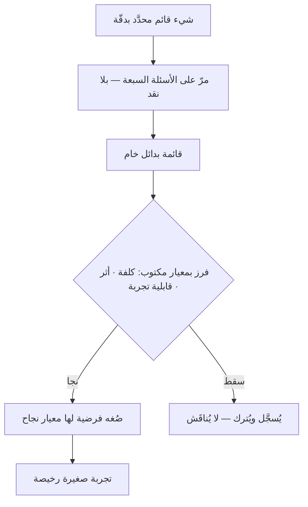

# SCAMPER — قائمة أسئلة توليد البدائل

> [!info] تعريف مختصر
> **SCAMPER** قائمة من سبعة أسئلة تُطرح على **شيء قائم** — منتج، أو ميزة، أو عملية — لتوليد بدائل له: **استبدل (Substitute)** · **ادمج (Combine)** · **كيّف (Adapt)** · **عدّل — كبّر أو صغّر (Modify)** · **وظّفه في غير ما وُضع له (Put to another use)** · **احذف (Eliminate)** · **اعكس أو أعد الترتيب (Reverse)**.
> صاغ المختصر **بوب إيبرلي** سنة 1971 من قائمة أسئلة أطول وضعها **أليكس أوزبورن** — صاحب العصف الذهني — في *Applied Imagination* (1953).
> **وآليّتها قلب السؤال:** فـ«فكّر في شيء جديد» سؤالٌ لا مدخل له، و«ماذا لو حذفنا هذه الخطوة؟» سؤالٌ يُجاب. **فالقيد هنا مولِّدٌ لا مانع.**

## الشرح العلمي والاحترافي

**والأسئلة السبعة**، ولكلٍّ صيغته العملية:

| الحرف | السؤال | صيغته على منتج رقمي |
|---|---|---|
| **S** — استبدل | ما الذي يمكن أن يحلّ محلّ جزء منه؟ | ما لو استبدلنا بنموذج الاشتراك دفعًا بالاستعمال؟ |
| **C** — ادمج | ماذا لو ضممنا إليه شيئًا آخر؟ | ما لو دُمجت شاشتا التسجيل والدفع في واحدة؟ |
| **A** — كيّف | ما الذي حلّ مشكلةً شبيهة في مجال آخر؟ | كيف حلّت المطاعم مشكلة الانتظار؟ أنقتبس الطابور المرقّم؟ |
| **M** — عدّل | ماذا لو كبّرنا سمةً أو صغّرناها إلى حدّ متطرّف؟ | ماذا لو صار الإعداد خطوةً واحدة؟ وماذا لو صار عشرين لكن بلا قرار؟ |
| **P** — وظّف في غير ما وُضع له | من قد يستعمله لغرض لم نقصده؟ | ألوحة التقارير عندنا تصلح أداة بيع للعميل نفسه؟ |
| **E** — احذف | ما الذي يمكن أن يُزال ويبقى الشيء نافعًا؟ | ماذا لو ألغينا التسجيل قبل التجربة؟ |
| **R** — اعكس | ماذا لو قلبنا الترتيب أو الاتّجاه؟ | ماذا لو دفع العميل بعد أن يرى النتيجة لا قبلها؟ |

**وأنفعها في البرمجيات هو `E` — احذف.** لأن الميل الغالب في الفرق إضافةٌ لا حذف، ولأن السؤال «ما الذي يبقى نافعًا إن أزلناه؟» هو بعينه منطق [[MVP|المنتج الأوّلي]] ومنطق مواجهة [[Feature Creep|تضخّم الميزات]]. ويليه `R` — اعكس، فأكثر نماذج الأعمال المبتكرة قلبٌ لترتيب مستقرّ: أن تُجرَّب البضاعة قبل الشراء، وأن يُدفَع بعد الاستعمال.

**وحدّها الذي يجب أن يُعرف:** الطريقة تعمل على **شيء موجود** لا على مشكلة مجرّدة. فإن كان بين يديك سؤالٌ من نوع «كيف نزيد الاحتفاظ بالمستخدمين؟» فليس لـSCAMPER ما تشتغل عليه بعد؛ يلزمك أوّلًا أن تعيّن **الشيء**: أيّ شاشة؟ أيّ خطوة؟ أيّ رسالة؟ ثم تُطرح الأسئلة السبعة عليه. **وهذا التحديد نصف الفائدة**، لأن كثيرًا من جلسات الأفكار تفشل لأنها لم تعيّن موضوعها لا لأنها عقمت.

**ولماذا تنجح؟** لأن العقل يولّد بدائل أفضل حين يُعطى **اتّجاهًا محدودًا** لا فضاءً مفتوحًا. فالورقة البيضاء تشلّ، والسؤال المخصوص يفتح. وهذا هو المبدأ نفسه الذي تقوم عليه [[Oblique Strategies|الاستراتيجيات المائلة]] بطريق آخر: تلك تكسر النمط بمثيرٍ غير متوقّع، وهذه تكسره **بمسحٍ منهجيّ لسبعة اتّجاهات**.

## أين ومتى يُستخدم

- **في تحسين ميزة قائمة** بلغت سقفها ولم يعد الفريق يرى فيها جديدًا.
- **في تبسيط عملية داخلية**: تُطرح السبعة على خطوات العملية واحدةً واحدة، و`E` وحده يكفي غالبًا.
- **في جلسة أفكار تعثّرت** بعد أن نضبت البدائل الظاهرة — فهي تعطي الجلسة مسارًا حين يجفّ العصف الحرّ.
- **في [[Product Discovery|اكتشاف المنتج]]** عند توليد حلول لفرصة تحدّدت بالفعل، لا عند البحث عن الفرصة نفسها.
- **مع فردٍ يعمل وحده**، وهي من قليل تقنيات التوليد التي لا تحتاج مجموعة.

> [!warning] متى لا تُستخدَم؟
> - **قبل تحديد الشيء**: بلا موضوع محدَّد تُنتج كلامًا عامًّا.
> - **في اختيار البديل**: هي تولّد ولا تفاضل؛ والاختيار لأدوات أخرى كـ[[WSJF]] أو معايير مكتوبة.
> - **حيث تكون المشكلة في المعلومة لا في الأفكار.** فالفريق الذي لا يعرف لماذا يهجره المستخدمون لا ينقصه توليد؛ ينقصه [[User Interview|مقابلة مستخدم]].
> - **بوصفها جلسةً كاملة تُستوفى سبعتها** في كل مرّة: أربعة أسئلة مثمرة خيرٌ من سبعة مستوفاة على مضض.

## مثال وسيناريو تطبيقي

> [!example] «منصّة رِفد» — شاشة إعداد يهجرها 44٪ من المستخدمين
> **الشيء المحدَّد:** شاشة إعداد الحساب الأوّل — سبع خطوات، ومعدّل إتمام 56٪.
> **ما أنتجته الأسئلة في أربعين دقيقة:**
> - **احذف:** ما الخطوات التي يمكن تأجيلها إلى ما بعد أوّل استعمال؟ → أربع من السبع لا يحتاجها المستخدم ليرى القيمة.
> - **اعكس:** ماذا لو رأى النتيجة قبل أن يُنشئ الحساب؟ → وضع تجريبي بلا تسجيل.
> - **ادمج:** ماذا لو جُمعت خطوتا الهوية والدفع؟ → قلّت شاشتان.
> - **كيّف:** كيف تفعل تطبيقات البنوك في التحقّق؟ → تحقّق بالرسالة القصيرة بدل تأكيد البريد.
> - **وظّف في غير ما وُضع له:** أتصلح شاشة الإعداد نفسها عرضًا للقيمة؟ → أُعيدت صياغتها لتُظهر ما سيحصل عليه لا ما نطلبه منه.
> **ما نُفّذ:** الحذف والعكس فقط — وهما الأرخص. فارتفع الإتمام إلى 79٪ في ثلاثة أسابيع.
> **الدرس:** خمسة من الأسئلة السبعة أعطت شيئًا، واثنان لم يعطيا — **وهذا هو المعدّل الطبيعي**؛ ومن انتظر أن تثمر السبعة أوقف الجلسة على أقلّها نفعًا.

## خطوات أو مخطّط

1. **عيّن الشيء بدقّة:** شاشة، أو خطوة، أو رسالة — لا «التجربة» ولا «المنتج».
2. **اكتب الأسئلة السبعة أمام الفريق** بصيغتها المخصوصة لهذا الشيء، لا بصيغتها العامّة.
3. **مرّ عليها واحدًا واحدًا**، خمس دقائق لكلٍّ، **ولا نقد أثناء التوليد**.
4. **تجاوز السؤال العقيم بعد دقيقتين** ولا تستوفِ السبعة تكلّفًا.
5. **افرز بعد الجلسة لا أثناءها**، وبمعيار مكتوب: الكلفة، والأثر المتوقّع، وقابلية التجربة.
6. **حوّل ما نجا إلى فرضية** لها معيار نجاح ([[Hypothesis|الفرضية]])، فالفكرة التي لا تصير فرضية تبقى محضر اجتماع.

## ⚠️ مفاهيم خاطئة شائعة

> [!warning]
> - **حسبانها منهج ابتكار.** هي **قائمة تحقّق للتوليد** لا منهجًا: لا تعرّف عملية ولا دورًا ولا معيار اختيار.
> - **الظنّ بأن الأسئلة السبعة متساوية النفع.** بل يتفاوت نفعها بحسب الشيء والمجال؛ و`احذف` و`اعكس` أغزرها في البرمجيات.
> - **الخلط بينها وبين العصف الذهني.** العصف يفتح الفضاء بلا اتّجاه، وSCAMPER **يُوجّه** التوليد في سبعة مسارات — ولهذا تنفع حين يجفّ العصف.
> - **الخلط بينها وبين [[Six Thinking Hats|القبّعات الستّ]].** تلك **تدير نقاشًا** حول بدائل مطروحة، وهذه **تولّد** البدائل.
> - **توقّع فكرة جاهزة للتنفيذ.** مخرجها مادّة خام؛ وقيمتها في السعة لا في الجودة، والجودة تأتي من الفرز والتجربة.

## ❌ ممارسات خاطئة في المشاريع

> [!failure]
> - **إطلاقها على موضوع مبهم** («كيف نصير أفضل؟») — فتُنتج عموميات. **الحلّ:** عيّن الشيء أوّلًا، ولو استغرق تعيينُه نصف الجلسة.
> - **النقد أثناء التوليد** — فيتوقّف الطرح بعد ثالث اقتراح. **الحلّ:** فصلٌ صارم بين جلسة التوليد وجلسة الفرز، ولو بيوم بينهما.
> - **الخروج بأربعين فكرة بلا معيار فرز** — فتموت كلّها في محضر. **الحلّ:** المعيار يُكتب **قبل** الجلسة لا بعدها.
> - **استيفاء السبعة تكلّفًا** — فينتهي الفريق منهكًا بأفكار متكلّفة. **الحلّ:** اترك السؤال العقيم بعد دقيقتين.
> - **استعمالها بديلًا عن فهم المستخدم** — فتُولَّد حلول أنيقة لمشكلة لم تُشخَّص. **الحلّ:** لا توليد قبل أن يكون [[Problem Statement|بيان المشكلة]] مكتوبًا.

## 🔗 مصطلحات ومفاهيم ذات صلة

[[Six Thinking Hats]] | [[Oblique Strategies]] | [[Design Thinking]] | [[Double Diamond]] | [[Product Discovery]] | [[Hypothesis]] | [[Problem Statement]] | [[MVP]] | [[Feature Creep]] | [[Prototype]] | [[Cost of Experimentation]]
