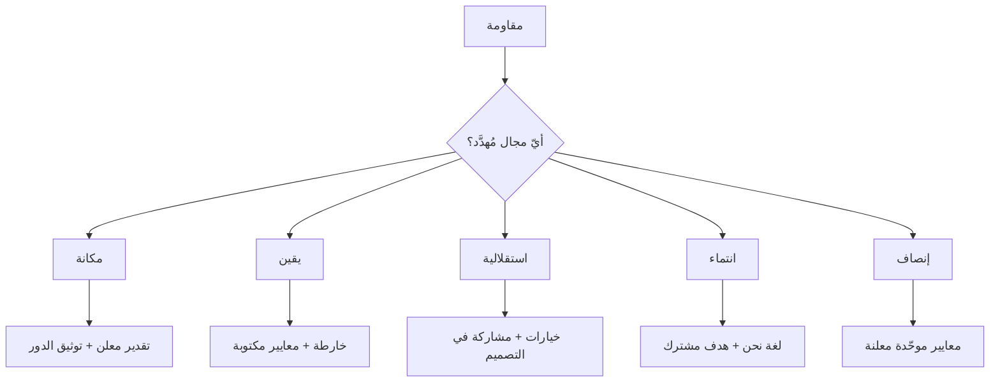

# نموذج SCARF
> [!info] تعريف مختصر
> إطار يُصنّف **خمسة مجالات اجتماعية** يُعالجها الدماغ بمنطق التهديد والمكافأة نفسه الذي يُعالج به الحاجات المادّية: **المكانة · اليقين · الاستقلالية · الانتماء · الإنصاف**. وقيمته أنّه يُحوّل «هذا الشخص يُقاوم» إلى **تشخيص محدّد** يُنتج تدخّلًا مختلفًا لكلّ مجال.

## الشرح العلمي والاحترافي
قدّمه **ديفيد روك (David Rock)** في *SCARF: A Brain-Based Model for Collaborating with and Influencing Others* (NeuroLeadership Journal, 2008).

| المجال | التهديد فيه | المكافأة فيه | مظهره في العمل |
|---|---|---|---|
| **المكانة (Status)** | نقد علني · تجاهل الرأي · تجاوز في ترقية | تقدير معلن · استشارة في تخصّصه | استعلاء · رفض النقد · تبرير غير منطقي |
| **اليقين (Certainty)** | متطلّبات غامضة · خطط تتغيّر · صمت الإدارة | خارطة واضحة · معايير قبول مكتوبة | قلق · أسئلة متكرّرة · شلل في القرار |
| **الاستقلالية (Autonomy)** | أوامر بلا مشاركة · [[Micromanagement\|إدارة تفصيلية]] | خيارات · مشاركة في وضع القاعدة | مقاومة تغيير موعد أو أداة |
| **الانتماء (Relatedness)** | «فريقكم» مقابل «فريقنا» · الشللية | لغة «نحن» · هدف مشترك معلن | تحزّب · قرارات خارج القاعة |
| **الإنصاف (Fairness)** | ازدواجية معايير · محاسبة غير متكافئة | شفافية المعايير · تطبيق موحّد | استياء صامت · انسحاب من المبادرة |

**وقيمته العملية لإدارة المشاريع** أنّه يُفسّر ثلاثة مواقف شائعة يُقدَّم علاجها عادةً بلا تفسير:
- **مقاومة تغيير موعد الاجتماع** ← استقلالية، لا رفضًا للموعد.
- **فاعلية الحديث بصيغة «نحن»** ← انتماء.
- **أثر «حاسِب كلًّا على مستواه»** ← إنصاف.

> [!warning] حدّ منهجي
> **SCARF إطار تنظيمي مفيد لا نظرية عصبية مُختبَرة كوحدة واحدة**؛ ومكوّناته مدعومة تفاوتيًّا في الأدبيات. **فاستخدمه قائمة تشخيص لا قانونًا** — قيمته في أنّه يمنعك من اختزال كلّ مقاومة في «سوء نيّة» أو «مقاومة تغيير».

## أين ومتى يُستخدم
- تشخيص مقاومة لتغيير أو سياسة أو أداة.
- تصميم إعلان تغيير تنظيمي: أيّ مجال سيُهدَّد وكيف تُعوّضه؟
- تحضير اجتماع مع شخص تعرف حساسيّته في مجال بعينه.
- في التحوّل الرشيق — حيث تُهدَّد أربعة مجالات دفعةً واحدة.

## مثال وسيناريو تطبيقي
> [!example] إعلان إعادة هيكلة يُقاوَم بشدّة رغم أنّ الجميع سيحتفظون بوظائفهم. والتشخيص بـSCARF يكشف أنّ **أربعة مجالات تُهدَّد معًا**: **المكانة** (تغيّرت المسمّيات وخطوط التبعية) · **اليقين** (لا أحد يعرف شكل عمله بعد شهر) · **الاستقلالية** (لم يُستشَر أحد) · **الانتماء** (فُرِّق أعضاء فريق عملوا معًا سنوات). **والتدخّل المطابق ليس خطابًا تحفيزيًّا** بل أربعة إجراءات: توثيق صريح لدور كلّ شخص ومكانته في الهيكل الجديد · جدول زمني معلن بما سيُعرَف ومتى · إشراك الفرق في تصميم تفاصيل التنفيذ · والحفاظ على وحدات العمل القائمة قدر الإمكان. **والملاحظة الأهمّ: الطمأنة الشفوية وحدها لا تُصدَّق — الأمان في مجال المكانة يحتاج توثيقًا.**

## خطوات أو مخطّط
1. أمام أيّ مقاومة، **مرّ على المجالات الخمسة** واسأل: أيّها مُهدَّد؟
2. **قد يكون أكثر من واحد** — والغالب في التغييرات الكبيرة ثلاثة أو أربعة.
3. صمّم تدخّلًا **لكلّ مجال مُهدَّد** لا تدخّلًا عامًّا.
4. **وثّق ما يخصّ المكانة واليقين** — الكلام وحده لا يكفي فيهما.
5. راجع: هل انخفضت المقاومة، أم انتقلت إلى مجال آخر؟

## ⚠️ مفاهيم خاطئة شائعة
> [!warning]
> - **«مقاومة التغيير» ليست تشخيصًا.** إنّها وصف للعَرَض؛ والتشخيص تحديد المجال المُهدَّد.
> - **ليست مجالات «شعورية» يمكن تجاهلها.** أثرها على الأداء والقرار مرصود؛ وتجاهلها يُنتج مقاومة تُنسَب خطأً إلى الأشخاص.
> - **التهديد قد يكون غير مقصود تمامًا** — إعلان في قناة عامّة قد يُهدّد مكانة شخص بلا أن يخطر ببال كاتبه.

## ❌ ممارسات خاطئة في المشاريع
> [!failure]
> - **معالجة تهديد اليقين بالطمأنة العاطفية** («لا تقلقوا، كلّ شيء سيكون بخير») — اليقين يحتاج **معلومة وجدولًا** لا طمأنة.
> - **نقد فردي في اجتماع عامّ** — تهديد مكانة يُنتج دفاعًا يُبطل مضمون النقد مهما كان صحيحًا.
> - **فرض عملية جديدة بلا إشراك** — تهديد استقلالية يُنتج امتثالًا ظاهريًّا و[[Fake Yes|«نعم» زائفة]].
> - **ازدواجية المعايير في تطبيق قاعدة** — أشدّ ما يُنتج استياءً صامتًا يصعب تشخيصه، لأنّ أحدًا لا يشتكي منه صراحةً.

## 🔗 مصطلحات ومفاهيم ذات صلة
[[Amygdala Hijack]] | [[Psychological Reactance]] | [[Psychological Safety]] | [[Biological Leadership]] | [[ADKAR Model]] | [[Evolutionary Change]] | [[Micromanagement]] | [[Empowerment]] | [[Task vs Relationship Conflict]]

> [!tip] 💡 إثراء عملي — كورس لعبة العقل
> المجالات الخمسة مقابل مُطلِقات الكورتيزول الأربعة، وما تُضيفه على القائمة: [[02 - بيولوجيا اللحظة - اللوزة والقشرة الجبهية]].
