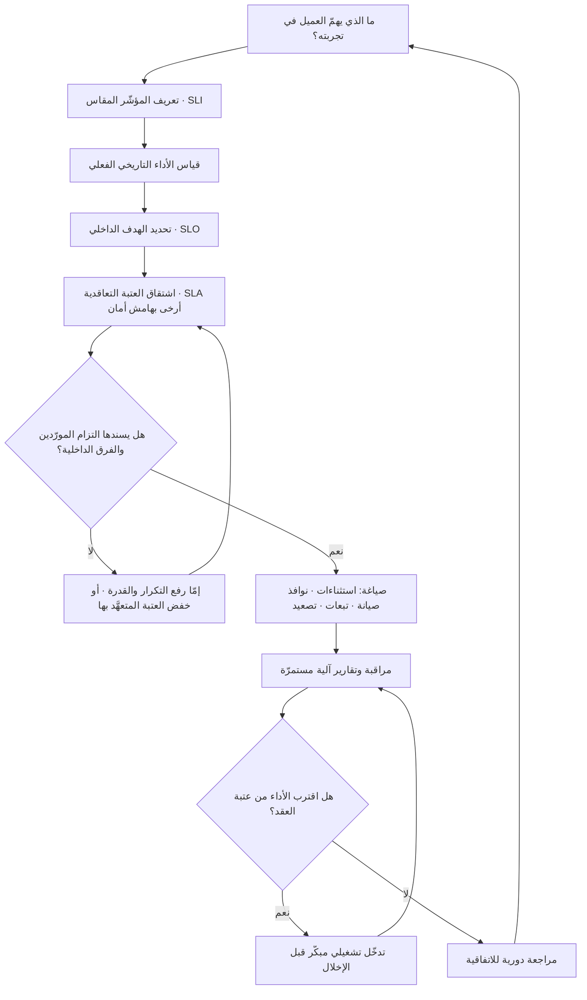

# اتفاقية مستوى الخدمة (SLA)

> [!info] تعريف مختصر
> وثيقة **تعاقدية مُلزِمة** بين مقدّم خدمة ومستفيد منها، تحدّد مستوى الأداء الواجب تقديمه بصيغة قابلة للقياس (توافر، زمن استجابة، زمن معالجة البلاغات)، وتنصّ صراحةً على طريقة القياس، وفترة الاحتساب، والاستثناءات، و**التبعة عند الإخلال** (Remedy) — وهي غالبًا خصم مالي أو رصيد خدمة أو حقّ إنهاء العقد. المفتاح في تمييز SLA عن قريباته الثلاث أنّ له **طرفَين وعواقب**: فهو الوحيد بين المصطلحات الأربعة الذي يُقاضى عليه.

## الشرح العلمي والاحترافي
- **العلاقة بين المصطلحات الأربعة (SLI · SLO · SLA · SLE)** — هذه أكثر نقطة يقع فيها اللبس، وأوضح طريقة لفهمها أنها سلسلة صاعدة من القياس إلى الالتزام:
  1. **[[SLI]] — ما نقيسه**: الرقم الخام المستخرَج من النظام (نسبة الطلبات الناجحة، زمن الاستجابة). لا هدف فيه ولا وعد، مجرّد قياس.
  2. **[[SLO]] — ما نستهدفه داخليًّا**: هدف نضعه فوق ذلك القياس ونحاسب أنفسنا عليه هندسيًّا. لا عقوبة تعاقدية عند تجاوزه، بل قرار تشغيلي (تجميد الإطلاقات، توجيه الجهد إلى الاستقرار).
  3. **SLA — ما نلتزم به تعاقديًّا**: عتبة أدنى نتعهّد بها للعميل، ومعها جزاء. وهي **دائمًا أرخى من الـSLO** بهامش أمان مقصود؛ فإن كان الـSLO الداخلي 99.95% فقد يكون الـSLA 99.9%. الغرض من الفجوة أن يمنحك الـSLO إنذارًا مبكّرًا يتيح التدخّل **قبل** أن تصل الخدمة إلى حدّ الإخلال التعاقدي.
  4. **[[SLE]] — ما نتوقّعه احتماليًّا**: تصريح إحصائي عن زمن إنجاز العمل مبنيّ على بيانات تاريخية، وليس تعهّدًا. موطنه إدارة تدفّق العمل في كانبان لا العقود.
  والفارق البنيوي: SLI وSLO وSLA تتحدّث عن **أداء الخدمة الجاهزة**، بينما SLE يتحدّث عن **زمن إنجاز العمل الجديد**. أمّا فارق الإلزام فبسيط: SLE توقّع، SLI وصف، SLO التزام على النفس، SLA التزام أمام الغير بعواقب.
- **بنية أي SLA محكمة**: نطاق الخدمة المشمولة بدقّة، وتعريف كل مؤشّر بصيغة رياضية لا لغوية، ونقطة القياس (من الخادم أم من عميل خارجي؟)، وفترة الاحتساب (شهرية أم ربع سنوية)، وتعريف «التعطّل» ومتى يبدأ احتسابه، والاستثناءات المعتمدة، وآلية الإبلاغ والتصعيد، والتبعات، وشروط المراجعة.
- **فترة الاحتساب تصنع المعنى أو تفرغه**: التوافر 99.9% شهريًّا يسمح بنحو 43 دقيقة تعطّل في الشهر، والنسبة نفسها سنويًّا تسمح بنحو 8.7 ساعة **قد تقع كلّها دفعة واحدة**. لذلك تفضّل الجهات الجادّة النافذة الشهرية أو المتحرّكة (Rolling Window)، لأن النافذة السنوية تخفي انقطاعًا كارثيًّا واحدًا خلف رقم جميل.
- **الاستثناءات هي المكان الذي تُفرَّغ فيه الاتفاقيات من مضمونها**: الصيانة المجدولة، والقوّة القاهرة، وأعطال شبكة العميل، وسوء الاستخدام، والخدمات المُعلَنة كتجريبية (Beta). حين تُكتب الاستثناءات بلغة فضفاضة يصبح إثبات الإخلال شبه مستحيل. والمعيار العملي: هل توجد نافذة صيانة **محدودة زمنيًّا ومُعلَنة مسبقًا** أم إعفاء مفتوح؟
- **مؤشّرات SLA أوسع من التوافر**: أشهرها التوافر ([[Uptime]])، لكن الاتفاقيات الجادّة تشمل زمن الاستجابة الأولى للبلاغ، وزمن الحلّ حسب درجة الخطورة ([[Severity vs Priority]])، ومتوسّط زمن الاستعادة ([[MTTR]])، وأحيانًا مؤشّرات جودة تسليم مثل معدّل العيوب المتسرّبة ([[Escaped Defect Rate]]) في عقود التطوير.
- **الجزاء يجب أن يكون ذا معنى اقتصادي**: كثير من اتفاقيات المزوّدين الكبار تنصّ على رصيد خدمة بنسبة صغيرة من فاتورة الشهر — وهو تعويض رمزي لا يقارب خسارة العميل الحقيقية من ساعة انقطاع في يوم ذروة. لذلك يُقرأ الجزاء بوصفه **إشارة على جدّية المزوّد** لا بوصفه تأمينًا على الخسارة؛ ومن أراد تغطية حقيقية فمكانها بند التعويض أو التأمين لا جدول الخصومات.
- **الاتفاقية الداخلية (OLA) والسند الخارجي**: لا يستطيع فريق أن يتعهّد لعميله بما لا يضمنه من مورّديه. فإن كان توافر مزوّدك السحابي أدنى من تعهّدك، فأنت تبيع وعدًا لا تملكه ما لم تبنِ عليه بنية تكرار (Redundancy) تعوّض الفارق. لذلك تُبنى الاتفاقيات من أسفل إلى أعلى: التزامات الموردين، ثم الاتفاقيات بين الفرق الداخلية، ثم الـSLA الخارجي.

## أين ومتى يُستخدم
- **في العقود مع الموردين وعمليات التوريد ([[Vendor Management]])**: الـSLA بند تفاوضي مركزي إلى جانب السعر، ويُقيَّم مع بنود الخروج وتفادي [[Vendor Lock-in]].
- **في نطاق العمل ووثائق الاتّفاق ([[SOW]])**: مستوى الخدمة بعد التسليم يُحدَّد صراحةً، خصوصًا حين يرتبط جزء من الدفع بالأداء التشغيلي ([[Milestone-based Payment]]).
- **في تسليم المشروع إلى التشغيل ([[Closure vs Handover]]) وفترة الرعاية المركّزة ([[Hypercare]])**: يُتّفق عادةً على مستوى خدمة مشدَّد مؤقّتًا بعد الإطلاق ثم يعود إلى المستوى الاعتيادي.
- **في إدارة الخدمة وفق [[ITIL 4]] وممارسات [[SRE]]**: بوصفه حجر الأساس لإدارة مستوى الخدمة وربطها بمكتب الدعم وسلالم التصعيد.
- **في تقارير حالة المشروع ([[Project Health Report]]) وتقييم مؤشّرات الأداء ([[KPI]])**: نسبة الالتزام بالـSLA مؤشّر دوري يُرفع للجنة التوجيهية ([[Steering Committee]]).
- **في تقدير الكلفة ([[TCO]])**: كل درجة إضافية من التسعة (99.9% ← 99.99%) قد تضاعف كلفة البنية والتشغيل والمناوبات، فيجب تسعير الالتزام لا التغنّي به.

## مثال وسيناريو تطبيقي
> [!example] شركة تشغّل منصّة دفع إلكتروني لمتاجر تجزئة في الخليج، ووقّعت مع سلسلة متاجر كبيرة اتفاقية مستوى خدمة تنصّ على: توافر 99.9% شهريًّا، واستجابة أولى خلال 15 دقيقة للبلاغات الحرجة، وحلّ خلال 4 ساعات، وجزاء 10% من فاتورة الشهر عند الإخلال بالتوافر.
> في شهر رمضان — وهو ذروة الشراء لدى العميل — وقع انقطاع 52 دقيقة يوم جمعة مساءً. حسابيًّا، ميزانية 99.9% الشهرية هي نحو 43 دقيقة، فالإخلال ثابت. لكن النزاع الحقيقي لم يكن على الرقم بل على ثلاثة تفاصيل لم تُحكَم صياغتها:
> ① **نقطة القياس**: مراقبة المزوّد الداخلية سجّلت 38 دقيقة فقط لأن الخدمة كانت «حيّة» تقنيًّا بينما ترفض تأكيد العمليات؛ فيما سجّلت مراقبة العميل الخارجية 52 دقيقة. لم يكن في الاتفاقية نصّ على أن القياس يعتمد على معاملات ناجحة من نقطة خارجية.
> ② **تعريف التعطّل**: تدهور جزئي يجعل 30% من العمليات تفشل لم يكن معرَّفًا أصلًا، فاعتُبر من المزوّد «خدمة متاحة».
> ③ **قيمة الجزاء**: 10% من فاتورة شهرية قدرها 60 ألف ريال = 6,000 ريال، بينما قدّر العميل خسارة مبيعاته في تلك الأمسية بمئات الآلاف. فالتعويض بلا معنى اقتصادي.
> عند التجديد أُعيدت صياغة الاتفاقية: القياس من نقطة خارجية مستقلّة على أساس نسبة **المعاملات المكتملة** لا استجابة الخادم، وأُضيف تعريف صريح لـ«التدهور الجزئي» يُحتسب فيه كل وقت تتجاوز فيه نسبة الفشل 5%، وأُدخلت نافذة احتساب شهرية متحرّكة، ومُنع إجراء صيانة مجدولة في نوافذ الذروة المُعلَنة مسبقًا من العميل، ورُبط الجزاء بسلّم تصاعدي يصل إلى حقّ إنهاء العقد عند تكرار الإخلال 3 أشهر في 12 شهرًا. وبالتوازي رفع المزوّد هدفه الداخلي ([[SLO]]) إلى 99.97% ليمنح فريقه هامش إنذار قبل بلوغ عتبة العقد.

## خطوات أو مخطّط
1. تحديد ما يهمّ العميل فعلًا في تجربته، لا ما يسهل على الفريق قياسه.
2. تحويل ذلك إلى مؤشّرات قابلة للقياس ([[SLI]]) بتعريف رياضي دقيق ونقطة قياس متّفق عليها.
3. جمع بيانات تاريخية لأداء النظام الحالي قبل التعهّد بأي رقم — لا تُبنى الالتزامات على التمنّي.
4. وضع الهدف الداخلي ([[SLO]]) عند مستوى الطموح التشغيلي، مع تحديد ميزانية الخطأ الناتجة عنه.
5. اشتقاق عتبة الـSLA أرخى من الـSLO بهامش أمان مدروس.
6. التحقّق من سند الالتزام: هل تضمن التزامات موردي البنية التحتية والفرق الداخلية بلوغ هذه العتبة؟
7. صياغة الاستثناءات ونوافذ الصيانة والتبعات وسلّم التصعيد بلغة لا تحتمل تأويلين.
8. بناء المراقبة والتقارير الآلية التي تُظهر الالتزام لحظيًّا لا في نهاية الشهر.
9. مراجعة دورية للاتفاقية عند تغيّر حجم الاستخدام أو المعمارية أو المورّدين.

## ⚠️ مفاهيم خاطئة شائعة
> [!warning]
> - **اعتبار SLA وSLO مترادفين**: الأول تعهّد أمام طرف آخر بعواقب تعاقدية، والثاني هدف داخلي تُدار به الهندسة. جعلهما رقمًا واحدًا يلغي هامش الإنذار المبكّر، فتكتشف المشكلة في اللحظة التي أصبحتَ فيها مُخلًّا بالعقد.
> - **الخلط بين SLA وSLE**: الـ[[SLE]] تصريح احتمالي عن زمن إنجاز العمل مبنيّ على بيانات تاريخية ولا جزاء عليه؛ استعماله كأنه تعهّد تسليم يفسده، واستعمال SLA مكانه في تقدير العمل الإبداعي يخلق وعودًا لا تُبنى على شيء.
> - **قراءة نسبة التوافر دون فترة الاحتساب**: 99.9% شهريًّا و99.9% سنويًّا التزامان مختلفان جوهريًّا في أسوأ الحالات التي يسمحان بها.
> - **الظنّ بأن الجزاء يعوّض الضرر**: رصيد الخدمة تعويض رمزي غالبًا. من يحتاج تغطية فعلية يفاوض على بنود تعويض منفصلة، أو يبني بديلًا احتياطيًّا، لا يكتفي بجدول خصومات.
> - **افتراض أن الـSLA يشمل الخدمة كلّها**: كثير من الاتفاقيات تغطّي المكوّن الأساسي وتستثني الميزات الجديدة والخدمات التجريبية والواجهات البرمجية الثانوية. اقرأ نطاق التغطية قبل النسبة.
> - **الاعتقاد بأن التوافر العالي يعني تجربة جيّدة**: خدمة تستجيب دائمًا لكن ببطء شديد قد تُحتسب «متاحة» 100% وهي غير قابلة للاستخدام عمليًّا. لذلك لا يُكتفى بمؤشّر التوافر وحده.

## ❌ ممارسات خاطئة في المشاريع
> [!failure]
> - **الخطأ**: نسخ أرقام SLA من عقد سابق أو من مزوّد آخر دون قياس القدرة الفعلية. **لماذا يضرّ**: تتعهّد بما لا تستطيع تقديمه، ويتحوّل العقد إلى مصدر غرامات دائم. **الحل**: ابنِ العتبة من بيانات تشغيل حقيقية لمدّة كافية، وسجّل الافتراضات صراحةً.
> - **الخطأ**: تعريف مؤشّرات الاتفاقية بلغة إنشائية («استجابة سريعة»، «أداء ممتاز»). **لماذا يضرّ**: كل نزاع يصبح خلافًا على التفسير لا على القياس. **الحل**: عرّف كل مؤشّر بصيغة رياضية مع نقطة القياس وأداة القياس المعتمدة.
> - **الخطأ**: إغفال الاستثناءات ونوافذ الصيانة عند التوقيع. **لماذا يضرّ**: قد تكتشف أن المزوّد يستطيع إيقاف الخدمة في ذروة عملك ويظلّ ممتثلًا شكليًّا. **الحل**: حدّد نوافذ الصيانة والإشعار المسبق واستثنِ فترات الذروة الحرجة نصًّا.
> - **الخطأ**: التوقيع على SLA خارجي دون تأمين ما يقابله من التزامات المورّدين. **لماذا يضرّ**: تتحمّل وحدك عواقب عطل ليس في يدك. **الحل**: ارسم سلسلة الاعتماد كاملة، وتأكّد أن التزام كل طبقة أشدّ من الطبقة التي فوقها أو أنك عوّضت الفارق ببنية تكرار.
> - **الخطأ**: قياس الالتزام يدويًّا في نهاية الشهر. **لماذا يضرّ**: تفقد فرصة التدخّل، وتصبح المراجعة نزاعًا على الأرقام بين الطرفين. **الحل**: مراقبة آلية ولوحة مشتركة يراها الطرفان لحظيًّا، مع تنبيه عند استهلاك نسبة من ميزانية الخطأ.
> - **الخطأ**: المبالغة في التشديد («نريد 99.999%») بلا مبرّر من قيمة الأعمال. **لماذا يضرّ**: كل تسعة إضافية ترفع الكلفة والتعقيد ومناوبات الفريق ارتفاعًا حادًّا وقد تستنزف طاقة كان أولى توجيهها للمنتج ([[Sustainable Pace]]). **الحل**: اربط مستوى الالتزام بأثر التعطّل الفعلي على الأعمال، واقبل أن بعض الخدمات لا تستحقّ أعلى مستوى.
> - **الخطأ**: إبقاء الاتفاقية جامدة سنوات بعد تضاعف الاستخدام أو تغيّر المعمارية. **لماذا يضرّ**: تصبح العتبات إمّا مستحيلة أو بلا معنى، وتفقد الاتفاقية دورها كأداة إدارة. **الحل**: اجعل المراجعة الدورية بندًا داخل الاتفاقية نفسها، مرتبطًا بمُحفّزات واضحة مثل نموّ الحمل أو تغيير المزوّد.

## 🔗 مصطلحات ومفاهيم ذات صلة
[[SLI]] | [[SLO]] | [[SLE]] | [[Uptime]] | [[MTTR]] | [[RTO and RPO]] | [[Severity vs Priority]] | [[Vendor Management]] | [[ITIL 4]] | [[SRE]] | [[Hypercare]] | [[SOW]]
