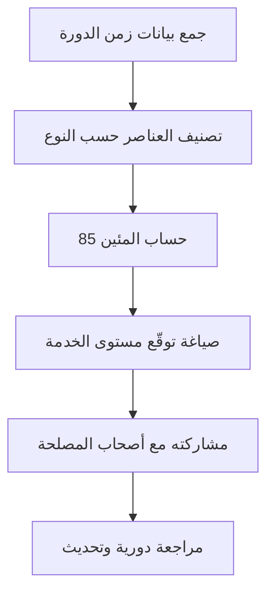

# توقّع مستوى الخدمة (SLE)
> [!info] تعريف مختصر
> توقّع مستوى الخدمة (Service Level Expectation) هو تصريح إحصائي يقول: "نسبة معيّنة من العناصر (مثلاً 85%) تُنجَز خلال مدة زمنية معيّنة (مثلاً 8 أيام)". يُستخدم في كانبان (Kanban) بدلاً من الوعود الثابتة غير الواقعية.

## الشرح العلمي والاحترافي
- الـ SLE ليس وعدًا قاطعًا (Service Level Agreement) بل توقّعًا مبنيًا على بيانات تاريخية فعلية لزمن الدورة (Cycle Time).
- يُحسَب عادةً بأخذ المئين 85 (Percentile) لزمن الدورة لعناصر مشابهة من عدد كافٍ من العناصر السابقة (يُفضَّل 30 عنصرًا أو أكثر لثبات إحصائي).
- الفكرة الأساسية: بدل أن تقول "سأُسلّم هذا الطلب يوم الخميس"، تقول "85% من الطلبات المشابهة تُنجَز خلال 8 أيام أو أقل، بناءً على آخر 3 أشهر من البيانات".
- يهم لأنه يحوّل النقاش مع أصحاب المصلحة (Stakeholders) من تخمين شخصي إلى بيان احتمالي مبني على أدلة، ويقلّل من الضغط على الفريق لإعطاء وعود غير واقعية.
- يرتبط ارتباطًا وثيقًا بمفهوم Percentiles and Median vs Average لأن استخدام المتوسط الحسابي (Average) وحده يُخفي التذبذب والقيم المتطرفة (Outliers).

## أين ومتى يُستخدم
- يُستخدم بشكل أساسي في أنظمة كانبان (Kanban) والفرق التي تعمل بتدفق مستمر (Flow-based) بدلاً من السباقات الزمنية الثابتة (Sprints).
- يُستخدم عند الإجابة عن سؤال "متى سينتهي هذا العنصر؟" الموجَّه من عميل أو مدير.
- يُستخدم في اجتماعات مراجعة الأداء وتخطيط السعة (Capacity)، وفي تقارير حالة المشروع الأسبوعية.

## مثال وسيناريو تطبيقي
> [!example] فريق دعم فني في شركة "نُظم السحابة" يتعامل مع طلبات تذاكر (Tickets). حلّلوا آخر 50 تذكرة مغلقة ووجدوا أن زمن الدورة عند المئين 85 هو 4 أيام. الآن، عندما يسأل عميل "متى ستُحل مشكلتي؟"، يجيب مدير الخدمة: "بناءً على بياناتنا، 85% من التذاكر المشابهة تُحل خلال 4 أيام أو أقل". بعد شهر، لاحظوا أن نوعًا معينًا من التذاكر (طلبات الدمج مع أنظمة خارجية) يستغرق وقتًا أطول بكثير، فقسّموا الـ SLE إلى فئتين: تذاكر عادية (4 أيام) وتذاكر دمج (10 أيام)، فأصبحت التوقعات أدق.

## خطوات أو مخطّط
1. اجمع بيانات زمن الدورة (Cycle Time) لعدد كافٍ من العناصر المكتملة (30 فأكثر يُفضَّل).
2. صنّف العناصر حسب النوع أو الحجم إن كانت متفاوتة جدًا (مثل الميزات الكبيرة مقابل الإصلاحات الصغيرة).
3. احسب المئين 85 (Percentile) لزمن الدورة لكل فئة.
4. صِغ العبارة: "X% من العناصر من نوع كذا تُنجَز خلال Y يومًا".
5. راجع الـ SLE دوريًا (كل شهر أو ربع سنة) مع تحديث البيانات.

## ⚠️ مفاهيم خاطئة شائعة
> [!warning]
> - الخلط بين SLE و SLA: الـ SLE توقّع إحصائي مرن قابل للتغيّر، بينما الـ SLA (اتفاقية مستوى الخدمة) التزام تعاقدي رسمي بعقوبات عند الإخلال به.
> - الاعتقاد بأن SLE يعني "ضمان 100%"؛ في الحقيقة هو احتمال (مثل 85%) وليس يقينًا، لذلك 15% من العناصر قد تتجاوز المدة المذكورة.
> - استخدام المتوسط الحسابي (Average) بدلاً من المئين، ما يُنتج رقمًا مضلِّلًا بسبب القيم المتطرفة.

## ❌ ممارسات خاطئة في المشاريع
> [!failure]
> - حساب SLE من عدد قليل جدًا من العناصر (أقل من 10)، ما يجعله غير موثوق إحصائيًا؛ الحل: انتظر تجميع عدد كافٍ من البيانات قبل نشر أي رقم.
> - تجاهل تحديث الـ SLE بعد تغيّر كبير في العملية (مثل انضمام أعضاء جدد أو تغيير الأدوات)؛ الحل: راجع الرقم دوريًا وليس مرة واحدة فقط.
> - استخدام SLE واحد لكل أنواع العمل المختلفة تمامًا في الحجم والتعقيد؛ الحل: قسّم العناصر إلى فئات متجانسة قبل الحساب.

## 🔗 مصطلحات ومفاهيم ذات صلة
[[Cycle Time]] | [[Percentiles and Median vs Average]] | [[Pull System]] | [[Throughput]] | [[Lead Time]] | [[Control Chart]] | [[Monte Carlo Simulation]] | [[03 - Kanban]]
