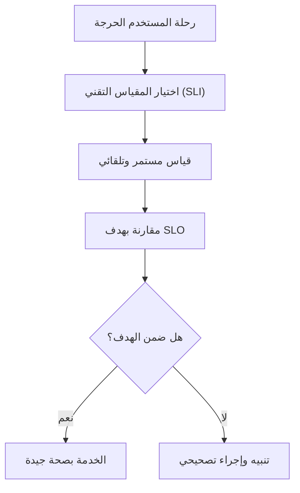

# مؤشر مستوى الخدمة (SLI)
> [!info] تعريف مختصر
> مؤشر مستوى الخدمة (Service Level Indicator أو SLI) هو مقياس رقمي فعلي يُقاس مباشرة من النظام (مثل زمن الاستجابة أو نسبة الأخطاء)، يُستخدم لمعرفة مدى جودة أداء الخدمة من وجهة نظر المستخدم.

## الشرح العلمي والاحترافي
- الـSLI هو "الرقم المقاس" نفسه، وليس الهدف؛ فهو الأساس الذي تُبنى عليه أهداف مستوى الخدمة ([[SLO]]).
- أمثلة شائعة على SLI: نسبة الطلبات الناجحة (Availability)، زمن الاستجابة (Latency)، معدل الأخطاء (Error Rate)، معدل النجاح في المعالجة (Throughput/Correctness).
- يهم لأنه يحوّل "الشعور بأن النظام بطيء" إلى رقم دقيق قابل للقياس والمقارنة عبر الزمن، مما يمكّن الفرق من اتخاذ قرارات مبنية على بيانات بدل الانطباعات.
- يرتبط مفهوم SLI ارتباطًا وثيقًا بممارسات [[SRE]] (هندسة موثوقية المواقع)، حيث يُعتبر حجر الأساس لبناء اتفاقيات مستوى الخدمة (SLA) وأهداف مستوى الخدمة (SLO).
- الصيغة الشائعة لحساب SLI: (عدد الأحداث الجيدة ÷ إجمالي عدد الأحداث) × 100%. مثال: (طلبات ناجحة ÷ إجمالي الطلبات) × 100 = نسبة التوافر.

## أين ومتى يُستخدم
- في فرق [[SRE]] والعمليات (DevOps/Ops) لمراقبة صحة الأنظمة الإنتاجية باستمرار.
- عند تصميم [[SLO]] و SLA جديدة: يجب أولًا تحديد الـSLI المناسب قبل وضع الهدف الرقمي عليه.
- في مرحلة ما بعد الإطلاق (Post-Launch) لمراقبة الأداء الفعلي مقابل الوعود المقدَّمة للعميل.
- عند تحليل الحوادث (Incident) لمعرفة أي مؤشر انحرف عن الطبيعي وأدى إلى المشكلة.

## مثال وسيناريو تطبيقي
> [!example] شركة "بوابة" تدير منصة دفع إلكتروني. اختار فريق SRE مؤشرين رئيسيين: SLI الأول هو "نسبة الطلبات التي تُعالَج في أقل من 300 مللي ثانية"، والثاني هو "نسبة الطلبات الناجحة بدون خطأ خادم (5xx)".
> خلال شهر يناير 2026، سجّل النظام أن 99.95% من الطلبات نجحت، لكن نسبة السرعة (أقل من 300ms) انخفضت إلى 92% بسبب ازدحام قاعدة البيانات في ساعات الذروة. بفضل قياس هذا الـSLI بدقة، اكتشف الفريق المشكلة قبل أن يشتكي العملاء، وأضافوا خادمًا إضافيًا لقاعدة البيانات.

## خطوات أو مخطّط
1. حدّد رحلة المستخدم الحرجة (مثل: تسجيل الدخول، الدفع، تحميل الصفحة).
2. اختر المقياس التقني الأنسب لتمثيل جودة تلك الرحلة (زمن استجابة، نسبة نجاح، إلخ).
3. اجعل القياس آليًا ومستمرًا عبر أدوات المراقبة (Monitoring/Observability).
4. اربط الـSLI بهدف [[SLO]] رقمي واضح (مثال: 99.9% خلال 30 يومًا).
5. راقب المؤشر باستمرار وأنشئ تنبيهات عند اقترابه من حد الخطر.

## ⚠️ مفاهيم خاطئة شائعة
> [!warning]
> - الخلط بين SLI و[[SLO]]: الـSLI هو الرقم المقاس فعليًا، بينما SLO هو الهدف الذي نريد أن يصل إليه هذا الرقم.
> - الاعتقاد أن قياس أي رقم تقني يصلح كـSLI؛ الأصح أن يعكس المؤشر تجربة المستخدم الفعلية وليس تفاصيل داخلية لا تهم العميل.
> - الظن أن SLI واحد يكفي لكل خدمة؛ الأنظمة المعقدة تحتاج عدة مؤشرات (توافر + سرعة + دقة) لتغطية جوانب الجودة المختلفة.

## ❌ ممارسات خاطئة في المشاريع
> [!failure]
> - قياس مؤشرات كثيرة جدًا بدون أولوية، مما يُغرق الفريق بتنبيهات لا قيمة عملية لها. الحل: اختر 2-4 مؤشرات جوهرية لكل خدمة.
> - تجاهل تحديث الـSLI عند تغيّر بنية النظام (مثل إضافة خدمة مصغّرة جديدة)، فيصبح المقياس غير معبّر عن الواقع.
> - قياس المؤشر من جهة الخادم فقط دون قياس تجربة المستخدم الفعلية (من طرف العميل)، مما يخفي مشاكل الشبكة أو الواجهة.

## 🔗 مصطلحات ومفاهيم ذات صلة
[[SLO]] | [[SRE]] | [[SLE]] | [[MTTR]] | [[Uptime]] | [[RTO and RPO]] | [[KPI]]
