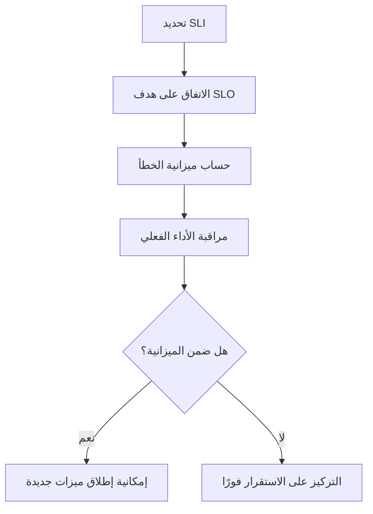

# هدف مستوى الخدمة (SLO)
> [!info] تعريف مختصر
> هدف مستوى الخدمة (Service Level Objective أو SLO) هو الرقم المستهدف الذي نريد أن يصل إليه مؤشر مستوى الخدمة ([[SLI]]) خلال فترة زمنية محددة، مثل "توافر بنسبة 99.9% شهريًا".

## الشرح العلمي والاحترافي
- SLO يجيب عن سؤال: "ما مستوى الجودة الذي التزمنا بتحقيقه داخليًا؟" وهو غالبًا أكثر صرامة من اتفاقية مستوى الخدمة التعاقدية (SLA) مع العميل.
- يُبنى SLO دائمًا فوق [[SLI]] محدد؛ فبدون مؤشر مقاس فعليًا، لا معنى لوضع هدف عليه.
- مفهوم "ميزانية الخطأ" (Error Budget) ينبثق مباشرة من SLO: إذا كان الهدف 99.9% توافر، فميزانية الخطأ المسموح بها هي 0.1% من الوقت (نحو 43 دقيقة توقف شهريًا). هذه الميزانية تُستخدم لتحقيق توازن بين سرعة إطلاق ميزات جديدة والاستقرار.
- يهم لأنه يمنح الفرق التقنية (خصوصًا فرق [[SRE]]) لغة موضوعية للحوار مع الإدارة والعملاء حول "كم يكفي من الجودة؟" بدل الرغبة غير الواقعية في "صفر أعطال".
- الفرق بين SLO وSLA: SLA هو التزام تعاقدي مع العميل يتضمن عادة تعويضات عند الإخلال به، بينما SLO هدف داخلي تشغيلي قد يكون أكثر تشددًا من SLA لضمان هامش أمان.

## أين ومتى يُستخدم
- عند إطلاق خدمة أو واجهة برمجة تطبيقات (API) جديدة، لتحديد مستوى الجودة المقبول قبل الإطلاق.
- في اجتماعات مراجعة الموثوقية الدورية لفرق [[SRE]] والعمليات؛ لمقارنة الأداء الفعلي بالهدف المتفق عليه.
- عند التفاوض مع العملاء لصياغة اتفاقيات SLA واقعية مبنية على أهداف SLO مُختبرة داخليًا مسبقًا.
- في تخطيط سعة الأنظمة (Capacity Planning) وتحديد أولويات إصلاح الأعطال مقابل تطوير ميزات جديدة.

## مثال وسيناريو تطبيقي
> [!example] فريق منصة "توصيل" التجارية حدّد SLO التالي: "يجب أن تنجح 99.5% من طلبات تتبّع الشحنة خلال أقل من ثانيتين، على مدار كل ربع سنوي".
> بعد قياس [[SLI]] الفعلي وجدوا أن الأداء بلغ 99.7% في الربع الأول من 2026، أي أفضل من الهدف، فامتلكوا "ميزانية خطأ" متبقية استخدموها لإطلاق ميزة تجريبية جديدة (خرائط حية) رغم أنها قد تسبب بعض التباطؤ المؤقت.
> في الربع الثاني انخفض الأداء إلى 99.1% (أقل من الهدف 99.5%)، فأوقف الفريق فورًا العمل على الميزات الجديدة وخصّص كل الجهد لإصلاح الاستقرار حتى يعود الأداء فوق الهدف.

## خطوات أو مخطّط
1. حدّد [[SLI]] المناسب للخدمة (مثل زمن الاستجابة أو نسبة النجاح).
2. اتفق مع أصحاب المصلحة على رقم هدف واقعي وفترة زمنية (شهري/ربعي).
3. احسب "ميزانية الخطأ" المسموح بها بناءً على الفرق بين 100% والهدف.
4. راقب الأداء الفعلي مقابل الهدف باستمرار عبر لوحات مراقبة.
5. عند تجاوز ميزانية الخطأ، أعطِ الأولوية للاستقرار على الميزات الجديدة حتى يتعافى الأداء.

## ⚠️ مفاهيم خاطئة شائعة
> [!warning]
> - الاعتقاد أن الهدف يجب أن يكون 100% دائمًا؛ هذا غير واقعي ومكلف جدًا، والأفضل هدف واقعي (مثل 99.9%) يوازن بين الجودة والتكلفة.
> - الخلط بين SLO وSLA (اتفاقية مستوى الخدمة)؛ SLO هدف داخلي تشغيلي، بينما SLA التزام تعاقدي رسمي مع العميل قد يترتب عليه تعويض مالي.
> - تجاهل "ميزانية الخطأ" الناتجة عن SLO، وبالتالي عدم استغلالها لتحقيق توازن ذكي بين الابتكار والاستقرار.

## ❌ ممارسات خاطئة في المشاريع
> [!failure]
> - وضع هدف SLO طموح جدًا (99.999%) دون تقدير التكلفة الهندسية الحقيقية لتحقيقه، مما يرهق الفريق بلا داعٍ.
> - عدم مراجعة SLO دوريًا مع نمو النظام وتغيّر توقعات المستخدمين، فيصبح الهدف قديمًا وغير معبّر عن الواقع.
> - الاستمرار في إطلاق ميزات جديدة رغم تجاوز ميزانية الخطأ، مما يُفاقم مشاكل الاستقرار بدل معالجتها.

## 🔗 مصطلحات ومفاهيم ذات صلة
[[SLI]] | [[SRE]] | [[SLE]] | [[Uptime]] | [[RTO and RPO]] | [[MTTR]] | [[KPI]] | [[OKR]]
