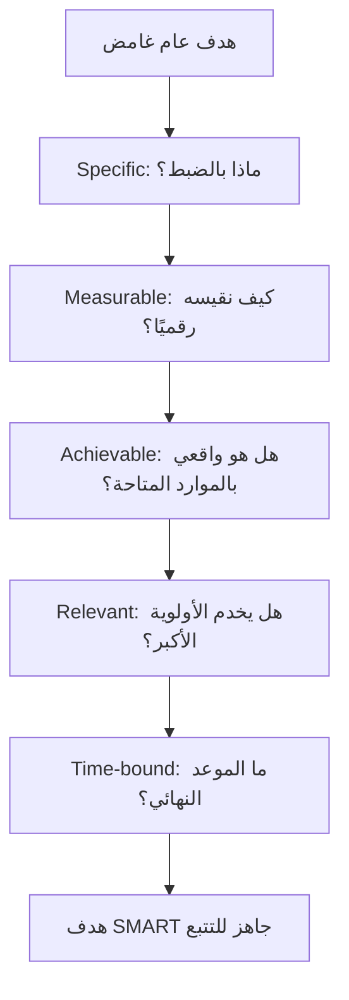

# أهداف سمارت (SMART Goals)
> [!info] تعريف مختصر
> أهداف سمارت (SMART Goals) هي إطار لصياغة الأهداف بحيث تكون: محددة (Specific)، قابلة للقياس (Measurable)، قابلة للتحقيق (Achievable)، ذات صلة (Relevant)، ومحددة بزمن (Time-bound)، لتحويل النوايا العامة الغامضة إلى أهداف عملية قابلة للتتبع.

## الشرح العلمي والاحترافي
- الحرف الأول (Specific/محدد): الهدف يجب أن يجيب بوضوح عن سؤال "ماذا بالضبط نريد تحقيقه؟" بدل صياغات عامة مثل "تحسين الأداء".
- الحرف الثاني (Measurable/قابل للقياس): يجب أن يرتبط الهدف برقم أو مؤشر واضح (KPI) يمكن التحقق منه لاحقًا، لا مجرد شعور عام بالتحسن.
- الحرف الثالث (Achievable/قابل للتحقيق): الهدف يجب أن يكون واقعيًا ضمن الموارد والوقت المتاحين، وإلا يتحول إلى مصدر إحباط بدل تحفيز (يختلف عن Stretch Goal الذي يُصاغ عمدًا كطموح إضافي).
- الحرف الرابع (Relevant/ذو صلة): يجب أن يخدم الهدف الفرعي هدفًا أكبر (مثل استراتيجية الشركة)، فلا قيمة لتحقيق هدف ممتاز لكنه غير مرتبط بأولويات العمل.
- الحرف الخامس (Time-bound/محدد بزمن): لكل هدف موعد نهائي واضح، وإلا يبقى بلا ضغط زمني فعلي يدفع لإنجازه.
- تُستخدم أهداف سمارت غالبًا لصياغة الأهداف الفردية للموظفين (تقييم الأداء)، وأهداف السبرنت (Sprint Goal)، وأهداف المشروع الفرعية ضمن إطار أكبر مثل OKR (حيث تكون النتائج الأساسية Key Results عادة مصاغة بمنطق SMART).

## أين ومتى يُستخدم
- في صياغة أهداف تقييم الأداء السنوي أو ربع السنوي للموظفين.
- عند تحديد هدف السبرنت (Sprint Goal) في Scrum بشكل يمكن التحقق من إنجازه فعليًا في نهاية السبرنت.
- عند تحويل رؤية استراتيجية عامة (Roadmap) إلى أهداف تنفيذية ملموسة على مستوى الفريق أو الفرد.
- في مرحلة التخطيط لأي مشروع، لضمان أن أهداف المشروع (Project Objectives) قابلة للقياس لا مجرد شعارات.

## مثال وسيناريو تطبيقي
> [!example] أراد مدير منتج في شركة "لوجيستيك برو" تحسين "تجربة المستخدم" في تطبيق الشحن. بدلًا من ترك الهدف غامضًا، صاغه بمنطق SMART: "تقليل متوسط زمن إتمام عملية تتبع الشحنة من 45 ثانية إلى 20 ثانية (محدد وقابل للقياس)، من خلال إعادة تصميم شاشة التتبع (قابل للتحقيق بموارد فريق UX الحالي)، لدعم هدف الشركة في رفع رضا العملاء (NPS) هذا الربع (ذو صلة)، خلال الأسابيع الستة القادمة قبل نهاية الربع الثالث (محدد بزمن)." هذا الهدف قابل للمتابعة أسبوعيًا عبر قياس زمن الإنجاز الفعلي، بخلاف الصياغة الأصلية الغامضة.

## خطوات أو مخطّط
1. اكتب الهدف الأولي كما يخطر ببالك (غالبًا سيكون عامًا).
2. حدّده: ماذا بالضبط، لمن، وأين؟
3. أضف مقياسًا رقميًا واضحًا يمكن التحقق منه.
4. تحقق من واقعية الهدف بالموارد المتاحة.
5. اربطه بهدف أكبر (استراتيجية الفريق أو الشركة).
6. ضع موعدًا نهائيًا محددًا.

## ⚠️ مفاهيم خاطئة شائعة
> [!warning]
> - الاعتقاد أن أي هدف يحتوي رقمًا هو تلقائيًا هدف SMART؛ يجب أن يستوفي الحروف الخمسة معًا، لا رقمًا معزولًا فقط.
> - الخلط بين "قابل للتحقيق" و"سهل"؛ الهدف الجيد يتطلب جهدًا حقيقيًا لكنه ليس مستحيلًا.
> - افتراض أن SMART بديل عن هدف السبرنت (Sprint Goal) أو OKR؛ هي في الواقع طريقة صياغة يمكن تطبيقها عليهما معًا.

## ❌ ممارسات خاطئة في المشاريع
> [!failure]
> - صياغة أهداف مبهمة مثل "تحسين جودة الكود" دون رقم أو موعد — يستحيل تقييم الإنجاز لاحقًا. الحل: أضف مقياسًا محددًا مثل "تقليل معدل الأخطاء المكتشفة بعد الإطلاق (Escaped Defect Rate) بنسبة 30% خلال ربعين".
> - وضع أهداف طموحة جدًا لا تراعي القدرة الفعلية للفريق (Capacity)، فتتحول لمصدر إحباط دائم. الحل: راجع الأهداف مع الفريق قبل اعتمادها للتأكد من واقعيتها.
> - وضع هدف SMART جيد الصياغة لكنه غير مرتبط بأي أولوية استراتيجية — جهد مبعثر لا يخدم الصورة الكبرى. الحل: تحقق دائمًا من الحرف Relevant قبل اعتماد الهدف.

## 🔗 مصطلحات ومفاهيم ذات صلة
[[Sprint Goal]] | [[OKR]] | [[KPI]] | [[Stretch Goal]] | [[Outcome vs Output]] | [[INVEST Criteria]] | [[15 - Roadmap]]
