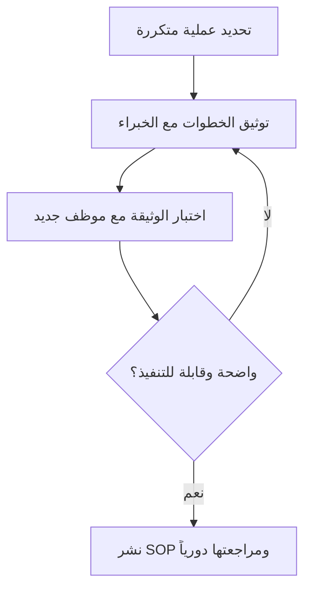

# كتيّب العمليات التشغيلية (SOP)
> [!info] تعريف مختصر
> كتيّب العمليات التشغيلية (Standard Operating Procedure - SOP) هو وثيقة مكتوبة تصف خطوات ثابتة ومتسلسلة لأداء مهمة أو عملية معيّنة بنفس الجودة في كل مرة. الهدف منها توحيد الأداء وتقليل الاعتماد على الذاكرة الفردية.

## الشرح العلمي والاحترافي
- الـ SOP وثيقة تفصيلية "كيفية التنفيذ" (How)، بخلاف السياسة (Policy) التي تحدد "ماذا ولماذا" بشكل عام.
- تُكتب بخطوات مرقّمة وواضحة، وغالباً ما تتضمن: الغرض، النطاق، الأدوار المسؤولة، الخطوات التفصيلية، والمخرجات المتوقعة.
- تقلّل من الاعتماد على شخص واحد (Bus Factor)؛ فإذا غاب الموظف المتمرّس، يستطيع أي شخص آخر اتباع الـ SOP لأداء المهمة بنفس الطريقة.
- تدعم [[QA vs QC]] لأنها تحدد المعيار المرجعي الذي تُقاس عليه جودة الأداء الفعلي.
- تشكّل جزءاً من [[Organizational Process Assets]] التي تراكمها المؤسسة عبر الزمن وتُستخدم كمرجع في مشاريع مستقبلية.
- ترتبط بمبدأ [[5S]] و[[Toyota Production System]] في تصنيع المعرفة كأصل قابل لإعادة الاستخدام بدل حصرها في رؤوس الأفراد.

## أين ومتى يُستخدم
- في العمليات المتكررة عالية التكرار مثل: نشر إصدار جديد (Release)، معالجة تذكرة دعم فني، أو إعداد بيئة عمل لموظف جديد (Onboarding).
- في فرق [[ITIL 4]] وإدارة الخدمات، حيث تُستخدم SOPs لضبط الاستجابة لحوادث النظام.
- في بيئات [[SRE]] لتوثيق إجراءات الاستجابة للأعطال (Runbooks) وتقليل [[MTTR]].
- عند تسليم مشروع للفريق التشغيلي بعد [[Closure vs Handover]]، لضمان استمرارية التشغيل دون الحاجة لفريق التطوير الأصلي.

## مثال وسيناريو تطبيقي
> [!example] شركة "بيانات كلاود" لديها فريق دعم فني يستقبل يومياً حوالي 40 تذكرة عبر نظام Zendesk. لاحظ مدير العمليات كريم أن كل موظف يتعامل مع "إعادة تعيين كلمة المرور" بطريقة مختلفة، ما يسبب تبايناً في وقت الحل. كتب كريم SOP بعنوان "إجراء إعادة تعيين كلمة المرور" يتضمن 6 خطوات: التحقق من هوية العميل، البحث في النظام، إرسال رابط إعادة التعيين، تسجيل الإجراء، إغلاق التذكرة، وإرسال استبيان رضا. بعد تطبيق الـ SOP انخفض متوسط وقت حل هذه التذكرة من 12 دقيقة إلى 4 دقائق.

## خطوات أو مخطّط
1. تحديد العملية المتكررة التي تحتاج توحيداً.
2. مقابلة الموظفين الأكثر خبرة لتوثيق أفضل الممارسات الفعلية.
3. كتابة الخطوات بترتيب منطقي وواضح، مع تحديد المسؤول عن كل خطوة.
4. مراجعة الوثيقة واختبارها مع موظف جديد لم يسبق له تنفيذ العملية.
5. تعديل الوثيقة بناءً على الملاحظات.
6. نشرها في مستودع مركزي، ومراجعتها دورياً (كل 6-12 شهراً) لتحديثها.

## ⚠️ مفاهيم خاطئة شائعة
> [!warning]
> - الاعتقاد بأن SOP تعني "بيروقراطية" تُبطئ العمل؛ في الواقع هي تُسرّع التدريب وتقلّل الأخطاء.
> - الخلط بين الـ SOP والسياسة العامة؛ السياسة تحدد المبدأ ("يجب حماية بيانات العميل")، أما SOP فتحدد الخطوات التنفيذية الدقيقة لتحقيق ذلك المبدأ.
> - الظن بأن كتابة SOP مرة واحدة كافية للأبد، دون مراعاة تطوّر الأدوات والعمليات.

## ❌ ممارسات خاطئة في المشاريع
> [!failure]
> - كتابة SOPs طويلة ومعقدة بلغة تقنية جافة لا يفهمها موظف جديد. تجنّبها بكتابة خطوات قصيرة ومباشرة مع أمثلة.
> - ترك الـ SOP دون تحديث لسنوات رغم تغيّر الأدوات، فيتحوّل من مرجع مفيد إلى مصدر تضليل. تجنّبها بجدولة مراجعة دورية ومسؤول واضح عن التحديث.
> - كتابة SOPs من مكتب الإدارة دون إشراك من ينفّذ العملية فعلياً، فتكون غير واقعية. تجنّبها بإشراك الموظفين التنفيذيين في الكتابة والمراجعة.

## 🔗 مصطلحات ومفاهيم ذات صلة
[[Runbook]] · [[Playbook]] · [[Organizational Process Assets]] · [[QA vs QC]] · [[ITIL 4]] · [[SRE]] · [[MTTR]] · [[5S]] · [[Toyota Production System]] · [[Closure vs Handover]] · [[SOW]]
