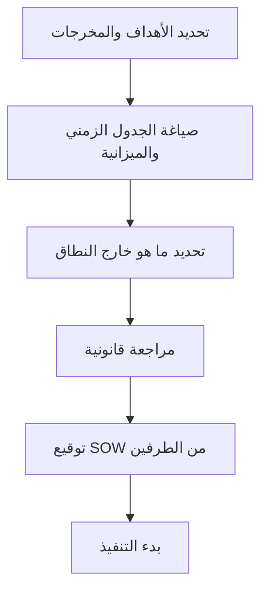

# نطاق العمل (SOW)
> [!info] تعريف مختصر
> وثيقة نطاق العمل (Statement of Work - SOW) هي وثيقة تعاقدية تحدد بدقة ما سيُنجَز في المشروع: المخرجات، الجدول الزمني، الميزانية، معايير القبول، ومسؤوليات كل طرف. تُعتبر المرجع الأساسي لفض أي نزاع حول ما هو داخل نطاق العمل أو خارجه.

## الشرح العلمي والاحترافي
- الـ SOW هي "العقد التنفيذي" الذي يترجم الاتفاق التجاري العام إلى تفاصيل عملية قابلة للتنفيذ والقياس.
- تتضمن عادة: مقدمة عن المشروع، الأهداف، قائمة المخرجات (Deliverables)، الجدول الزمني والمعالم ([[Milestone]])، الميزانية وشروط الدفع (قد ترتبط بـ [[Milestone-based Payment]] أو [[Split Payment]])، معايير القبول، الأدوار والمسؤوليات، وبنود [[Out of Scope]] التي تستبعد صراحة ما لا يشمله العقد.
- تُستخدم كخط أساس (Baseline) لقياس أي انحراف لاحق؛ أي طلب يتجاوز حدودها يُعامَل كـ [[Change Request]] رسمي، وهذا ما يحمي المشروع من [[Scope Creep]].
- تختلف عن [[BRD]] (وثيقة متطلبات العمل) في أن BRD تشرح "ماذا يحتاج العمل ولماذا"، بينما SOW تحدد "ماذا سنسلّم، متى، وبكم" بصيغة تعاقدية ملزمة.
- في مشاريع الاستشارات والتعهيد الخارجي (Outsourcing)، تُعد SOW أهم وثيقة على الإطلاق لأنها الأساس القانوني للفوترة والمحاسبة.

## أين ومتى يُستخدم
- عند التعاقد مع مورّد أو شركة تطوير خارجية لتنفيذ مشروع أو جزء منه.
- في بداية أي مشروع Waterfall ([[04 - Waterfall]]) كوثيقة تأسيسية قبل البدء بالتنفيذ.
- عند تجديد أو تمديد عقد قائم يحتاج إعادة تحديد نطاق جديد (SOW إضافية أو Change Order).
- كمرجع أثناء [[UAT]] و[[Sign-off]] للتحقق من أن المُسلَّم يطابق ما تم الاتفاق عليه فعلياً.

## مثال وسيناريو تطبيقي
> [!example] وقّعت شركة "فينتك سوليوشنز" عقداً مع مطوّر مستقل، عمر، لبناء تطبيق محفظة رقمية. تضمنت وثيقة SOW: 4 شاشات رئيسية (تسجيل الدخول، المحفظة، التحويل، السجل)، دعم لغتين (عربي وإنجليزي)، تسليم خلال 10 أسابيع، ودفعات مقسّمة على 3 مراحل حسب [[Milestone-based Payment]]. في الأسبوع السادس طلب العميل إضافة ميزة "الدفع عبر رمز QR" غير المذكورة في الوثيقة. رجع عمر إلى SOW، أثبت أن الميزة خارج النطاق ([[Out of Scope]])، وقدّم عرض سعر منفصل كـ [[Change Request]] بدلاً من تنفيذها مجاناً ضمن العقد الأصلي.

## خطوات أو مخطّط
1. تحديد أهداف المشروع ونتائجه المتوقعة بالتعاون مع العميل.
2. صياغة قائمة المخرجات (Deliverables) بدقة قابلة للقياس.
3. تحديد الجدول الزمني والمعالم الرئيسية.
4. تحديد الميزانية وشروط وجدولة الدفع.
5. كتابة بنود صريحة لما هو خارج النطاق ([[Out of Scope]]).
6. مراجعة الوثيقة قانونياً وتوقيعها من الطرفين قبل بدء التنفيذ.

## ⚠️ مفاهيم خاطئة شائعة
> [!warning]
> - الخلط بين SOW وعرض السعر (Proposal)؛ العرض تسويقي غير ملزم تفصيلياً، بينما SOW وثيقة تعاقدية دقيقة وملزمة.
> - الاعتقاد بأن SOW ثابتة لا يمكن تعديلها؛ في الواقع يمكن تعديلها عبر إجراء رسمي [[Change Request]] موثّق.
> - الظن بأن كتابة SOW عامة وغامضة "توفر وقتاً"؛ العكس صحيح، الغموض يفتح الباب لنزاعات مكلفة لاحقاً.

## ❌ ممارسات خاطئة في المشاريع
> [!failure]
> - كتابة SOW دون بند صريح لما هو خارج النطاق، مما يجعل كل طلب إضافي محل جدال. تجنّبها بإدراج قسم [[Out of Scope]] واضح دائماً.
> - البدء بالتنفيذ قبل توقيع SOW النهائية اعتماداً على "اتفاق شفهي"، مما يعرّض المزوّد لمخاطر عدم الدفع. تجنّبها بجعل التوقيع بوابة إلزامية قبل أي عمل فعلي.
> - نسخ SOW من مشروع سابق دون تخصيصها للمشروع الحالي، فتحتوي تفاصيل غير دقيقة. تجنّبها بمراجعة كل بند مع صاحب المصلحة الفعلي لكل مشروع جديد.

## 🔗 مصطلحات ومفاهيم ذات صلة
[[BRD]] · [[Out of Scope]] · [[Scope Creep]] · [[Change Request]] · [[Milestone]] · [[Milestone-based Payment]] · [[Split Payment]] · [[Sign-off]] · [[UAT]] · [[Baseline]]
