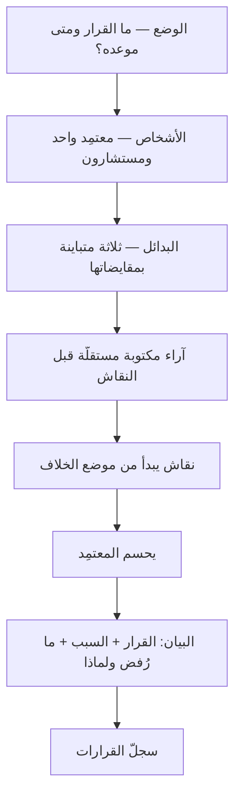

# إطار صناعة القرار (SPADE)

> [!info] تعريف مختصر
> **SPADE** إطارٌ عمليّ لصناعة قرار واحد وتوثيقه، صاغه **جوكول راجارام (Gokul Rajaram)** من خبرته في جوجل وسكوير وفيسبوك، وحروفه خمس خطوات: **الوضع (Setting)** — ما القرار بالضبط، ومتى يجب أن يُحسم، ولماذا الآن؛ **الأشخاص (People)** — من يعتمد ومن يُستشار ومن يُبلَّغ؛ **البدائل (Alternatives)** — ثلاثة على الأقلّ، حقيقية ومتباينة؛ **الحسم (Decide)** — وفيه آليّته المميّزة: **يُجمع رأي كلّ مشارك مكتوبًا ومستقلًّا قبل أن يُفتح النقاش**؛ ثم **البيان (Explain)** — أن يُعلَن القرار ومعه سببه والبدائل التي رُفضت ولماذا. وفرقه عن [[DACI|نموذج أدوار القرار]] أن ذاك يوزّع **الأدوار**، وهذا يصف **العملية** من أوّلها إلى إعلانها.

## الشرح العلمي والاحترافي

### 1. الخطوات الخمس، وما يحلّه كلٌّ منها

| الحرف | الخطوة | المرض الذي تعالجه |
|---|---|---|
| **S** | **الوضع** — صياغة القرار وموعده وسببه | قرارات تُناقَش شهورًا لأن أحدًا لم يكتب ما الذي يُقرَّر أصلًا |
| **P** | **الأشخاص** — معتمِدٌ واحد، ومستشارون، ومُبلَّغون | «الجميع له رأي ولا أحد له حسم» |
| **A** | **البدائل** — ثلاثة فأكثر، متباينة، بمقايضاتها | البديل الواحد الذي يُعرض للتصديق لا للاختيار |
| **D** | **الحسم** — آراء مكتوبة مستقلّة، ثم نقاش، ثم قرار | أن يرسو الرأي على أوّل من تكلّم أو أعلى من حضر |
| **E** | **البيان** — إعلان القرار وسببه وما رُفض | قرار يُنفَّذ ولا يُفهم، فيُعاد فتحه كل ربع |

### 2. الآلية المميّزة: التصويت المستقلّ قبل النقاش

هذا هو موضع الإضافة الحقيقية في الإطار، وما يفرّقه عن أي قائمة خطوات أخرى: **يكتب كلّ مشارك اختياره وسببه قبل أن يسمع اختيار غيره.**

وعلّته أن النقاش المفتوح ليس ميدانًا محايدًا: أوّل رأي يُطرح يصير مرساةً يدور حولها ما بعده، ورأي أعلى الحاضرين رتبةً يُغلق باب المخالفة قبل أن يُفتح. فالفريق الذي يظنّ أنه ناقش عشرة آراء قد يكون سمع رأيًا واحدًا معادًا تسع مرّات بصيغ مختلفة.

**والجمع المسبق يفعل شيئين:** يحفظ التباين الحقيقي فيظهر الاختلاف حيث كان يُبتلع، ويكشف موضع الخلاف بدقّة — فإن اتّفق الجميع صار النقاش قصيرًا وانتقل الوقت إلى التنفيذ، وإن اختلفوا عُرف **على أي بديل** يختلفون فبدأ النقاش من موضعه لا من أوّله.

### 3. البدائل الثلاثة شرط لا زينة

القرار الذي يُعرض ببديل واحد ليس قرارًا بل طلب تصديق. والشرط ثلاثة **متباينة في الجوهر** لا ثلاث صياغات لخيار واحد؛ ومن أعوزه الثالث فليضع الأسهل دائمًا: **«ألّا نفعل شيئًا الآن»** — فهو بديل مشروع دائمًا، وله كلفة يجب أن تُكتب كما تُكتب كلفة غيره.

### 4. البيان (E) ليس إبلاغًا

الخطوة الخامسة أكثرها إسقاطًا وأثقلها ثمنًا. فالفرق بين «قرّرنا كذا» و«قرّرنا كذا لأن كذا، وكنّا قد نظرنا في كذا فتركناه لكذا» ليس أدبًا تنظيميًّا، بل هو ما يمنع **إعادة فتح القرار** كلّما تغيّر الحاضرون. والبيان المكتوب هو نفسه ما يستقرّ في [[Decision Log|سجلّ القرارات]]، فيصير مرجعًا يُراجَع عند تغيّر المعطيات لا ذاكرةً تُستدعى من الحضور.

### 5. موضعه من جيرانه

| الأداة | ما توزّعه أو تصفه | متى تختارها |
|---|---|---|
| [[RACI\|مصفوفة المسؤوليات]] | أدوارٌ على **أنشطة** مستمرّة | تشغيل ممتدّ وتسليم متكرّر |
| [[DACI\|نموذج أدوار القرار]] | أدوارٌ في **قرار** واحد | حين يكون العطل «من يحسم؟» |
| **SPADE** | **عملية** القرار من صياغته إلى إعلانه | حين يكون العطل في الطريق كلّه لا في الأدوار |

> **السؤال الفارق:** DACI يجيب عن **«من يقرّر؟»**، وSPADE عن **«وكيف نصل إلى القرار ونعلنه؟»**. وهما يجتمعان لا يتنافسان: خطوة `P` من SPADE هي DACI نفسه.

## أين ومتى يُستخدم

- في القرارات المتوسّطة والكبيرة التي يتعدّد أصحابها ويتنازعون: اختيار مورّد، أو تقنية أساسية، أو تغيير في نموذج التسعير.
- في القرارات التي **يصعب التراجع عنها**، إذ يستحقّ ثمنُ العملية أن يُدفع ([[Reversible vs Irreversible Decisions]]).
- حين يتكرّر إعادة فتح قرار سبق حسمه — وهي علامة على غياب الخطوة الخامسة لا على سوء القرار.
- في الفرق الموزّعة وغير المتزامنة، إذ يعمل التصويت المكتوب فيها أفضل ممّا يعمل في غرفة واحدة.
- حين يكون في الاجتماع فارق رتبة كبير، فالخطوة `D` هي علاجه المباشر.

## مثال وسيناريو تطبيقي

> [!example] سيناريو ملموس
> شركة أمام قرار: أتبني وحدة الإشعارات داخليًّا أم تشتري خدمة جاهزة؟ والنقاش دائر منذ سبعة أسابيع.
>
> **الوضع:** «نحسم قبل 20 من الشهر، لأن عقد المزوّد الحالي ينتهي في 30، والتجديد التلقائي يبدأ قبله بعشرة أيام.» — وبهذه الجملة وحدها انتهى نصف التعثّر: لم يكن أحد يعرف أن للقرار موعدًا مُلزِمًا.
>
> **الأشخاص:** المعتمِدة مديرة الهندسة، والمستشارون خمسة، والمُبلَّغون فريقا الدعم والمبيعات.
>
> **البدائل:** (١) بناء داخلي كامل · (٢) شراء خدمة جاهزة · (٣) تمديد العقد الحالي ستّة أشهر وتأجيل القرار — ولكلٍّ كلفته وأثره على خارطة الطريق.
>
> **الحسم:** كتب الخمسة اختياراتهم قبل الاجتماع. فظهر أن أربعة اختاروا الشراء، وأن المدافع الوحيد عن البناء الداخلي — وهو أكثرهم كلامًا في الأسابيع الماضية — كان **يرى الشراء أفضل أيضًا**، وإنما كان يعترض على مزوّد بعينه. فتحوّل الاجتماع من «نبني أم نشتري» إلى «أي مزوّد»، وانتهى في أربعين دقيقة.
>
> **البيان:** كُتبت فقرة في [[Decision Log|سجلّ القرارات]] تذكر الخيار وسببه، وتذكر أن البناء الداخلي رُفض لكلفة الصيانة المستمرّة لا لصعوبته التقنية — **وهي الجملة التي منعت إعادة فتح النقاش** حين انضمّ مهندس جديد بعد شهرين واقترح البناء الداخلي.

## خطوات أو مخطّط

1. اكتب القرار في جملة واحدة، ومعه موعده وسبب إلحاحه.
2. سمِّ المعتمِد الواحد، ثم المستشارين والمُبلَّغين.
3. اجمع ثلاثة بدائل متباينة، ومنها بديل «لا نفعل شيئًا الآن» بكلفته.
4. اطلب من كلٍّ **اختياره وسببه مكتوبًا وقبل النقاش**، ولا تعرض الآراء حتى تكتمل.
5. اعرضها مجتمعةً، وابدأ النقاش من موضع الخلاف لا من أوّل القائمة.
6. يحسم المعتمِد ولو بقي خلاف — فالإجماع ليس شرطًا، والالتزام بعد الحسم هو الشرط.
7. اكتب البيان: القرار، وسببه، والبدائل المرفوضة وعللها، ومن يُنفّذ ومتى.

## ⚠️ مفاهيم خاطئة شائعة

> [!warning]
> - **حسبان الخطوة `D` تصويتًا يُحسم بالأغلبية.** بل هي **جمع آراء** لكشف التباين؛ والحسم يبقى للمعتمِد الواحد، وقد يخالف الأكثرية ويبيّن سببه.
> - **الظنّ أنه بديل عن [[DACI]] أو [[RACI]].** فهو عملية تحتوي توزيع الأدوار خطوةً من خطواتها، لا منافسًا له.
> - **استعماله في كل قرار.** فكلفته لا تحتملها القرارات اليومية القابلة للتراجع، وإجراؤه عليها يبطّئ العمل ويستهلك رصيد الأداة.
> - **حسبان البيان إعلانًا.** الإعلان يقول ماذا، والبيان يقول لماذا ومَ رُفض — والفرق بينهما هو الفرق بين قرار يستقرّ وقرار يُعاد فتحه.

## ❌ ممارسات خاطئة في المشاريع

> [!failure]
> - **صياغة بدائل صوريّة** حول خيار قرّره صاحب القرار سلفًا، فتصير العملية تصديقًا مزيّنًا بمظهر المداولة — وأثرها أسوأ من غيابها، لأنها تستنزف ثقة من شارك فيها.
> - **عرض الآراء قبل اكتمال جمعها**، ولو بحسن نيّة، فيقع التأثّر الذي وُجدت الخطوة لمنعه.
> - **إغفال موعد الحسم في خطوة الوضع**، فيبقى القرار مفتوحًا حتى يفرضه حدث خارجي — وهو حينئذٍ ليس قرارًا بل استجابة.
> - **إجراء الخطوات الأربع وترك الخامسة**، فيُعاد النقاش نفسه بعد أشهر بأناس جدد لا يعرفون ما نُظر فيه.
> - **تعدّد المعتمِدين**، فيصير القرار تفاوضًا بين أنداد لا حسمًا، وهو المرض الذي جاء الإطار لعلاجه.

## 🔗 مصطلحات ومفاهيم ذات صلة

[[DACI]] | [[RACI]] | [[PARIS Matrix]] | [[Decision Log]] | [[Reversible vs Irreversible Decisions]] | [[Cognitive Bias]] | [[Pre-mortem]] | [[Go or No-Go Decision]] | [[Steering Committee]] | [[Governance]] | [[Business Case]] | [[Empowerment]]
