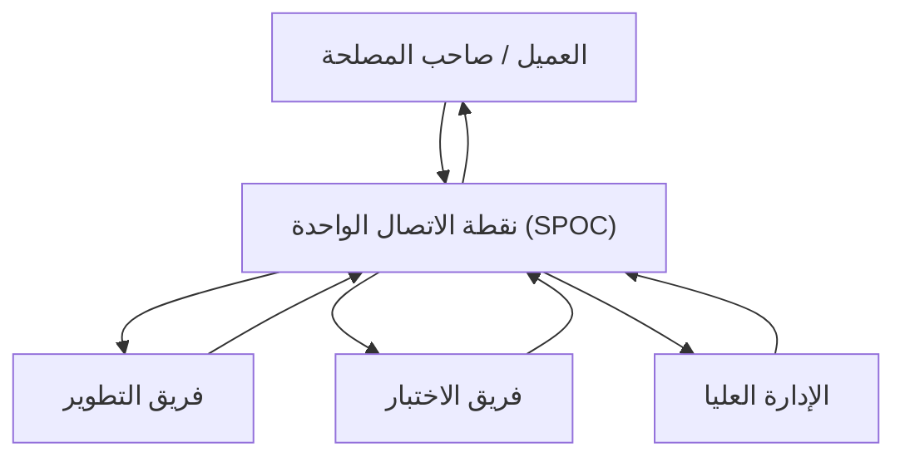

# نقطة الاتصال الواحدة (SPOC)
> [!info] تعريف مختصر
> نقطة الاتصال الواحدة (Single Point of Contact - SPOC) هي الشخص المُعيَّن رسمياً ليكون القناة الوحيدة للتواصل بين طرفين (مثلاً بين فريق المشروع والعميل)، بدلاً من تواصل عشوائي متعدد القنوات مع أعضاء مختلفين.

## الشرح العلمي والاحترافي
- الـ SPOC يعمل كمرشّح ومنسّق للمعلومات: يستقبل الطلبات والاستفسارات، يوجّهها للجهة المناسبة داخلياً، ثم يعيد توصيل الرد بصيغة واضحة وموحّدة.
- يقلّل من "ضجيج التواصل" (Communication Noise) الذي يحدث عندما يتواصل العميل مباشرة مع عدة مطوّرين في نفس الوقت فيحصل على إجابات متضاربة.
- يُعتبر جزءاً أساسياً من [[Communication Plan]] في أي مشروع متوسط أو كبير الحجم، ويُذكر عادة بالاسم في وثيقة [[SOW]] أو ميثاق المشروع.
- في فرق الدعم الفني، غالباً ما يكون [[Service Delivery Manager]] هو الـ SPOC الرسمي أمام العميل.
- يرتبط بمفهوم [[Stakeholder Map]]؛ فتحديد SPOC واضح لكل طرف مصلحة رئيسي يقلل الغموض حول "من أُخاطب عند الحاجة؟".
- في فرق [[Scrum]] ([[02 - Scrum]])، يقوم [[05 - Product Owner]] غالباً بدور SPOC تجاه العميل والإدارة العليا فيما يخص أولويات المنتج.

## أين ومتى يُستخدم
- في المشاريع التي تضم عدة أطراف (عميل، مورّدون، فرق فرعية متعددة) حيث يصعب تنسيق التواصل المباشر بين الجميع.
- عند التعامل مع عملاء خارجيين أو وكالات تعهيد (Outsourcing) لتفادي تشتت التواصل.
- في الحوادث التقنية الكبرى (Major Incidents) ضمن [[ITIL 4]]، حيث يُعيَّن SPOC لتوحيد التحديثات الصادرة عن الحادثة.
- عند إدارة أصحاب مصلحة متعددين ([[21 - Stakeholder Communication]]) لتفادي تضارب الرسائل.

## مثال وسيناريو تطبيقي
> [!example] في مشروع بناء منصة تعليم إلكتروني بين شركة "تِك برو" وعميلها جامعة خاصة، لاحظ مدير المشروع ليلى أن أساتذة الجامعة كانوا يتواصلون مباشرة مع المطوّرين عبر واتساب بطلبات متضاربة، مما أدى لالتباس في الأولويات. عيّنت ليلى نفسها كـ SPOC الرسمي: أي طلب أو استفسار من الجامعة يجب أن يمر عبرها فقط، وهي بدورها توزّعه على الفريق المناسب وترد بجواب موحّد خلال 24 ساعة. خلال أسبوعين انخفضت رسائل التواصل المباشرة مع المطورين إلى الصفر، وتحسّنت دقة تتبّع الطلبات بشكل ملحوظ.

## خطوات أو مخطّط
1. تحديد الحاجة لنقطة اتصال واحدة عند وجود أطراف متعددة في التواصل.
2. اختيار الشخص الأنسب (غالباً مدير المشروع أو Product Owner) بناءً على معرفته الشاملة بالمشروع.
3. إبلاغ جميع الأطراف رسمياً بهوية الـ SPOC وقنوات التواصل معه.
4. توثيق الدور في [[Communication Plan]] أو ميثاق المشروع.
5. متابعة فعالية الترتيب دورياً وتعديل الدور عند الحاجة (مثلاً عند تغيّر حجم الفريق).

## ⚠️ مفاهيم خاطئة شائعة
> [!warning]
> - الاعتقاد بأن SPOC يعني أن هذا الشخص يجب أن يحل كل المشاكل بنفسه؛ دوره التنسيق وتوجيه الطلب للجهة الصحيحة، وليس التنفيذ الشخصي.
> - الظن بأن وجود SPOC يبطئ التواصل بإضافة "وسيط" غير ضروري؛ في الواقع هو يسرّع الحل بمنع التضارب وتكرار الجهد.
> - الخلط بين SPOC وبين مدير المشروع بالضرورة؛ قد يكون الدور لأي عضو مؤهل في الفريق حسب طبيعة المشروع.

## ❌ ممارسات خاطئة في المشاريع
> [!failure]
> - تعيين SPOC دون منحه صلاحية أو معلومات كافية، فيصبح مجرد "ناقل رسائل" بطيء يزيد من التأخير. تجنّبها بتمكين الـ SPOC فعلياً من الوصول للمعلومات واتخاذ القرار.
> - السماح باستمرار التواصل المباشر مع أعضاء الفريق رغم وجود SPOC معلن، مما يُبطل الغرض من الترتيب. تجنّبها بإلزام الجميع رسمياً بالقناة الموحّدة.
> - تعيين SPOC واحد دون خطة بديلة لغيابه (إجازة، مرض)، مما يوقف التواصل بالكامل. تجنّبها بتحديد شخص احتياطي (Backup) معروف مسبقاً.

## 🔗 مصطلحات ومفاهيم ذات صلة
[[Communication Plan]] · [[Stakeholder Map]] · [[Service Delivery Manager]] · [[21 - Stakeholder Communication]] · [[05 - Product Owner]] · [[ITIL 4]] · [[SOW]]
