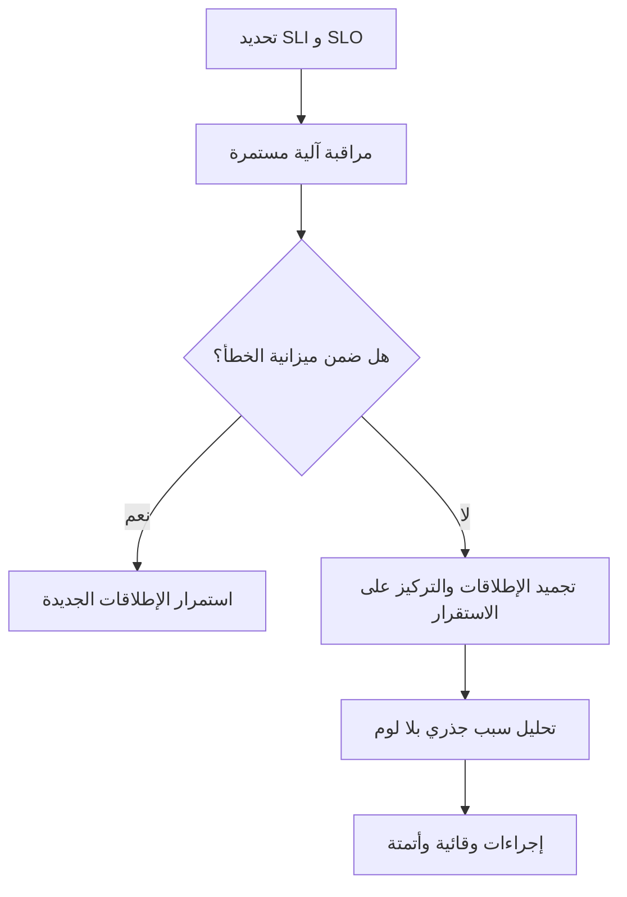

# هندسة موثوقية المواقع (SRE)
> [!info] تعريف مختصر
> هندسة موثوقية المواقع (Site Reliability Engineering أو SRE) هي ممارسة هندسية نشأت في Google، تطبّق مبادئ البرمجة على مشاكل التشغيل (Operations) لبناء أنظمة موثوقة وقابلة للتوسّع تلقائيًا قدر الإمكان.

## الشرح العلمي والاحترافي
- تقوم فلسفة SRE على فكرة أن "الموثوقية ميزة" يجب هندستها وقياسها مثل أي ميزة برمجية أخرى، وليست مجرد مهمة يدوية لفريق الدعم.
- تعتمد SRE على قياسات موضوعية: مؤشرات مستوى الخدمة ([[SLI]])، أهداف مستوى الخدمة ([[SLO]])، و"ميزانية الخطأ" (Error Budget) الناتجة عنها، لاتخاذ قرارات متوازنة بين الابتكار والاستقرار.
- من مبادئها الأساسية: أتمتة المهام المتكررة (بدل تكرارها يدويًا)، تقليل "العمل اليدوي المضني" (Toil)، والاستجابة للحوادث بعمليات منظمة تشمل تحليل السبب الجذري ([[Root Cause Analysis]]) بعد كل حادثة كبرى دون إلقاء اللوم على الأفراد (Blameless Postmortem).
- تهم لأنها تسد الفجوة التقليدية بين فرق التطوير (Dev) وفرق التشغيل (Ops)؛ بدل أن يكون فريق العمليات "حارس بوابة" يبطئ الإطلاق، يصبح شريكًا هندسيًا يشارك في تصميم الأنظمة من البداية لضمان قابليتها للتشغيل والصيانة.
- ترتبط SRE ارتباطًا مباشرًا بثقافة [[CI and CD]] (التكامل والنشر المستمر) لأن الإطلاقات المتكررة والآمنة تتطلب مراقبة وموثوقية آلية.
- تختلف عن ITIL التقليدي (انظر [[ITIL 4]]) في أنها تعتمد نهجًا هندسيًا قائمًا على الكود والأتمتة بدل الإجراءات الإدارية الثقيلة فقط.

## أين ومتى يُستخدم
- في الشركات التقنية التي تدير أنظمة إنتاجية كبيرة الحجم (منصات SaaS، تطبيقات جوّال بملايين المستخدمين، بنى تحتية سحابية).
- عند الانتقال من نموذج "فريق تطوير + فريق دعم منفصل" إلى نموذج مسؤولية مشتركة عن الموثوقية.
- في التخطيط لإطلاق ميزات جديدة، حيث يقرر فريق SRE بناءً على "ميزانية الخطأ" هل يُسمح بإطلاقات جديدة أم يجب التركيز على الاستقرار أولًا.
- عند التعامل مع الحوادث الكبرى (Incident Response) وإجراء تحليل ما بعد الحادثة لمنع تكرارها.

## مثال وسيناريو تطبيقي
> [!example] شركة برمجيات "أفق" تدير منصة بث فيديو. أنشأت فريق SRE مكوّنًا من 5 مهندسين، مهمتهم ضمان أن المنصة تحقق [[SLO]] بنسبة 99.9% توافر شهريًا، بناءً على [[SLI]] هو "نسبة الطلبات الناجحة لتشغيل الفيديو".
> في مارس 2026، حدث عطل استمر 90 دقيقة بسبب خطأ في تحديث قاعدة البيانات، فاستهلك معظم "ميزانية الخطأ" الشهرية (43 دقيقة مسموحة أصلًا). قرر فريق SRE تجميد كل الإطلاقات الجديدة لبقية الشهر، وأجرى تحليل سبب جذري (Postmortem) بلا لوم شخصي، واكتشف أن سبب العطل غياب اختبار تلقائي لتغييرات قاعدة البيانات. أضاف الفريق خطوة اختبار آلية جديدة في خط أنابيب [[CI and CD]] لمنع تكرار المشكلة مستقبلًا.

## خطوات أو مخطّط
1. حدّد [[SLI]] الأساسية للخدمات الحرجة (توافر، سرعة، دقة).
2. اتفق مع أصحاب المصلحة على [[SLO]] واقعي واحسب ميزانية الخطأ.
3. أتمتة المراقبة والتنبيهات لرصد أي انحراف عن الهدف فور حدوثه.
4. عند وقوع حادثة: استجب سريعًا، أصلح المشكلة، ثم أجرِ تحليل سبب جذري بلا لوم.
5. استخدم نتائج ميزانية الخطأ لتحديد سرعة الإطلاقات القادمة (توسّع أو تباطؤ).
6. أتمتة المهام المتكررة (Toil) تدريجيًا لتقليل الجهد اليدوي في التشغيل.

## ⚠️ مفاهيم خاطئة شائعة
> [!warning]
> - الاعتقاد أن SRE هو مجرد اسم جديد لفريق الدعم الفني (Ops) التقليدي؛ في الواقع هو دور هندسي يكتب كودًا وأدوات أتمتة، وليس مجرد الاستجابة اليدوية للأعطال.
> - الظن أن هدف SRE هو "صفر أعطال"؛ الأصح أنه إدارة الموثوقية ضمن هدف واقعي (SLO) مع قبول مستوى معين من الفشل المخطط له.
> - الخلط بين SRE و[[ITIL 4]]؛ SRE أكثر اعتمادًا على الأتمتة والكود والقياس الكمي، بينما ITIL إطار عمليات إدارية أوسع وأقل ارتباطًا بالبرمجة المباشرة.

## ❌ ممارسات خاطئة في المشاريع
> [!failure]
> - تطبيق SRE كمسمى وظيفي فقط دون تغيير ثقافي حقيقي (بلا أتمتة، بلا ميزانية خطأ فعلية)، فيبقى الفريق يعمل يدويًا كما كان.
> - إلقاء اللوم على أفراد بعد الحوادث بدل إجراء تحليل سبب جذري بنّاء، مما يخلق ثقافة خوف تمنع الإبلاغ المبكر عن المشاكل ويضر بـ[[Psychological Safety]].
> - تجاهل ميزانية الخطأ عمليًا والاستمرار في الإطلاقات رغم تجاوزها، مما يفقد SRE قيمته كأداة توازن بين السرعة والاستقرار.

## 🔗 مصطلحات ومفاهيم ذات صلة
[[SLI]] | [[SLO]] | [[SLE]] | [[MTTR]] | [[Root Cause Analysis]] | [[CI and CD]] | [[ITIL 4]] | [[RTO and RPO]] | [[Uptime]] | [[Psychological Safety]]
