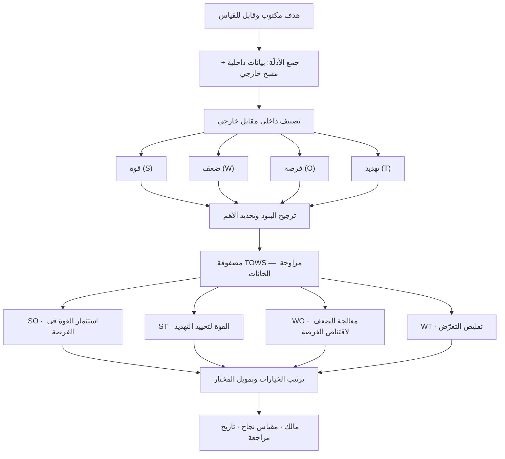

# تحليل نقاط القوة والضعف والفرص والتهديدات (SWOT)

> [!info] تعريف مختصر
> أداة تشخيص استراتيجي تلخّص وضع منظّمة أو منتج أو مشروع في أربع خانات: **نقاط القوة (Strengths)** و**نقاط الضعف (Weaknesses)** وهما عاملان **داخليان** تملك المنظّمة التصرّف فيهما، و**الفرص (Opportunities)** و**التهديدات (Threats)** وهما عاملان **خارجيان** لا تملكهما وإنما تستجيب لهما. الأداة أشهر أدوات الاستراتيجية على الإطلاق وأسهلها تعلّمًا — وهذان بالضبط سببا أكثر إساءات استعمالها: فهي في ذاتها **جدول تصنيف لا آلة قرار**، ولا تنتج استراتيجية إلا حين تُتبَع بخطوة تركيب تحوّل الخانات الأربع إلى خيارات، كما في مصفوفة `TOWS`.

## الشرح العلمي والاحترافي
- **أصله متنازَع فيه، وهذا يجب أن يُقال صراحةً**: الرواية الأكثر تداولًا تنسب الأداة إلى **ألبرت همفري (Albert Humphrey)** ضمن عمل بحثي في **معهد ستانفورد للأبحاث (SRI)** في الستينيات والسبعينيات، بوصفها تطويرًا لأداة سابقة اسمها **SOFT** (Satisfactory / Opportunity / Fault / Threat). غير أن هذه الرواية **موضع مراجعة نقدية جادّة في الأدبيات الأكاديمية الحديثة**: فهمفري نفسه لم يدّعِ في كتاباته أنه صاغ الاختصار، والوثائق المعاصرة لتلك الفترة لا تسند القصة إسنادًا محكمًا. ويرجّح باحثون آخرون أن جذور الفكرة تعود إلى تقليد **«سياسة الأعمال» في كلية هارفارد للأعمال** في الستينيات، حيث كان تحليل الملاءمة بين الكفاءات الداخلية للشركة والظروف الخارجية يُدرَّس بوصفه لبّ صياغة الاستراتيجية. **الخلاصة الأمينة: نسبة SWOT إلى شخص بعينه غير محسومة، والأسلم وصفها بأنها بلورة اصطلاحية لفكرة أقدم منها ومتعدّدة المصادر** — لا اختراع فرد في لحظة محدّدة.
- **المحور الحقيقي للأداة هو ثنائية داخلي/خارجي**: الخطأ التقني الأكثر شيوعًا هو الخلط بين البعدين. الضابط العملي: **إن كان بوسعك تغييره بقرار داخلي فهو قوة أو ضعف؛ وإن كنت لا تملك إلا الاستجابة له فهو فرصة أو تهديد**. «فريقنا لا يجيد التسويق الرقمي» ضعف داخلي؛ «تكلفة الإعلانات ارتفعت ٤٠٪ في السوق» تهديد خارجي — والخلط بينهما يوجّه الحل إلى الجهة الخاطئة تمامًا.
- **البعد الثاني هو النافع/الضارّ**: تتقاطع ثنائية داخلي/خارجي مع ثنائية «مفيد لتحقيق الهدف / ضارّ به»، فتنتج الخانات الأربع. ومن هذا يتضح أن **الأداة تفترض وجود هدف محدّد سلفًا**: لا معنى لقول «هذه نقطة قوة» بإطلاق، بل «قوة **بالنسبة إلى** هدف كذا». تحليل بلا هدف مكتوب في رأسه هو أول أعراض الاستعمال السيّئ.
- **النقد الجادّ المنشور**: أشهر نقد أكاديمي للأداة مقالة **تيري هِل (Terry Hill) وروي ويستبروك (Roy Westbrook)** المنشورة عام ١٩٩٧ في *Long Range Planning* بعنوان لاذع: «تحليل SWOT: حان وقت سحب المنتج من السوق» (SWOT Analysis: It's Time for a Product Recall). فحص الباحثان استخدامات فعلية للأداة في شركات بريطانية ورصدا نمطًا متكرّرًا: قوائم طويلة من العبارات العامة، بلا ترجيح ولا أولويات، ولا ربط بمرحلة صياغة الاستراتيجية اللاحقة — أي أن التحليل يُنجَز ثم **لا يُستخدم**. وخلاصة نقدهما أن الأداة تُشعِر الفريق بأنه أنجز عملًا استراتيجيًّا بينما لم يُتّخذ قرار واحد.
- **العلل البنيوية الأربع**: (١) **غياب الأوزان** — كل بند يظهر بالحجم نفسه، فيتساوى خطر وجودي مع إزعاج تشغيلي. (٢) **غياب الأدلّة** — العبارات تُكتب بالانطباع لا بالبيانات، وغالبًا تُملى من أعلى ([[HiPPO]]). (٣) **الطول المفرط** — القائمة الطويلة تعطي إحساسًا بالشمول وتمنع الحسم. (٤) **انقطاع الصلة بالقرار** — لا توجد في الأداة نفسها أي خطوة تحوّل الوصف إلى فعل.
- **العلاج المعياري: مصفوفة TOWS**: طرح **هاينز فايهرش (Heinz Weihrich)** عام ١٩٨٢ مصفوفة `TOWS` بوصفها الخطوة التركيبية الناقصة. الفكرة أن تُزاوَج الخانات بدل أن تُسرَد، فتتولّد أربع عائلات من الخيارات: **SO** (استثمر قوّتك في اقتناص الفرصة — استراتيجيات هجومية)، **ST** (وظّف قوّتك لتحييد التهديد — استراتيجيات دفاعية)، **WO** (عالج ضعفك حتى لا تفوتك الفرصة — استراتيجيات تحسين)، **WT** (قلّص التعرّض حيث يلتقي ضعفك بتهديد — استراتيجيات انسحاب أو تحوّط). الفارق العملي كبير: SWOT تنتج **قائمة**، وTOWS تنتج **مبادرات مرشّحة للترتيب** عبر [[Weighted Scoring]] أو [[RICE Prioritization]].
- **علاقته بأدوات المسح الخارجي**: خانتا الفرص والتهديدات لا تُملأ بالتأمّل، بل تُغذَّى من تحليل منهجي للبيئة: [[PESTEL]] للعوامل الكلّية، و[[Porter's Five Forces]] لبنية الصناعة والمنافسة، و[[CAGE Framework]] للمسافة بين الأسواق عند التوسّع الدولي. أمّا خانتا القوة والضعف فتُغذَّى من تقييم الموارد والقدرات الداخلية وبيانات الأداء الفعلية ([[KPI]] و[[Leading and Lagging Indicators]]).
- **معيار التمييز الصحيح لنقطة القوة**: في أدبيات الاستراتيجية القائمة على الموارد، لا تُعدّ الميزة الداخلية «قوة» استراتيجية إلا إذا كانت **ذات قيمة للعميل، ونادرة نسبيًّا في السوق، ويصعب تقليدها أو استبدالها**. «لدينا فريق مجتهد» ليست قوة استراتيجية لأن كل منافس يقول الشيء نفسه؛ «نملك بيانات تشغيلية لعشر سنوات لا يملكها غيرنا» قد تكون قوة فعلية.

## أين ومتى يُستخدم
- **في بناء [[Business Case]] وتبرير مبادرة جديدة**: لتأطير سريع للوضع قبل الدخول في الأرقام، بشرط أن تُتبع بخيارات مقارَنة لا بقائمة وصفية.
- **قبل دخول سوق جديد**: مع [[Market Entry Modes]] و[[Go-to-Market]]، لفحص هل تملك المنظّمة القدرات الداخلية التي يتطلّبها الشكل المختار للدخول.
- **في تحديد موقع المنتج ضمن [[Product Strategy]]**: لتوضيح على أي أساس تتنافس، وعلى أي جبهة لا تنوي التنافس أصلًا ([[Non-Goals]]).
- **في مراجعة نصف المسار للبرامج الكبيرة**: بوصفه فحصًا دوريًّا لصلاحية الافتراضات الأساسية للبرنامج، بالتزامن مع [[Assumption Mapping]].
- **في تقييم المورّد أو الشريك**: مع [[Vendor Management]] و[[Vendor Lock-in]]، لتحديد أين يُنشئ الشريك قوة حقيقية وأين ينشئ تبعية.
- **في ورش المواءمة بين إدارات متعدّدة**: قيمته الأكبر هنا ليست المخرَج بل **الحوار** — إظهار أن ما تراه إدارة فرصةً تراه أخرى تهديدًا، وهو خلاف كان مستترًا.

## مثال وسيناريو تطبيقي
> [!example] شركة سعودية متوسّطة تقدّم برنامج إدارة عيادات (SaaS) لعملاء في القطاع الصحّي الخاص. الإيراد السنوي المتكرّر ٩ ملايين ريال، وعدد العيادات المشتركة ٤٣٠، ومعدّل الفقد السنوي ([[Churn]]) ١٩٪. أُقيمت ورشة استراتيجية لمدّة يوم، وخرجت بـ SWOT من ٣٨ بندًا موزّعة على الخانات الأربع، وعُلّقت على الجدار ولم تُستخدم في أي قرار خلال الربع التالي.
> في الربع الذي يليه أُعيدت الورشة بقواعد مختلفة: (١) هدف مكتوب في الرأس — «رفع الإيراد المتكرّر إلى ١٥ مليونًا خلال ٢٤ شهرًا مع خفض الفقد إلى أقل من ١٠٪»؛ (٢) سقف **خمسة بنود لكل خانة** مع دليل رقمي إلزامي لكل بند؛ (٣) جلسة `TOWS` إجبارية بعد التصنيف.
> خرجت الخانات مكثّفة: **قوة** — تكامل مُعتمد ومستقرّ مع منظومة المطالبات التأمينية استغرق بناؤه ٣ سنوات ولا يملكه سوى منافسَين؛ ودعم تشغيلي بزمن استجابة وسيط ١٨ دقيقة. **ضعف** — ٦٨٪ من الإيراد يأتي من ٤٠ عميلًا فقط؛ وغياب تام لتطبيق جوّال للمريض. **فرصة** — تحوّل تنظيمي في السوق يوسّع اشتراطات الربط الإلكتروني ويزيد الطلب على أنظمة متوافقة. **تهديد** — منافس إقليمي مموَّل خفّض سعره ٣٥٪ ودخل السوق بعرض مجّاني لأول سنة.
> ثم جاء التركيب: **SO** — تحويل التكامل التأميني من ميزة تقنية إلى **عرض قيمة معلَن** يستهدف موجة الامتثال التنظيمي؛ **ST** — مواجهة تخفيض المنافس بالتعاقد السنوي المسبق بخصم، لا بمطابقة السعر، لأن المنافسة السعرية تضرب قوّتها الوحيدة؛ **WO** — بناء تطبيق مريض بحدّ أدنى صالح ([[MVP]]) خلال ١٤ أسبوعًا لأنه شرط دخول للعطاءات الجديدة؛ **WT** — خطة تخفيض تركّز الإيراد عبر استهداف شريحة العيادات الصغيرة بباقة مبسّطة.
> رُتّبت الخيارات الأربعة بـ [[Weighted Scoring]] فحصلت `SO` و`WO` على الأولوية، وأُدرجتا في خارطة الطريق بميزانية ومالك ومقياس نجاح. النتيجة بعد ثلاثة أرباع: ارتفاع الإيراد المتكرّر إلى ١٢٫٤ مليون ريال وانخفاض الفقد إلى ١٣٪. **الفرق بين الورشتين لم يكن في جودة التحليل بل في وجود خطوة تحويل التحليل إلى خيارات مرقّمة ومموَّلة.**

## خطوات أو مخطّط
1. اكتب الهدف الذي يجري التحليل من أجله في سطر واحد قابل للقياس — بلا هدف لا معنى لتسمية شيء «قوة».
2. حدّد وحدة التحليل بدقّة: الشركة كلها؟ خط منتج؟ مشروع بعينه؟ خلط الوحدات ينتج جدولًا بلا معنى.
3. اجمع الأدلّة قبل الورشة لا فيها: بيانات الأداء، وملاحظات العملاء ([[Voice of the Customer]])، ومسح البيئة عبر [[PESTEL]] و[[Porter's Five Forces]].
4. صنّف كل بند بسؤال واحد: هل أملك تغييره؟ (داخلي) أم أستجيب له فقط؟ (خارجي).
5. افرض سقفًا صارمًا — من ٣ إلى ٥ بنود لكل خانة — واشترط لكل بند دليلًا واحدًا على الأقل.
6. رجّح البنود داخل كل خانة بحسب الأثر واليقين، وميّز البند الوجودي عن البند التشغيلي.
7. نفّذ التركيب بمصفوفة `TOWS` فولّد خيارات في العائلات الأربع SO · ST · WO · WT.
8. رتّب الخيارات المولّدة بأداة أولويات صريحة، واختر منها ما يُموَّل فعلًا، وسجّل المرفوض وسببه في [[Decision Log]].
9. حدّد تاريخ مراجعة (كل ربع مثلًا) وأشرِط إعادة التقييم بحدث: تغيّر تنظيمي، أو دخول منافس، أو انحراف مقياس رئيسي.

## ⚠️ مفاهيم خاطئة شائعة
> [!warning]
> - **الظنّ بأن SWOT استراتيجية**: هي **تشخيص** لا استراتيجية. الاستراتيجية اختيار: أين نلعب وكيف نفوز وما الذي نرفض فعله. الجدول الرباعي لا يتضمّن أي آلية اختيار، ولهذا يكثر أن ينتهي التحليل بلا قرار.
> - **افتراض أن للأداة أصلًا موثّقًا لا خلاف عليه**: الرواية الشائعة عن معهد ستانفورد وألبرت همفري متداولة على نطاق واسع لكنها **مطعون فيها في الأدبيات الحديثة**، وقد يعود جذر الفكرة إلى تقليد سياسة الأعمال في هارفارد. المهني الدقيق يقول «أصله متنازَع فيه» لا ينسبه جزمًا.
> - **الخلط بين نقطة الضعف والتهديد**: «قد نخسر مطوّرينا الأساسيين» ضعف داخلي بنيوي (اعتماد على أفراد)، لا تهديدًا خارجيًّا. الفارق يحدّد من يملك الحل ومن يُحاسَب عليه.
> - **اعتبار كل ميزة داخلية «قوة»**: القوة الاستراتيجية ما يصعب على المنافس تقليده وله قيمة عند العميل. الميزات التي يملكها الجميع ليست قوة بل **شرط دخول** إلى السوق.
> - **الظنّ بأن طول القائمة دليل عمق**: القائمة الطويلة عرَض من أعراض الهروب من الحسم. أربعون بندًا بلا أوزان أقل نفعًا من خمسة بنود مسنودة بأدلّة.
> - **معاملة التحليل كوثيقة سنوية جامدة**: البيئة تتغيّر أسرع من دورة التخطيط. ما كان فرصة قد ينقلب تهديدًا خلال ربع واحد بدخول منافس أو تغيّر تنظيمي، ولذلك يجب أن يكون التحليث مشروطًا بالأحداث لا بالتقويم وحده.

## ❌ ممارسات خاطئة في المشاريع
> [!failure]
> - **إجراء التحليل بلا هدف محدّد**: الخطأ → ورشة عنوانها «SWOT للشركة» بلا سؤال استراتيجي. لماذا يضرّ → تصبح التسميات اعتباطية لأن الشيء نفسه قد يكون قوة لهدف وضعفًا لآخر. الحل → اكتب الهدف على رأس اللوح قبل أول بند، وارفض أي بند لا يُربط به.
> - **ملء الخانات بالانطباعات في غرفة مغلقة**: الخطأ → أن يملأ فريق الإدارة الخانات من ذاكرته دون بيانات أو صوت عميل. لماذا يضرّ → ينتج صورة مُرضية للذات تعيد إنتاج انحياز التأكيد ([[Confirmation Bias]]). الحل → اشترط دليلًا لكل بند: رقم، أو اقتباس عميل، أو مصدر خارجي، وإلا حُذف البند.
> - **التوقّف عند التصنيف دون تركيب**: الخطأ → أرشفة الجدول بعد الورشة. لماذا يضرّ → هذا بالضبط ما وصفه النقد الأكاديمي بأن الأداة «تعطي شعور الإنجاز بلا قرار»، وتُهدر يومًا من وقت القيادة. الحل → اعتبر جلسة `TOWS` جزءًا إلزاميًّا من الورشة نفسها لا نشاطًا لاحقًا اختياريًّا.
> - **إخفاء نقاط الضعف الحقيقية لأسباب سياسية**: الخطأ → حذف بند يمسّ إدارة متنفّذة أو قرارًا سابقًا للقيادة. لماذا يضرّ → التحليل يفقد قيمته كلها لأن العلّة الأكبر هي بالضبط ما لا يُقال ([[Psychological Safety]]). الحل → اجمع البنود بصيغة مجهولة المصدر أولًا، أو يسّرها ميسّر محايد ([[Facilitator]]).
> - **تحويل كل بند إلى مبادرة**: الخطأ → إطلاق ٣٨ مبادرة مقابل ٣٨ بندًا. لماذا يضرّ → يشتّت السعة ويخنق التنفيذ ويوقع في [[Feature Creep]] على مستوى المحفظة كلها. الحل → لا تموّل أكثر من ثلاث مبادرات في الدورة، والباقي يُسجَّل صراحةً كـ[[Out of Scope]] لهذه الدورة.
> - **استخدام التحليل لتبرير قرار مُتّخذ سلفًا**: الخطأ → صياغة الخانات بأثر رجعي لدعم توجّه قرّرته القيادة. لماذا يضرّ → يمنح غطاءً تحليليًّا لقرار لم يُختبر، ويُفسد ثقة الفريق بالأدوات كلها. الحل → اكتب الفرضيات والمعايير قبل الجلسة، ووثّق البنود التي عارضت الاتجاه المفضّل بدل حذفها.
> - **خلط مستويات التحليل في جدول واحد**: الخطأ → وضع «ضعف في ثقافة المؤسسة» بجوار «بطء في شاشة تسجيل الدخول». لماذا يضرّ → يجعل الترجيح مستحيلًا ويضيّع البنود الوجودية بين التفاصيل. الحل → افصل مستوى المؤسسة عن مستوى المنتج عن مستوى المشروع في تحليلات مستقلّة.

## 🔗 مصطلحات ومفاهيم ذات صلة
[[PESTEL]] | [[Porter's Five Forces]] | [[Business Model Canvas]] | [[Wardley Mapping]] | [[CAGE Framework]] | [[Product Strategy]] | [[Business Case]] | [[Assumption Mapping]] | [[Weighted Scoring]] | [[Non-Goals]] | [[Decision Log]]
