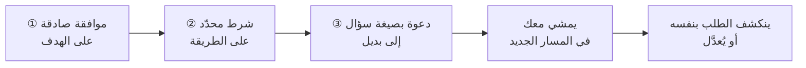

# طريقة الساندويتش (Sandwich Method)
> [!info] تعريف مختصر
> الساندويتش بنية ثلاثية للرفض غير المباشر: **أوافق على الفكرة والهدف** → **أختلف على الطريقة أو التوقيت وأذكر الشرط** → **أدعو إلى الاتّفاق على طريق بديل**. ووظيفتها الحقيقية ليست إخفاء الرفض بل **تحويل المسار** إلى مجرى ينكشف فيه الطلب بنفسه.

## الشرح العلمي والاحترافي
البنية شائعة الاسم ونادرة الفهم، لأنّها تُخلَط بـ«ساندويتش التغذية الراجعة» (مديح ← نقد ← مديح) — وهو نموذج **صار مكشوفًا** ويُقرأ «ماذا تريد أن تقول؟».

| | ساندويتش التغذية الراجعة | ساندويتش الرفض |
|---|---|---|
| الطبقة الأولى | مديح عامّ | **موافقة حقيقية على الهدف** |
| الحشوة | نقد للأداء | اختلاف على **الطريقة** |
| الطبقة الثالثة | مديح آخر | **دعوة للاتّفاق على بديل** |
| صدقه | مشكوك فيه — المديح تغليف | **صادق** — أنت فعلًا توافق على الهدف |
| مصيره | يُكشَف فيتآكل | لا يُكشَف لأنّه ليس تغليفًا |

**والفرق الجوهري في الطبقة الأولى:** حين تقول «فكرة ممتازة» لمن اقترح الانتقال إلى كانبان، فأنت توافق فعلًا على **الهدف** (تدفّق أفضل) وتختلف على **الطريقة والتوقيت** (الفريق يحتاج تدريبًا أوّلًا). ولهذا لا تتآكل الأداة — لأنّها ليست حيلة.

## أين ومتى يُستخدم
- طلب مستحيل أو غير مدروس من صاحب مصلحة ذي سلطة.
- اقتراح تقني صحيح في جوهره وخاطئ في توقيته.
- كلّ موقف تحتاج فيه إلى الرفض **وإلى إبقاء صاحب الاقتراح متعاونًا**.
- الخطوة التي تسبق البند الإجرائي في [[Displacement Strategy|الإزاحة]].

## مثال وسيناريو تطبيقي
> [!example] صاحب مصلحة يطلب ميزة كبيرة «خلال ثلاثة أيّام» بلا أيّ دراسة. الردّ المباشر — «هذا غير ممكن، نحتاج تحليلًا وتقديرًا» — يُنتج دفاعًا وإصرارًا. أمّا الساندويتش: **«بصراحة يا سيّدي فكرتك ممتازة فعلًا — ونحتاج أن ندرسها ونُوثّقها كما ينبغي. فإن لم تكن لديك وثائق، نُجري التوثيق أوّلًا ويأخذ مساره الصحيح. أفنبدأ به هذا الأسبوع؟»** — **لم تُرفَض الفكرة صراحةً؛ نُقلت مرحلةً إلى ملعبك.** فصار يمشي معك في التوثيق والتقدير، ولاحقًا سيرى فكرته هو تتحرّك تحرّكًا صحيحًا، **ويتخلّى بنفسه عن تقدير الثلاثة أيّام** — بلا أن يخسر ماء وجهه.

## خطوات أو مخطّط
1. **①** «طلبك [مهمّ · مفهوم] — وأرى الهدف الذي تريده: [اذكره بدقّة].»
2. **②** «والذي نحتاجه حتى نصل إليه صحيحًا هو [شرط محدّد لا اعتراض عامّ].»
3. **③** «فما رأيك أن [نبدأ بـ… · نُخصّص… · نتّفق على…]؟» — **بصيغة سؤال**.
4. **تحقّق من الشروط الثلاثة:** الموافقة في ① **صادقة** · الشرط في ② **محدّد** · و③ **سؤال** لا جملة خبرية.

## ⚠️ مفاهيم خاطئة شائعة
> [!warning]
> - **ليست مديحًا مُصطنَعًا.** إن كنتَ تقول «فكرة ممتازة» عن فكرة لا تراها كذلك، فأنت تستخدم النموذج المكشوف — وستُكشَف، لأنّ ما لا يُقصَد لا يُتبَع بفعل.
> - **ليست تأجيلًا.** الفارق بين ساندويتش سليم ومماطلة مُغلَّفة أنّ **الأوّل ينتهي بشرط أو مفاضلة أو موعد محدّد**.
> - **ليست بديلًا عن الوضوح في المسائل الحاسمة.** في مسائل السلامة والأخلاق يكون الوضوح المباشر أوجب من حفظ ماء الوجه.

## ❌ ممارسات خاطئة في المشاريع
> [!failure]
> - **تكرارها بلا نتيجة ثلاث مرّات** — سيقول صاحب المصلحة بحقّ: «كلّما جئتُ بشيء تقول «فكرة جيّدة» ثم لا يحدث شيء.» الحل حين يقع ذلك: لا تُساندوِش رابعة؛ أقِرّ صراحةً وأعطِ وضوحًا متأخّرًا — فالوضوح المتأخّر يُصلح، والساندويتش الرابع يُنهي العلاقة.
> - **حشوة بلا شرط** («لكنّنا نحتاج أن نُفكّر فيها») — لا تُنتج مسارًا فلا تُنتج شيئًا.
> - **إغلاق بجملة خبرية** («سنبدأ بالتوثيق») — ينزع الشراكة من القرار فيُقرأ فرضًا.
> - **استخدامها مع من هو أدنى سلطةً** لتجنّب تغذية راجعة صريحة يستحقّها — انظر [[Ruinous Empathy]].

## 🔗 مصطلحات ومفاهيم ذات صلة
[[Positive Refusal]] | [[Calibrated Questions]] | [[Displacement Strategy]] | [[Tactical Empathy]] | [[Positions vs Interests]] | [[Scope Creep]] | [[Ruinous Empathy]]

> [!tip] 💡 إثراء عملي — كورس لعبة العقل
> البنية بالنصّ وشروط صحّتها، والفرق عن ساندويتش التغذية الراجعة: [[06 - قوّة لا وأنواع نعم الثلاثة]].
