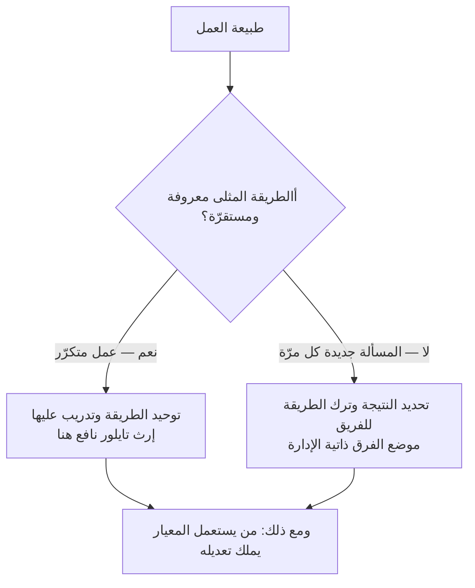

# الإدارة العلمية (Scientific Management)

> [!info] تعريف مختصر
> **الإدارة العلمية** مدرسة إدارية وضعها المهندس الأمريكي **فريدريك وينسلو تايلور** في كتابه *The Principles of Scientific Management* (1911)، مؤدّاها أن العمل يمكن أن يُدرَس دراسة تجريبية كما تُدرس الآلة: تُقاس كل حركة فيه بالزمن، فتُستخرج «الطريقة المثلى الواحدة» لأدائه، ثم يُدرَّب العامل عليها ويُكافأ على الالتزام بها. **وأبعد مبادئها أثرًا في يومنا هو الرابع: فصل التخطيط عن التنفيذ** — أن يفكّر قسم الإدارة ويُنفّذ العامل. وهذا المبدأ بعينه هو ما جاءت أجايل والفرق ذاتية الإدارة لتقلبه.

## الشرح العلمي والاحترافي

**السياق الذي وُلدت فيه.** كانت المصانع الأمريكية أواخر القرن التاسع عشر تُدار بما سمّاه تايلور «قاعدة الإبهام»: يتعلّم العامل من عامل قبله، ويقدّر المشرف الإنتاج تقديرًا، ولا أحد يعرف كم ينبغي أن تستغرق المهمّة فعلًا. وكان تايلور — وقد بدأ عاملًا في مصانع الحديد ثم صار كبير المهندسين — يرى أن هذا الجهل المتبادل هو أصل الصراع بين الطرفين: فالإدارة تظنّ العامل متكاسلًا، والعامل يظنّ كل رفع للإنتاج ذريعةً لخفض أجره.

**والمبادئ أربعة:**

1. **إحلال الدراسة محلّ التقدير**: تُدرس المهمّة بالقياس لا بالخبرة المتوارثة.
2. **اختيار العامل وتدريبه علميًّا**: بدل أن يُترك ليتعلّم بنفسه كيفما اتّفق.
3. **التعاون على تطبيق الطريقة**: لا يُكتفى بإصدارها، بل يُتابَع تنفيذها.
4. **قسمة العمل بين الإدارة والعمّال**: تتولّى الإدارة التخطيط والتصميم، ويتولّى العامل التنفيذ.

**والثالث والرابع هما موضع الخلاف كلّه.** فالأوّلان يكادان يكونان بديهيَّين اليوم — لا أحد ينكر فائدة القياس والتدريب. أمّا المبدأ الرابع فقد **أخرج التفكير من موضع العمل** وأودعه غرفةً أخرى، وقام عليه القرن العشرون الصناعي كلّه.

**وما ترتّب عليه:** انتقلت الفكرة من المصنع إلى المكتب بلا مراجعة، فصار **من يعرف العمل لا يملك تغييره، ومن يملك تغييره لا يعرفه**. وحين انتقل الاقتصاد إلى العمل المعرفي — حيث الطريقة المثلى غير معروفة سلفًا وتتغيّر مع كل مسألة — بقي الترتيب الإداري على حاله، فظهرت الفجوة التي بنت عليها أجايل حجّتها: أن **أقرب الناس إلى العمل أقدرهم على تقرير كيفيّته**.

**والإنصاف واجب هنا.** فأثر تايلور ليس شرًّا محضًا كما يُصوَّر في كثير من عروض أجايل:

- منه جاءت **المعايرة والتدريب المنهجي وقياس العمل**، وهي أصول قامت عليها الجودة الحديثة وسلامة الصناعة.
- ومن نقده الجادّ خرجت مدارس كاملة: **حركة العلاقات الإنسانية** بعد تجارب هاوثورن، ثم [[Theory X and Y|نظريتا X وY]] عند ماكجريجور.
- وحتى **[[Toyota Production System|نظام إنتاج تويوتا]]** أخذ عنه العمل المعياريّ وقلبه في الوقت نفسه: فجعل تحسين المعيار مسؤولية من يقوم عليه، لا مسؤولية قسم التخطيط ([[Kaizen]]).

**والنقد الأشدّ الذي وُجّه إليه** لم يكن أخلاقيًّا وحده بل عمليًّا: أنه افترض عاملًا **متلقّيًا**، فأهدر أثمن ما فيه — معرفته بموضع الخلل. وقد بلغ الجدل حول تطبيقه في ترسانة ووترتاون حدَّ تحقيقٍ في الكونغرس سنة 1912 إثر إضراب، ثم صدرت قيود تشريعية منعت استعمال ساعة الإيقاف وأنظمة المكافأة في الأعمال المموّلة حكوميًّا، وظلّت نافذة عقودًا.

## أين ومتى يُستخدم

**بوصفه إرثًا يُفهم لا أسلوبًا يُتبنّى:**

- **يُفهم به أصل كثير من ممارساتنا**: تقدير المدد، وتوصيف الوظائف، وفصل «مكتب إدارة المشاريع» عن الفرق، ووجود من يخطّط لمن ينفّذ.
- **ويبقى منطقه صالحًا** حيث يكون العمل **متكرّرًا ومعروف الطريقة**: خطوط التجميع، ومراكز التوزيع، وإجراءات السلامة — وهناك يكون توحيد الطريقة أمانًا لا قمعًا.
- **ويفسد** حيث يكون العمل معرفيًّا متغيّر المسألة، فتصير «الطريقة المثلى الواحدة» قيدًا على من يعرف الطريق أكثر ممّن رسمها.
- **وهو المدخل الصحيح لتدريس أجايل**: فمن لم يعرف ما جاءت لتبديله حفظ مبادئها ولم يفهم عللها.

## مثال وسيناريو تطبيقي

> [!example] سيناريو ملموس
> شركة برمجيات اسمها **«منهج»** تنشئ «مكتب معايير هندسية» من ثلاثة مهندسين أقدمين، مهمّته وضع الطريقة المثلى لكل نوع من الأعمال: كم تستغرق واجهة برمجية، وكيف تُكتب الاختبارات، وكم مهمّة يُنجز المطوّر أسبوعيًّا.
>
> **وأثره في الأشهر الستّة الأولى إيجابيّ ظاهر:** تقلّ الفوضى، وتصير التقديرات أقرب، ويتوحّد شكل الشيفرة.
>
> **ثم يظهر ما لم يكن في الحسبان:**
>
> - الفرق التي اكتشفت طريقة أفضل تحتاج ثلاثة أسابيع لاعتمادها من المكتب، فتلتزم بالطريقة القديمة لأنها أرخص إجرائيًّا.
> - ومعيار «عدد المهام أسبوعيًّا» يدفع إلى تفتيت المهام لا إلى إنجاز أسرع — وهو [[Goodhart's Law|قانون غودهارت]] بعينه.
> - وأدقّ ما في المصيبة: **المكتب صار آخر من يعلم بالمشكلات**، لأن من يراها لم يعد صاحب قرار فيها.
>
> **والعلاج ليس إلغاء المعايير** — فهي نافعة — بل **قلب المبدأ الرابع**: أن يملك الفريق تغيير المعيار وعليه أن يوثّق التغيير وعلّته، ويبقى المكتب حارسًا للتوثيق ومسهّلًا للنشر لا بوّابةً للإذن. فيُحتفظ بمكسب تايلور الأوّل ويُترك مبدؤه الأخير.

## خطوات أو مخطّط

1. **افحص أين يقع عملك على المحور**: أهو معروف الطريقة متكرّر، أم مسألته جديدة كل مرّة؟
2. **وحّد ما يحتمل التوحيد**: ما تكراره عالٍ وتباينه ضارّ ([[SOP]] و[[Definition of Done]]).
3. **اترك تقرير الطريقة لمن يمارسها** فيما عدا ذلك، واكتفِ بتحديد النتيجة وحدودها.
4. **اجعل المعيار قابلًا للتعديل ممّن يستعمله**، وإلا تحوّل من أداة إلى سقف.
5. **قِس المخرَج لا الحركة**: قياس عدد الحركات إرثٌ تايلوريّ صالح للمصنع، ضارّ في العمل المعرفي.

## ⚠️ مفاهيم خاطئة شائعة

> [!warning]
> - **أنها مجرّد «استغلال العمّال».** كان تايلور يرى أن الطريقة المدروسة ترفع الأجر والإنتاج معًا وتنهي الصراع بينهما، وقد رفعت الأجور فعلًا في مواضع. **والخلل في المبدأ الرابع لا في نيّة صاحبه** — وقصر النقد على النيّة يُضيع الدرس.
> - **أنها ماتت.** بل هي أساس ما نمارسه اليوم بلا أن نسمّيه باسمه: التوصيف الوظيفي، ومعايير الإنتاجية، وفصل التخطيط عن التنفيذ في أكثر المنظّمات.
> - **أن أجايل نقيضها في كل شيء.** أجايل تحتفظ بالقياس والمعيار والتدريب، وتنقض المبدأ الرابع وحده. فالخلاف على **من يقرّر الطريقة**، لا على وجود طريقة.
> - **أن «العمل المعياري» في [[Toyota Production System|نظام تويوتا]] تايلوريّ.** الشكل واحد والمالك مختلف: هناك يضع العامل المعيار ويحسّنه، وهنا يتلقّاه.

## ❌ ممارسات خاطئة في المشاريع

> [!failure]
> - **نقل منطق المصنع إلى العمل المعرفي بلا فحص**: قياس ساعات الجلوس وعدد الأسطر وعدد المهام، وكلّها **حركة** لا **نتيجة**. **التجنّب:** اربط كل مقياس بأثر يراه المستخدم أو الأعمال ([[22 - Outputs and Outcomes]]).
> - **جعل المعيار سقفًا لا أرضية**: يُمنع تجاوزه فيتوقّف التحسين عند لحظة كتابته. **التجنّب:** لكل معيار مالك ودورة مراجعة وباب مفتوح لاقتراح من يمارسه.
> - **فصل من يخطّط عمّن ينفّذ في عمل غير مستقرّ**: فتُبنى الخطط على واقع لا يعرفه صاحبها. **التجنّب:** لا خطّة تفصيلية لمهمّة لم يشارك منفّذها في تقديرها.
> - **استعمال القياس أداة محاسبة لا أداة تحسين**: فيتعلّم الناس تحسين الرقم لا العمل. **التجنّب:** فصل مقاييس التحسين عن تقييم الأفراد فصلًا معلنًا.

## 🔗 مصطلحات ومفاهيم ذات صلة

[[Theory X and Y]] | [[Command and Control]] | [[Self-Organizing Team]] | [[Micromanagement]] | [[Empowerment]] | [[Toyota Production System]] | [[Kaizen]] | [[SOP]] | [[Goodhart's Law]] | [[Six Sigma]] | [[22 - Outputs and Outcomes]] | [[01 - Agile]]
