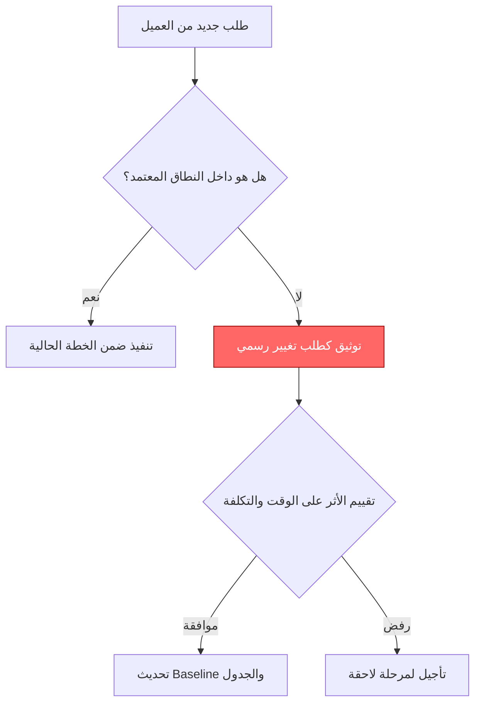

# تسرّب النطاق (Scope Creep)

> [!info] تعريف مختصر
> تسرّب النطاق (Scope Creep) هو التوسّع التدريجي وغير المُتحكَّم فيه في نطاق المشروع، بإضافة متطلبات أو ميزات جديدة دون مراجعة رسمية أو تعديل في الميزانية والجدول الزمني. يحدث بصمت، خطوة صغيرة تلو الأخرى، حتى يجد الفريق نفسه ينجز أضعاف ما اتُّفق عليه أصلاً بنفس الموارد.

## الشرح العلمي والاحترافي
- الفرق الجوهري بين تسرّب النطاق والتغيير المُدار (Managed Change of Scope): التغيير المُدار يمر عبر [[Change Request]] رسمي يُقيَّم أثره على الوقت والتكلفة والجودة ثم يُعتمَد أو يُرفَض. أما تسرّب النطاق فيحدث "من الباب الخلفي" دون توثيق أو موافقة، غالباً بسبب طلبات بسيطة يبدو تنفيذها غير مكلف ("إضافة صغيرة فقط").
- يحدث تسرّب النطاق لأسباب متعددة: ضعف تعريف [[Scope Statement]] منذ البداية، غياب [[SPOC]] واضح لدى العميل يتحكّم بالطلبات، رغبة الفريق في إرضاء العميل بأي ثمن، أو عدم وجود عملية موافقة رسمية معروفة للجميع.
- أثره التراكمي خطير: كل إضافة صغيرة على حدة تبدو غير مؤثرة، لكن مجموعها يرفع [[Technical Debt]]، يؤخر [[Critical Path]]، ويستنزف [[Contingency Reserve]] دون أن يُلاحَظ ذلك حتى فوات الأوان.
- يُقاس تسرّب النطاق عملياً بمقارنة النطاق المعتمد في [[Baseline]] مع النطاق الفعلي المُنفَّذ في لحظة معينة؛ أي فارق غير موثّق بموافقة رسمية هو تسرّب.
- يختلف عن "التغيير التطوري" ([[Evolutionary Change]]) في المشاريع الرشيقة، حيث يكون التوسّع في الفهم متوقّعاً ومُدارَاً عبر [[Backlog Refinement]] وإعادة الترتيب، لا تسرّباً خفياً غير محسوب.

## أين ومتى يُستخدم
- يُناقَش المصطلح في مرحلة التخطيط لوضع ضوابط وقائية (مثل توقيع [[Sign-off]] على [[Scope Statement]])، وفي مرحلة التنفيذ عند مراقبة أي انحراف عن النطاق المعتمد.
- في مشاريع الشلال ([[04 - Waterfall]]) يُعتبر خطراً كبيراً لأن النطاق مُثبَّت مسبقاً، وأي إضافة بلا [[Change Request]] تهدد الجدول الزمني بأكمله.
- في المشاريع الرشيقة ([[01 - Agile]]) يُدار الخطر عبر تجميد نطاق السبرنت الحالي ([[Feature Freeze]] المؤقت داخل السبرنت) مع السماح بمرونة أكبر بين السبرنتات عبر [[13 - Backlog]].
- يظهر في تقارير حالة المشروع وسجل المخاطر ([[Risk Register]]) كخطر متكرر يجب رصده أسبوعياً.

## مثال وسيناريو تطبيقي
> [!example] سيناريو ملموس
> شركة "نجم التقنية" تطوّر تطبيق حجز مواعيد طبية بميزانية 200,000 ريال ومدة ثلاثة أشهر. النطاق المعتمد يشمل: تسجيل المرضى، حجز موعد، وتذكير عبر رسالة نصية.
> في الأسبوع الثالث طلب العميل "إضافة صغيرة": زر لإلغاء الموعد. وافق الفريق فوراً بلا توثيق لأنها "بسيطة". في الأسبوع الخامس طلب "أيضاً" تقييم الطبيب بعد الزيارة. ثم في الأسبوع السابع طلب لوحة تحكم للطبيب لعرض إحصاءات مواعيده.
> بحلول الشهر الثالث اكتشف مدير المشروع أن الفريق نفّذ 40% ميزات إضافية لم تكن في العقد الأصلي، دون أي زيادة في الميزانية أو الوقت. تأخر التسليم شهراً كاملاً، واضطرت الشركة لتحمّل التكلفة الإضافية من هامش ربحها لأنه لا يوجد توثيق رسمي يُثبت أن هذه طلبات خارج النطاق تستحق فاتورة إضافية.

## خطوات أو مخطّط
1. تعريف نطاق دقيق وموثَّق منذ البداية في [[Scope Statement]] وتوقيعه من كل الأطراف.
2. تحديد [[SPOC]] واحد مخوَّل باستلام أي طلب تغيير من جهة العميل.
3. عند وصول أي طلب جديد، تقييمه فوراً: هل هو داخل النطاق أم [[Out of Scope]]؟
4. إذا كان خارج النطاق، تحويله رسمياً إلى [[Change Request]] يُقيَّم أثره على الوقت والتكلفة قبل أي تنفيذ.
5. رفض تنفيذ أي طلب "بسيط" دون توثيق، مهما بدا صغيراً، لأن التراكم هو المشكلة الحقيقية.
6. مراجعة النطاق الفعلي مقابل [[Baseline]] بشكل دوري (أسبوعياً أو في كل مراجعة سبرنت) لرصد أي انحراف مبكراً.

## ⚠️ مفاهيم خاطئة شائعة
> [!warning]
> - الاعتقاد أن كل توسّع في النطاق أمر سيئ بحد ذاته؛ المشكلة ليست في التغيير نفسه بل في غياب التوثيق والموافقة الرسمية عليه.
> - الظن بأن الطلبات "الصغيرة" لا تستحق عملية [[Change Request]] كاملة؛ في الواقع تراكم عشرات الطلبات الصغيرة هو السبب الأشيع لتسرّب النطاق وليس طلباً كبيراً واحداً.
> - الخلط بين تسرّب النطاق والتكيّف الرشيق الصحي مع تغيّر الفهم؛ في أجايل التغيير مُدار عبر ترتيب [[13 - Backlog]] بشفافية، بينما التسرّب يحدث خارج أي عملية رسمية.

## ❌ ممارسات خاطئة في المشاريع
> [!failure]
> - الموافقة الشفهية على طلبات العميل دون توثيق كتابي، مما يجعل تتبّع حجم التوسّع لاحقاً شبه مستحيل. التجنب: أي طلب جديد يُسجَّل كتابياً فوراً، حتى لو نُفِّذ سريعاً.
> - غياب [[SPOC]] واحد لدى العميل، فيصل الفريق طلبات متضاربة من عدة أشخاص في نفس الجهة. التجنب: الاتفاق منذ العقد الأول على شخص واحد مخوَّل بتقديم طلبات التغيير.
> - قياس التقدم بعدد الميزات المُنجزة بدل مقارنتها بالنطاق المعتمد في [[Baseline]]، فيبدو المشروع "متقدماً" بينما هو فعلياً متأخر عن الالتزامات التعاقدية الأصلية. التجنب: مراجعة دورية صريحة تقارن المُنفَّذ بالمُتفَق عليه.

## 🔗 مصطلحات ومفاهيم ذات صلة
[[Change Request]] | [[Scope Statement]] | [[Out of Scope]] | [[Baseline]] | [[Contingency Reserve]] | [[Risk Register]] | [[Technical Debt]] | [[Sign-off]] | [[SPOC]] | [[Backlog Refinement]] | [[04 - Waterfall]] | [[01 - Agile]]
