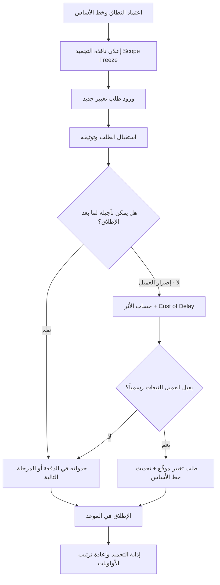

# تجميد النطاق (Scope Freeze)

> [!info] تعريف مختصر
> تجميد النطاق (Scope Freeze) أو قفل النطاق (Scope Lock) هو نافذة زمنية مُتفَق عليها رسمياً مع العميل وأصحاب المصلحة، لا يُقبَل خلالها أي تغيير في نطاق المشروع أو المرحلة — لا إضافة، ولا حذف، ولا إعادة تعريف. تُحدَّد هذه النافذة عادةً بـ **5–10 أيام قبل الإطلاق**، وقد تمتد إلى نافذة تنفيذ كاملة من **2–4 أسابيع**، أو تصل في المشاريع الكبيرة إلى **تجميد التصميم قبل 60 يوماً من `Go-Live`**. الغاية منها حماية تركيز الفريق، ومنع إعادة العمل (`Rework`)، ودفع مخاطر الإطلاق نحو الصفر.

## الشرح العلمي والاحترافي
- **القاعدة الذهبية**: الهدف من تجميد النطاق **ليس منع التغيير، بل منعه في التوقيت الخطأ**. الطلبات الجديدة لا تُرفض ولا تُهمَل، بل تُستقبل وتُوثَّق وتُوجَّه إلى ما بعد الإطلاق أو إلى المرحلة التالية. هذا التمييز هو ما يجعل التجميد أداة إدارية ناضجة لا حاجزاً بيروقراطياً.
- التجميد قرار **تعاقدي وإداري** قبل أن يكون فنياً: يُبنى على [[Scope Statement]] المعتمد، ويُثبَّت عبر توقيع رسمي ([[Sign-off]])، ويُدار بعده كل طلب عبر مسار [[Change Request]] المُعلَن.
- الأساس العلمي وراءه أن **تكلفة التغيير ترتفع أُسّياً كلما اقترب موعد الإطلاق**؛ فتغيير صغير في الأسبوع الأخير يمسّ التحليل والتصميم والتطوير والاختبار والتوثيق والتدريب معاً، فيتحوّل إلى موجة `Rework` تلتهم الاحتياطي الزمني (Buffer) بالكامل.
- التجميد يضبط أيضاً **استقرار خط الأساس (Baseline)**: بدون نطاق ثابت لا يمكن قياس الأداء الزمني أو الكلفوي بصدق، لأن المرجع نفسه يتحرك مع كل طلب.
- **مسار التصعيد عند إصرار العميل**: لا يُقابَل الإصرار برفض عاطفي، بل بمسار محسوب ومهني:
  1. **حساب الأثر (Impact Analysis)**: تقدير الأثر على الوقت والتكلفة والجودة والمخاطر، بأرقام لا بانطباعات.
  2. **احتساب تكلفة التأخير ([[Cost of Delay]])**: كم يخسر العمل يومياً إن تأخر الإطلاق لاستيعاب هذا الطلب؟ هذا الرقم غالباً ما يُنهي النقاش وحده.
  3. **توثيق رسمي بتحمّل التبعات**: إن أصرّ العميل رغم الأثر المُعلَن، يُوقَّع طلب تغيير رسمي يُقرّ فيه بالتاريخ الجديد والتكلفة الإضافية والمخاطر المقبولة، ويُسجَّل القرار في [[Decision Log]].
- **الفرق بين تجميد النطاق وتجميد الميزات**: [[Feature Freeze]] مصطلح **هندسة إصدار (Release Engineering)** أضيق مدى؛ يوقف إضافة الميزات الجديدة داخل دورة الإصدار الحالية مع استمرار إصلاح العيوب (`Bug Fixes`) والتحسينات الطفيفة، وقراره غالباً داخلي بيد فريق المنتج والهندسة. أما `Scope Freeze` فأوسع وأعلى مستوى: هو **تجميد نطاق المشروع أو المرحلة بالاتفاق مع العميل**، يشمل المتطلبات والتسليمات والتكاملات والتدريب والتوثيق، وله وجه تعاقدي يرتبط بالميزانية والجدول الزمني. باختصار: كل `Feature Freeze` تجميدٌ تقني داخل الإصدار، بينما `Scope Freeze` تجميدٌ إداري للاتفاق نفسه.

## أين ومتى يُستخدم
- قبل الإطلاق الكبير (`Go-Live`) بـ 5–10 أيام كحدّ أدنى، لتأمين فترة اختبار واستقرار خالية من المتغيّرات.
- في المشاريع التي تُدار بنافذة تنفيذ محددة (2–4 أسابيع)، حيث يُجمَّد النطاق طوال النافذة ثم يُعاد فتحه للمراجعة في نهايتها.
- في مشاريع الأنظمة المؤسسية الكبيرة (ERP، أنظمة بنكية، منصات حكومية)، حيث يُطبَّق **تجميد التصميم (Design Freeze)** قبل 60 يوماً من التشغيل الفعلي، لأن أي تعديل في التصميم بعدها يمسّ التكاملات وهجرة البيانات والتدريب.
- عند الانتقال بين مراحل المشروع (Phase Gate)، حيث يُجمَّد نطاق المرحلة الحالية قبل اعتمادها والانتقال للتالية.
- قبل [[Go or No-Go Decision]] مباشرة، لضمان أن القرار يُتخذ على نطاق مستقر معروف لا على هدف متحرك.
- في العقود ذات السعر الثابت (Fixed Price)، حيث يكون تجميد النطاق آلية الحماية الأساسية من [[Scope Creep]] غير المُسعَّر.

## مثال وسيناريو تطبيقي
> [!example] سيناريو
> شركة تنفّذ منصة حجوزات لعميل في قطاع السياحة، والإطلاق مُقرَّر يوم 1 سبتمبر. اتفق مدير المشروع مع العميل كتابياً على تجميد النطاق اعتباراً من 22 أغسطس (10 أيام قبل الإطلاق)، مع بند صريح: "تُستقبَل جميع الطلبات وتُسجَّل، وتُنفَّذ في الدفعة التالية بعد الإطلاق".
> في 26 أغسطس طلب مدير التسويق لدى العميل إضافة "كوبونات خصم موسمية" قبل الإطلاق، بحجة أن الحملة الإعلانية جاهزة. لم يرفض مدير المشروع الطلب، بل نفّذ مسار التصعيد: أعدّ تحليل أثر أظهر أن الميزة تتطلب 6 أيام عمل تطوير + إعادة اختبار انحدار كامل + تعديل في بوابة الدفع، أي تأجيل الإطلاق 9 أيام.
> ثم أضاف حساب [[Cost of Delay]]: تأجيل الإطلاق 9 أيام في ذروة الموسم يعني خسارة تقديرية 340 ألف ريال من الحجوزات، مقابل عائد متوقع من الكوبونات لا يتجاوز 60 ألفاً.
> عرض المدير خيارين موثّقين: (أ) الالتزام بالتجميد والإطلاق في موعده مع إدراج الكوبونات في الدفعة التالية بعد أسبوعين، أو (ب) طلب تغيير رسمي مُوقَّع من العميل يُقرّ فيه بالتاريخ الجديد والكلفة الإضافية. اختار العميل الخيار (أ)، وسُجِّل القرار في [[Decision Log]] وأُدرج الطلب في [[13 - Backlog]] للدفعة التالية. أُطلقت المنصة في موعدها دون حوادث حرجة.

## خطوات أو مخطّط
1. **الاتفاق المسبق**: تحديد تاريخ التجميد ومدّته ضمن الخطة و[[Scope Statement]]، قبل بدء التنفيذ لا في منتصفه.
2. **الإعلان الرسمي**: إبلاغ العميل وكل أصحاب المصلحة كتابياً بتاريخ بدء النافذة وما تعنيه بدقة، مع توضيح أن الطلبات ستُستقبَل لكن ستُجدوَل لاحقاً.
3. **تثبيت خط الأساس**: توثيق النطاق المجمَّد (قائمة التسليمات والمتطلبات) واعتماده بتوقيع رسمي ([[Sign-off]]).
4. **استقبال الطلبات لا رفضها**: تسجيل كل طلب جديد في سجل التغييرات ([[Change Request]]) وتصنيفه: ما بعد الإطلاق / المرحلة التالية.
5. **عند الإصرار — حساب الأثر**: تقدير الوقت والتكلفة والمخاطر بالأرقام، وإضافة [[Cost of Delay]] لمقارنة كلفة التأجيل بعائد الطلب.
6. **قرار موثّق**: إما الالتزام بالتجميد، أو قبول التغيير عبر طلب تغيير مُوقَّع يُقرّ فيه العميل بتحمّل التبعات (تاريخ جديد + تكلفة + مخاطر)، وتسجيله في [[Decision Log]].
7. **الإطلاق ثم إذابة التجميد**: بعد استقرار الإطلاق، يُعاد فتح النطاق رسمياً وتُعاد أولويات الطلبات المؤجَّلة للدفعة التالية.

## ⚠️ مفاهيم خاطئة شائعة
> [!warning]
> - **الاعتقاد بأن تجميد النطاق يعني رفض التغيير**: التجميد يضبط **توقيت** التغيير لا وجوده؛ الطلبات تُقبَل وتُوثَّق وتُنفَّذ لاحقاً، والفريق الذي يرفض الطلبات بدل توجيهها يخسر ثقة العميل بلا داعٍ.
> - **الخلط بينه وبين [[Feature Freeze]]**: تجميد الميزات قرار هندسي داخل دورة الإصدار يوقف الميزات الجديدة ويُبقي إصلاح العيوب، بينما تجميد النطاق قرار تعاقدي/إداري مع العميل يشمل المشروع أو المرحلة بكاملها.
> - **الظن بأن التجميد يشمل إصلاح الأخطاء الحرجة**: العيوب التي تمنع التشغيل ليست "نطاقاً جديداً"، بل جزء من الالتزام الأصلي، ويجب إصلاحها خلال النافذة.
> - **افتراض أن التجميد يُعلَن شفهياً ويكفي**: بلا توثيق مكتوب ومُعتمَد، يتحوّل التجميد إلى رأي شخصي لمدير المشروع يسهل تجاوزه.
> - **اعتباره أداة للمشاريع التقليدية فقط**: حتى الفرق الرشيقة تستخدم نوافذ تجميد قبل الإطلاقات الكبرى وقبل عروض العملاء الحرجة.

## ❌ ممارسات خاطئة في المشاريع
> [!failure]
> - **إعلان التجميد متأخراً أو من طرف واحد**: إبلاغ العميل بالتجميد بعد بدئه يُفهَم كتهرّب من الالتزامات. **التجنب**: تضمين تاريخ التجميد ومدّته في الخطة والعقد منذ البداية، والتذكير به قبل أسبوعين من سريانه.
> - **السماح باستثناءات متكررة لطلبات "صغيرة"**: كل استثناء يُضعف القاعدة حتى يصبح التجميد شكلياً، وتعود موجة `Rework`. **التجنب**: قناة استثناء وحيدة ومكلفة إجرائياً (تحليل أثر + موافقة الراعي)، بحيث يكون الاستثناء نادراً بطبيعته.
> - **رفض الطلبات دون بديل**: قول "لا" بلا مسار واضح لما بعد الإطلاق يدفع العميل للتصعيد فوق رأس مدير المشروع. **التجنب**: ربط كل رفض بموعد بديل مُحدَّد في [[13 - Backlog]] أو خارطة الطريق.
> - **قبول التغيير دون تحديث خط الأساس**: تنفيذ طلب متأخر مع الإبقاء على التاريخ والميزانية القديمين يعني فشلاً مضموناً يُحمَّل للفريق. **التجنب**: أي تغيير مقبول يستوجب تحديث الجدول والميزانية رسمياً.
> - **عدم حساب [[Cost of Delay]]**: النقاش بلا أرقام يتحوّل إلى صراع نفوذ يفوز فيه الأعلى منصباً لا الأصوب قراراً. **التجنب**: تقديم مقارنة رقمية بين كلفة التأجيل وعائد الطلب في كل حالة تصعيد.
> - **نسيان إذابة التجميد**: بقاء النطاق مجمّداً بعد الإطلاق يُجمّد التحسين نفسه ويُراكم الطلبات بلا معالجة. **التجنب**: تحديد تاريخ انتهاء النافذة صراحةً عند إعلانها.

## 🔗 مصطلحات ومفاهيم ذات صلة
[[Feature Freeze]] | [[Scope Creep]] | [[Change Request]] | [[Decision Log]] | [[Cost of Delay]] | [[Go or No-Go Decision]] | [[Scope Statement]] | [[Sign-off]] | [[13 - Backlog]]
