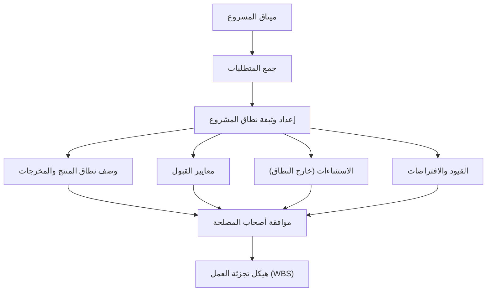

# وثيقة نطاق المشروع (Scope Statement)
> [!info] تعريف مختصر
> وثيقة نطاق المشروع (Scope Statement) هي وثيقة رسمية تحدد بوضوح ما يشمله المشروع وما لا يشمله، بما في ذلك الأهداف والمخرجات والقيود والافتراضات ومعايير القبول. تُعد المرجع الأساسي الذي يمنع سوء الفهم واتساع النطاق غير المخطط له.

## الشرح العلمي والاحترافي
وثيقة نطاق المشروع هي حجر الأساس في إدارة أي مشروع، لأنها تجيب على السؤال الأهم: "ما الذي نبنيه بالضبط، وما الذي لن نبنيه؟" تتكون عادة من العناصر التالية:
- **وصف نطاق المنتج (Product Scope)**: خصائص ومواصفات المنتج أو الخدمة النهائية.
- **المخرجات (Deliverables)**: قائمة محددة بما سيُسلَّم فعلياً في نهاية المشروع أو كل مرحلة.
- **معايير القبول (Acceptance Criteria)**: الشروط التي يجب توفرها ليُعتبر كل مخرج مقبولاً من العميل.
- **الاستثناءات (Exclusions)**: كل ما هو [[Out of Scope]] صراحة، لتجنب أي التباس لاحق.
- **القيود (Constraints)**: عوامل تحد من خيارات الفريق مثل الميزانية، الجدول الزمني، أو التقنية المفروضة.
- **الافتراضات (Assumptions)**: عوامل يُفترض صحتها دون دليل مؤكد بعد.

تختلف وثيقة النطاق عن ميثاق المشروع (Project Charter) في أنها أكثر تفصيلاً وتُبنى عادة بعده، وتُستخدم كأساس لإنشاء هيكل تجزئة العمل (Work Breakdown Structure - WBS). أي طلب لاحق يقع خارج ما ورد في هذه الوثيقة يُعامل كطلب تغيير رسمي وليس تعديلاً تلقائياً.

## أين ومتى يُستخدم
- في **مرحلة التخطيط المبكرة** من دورة حياة المشروع، بعد اعتماد ميثاق المشروع (Project Charter) وقبل البدء بالتصميم التفصيلي.
- في منهجية **الشلال (Waterfall)** بشكل رسمي وموسّع، وتُستخدم بصيغة مبسّطة في Agile ضمن "هدف المنتج" (Product Goal) أو ملخص النطاق في بداية كل إصدار.
- عند التعاقد مع عميل خارجي، غالباً كجزء من [[SOW]] (بيان العمل) أو [[BRD]] (وثيقة متطلبات العمل).
- كمرجع أساسي عند تقييم أي [[Change Request]] لتحديد ما إذا كان الطلب داخل النطاق المتفق عليه أم يستدعي تعديلاً رسمياً في العقد والميزانية.

## مثال وسيناريو تطبيقي
> [!example] شركة "بنية" تتعاقد مع مطعم لبناء نظام حجوزات إلكتروني. تُعد مديرة المشروع ليلى وثيقة نطاق تتضمن: **المخرجات**: تطبيق ويب لحجز الطاولات، لوحة تحكم للموظفين، تكامل مع نظام الرسائل النصية للتذكير. **معايير القبول**: يجب أن يدعم النظام 200 حجز يومي دون تعطل، وأن يُرسل تذكيراً قبل ساعة من الموعد. **الاستثناءات**: لا يشمل نظام دفع إلكتروني، ولا تطبيق جوال منفصل، ولا دعم لغات غير العربية والإنجليزية. **القيود**: الميزانية 80,000 ريال والمدة 10 أسابيع. **الافتراضات**: العميل سيوفر قائمة الطاولات وأوقات العمل خلال الأسبوع الأول. بعد شهرين، يطلب صاحب المطعم إضافة نظام دفع إلكتروني "بسيط" ظناً منه أنه ضمن الاتفاق. ترجع ليلى إلى وثيقة النطاق الموقّعة وتوضّح أن هذا البند مذكور صراحة تحت "الاستثناءات"، وتقترح معالجته كطلب تغيير رسمي بتقدير تكلفة ووقت إضافيين، مما يحمي الفريق من عمل غير مدفوع ويحافظ على علاقة واضحة مع العميل.

## خطوات أو مخطّط
1. اجمع متطلبات العميل وأصحاب المصلحة من خلال الاجتماعات ووثائق مثل [[BRD]].
2. حدد المخرجات الرئيسية ووصف نطاق المنتج بدقة.
3. اكتب معايير قبول واضحة وقابلة للقياس لكل مخرج.
4. وثّق صراحة كل ما هو [[Out of Scope]] لتفادي الالتباس لاحقاً.
5. اذكر القيود (الميزانية، الوقت، التقنية) والافتراضات المعتمد عليها.
6. اعرض الوثيقة على أصحاب المصلحة الرئيسيين واحصل على توقيعهم أو موافقتهم الرسمية ([[Sign-off]]).
7. استخدم الوثيقة الموافق عليها كأساس لبناء هيكل تجزئة العمل (WBS) والجدول الزمني.

## ⚠️ مفاهيم خاطئة شائعة
> [!warning]
> - **الخلط بينها وبين ميثاق المشروع (Project Charter)**: الميثاق وثيقة عامة توثق تفويض المشروع وأهدافه الكبرى، أما وثيقة النطاق فأكثر تفصيلاً وتُركّز تحديداً على حدود العمل والمخرجات.
> - **الاعتقاد بأن كتابتها مرة واحدة في البداية كافية للأبد**: النطاق قد يحتاج تحديثاً رسمياً عبر عملية إدارة التغيير عندما تتغير الظروف، لكن هذا يجب أن يمر بموافقة رسمية وليس تعديلاً عشوائياً.
> - **الظن بأن التفاصيل التقنية الدقيقة يجب أن تكون في وثيقة النطاق**: التفاصيل التقنية الدقيقة مكانها وثائق أخرى مثل [[Software Requirements Specification]]، أما وثيقة النطاق فتُركّز على الحدود العامة والمخرجات ومعايير القبول.

## ❌ ممارسات خاطئة في المشاريع
> [!failure]
> - **كتابة نطاق غامض أو عام** مثل "بناء نظام حديث وسهل الاستخدام" دون تفاصيل قابلة للقياس، مما يفتح الباب لتفسيرات متضاربة لاحقاً. الحل: استخدم لغة محددة وقابلة للقياس ومعايير قبول واضحة.
> - **عدم توثيق قسم "الاستثناءات" (خارج النطاق) بشكل كافٍ**، فيظن العميل أن كل ما لم يُذكر معارضته مشمول تلقائياً. الحل: اكتب بنوداً صريحة لأهم الاستثناءات المتوقعة.
> - **البدء بالتنفيذ قبل الحصول على موافقة رسمية موقّعة على وثيقة النطاق**، مما يجعل أي خلاف لاحق بلا مرجع حاسم. الحل: لا يبدأ التنفيذ الفعلي إلا بعد اعتماد الوثيقة رسمياً من كل الأطراف المعنية.

## 🔗 مصطلحات ومفاهيم ذات صلة
[[Out of Scope]] | [[Functional Specification]] | [[Scope Creep]] | [[BRD]] | [[SOW]] | [[Change Request]] | [[Sign-off]] | [[Software Requirements Specification]] | [[04 - Waterfall]]
