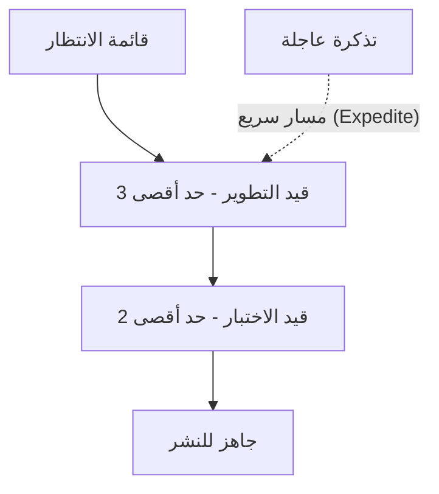

# سكرم-بان (Scrum-ban)

> [!info] تعريف مختصر
> سكرم-بان (Scrum-ban / Scrumban) هو نهج هجين يجمع بين بنية سكرم ([[02 - Scrum]]) المنظَّمة (اجتماعات، أدوار، سبرنتات) وآليات تدفق كانبان ([[03 - Kanban]]) المرنة (حدود العمل الجاري، السحب المستمر) للحصول على انضباط سكرم مع مرونة كانبان.

## الشرح العلمي والاحترافي
- سكرم يعتمد على دفعات عمل ثابتة الزمن (Sprints) يُخطَّط لها مسبقاً، بينما كانبان يعتمد على تدفق مستمر بلا سبرنتات، حيث تُسحَب المهام واحدة تلو الأخرى فور توفر طاقة استيعابية ([[Pull System]]).
- سكرم-بان يأخذ من سكرم: الأدوار (مثل [[06 - Scrum Master]])، بعض الاجتماعات (كالـ [[10 - Sprint Retrospective]])، والتخطيط الدوري. ويأخذ من كانبان: حدود العمل الجاري ([[WIP Limit]])، التصور المرئي للتدفق، والسحب المستمر بدلاً من التزام السبرنت الصارم.
- يُستخدم غالباً كخطوة انتقالية للفرق التي تريد الانتقال من سكرم إلى كانبان تدريجياً، أو للفرق التي تحتاج مرونة كانبان في التعامل مع الأعمال غير المتوقعة (مثل تذاكر الدعم الفني العاجلة) مع الحفاظ على انضباط سكرم في التخطيط الدوري.
- من الناحية العملية، بدلاً من التزام الفريق بمحتوى سبرنت ثابت لمدة أسبوعين، يضع الفريق حدود عمل جارٍ ([[WIP Limit]]) على كل عمود في اللوحة، ويسحب مهاماً جديدة فور توفر طاقة، مع الاحتفاظ باجتماعات دورية للتخطيط والمراجعة والتحسين.
- يناسب سكرم-بان بيئات العمل التي تحتوي مزيجاً من عمل مخطَّط (ميزات جديدة) وعمل غير مخطَّط (أعطال طارئة، طلبات دعم)، لأن كانبان البحت قد يفتقر لإيقاع التخطيط المنتظم، بينما سكرم البحت قد يكون جامداً جداً أمام المقاطعات المتكررة.

## أين ومتى يُستخدم
- يُستخدم في فرق الصيانة والدعم الفني (Support/Maintenance Teams) التي تتلقى طلبات غير متوقعة باستمرار ولا يمكنها الالتزام بمحتوى سبرنت ثابت مسبقاً.
- يُلجأ إليه في الفرق التي تنتقل تدريجياً من سكرم إلى كانبان (أو العكس)، كمرحلة وسطى تسمح بالتجربة دون تغيير جذري مفاجئ في طريقة العمل.
- يناسب أيضاً فرق العمليات (DevOps/SRE) التي تحتاج التعامل مع حوادث عاجلة ([[Hotfix]]) بجانب عمل مخطَّط له مسبقاً، حيث يوفر مرونة السحب الفوري مع بقاء إيقاع اجتماعات التخطيط والمراجعة.

## مثال وسيناريو تطبيقي
> [!example] سيناريو ملموس
> فريق دعم فني في شركة برمجيات كان يعمل بسكرم بسبرنتات مدتها أسبوعان. المشكلة أن 40% من وقت كل سبرنت يُستهلَك بتذاكر دعم عاجلة غير مخطَّطة، مما يعطل خطة السبرنت باستمرار ويجعل تقديرات [[18 - Velocity]] غير موثوقة.
> ينتقل الفريق إلى سكرم-بان: يحتفظ بـ [[10 - Sprint Retrospective]] الأسبوعي و[[08 - Sprint Planning]] الخفيف لتحديد الأولويات، لكنه يستبدل التزام السبرنت الثابت بلوحة كانبان بحدود عمل جارٍ (مثلاً 3 مهام كحد أقصى قيد "التطوير").
> عندما تصل تذكرة عاجلة، تُسحَب فوراً ضمن حد "فئة الاستعجال" ([[Expedite Class]]) دون انتظار سبرنت جديد، بينما تستمر المهام المخطَّطة بالتدفق العادي. بعد شهرين، ينخفض [[Cycle Time]] لتذاكر الدعم من 5 أيام إلى يوم واحد، مع بقاء انضباط التخطيط الأسبوعي.

## خطوات أو مخطّط
1. الاحتفاظ ببعض ممارسات سكرم المفيدة للفريق (اجتماعات تخطيط ومراجعة وتحسين دورية، الأدوار الأساسية).
2. استبدال التزام السبرنت الثابت بلوحة كانبان مرئية تعكس حالة كل مهمة.
3. وضع حدود عمل جارٍ ([[WIP Limit]]) على كل عمود في اللوحة لمنع التكدس.
4. السماح بسحب المهام الجديدة فور توفر طاقة استيعابية، بدلاً من انتظار بداية سبرنت جديد.
5. تخصيص مسار سريع (Expedite Class) للعمل العاجل غير المخطَّط له.
6. قياس الأداء عبر مقاييس التدفق مثل [[Cycle Time]] و[[Throughput]] بدلاً من الاعتماد فقط على [[18 - Velocity]].

## ⚠️ مفاهيم خاطئة شائعة
> [!warning]
> - الظن أن سكرم-بان هو "مجرد كانبان بأسماء سكرم"؛ في الحقيقة هو دمج مقصود بين انضباط التخطيط الدوري لسكرم ومرونة التدفق المستمر لكانبان، وليس مجرد تسمية.
> - الاعتقاد أنه لا توجد فيه أي سبرنتات إطلاقاً؛ بعض الفرق تحتفظ بدورات تخطيط ومراجعة منتظمة (تشبه السبرنت) لكن دون التزام صارم بمحتوى ثابت.
> - الخلط بينه وبين كانبان البحت؛ الفارق الجوهري هو احتفاظ سكرم-بان ببعض الطقوس والأدوار من سكرم، بينما كانبان البحت لا يفرض أدواراً أو اجتماعات محددة.

## ❌ ممارسات خاطئة في المشاريع
> [!failure]
> - تبني سكرم-بان دون وضع حدود عمل جارٍ فعلية، فيتحول إلى "سكرم بلا التزام" بدون فوائد كانبان الحقيقية. التجنب: تحديد [[WIP Limit]] واضح لكل عمود والالتزام به فعلياً.
> - إلغاء كل اجتماعات سكرم دفعة واحدة عند الانتقال، فيفقد الفريق إيقاع التخطيط والتحسين المستمر. التجنب: الاحتفاظ بالاجتماعات المفيدة (كالـ Retrospective) وتعديل تكرارها بدلاً من حذفها بالكامل.
> - استخدام مسار الاستعجال (Expedite) لكل مهمة تقريباً بحجة أنها "عاجلة"، مما يُفرغ حدود العمل الجاري من معناها. التجنب: تعريف معايير صارمة وواضحة لما يُعتبر عملاً عاجلاً فعلاً يستحق تجاوز الطابور العادي.

## 🔗 مصطلحات ومفاهيم ذات صلة
[[02 - Scrum]] | [[03 - Kanban]] | [[WIP Limit]] | [[Pull System]] | [[Cycle Time]] | [[Throughput]] | [[Expedite Class]] | [[18 - Velocity]] | [[Hotfix]] | [[Explicit Policies]]
