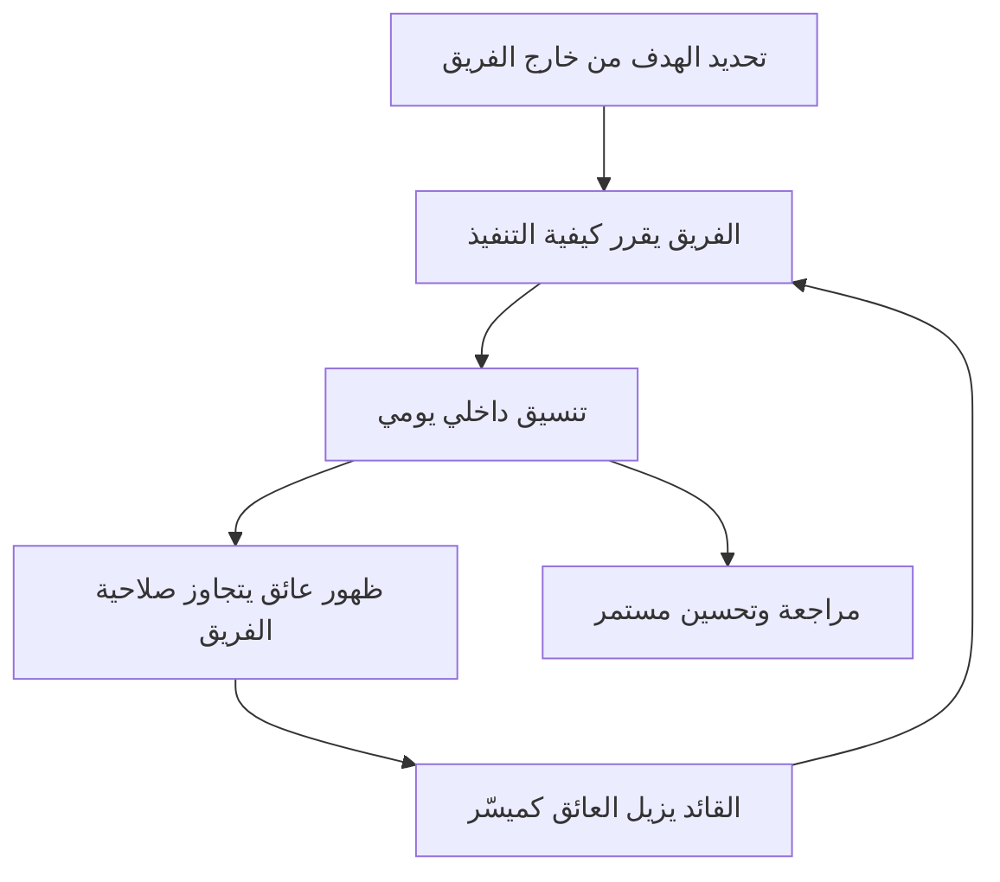

# الفريق المنظّم ذاتيًا (Self-Organizing Team)
> [!info] تعريف مختصر
> الفريق المنظّم ذاتيًا (Self-Organizing Team) هو فريق يقرر أعضاؤه بأنفسهم كيف ينجزون العمل الموكل إليهم، دون أن يوجّههم مدير خارجي في تفاصيل التنفيذ اليومي. الفريق يختار أدواته وتوزيع مهامه وطريقة تعاونه، بينما تُحدَّد الأهداف من خارج الفريق.

## الشرح العلمي والاحترافي
- التنظيم الذاتي لا يعني غياب القيادة أو الفوضى؛ بل يعني أن القرارات التشغيلية (من يعمل على ماذا، وكيف، وبأي ترتيب) تُتخذ داخل الفريق نفسه.
- يعتمد هذا المفهوم على افتراض أن الأشخاص الأقرب للعمل الفعلي هم الأقدر على اتخاذ أفضل القرارات التقنية والتنفيذية بشأنه، أكثر من مدير بعيد عن التفاصيل.
- من أهم شروط نجاحه: وجود أمان نفسي (Psychological Safety) يسمح بالنقاش الصريح والاعتراف بالأخطاء، ووضوح الهدف (Alignment) حتى لا يتحول الاستقلال إلى تشتت.
- دور القائد يتحول من "الموجّه والمتحكم" إلى "الميسّر والمزيل للعوائق"، وهو جوهر مفهوم القيادة الخادمة (Servant Leadership).
- الفرق التي تمر بمراحل نمو جماعي معروفة (انظر Tuckman's Stages of Group Development) تصل عادة إلى التنظيم الذاتي الفعّال بعد مرورها بمرحلتي الصراع والتوافق (Storming وNorming) قبل الوصول لمرحلة الأداء (Performing).
- التمكين (Empowerment) هو الوجه الآخر لنفس العملة: المنظمة تمنح الفريق الصلاحية، والفريق يتحمل المسؤولية.

## أين ومتى يُستخدم
- من القيم الأساسية في بيان Agile (Agile Manifesto) وفي إطار Scrum، حيث يُتوقع من المطوّرين أن يقرّروا بأنفسهم كيفية تحويل عناصر الـ Backlog إلى زيادة (Increment) جاهزة.
- مناسب في بيئات العمل المعرفي المعقد (تطوير البرمجيات، التصميم، البحث) حيث المشاكل غير متكررة وتحتاج حكمًا محليًا سريعًا.
- أقل ملاءمة في بيئات شديدة التنظيم أو ذات مخاطر سلامة عالية تتطلب إجراءات موحدة صارمة (Explicit Policies) لا مجال للاجتهاد فيها.
- يظهر أثره بوضوح في اجتماعات التخطيط (Sprint Planning) حيث يختار الفريق بنفسه حجم العمل الذي يلتزم به، وفي الوقفة اليومية (Daily Scrum) حيث ينسق الأعضاء العمل فيما بينهم دون توجيه من مدير.

## مثال وسيناريو تطبيقي
> [!example] فريق تطوير مكوّن من 6 مهندسين في شركة "بيانات" كان يتلقى توزيع المهام يوميًا من قائد الفريق السابق. بعد تبني Scrum، طلب مدير المنتج من الفريق أن يقرر بنفسه كيف يوزّع عمل السبرنت القادم. في أول اجتماع تخطيط، اختلف الفريق حول من يتولى مهمة "دمج بوابة الدفع" المعقدة. بدل أن يحسم القرار مدير خارجي، تطوّع اثنان من المهندسين للعمل عليها معًا (Pair)، بينما وزّع البقية المهام الأصغر حسب خبرتهم. سكرم ماستر لم يفرض القرار، بل سهّل النقاش وتأكد من عدم وجود عائق (Blocker). بعد 3 سبرنتات، أصبح الفريق يحل خلافاته بنفسه في الاجتماع اليومي دون تدخل خارجي، وارتفعت سرعته (Velocity) بشكل ملحوظ لأن القرارات أصبحت أسرع وأقرب لمن ينفذ العمل فعليًا.

## خطوات أو مخطّط
1. تحديد الهدف والحدود بوضوح من خارج الفريق (ما المطلوب، وليس كيف يُنفَّذ).
2. منح الفريق صلاحية اتخاذ قرارات التنفيذ اليومية.
3. توفير أمان نفسي يشجع النقاش الصريح دون خوف من اللوم.
4. دعم الفريق بتيسير (Facilitation) بدل التوجيه المباشر عند الحاجة.
5. إزالة العوائق (Blockers) التي تتجاوز صلاحية الفريق عبر القيادة.
6. مراجعة دورية (Retrospective) لتحسين طريقة التنظيم الذاتي نفسها.

## ⚠️ مفاهيم خاطئة شائعة
> [!warning]
> - الاعتقاد بأن الفريق المنظّم ذاتيًا لا يحتاج إلى قيادة على الإطلاق؛ في الواقع هو يحتاج قيادة من نوع مختلف (خادمة وميسِّرة).
> - الخلط بين التنظيم الذاتي وحرية اختيار الأهداف؛ الفريق يقرر "كيف" ينفذ العمل، لكن "ماذا" يُنجز عادة يأتي من صاحب المنتج أو استراتيجية العمل.
> - الظن بأن التنظيم الذاتي يظهر تلقائيًا فور تشكيل الفريق دون مرور بمراحل نضج تدريجية.

## ❌ ممارسات خاطئة في المشاريع
> [!failure]
> - **ترك الفريق بلا أي توجيه أو حدود (فوضى كاملة)**: يؤدي لتشتت الجهد وغياب الأولويات. الحل: وضوح الهدف والقيود، مع حرية كاملة في طريقة التنفيذ.
> - **تدخل المدير المستمر في تفاصيل من يعمل على ماذا (إدارة تفصيلية/Micromanagement)**: يقتل التنظيم الذاتي فعليًا رغم الادعاء بتبنيه. الحل: تدريب المديرين على دور الميسّر بدل المتحكم.
> - **تشكيل فريق دون كفاءات متكاملة (Cross-functional)**: يجعله عاجزًا عن اتخاذ قرارات تنفيذ حقيقية لأنه يحتاج دائمًا لأطراف خارجية. الحل: بناء فرق متعددة الوظائف من البداية.

## 🔗 مصطلحات ومفاهيم ذات صلة
[[Theory X and Y]] | [[Command and Control]] | [[Scientific Management]] | [[Psychological Safety]] | [[Servant Leadership]] | [[Micromanagement]] | [[Empowerment]] | [[Cross-functional Team]] | [[Spotify Model]] | [[Two-Pizza Team]] | [[Tuckman's Stages of Group Development]] | [[Team Working Agreement]] | [[Alignment]] | [[02 - Scrum]] | [[01 - Agile]] | [[Chain of Command]]
