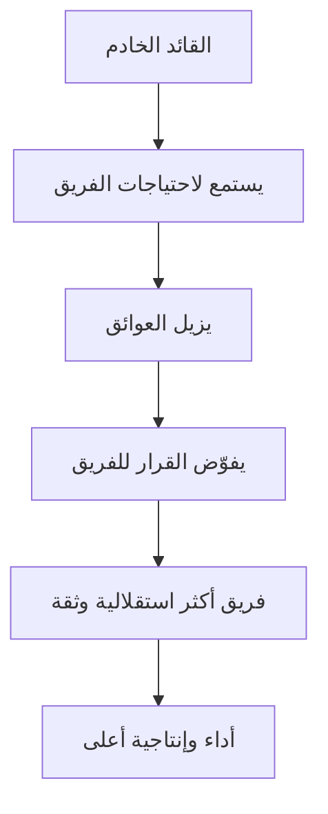

# القيادة الخادمة (Servant Leadership)
> [!info] تعريف مختصر
> القيادة الخادمة هي أسلوب قيادة يضع القائد فيه احتياجات الفريق ونموه أولاً، فيركّز على إزالة العقبات وتمكين الأعضاء بدل إصدار الأوامر والتحكّم المباشر.

## الشرح العلمي والاحترافي
صاغ المصطلح روبرت غرينليف (Robert Greenleaf) عام 1970، وتبنّته منهجيات رشيقة مثل سكرَم (Scrum) كنموذج أساسي لدور قائد الفريق (Scrum Master). الفكرة المحورية: بدل أن يسأل القائد "كيف أجعل الفريق يخدم رؤيتي؟" يسأل "كيف أخدم الفريق ليحقق أفضل أداء؟".

كيف تعمل عملياً:
- القائد يُزيل العوائق (Blocker) بدل أن يطلب من الفريق تجاوزها بمفرده.
- يُفوّض القرارات للفريق بدل اتخاذها نيابة عنه (انظر Empowerment).
- يُدرّب ويوجّه (Coaching) بدل الإصدار المباشر للتعليمات.
- يحمي الفريق من التشتت الخارجي والمقاطعات غير الضرورية.
- يقيس نجاحه بنجاح الفريق ونموه، لا بسلطته الشخصية.

لماذا يهم: في الفرق ذاتية التنظيم (Self-Organizing Team) يحتاج الفريق إلى مساحة لاتخاذ قراراته التقنية بنفسه. القيادة الخادمة توفّر هذه المساحة مع الحفاظ على الدعم والتوجيه، وهي نقيض الإدارة التفصيلية (Micromanagement) التي تخنق الاستقلالية والإبداع.

## أين ومتى يُستخدم
- دور قائد الفريق (Scrum Master) في سكرَم هو التجسيد الأوضح لهذا الأسلوب.
- ميسّرو فرق كانبان (Kanban) الذين يديرون التدفق بدل الأشخاص.
- أي مدير مشروع يقود فرقاً معرفية (Knowledge Workers) تحتاج استقلالية فكرية.
- عند بناء ثقافة أمان نفسي (Psychological Safety) داخل الفريق.

## مثال وسيناريو تطبيقي
> [!example] في فريق تطوير تطبيق جوال، لاحظت قائدة الفريق سلمى أن المطورين يتأخرون باستمرار بسبب انتظار موافقات من قسم الأمن السيبراني تستغرق أسبوعاً. بدل أن تطلب من الفريق "الإسراع" أو تتدخل في كل تفصيلة برمجية، تواصلت سلمى شخصياً مع رئيس قسم الأمن، واتفقت على مسار موافقة سريع (Expedite Class) للطلبات الصغيرة، وأحضرت عضواً من الأمن لحضور اجتماع التخطيط (Sprint Planning) الأسبوعي مباشرة. النتيجة: انخفض وقت الانتظار (Lead Time) من أسبوع إلى يوم واحد، والفريق استمر في عمله التقني دون مقاطعة.

## خطوات أو مخطّط
1. الإصغاء الفعّال لمشكلات الفريق أولاً قبل اقتراح الحلول.
2. تحديد العوائق التي تعيق التقدّم والعمل على إزالتها شخصياً.
3. تفويض القرارات التقنية والتنفيذية للفريق (Empowerment).
4. حماية الفريق من الطلبات العشوائية ومقاطعات أصحاب المصلحة.
5. تدريب الأعضاء ومساعدتهم على النمو المهني بدل تصحيح كل خطأ بنفسه.

## ⚠️ مفاهيم خاطئة شائعة
> [!warning]
> - القيادة الخادمة ليست غياباً للقيادة أو تركاً للفريق بلا توجيه؛ بل هي قيادة نشطة تركّز على التمكين لا السيطرة.
> - لا تعني الموافقة على كل طلب أو تجنّب اتخاذ قرارات صعبة؛ القائد الخادم يتخذ قرارات حازمة حين يلزم الأمر.
> - ليست حصراً على دور قائد الفريق (Scrum Master)؛ يمكن لأي مدير مشروع تبنّي هذا الأسلوب.

## ❌ ممارسات خاطئة في المشاريع
> [!failure]
> - القائد يظل يتخذ كل القرارات التقنية بنفسه بينما يدّعي أنه "قائد خادم" — الحل: تفويض حقيقي مع تحمّل الفريق للمسؤولية.
> - الانشغال بإزالة العوائق الصغيرة فقط وتجاهل العوائق التنظيمية الكبرى مثل نقص الموارد — الحل: التصعيد الجاد لأصحاب المصلحة عند الحاجة.
> - الخلط بين الخدمة والتساهل، فيتجنب القائد المحادثات الصعبة حول الأداء الضعيف — الحل: صراحة محترمة مبنية على أمان نفسي (Psychological Safety).

## 🔗 مصطلحات ومفاهيم ذات صلة
[[Psychological Safety]] | [[Self-Organizing Team]] | [[Micromanagement]] | [[Empowerment]] | [[Leadership at Every Level]] | [[Facilitator]] | [[06 - Scrum Master]] | [[Emotional Intelligence]]
