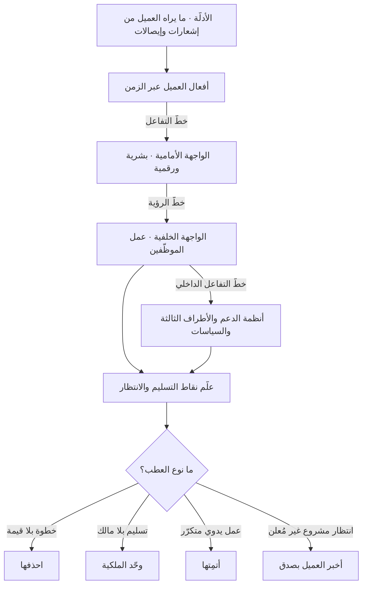

# مخطّط الخدمة (Service Blueprint)

> [!info] تعريف مختصر
> مخطّط يوثّق الخدمة كاملة على محور زمني، بطبقات متراكبة تصف ما يراه العميل وما لا يراه في آن: **أفعال العميل**، ثم **الواجهة الأمامية (Frontstage)** التي يتفاعل معها مباشرة، ثم **الواجهة الخلفية (Backstage)** أي عمل الموظّفين خلف الكواليس، ثم **عمليات الدعم** من أنظمة وأطراف ثالثة — تفصل بينها خطوط أشهرها **خطّ الرؤية (Line of Visibility)** الذي يفصل ما يراه العميل عمّا لا يراه. صاغت المفهوم وقدّمته الباحثة **ج. ليون شوستاك (G. Lynn Shostack)** عام 1984 في مجلة *Harvard Business Review* ضمن عملها على تصميم الخدمات. قيمته الأساسية أنه **الأداة الوحيدة التي تربط عطبًا يشعر به العميل بمصدره الحقيقي في العملية الداخلية**، بدل الاكتفاء بتوثيق شعوره.

## الشرح العلمي والاحترافي
- **الطبقات الأربع بترتيبها من أعلى إلى أسفل**:
  1. **أفعال العميل (Customer Actions)**: الخطوات التي يقوم بها العميل بنفسه عبر الزمن — يبحث، يطلب، ينتظر، يستلم، يشتكي، يعيد الطلب.
  2. **أفعال الواجهة الأمامية (Frontstage / Onstage)**: كل ما يتفاعل معه العميل مباشرة، بشرًا كان (موظّف استقبال، مندوب توصيل، وكيل دعم) أو رقميًّا (شاشة، إشعار، رسالة نصية). يُفصَل هذان النوعان أحيانًا إلى صفّين مستقلّين لأن المشكلة قد تكون في السلوك البشري لا في النظام.
  3. **أفعال الواجهة الخلفية (Backstage)**: عمل الموظّفين الذي يحدث فعلًا لكن العميل لا يراه — تدقيق الطلب، تجهيز الشحنة، مراجعة الامتثال، تسوية المدفوعات، متابعة المرتجعات.
  4. **عمليات الدعم (Support Processes)**: الأنظمة والسياسات والأطراف الثالثة التي تُمكِّن كل ما سبق — بوابة الدفع، نظام إدارة المخزون، مزوّد الشحن، سياسة الاسترجاع، اتفاقية مستوى الخدمة مع مورّد.
- **الخطوط الفاصلة ووظيفة كل خطّ**: يفصل **خطّ التفاعل** بين العميل والواجهة الأمامية؛ ويفصل **خطّ الرؤية** بين ما يراه العميل وما لا يراه — وهو الخطّ الذي أعطى الأداة معناها؛ ويفصل **خطّ التفاعل الداخلي** بين عمل الموظّفين وأنظمة الدعم. الخطوط ليست زينة: كل عبور لخطّ هو **نقطة تسليم** (Handoff)، والتسليمات هي حيث تتراكم أعطال الخدمة عادةً، لأنها المواضع التي تنتهي عندها مسؤولية طرف قبل أن تبدأ مسؤولية آخر.
- **لماذا هو الأداة المناسبة للمنصّات التي فيها عمل بشري خلف الكواليس**: في منتج رقمي بحت، تجربة العميل تساوي تقريبًا ما تفعله الشيفرة، فيكفي غالبًا رسم التدفّق. أما في التوصيل والدعم والتسوية المالية والخدمات الميدانية، فبين ضغطة الزرّ ووصول القيمة **سلسلة بشرية وتشغيلية طويلة**: مندوب يقبل أو يرفض، مشغّل يتّصل، موظّف مالية يراجع، مورّد يتأخّر. في هذه البيئات يكون سبب أغلب الشكاوى تحت خطّ الرؤية تمامًا، ولا يمكن تشخيصه بأي أداة تكتفي بتوثيق ما يراه العميل. مثال حاسم: عميل يشتكي من «تأخّر الاسترجاع أسبوعين» — على مستوى الواجهة كل شيء سليم والزرّ يعمل؛ والسبب الفعلي أن التسوية تنتظر دورة مطابقة بنكية أسبوعية وتحتاج موافقة يدوية من موظّف واحد. لا شيء من هذا يظهر إلا في مخطّط خدمة.
- **الفرق الدقيق عن خريطة رحلة المستخدم**: [[User Journey Map]] أداة **متمركزة حول العميل**: مراحل، أفعال، أفكار، مشاعر، نقاط ألم؛ مخرجها فهم التجربة من الخارج. مخطّط الخدمة أداة **متمركزة حول المؤسّسة في مقابل العميل**: يأخذ الرحلة نفسها كصفّ علوي، ثم ينزل تحتها ليكشف الآلة التي تُنتجها. الأولى تجيب «أين يتألّم العميل؟» والثاني يجيب «ما الذي في عملياتنا يُنتج هذا الألم، ومن يملكه؟». ولذلك: الرحلة تُنتج غالبًا مطالب تصميمية، والمخطّط يُنتج غالبًا **قرارات تشغيلية وتنظيمية** — تغيير سياسة، إعادة توزيع صلاحية، أتمتة خطوة، حذف تسليم. العلاقة تكاملية والترتيب الطبيعي: رحلة أولًا لتحديد الألم، ثم مخطّط للخطوة أو الخطوتين الأشدّ ألمًا.
- **مخطّط الحالة الراهنة مقابل الحالة المستهدفة**: يُرسم أولًا **كما هو فعلًا** (As-Is) بما فيه من التفافات وحيل غير موثّقة يمارسها الموظّفون يوميًّا — وهذه الحيل بحدّ ذاتها من أثمن مخرجات التمرين لأنها تدلّ على مواضع فشل العملية الرسمية. ثم يُرسم **كما ينبغي** (To-Be). ورسم الحالة الراهنة اعتمادًا على الإجراءات المكتوبة بدل الملاحظة الميدانية هو أسرع طريق لمخطّط جميل لا يشبه الواقع.
- **علاقته بتحليل تدفّق القيمة**: يتقاطع مع [[Value Stream Mapping]] في الاهتمام بالعمليات وأزمنتها، لكن الأخير نشأ في سياق التصنيع والتدفّق الداخلي ويركّز على زمن الانتظار والهدر، بينما مخطّط الخدمة يحتفظ دائمًا **بمنظور العميل في الصفّ الأول** ويقيس كل شيء بالنسبة إليه. أفضل تطبيق ينقل تقنيات القياس من الأول (زمن الدورة، زمن الانتظار، نسبة إعادة العمل) إلى صفوف الثاني.
- **إضافة طبقة الأدلّة والمقاييس**: الممارسة الناضجة تُضيف صفًّا علويًّا لـ**الأدلّة المادّية/الرقمية (Evidence)** — الرسالة، الإيصال، الإشعار، الملصق — لأن هذه هي ما يستدلّ به العميل على أن شيئًا يحدث؛ وغيابها هو سبب جوهري للقلق وللاتصال بالدعم رغم أن العملية تسير بشكل سليم. كما تُضاف مقاييس زمنية لكل خطوة وأزمنة الانتظار بينها، وهنا تظهر مواضع [[Bottleneck]] بوضوح.
- **قيمته التنظيمية غير المرئية**: أكثر ما يكشفه المخطّط في المؤسّسات ليس خطوة سيئة، بل **خطوة بلا مالك** — نشاط يقع في المنطقة الرمادية بين إدارتين فيتأخّر دائمًا ولا يُحاسَب عليه أحد. هذا الاكتشاف وحده يبرّر التمرين في كثير من المشاريع، ويرتبط مباشرة بمفاهيم [[Governance]] و[[SPOC]].

## أين ومتى يُستخدم
- **في الخدمات ذات المكوّن البشري الثقيل**: التوصيل، الدعم الفني، الخدمات المالية والتسويات، الرعاية الصحية، الخدمات الحكومية — أي خدمة يفصل فيها بين طلب العميل وتحقّق القيمة عملٌ بشري.
- **عند تشخيص شكوى متكرّرة لا يُعرف مصدرها**: حين تكون الواجهة سليمة والعميل غاضبًا، فالمصدر تحت خطّ الرؤية غالبًا، ولا سبيل لرؤيته إلا بهذا المخطّط. وهو مدخل طبيعي إلى [[Root Cause Analysis]].
- **قبل أتمتة عملية قائمة**: أتمتة عملية معطوبة تُنتج عطبًا أسرع. المخطّط يكشف الخطوات القابلة للحذف قبل تلك القابلة للأتمتة.
- **عند إطلاق خدمة جديدة أو التوسّع إلى مدينة/سوق جديد**: لتصميم العمليات الخلفية ومستويات الخدمة قبل الإطلاق لا بعده، وربطها بـ[[SLA]] واقعية.
- **في تصميم تجربة الاسترجاع والشكاوى والاستثناءات**: أغلب الفرق ترسم [[Happy Path]] فقط، والمخطّط يجبر على تمثيل مسارات الفشل التي تصنع الانطباع الأسوأ.
- **مع [[Service Delivery Manager]] وفرق العمليات**: كلغة مشتركة بين المنتج والتشغيل، تُترجم مطالب التجربة إلى قرارات في الطاقة الاستيعابية والسياسات.
- **قبل بناء [[SOP]] أو تحديثه**: المخطّط يعطي الصورة الشاملة التي تُشتقّ منها الإجراءات التفصيلية، بدل كتابة إجراءات منفصلة لا تتّسق عند التسليمات.
- **بعد حادثة تشغيلية كبيرة**: لتحديد أي طبقة انهارت ولماذا لم يظهر أثرها إلا عند العميل.

## مثال وسيناريو تطبيقي
> [!example] **منصّة توصيل صيدلاني في مدينة خليجية.** المشكلة المُبلَّغ عنها: 19% من الطلبات تُلغى بعد قبولها، ومتوسّط تقييم الخدمة 3.2 من 5، ومعظم التعليقات السلبية تقول «تأخير» أو «إلغاء بلا سبب». فريق المنتج كان يخطّط لإعادة تصميم شاشة التتبّع لأن الشكاوى تتحدّث عن «عدم معرفة ما يحدث».
> رسم الفريق مخطّط خدمة للحالة الراهنة بحضور مندوبَي توصيل وصيدلانيّ وموظّف دعم وموظّف امتثال، على مدى جلستين:
> — **أفعال العميل**: يبحث عن الدواء ← يرفع صورة الوصفة ← يدفع ← ينتظر ← يستلم.
> — **الواجهة الأمامية**: نتائج البحث ← شاشة رفع الوصفة ← تأكيد الدفع ← شاشة تتبّع ← تسليم بيد المندوب.
> — **الواجهة الخلفية**: صيدلانيّ يراجع الوصفة يدويًّا ← يتحقّق من توفّر الصنف في الفرع الأقرب ← يجهّز الطلب ← يسلّمه للمندوب.
> — **عمليات الدعم**: نظام المخزون لكل فرع، بوابة الدفع، تطبيق المندوبين، سجلّ الأدوية المقيّدة.
> ظهرت ثلاث حقائق لم تكن في أي تقرير سابق:
> ① مراجعة الوصفة تتمّ بواسطة صيدلانيّ واحد مناوب يخدم 6 فروع، وفي ذروة المساء يصل طابور المراجعة إلى 40 دقيقة انتظار — والعميل في هذه الأثناء يرى شاشة تقول «جارٍ التجهيز» بلا أي دليل على ما يحدث.
> ② نظام المخزون يُحدَّث كل 30 دقيقة، فيقبل الطلب لصنف نفد فعليًّا؛ وحين يكتشف الصيدلانيّ ذلك، الخيار الوحيد المتاح له في النظام هو **الإلغاء الكامل** — لا يوجد مسار لاقتراح بديل أو تحويل الطلب لفرع آخر. هذه كانت المصدر الأكبر لنسبة الـ19%.
> ③ الأدوية المقيّدة تحتاج موافقة إضافية من موظّف امتثال، ودوامه ينتهي 5 مساءً بينما ذروة الطلب بعد 8 مساءً. الطلبات المسائية كانت تنتظر حتى صباح اليوم التالي، **دون أن يُخبَر العميل بذلك إطلاقًا**.
> لاحظ أن أيًّا من هذه الأسباب الثلاثة لا يقع فوق خطّ الرؤية، وأن إعادة تصميم شاشة التتبّع كانت ستُنفق شهرين على عرض معلومة خاطئة بشكل أجمل.
> ما نُفِّذ فعليًّا: مزامنة المخزون لحظيًّا للأصناف عالية الطلب، وإضافة مسار «اقتراح بديل» يصل للعميل بإشعار بدل الإلغاء، وتغيير جدول مناوبة الامتثال ليغطّي الذروة، وإظهار حالة صادقة على شاشة التتبّع («بانتظار مراجعة الصيدلانيّ · تقديريًّا 15 دقيقة») بدل عبارة عامة.
> النتيجة بعد ربع: الإلغاء 19% → 7%، التقييم 3.2 → 4.3، وتذاكر «أين طلبي؟» انخفضت إلى أقل من الثلث. التغيير الأغلى تقنيًّا كان مزامنة المخزون؛ أمّا أرخص تغيير وأكثرها أثرًا على التقييم فكان **صدق رسالة الانتظار** — وهو تغيير في نصّ لا في بنية.

## خطوات أو مخطّط
1. اختر خدمة أو سيناريو واحدًا محدّدًا («طلب دواء بوصفة مساءً») لا الخدمة كاملة. المخطّط الشامل لكل السيناريوهات يصبح غير قابل للقراءة.
2. ابدأ من الصفّ العلوي: أفعال العميل عبر الزمن، مستقاة من ملاحظة وبحث حقيقي لا من تصوّر داخلي.
3. أضف الأدلّة المادّية والرقمية التي يراها العميل عند كل خطوة (إشعار، إيصال، رسالة، ملصق).
4. املأ الواجهة الأمامية، وافصل التفاعل البشري عن الرقمي في صفّين إن كان الاثنان مؤثّرين.
5. انزل تحت خطّ الرؤية: وثّق ما يفعله الموظّفون فعلًا، **بالملاحظة الميدانية وبحضورهم**، لا بنقل الإجراء المكتوب.
6. أضف صفّ أنظمة الدعم والأطراف الثالثة والسياسات المُقيِّدة.
7. ارسم الخطوط الفاصلة، وضع علامة على كل نقطة تسليم بين طرفين.
8. أضف الأزمنة: زمن كل خطوة وزمن الانتظار بينها؛ ثم احسب النسبة بين الزمن المُنتِج والزمن الكلّي.
9. علّم مواضع الفشل: نقاط التسليم بلا مالك، الخطوات اليدوية المتكرّرة، القيود الزمنية (دوام، دفعات ليلية)، والخطوات التي لا يقابلها أي دليل يراه العميل.
10. صنّف التدخّلات إلى: احذف الخطوة، وحّد الملكية، أتمت، أو أخبر العميل بصدق. جرّب الفئة الأخيرة أولًا فهي الأرخص وأثرها على الرضا كبير.
11. ارسم الحالة المستهدفة، واربط كل تغيير بمالك ومؤشّر وموعد مراجعة.

## ⚠️ مفاهيم خاطئة شائعة
> [!warning]
> - **الظنّ بأنه نسخة مفصّلة من خريطة الرحلة**: الاختلاف في الغرض لا في التفصيل. خريطة الرحلة تُنتج فهمًا لتجربة العميل ومطالب تصميمية؛ ومخطّط الخدمة يُنتج تشخيصًا للآلة التشغيلية وقرارات ملكية وسياسات. مخطّط بلا طبقات تحت خطّ الرؤية ليس مخطّط خدمة أصلًا.
> - **اعتباره مخطّط عمليات تقنيًّا (Flowchart) بشكل ملوّن**: مخطّط التدفّق التقني يصف تسلسل النظام؛ ومخطّط الخدمة يحتفظ بالعميل في الصفّ الأول ويقيس كل شيء بالنسبة إليه، ويشمل ما ليس في النظام أصلًا (مكالمة، ورقة، قرار بشري، سياسة).
> - **الاعتقاد بأنه لا يلزم إلا للخدمات غير الرقمية**: أكثر المنتجات الرقمية اليوم مسنودة بعمل بشري خفي — مراجعة، تحقّق هوية، تسوية، وساطة، إشراف على مخرجات آلية. أي منتج فيه [[Human in the Loop]] هو مرشّح مباشر لهذه الأداة.
> - **رسم المسار السعيد وحده**: الانطباع الأسوأ لدى العملاء يتشكّل في الاستثناءات — الاسترجاع، الخطأ، التأخّر، الشكوى. مخطّط لا يحوي مسار فشل واحدًا يوثّق النصف المريح من الواقع فقط.
> - **الظنّ بأن الحل دائمًا أتمتة الخطوة البطيئة**: كثير من الخطوات البطيئة يجب أن تُحذف لا أن تُؤتمت، وبعضها بطؤه مشروع (مراجعة نظامية) والمطلوب فيه شفافية مع العميل لا تسريع. الحذف ثم الشفافية ثم الأتمتة — بهذا الترتيب.
> - **بناؤه من الإجراءات المكتوبة**: الفجوة بين الإجراء الرسمي والممارسة اليومية هي بالضبط ما يفسّر أعطال الخدمة؛ ومخطّط مبنيّ على الورق يُخفي هذه الفجوة تمامًا. الملاحظة الميدانية ([[Gemba Walk]]) شرط لا خيار.
> - **الظنّ بأنه وثيقة تُرسم مرّة عند الإطلاق**: الخدمة تتغيّر بتغيّر السياسات والمورّدين والطاقة والمواسم؛ مخطّط عمره سنة قد يصف خدمة لم تعد موجودة.

## ❌ ممارسات خاطئة في المشاريع
> [!failure]
> - **الخطأ: رسم المخطّط بفريق المنتج وحده دون موظّفي الخط الأمامي والتشغيل.** لماذا يضرّ: تُوثَّق العملية كما يتصوّرها من لا يمارسها، فتُغفَل الالتفافات اليومية التي هي مواضع العطب الحقيقية، ويُبنى حل لمشكلة غير قائمة. الحل: اشترط حضور ممثّل عن كل صفّ من صفوف المخطّط في الجلسة، واجعل مقابلة موظّفَي خطّ أمامي شرطًا مسبقًا.
> - **الخطأ: الاكتفاء بخريطة الرحلة في خدمة ذات عمل بشري خلف الكواليس.** لماذا يضرّ: تُوثَّق مشاعر العميل بدقّة ويبقى السبب مجهولًا، فتُنفَق ميزانيات على تحسينات واجهة بينما العطل في سياسة أو طاقة أو تسليم داخلي. الحل: بعد تحديد أشدّ نقطتَي ألم في الرحلة، انزل بمخطّط خدمة تحتهما تحديدًا بدل رسم كل شيء.
> - **الخطأ: عدم تسجيل أزمنة الانتظار بين الخطوات.** لماذا يضرّ: تُحسَّن أزمنة العمل الفعلي (وهي الجزء الأصغر عادةً) بينما الجزء الأكبر من الزمن الكلّي انتظار بين التسليمات، فلا يشعر العميل بأي فرق. الحل: سجّل زمن كل خطوة وزمن الانتظار الذي يليها، واحسب نسبة الزمن المُنتِج إلى الزمن الكلّي كمؤشّر ثابت.
> - **الخطأ: ترك خطوات في المنطقة الرمادية بين إدارتين بلا مالك محدّد.** لماذا يضرّ: تتأخّر هذه الخطوات دائمًا ولا يُحاسَب عليها أحد، وتتحوّل إلى عطب مزمن يُعزى خطأً إلى «ضعف التنسيق». الحل: أسنِد لكل خطوة مالكًا اسمًا ودورًا، ووثّق ذلك في نموذج قرار واضح واربطه بـ[[SLA]] داخلية.
> - **الخطأ: إخفاء الانتظار المشروع عن العميل بدل إعلانه.** لماذا يضرّ: العميل يفسّر الصمت على أنه إهمال أو عطل، فيتّصل بالدعم ويرفع شكوى ويُلغي — وترتفع كلفة الخدمة رغم أن العملية تسير بشكل سليم. الحل: اجعل لكل خطوة تحت خطّ الرؤية دليلًا مقابلًا فوقه يشرح ما يحدث ومدّته المتوقّعة بصدق.
> - **الخطأ: أتمتة العملية كما هي دون تنقيتها أولًا.** لماذا يضرّ: تُثبَّت الخطوات الزائدة في شيفرة يصعب تغييرها لاحقًا، وتصبح العملية المعطوبة أسرع وأصعب إصلاحًا. الحل: مرّ على كل خطوة بسؤال «ماذا يخسر العميل لو حذفناها؟» قبل أي حديث عن الأتمتة.
> - **الخطأ: إغفال الأطراف الثالثة والقيود التنظيمية في صفّ الدعم.** لماذا يضرّ: يُبنى وعد بمستوى خدمة لا يستطيع المورّد أو النظام الخارجي الوفاء به، فيتحوّل الوعد نفسه إلى مصدر الشكوى. الحل: وثّق التزامات كل طرف ثالث وأزمنته في صفّ الدعم، وابنِ وعد الخدمة على أضعف حلقة لا على المتوسّط.
> - **الخطأ: إنهاء التمرين بمخطّط جميل بلا خطّة تنفيذ.** لماذا يضرّ: يُستهلك جهد كبير من فرق متعدّدة ثم لا يتغيّر شيء، فيفقد المشاركون الثقة بالأداة ويصعب جمعهم مرّة أخرى. الحل: أنهِ كل جلسة بقائمة تدخّلات مصنّفة (احذف · وحّد الملكية · أتمت · أخبر) لكلٍّ منها مالك وموعد ومؤشّر.

## 🔗 مصطلحات ومفاهيم ذات صلة
[[User Journey Map]] | [[Value Stream Mapping]] | [[Gemba Walk]] | [[SLA]] | [[Bottleneck]] | [[Root Cause Analysis]] | [[Service Delivery Manager]] | [[Human in the Loop]] | [[SOP]] | [[Happy Path]] | [[Empathy Map]] | [[Impact Mapping]]
