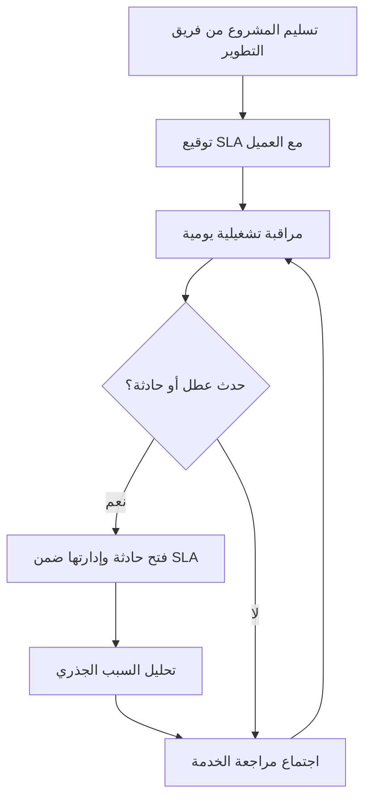

# مدير تسليم الخدمة (Service Delivery Manager)
> [!info] تعريف مختصر
> مدير تسليم الخدمة (Service Delivery Manager، اختصارًا SDM) هو المسؤول عن ضمان تسليم الخدمات التقنية أو الدعم للعميل بالجودة والوقت المتفق عليهما، عادة بعد إطلاق المنتج، من خلال إدارة اتفاقيات مستوى الخدمة (SLA) والعلاقة اليومية مع العميل.

## الشرح العلمي والاحترافي
- بينما يركّز مدير المشروع (Project Manager) على تسليم منتج أو مشروع جديد ضمن نطاق ووقت وميزانية محددة (له بداية ونهاية)، يركّز مدير تسليم الخدمة على الاستمرارية التشغيلية بعد التسليم: الدعم، الصيانة، تحديثات دورية، وحل الأعطال.
- من مسؤولياته الأساسية: مراقبة مؤشرات الأداء التشغيلي مثل مدة التعطل (Uptime)، ومتوسط زمن الإصلاح (MTTR)، والالتزام باتفاقية مستوى الخدمة (SLA)، وإدارة نقطة الاتصال الواحدة (SPOC) مع العميل.
- يعمل غالبًا في إطار عمليات مبني على ITIL 4، حيث يشرف على دورة حياة الحادثة (Incident) من الإبلاغ حتى الإغلاق، ويقود اجتماعات مراجعة الخدمة الدورية (Service Review) مع العميل.
- يحتاج مهارات مزدوجة: فهم تقني كافٍ لفهم طبيعة المشاكل (Bugs، Downtime)، ومهارات تواصل قوية لإدارة توقعات العميل والتفاوض حول الأولويات.
- يُعتبر حلقة الوصل بين فريق الدعم الفني (Support/Ops) والعميل من جهة، وبين فريق التطوير من جهة أخرى عند الحاجة إلى إصلاحات جوهرية (Hotfix) أو تغييرات (Change Request).

## أين ومتى يُستخدم
- يُستخدم هذا الدور في الشركات التي تقدّم خدمات مُدارة (Managed Services) أو دعمًا مستمرًا بعد تسليم المشروع (Post-launch Support)، خصوصًا في نماذج SaaS أو العقود طويلة الأمد.
- يظهر بوضوح في المرحلة التي تلي "الإغلاق أو التسليم" (Closure vs Handover) لمشروع تطوير، حيث ينتقل المشروع من طور البناء إلى طور التشغيل المستمر.
- ضروري في أي تعاقد يتضمن اتفاقية مستوى خدمة (SLA) رسمية مع غرامات أو التزامات تعاقدية على الاستجابة والحل.

## مثال وسيناريو تطبيقي
> [!example] بعد إطلاق منصة "رفوف" للتجارة الإلكترونية، وقّعت الشركة عقد دعم لمدة سنة مع بند SLA ينص على استجابة خلال ساعة لأي عطل حرج (Critical) وحل خلال 4 ساعات. عُيّنت "ريم" كمديرة تسليم خدمة (SDM) لهذا العقد. حين تعطّل نظام الدفع فجأة يوم جمعة الساعة 11 مساءً، تلقّت ريم التنبيه عبر نظام المراقبة، فتحت حادثة (Incident) بأولوية حرجة، أشعرت العميل خلال 15 دقيقة بأنها قيد المعالجة (ضمن التزام الاستجابة)، حشدت فريق الطوارئ التقني، وتابعت حتى إصدار حل سريع (Hotfix) بعد ساعتين ونصف — ضمن نافذة الـ SLA. بعد الحادثة، أعدّت تقرير تحليل السبب الجذري (Root Cause Analysis) وقدّمته للعميل في اجتماع المراجعة الشهري لبناء الثقة وتفادي التكرار.

## خطوات أو مخطّط
1. استلام المشروع رسميًا من فريق التطوير عبر عملية تسليم موثقة (Handover).
2. تعريف وتوقيع اتفاقية مستوى الخدمة (SLA) مع العميل: أوقات الاستجابة والحل حسب الأولوية.
3. مراقبة مستمرة للمؤشرات التشغيلية (Uptime، MTTR، عدد الحوادث).
4. إدارة الحوادث فور وقوعها بالتنسيق مع فرق الدعم والتطوير.
5. عقد اجتماعات مراجعة دورية مع العميل لعرض الأداء ومناقشة التحسينات.

## ⚠️ مفاهيم خاطئة شائعة
> [!warning]
> - الخلط بين مدير تسليم الخدمة ومدير المشروع؛ الأول يدير تشغيلًا مستمرًا بلا نهاية محددة، والثاني يدير عملًا محدود المدة له بداية ونهاية.
> - الاعتقاد أن دور SDM تقني بحتٍ؛ في الواقع جزء كبير من عمله إدارة علاقة وتوقعات العميل والتفاوض.
> - الظن أن الالتزام بـ SLA يعني فقط "الرد السريع"، بينما يشمل أيضًا جودة الحل ومنع تكرار المشكلة.

## ❌ ممارسات خاطئة في المشاريع
> [!failure]
> - عدم وجود عملية تسليم رسمية (Handover) من فريق التطوير إلى SDM، فيبدأ الدعم دون فهم كافٍ للنظام — يؤدي لبطء حل الأعطال. الحل: وثيقة تسليم شاملة ونقل معرفة منظّم.
> - التركيز فقط على الالتزام الحرفي بأرقام SLA دون تحسين جذري للمشاكل المتكررة — يرضي العميل قصيرًا ويستنزف الفريق طويلًا. الحل: ربط كل حادثة متكررة بتحليل سبب جذري وخطة تصحيح دائمة.
> - غياب اجتماعات المراجعة الدورية مع العميل، فيكتشف الطرفان الخلافات متأخرًا. الحل: جدولة اجتماعات مراجعة خدمة منتظمة وشفافة.

## 🔗 مصطلحات ومفاهيم ذات صلة
[[ITIL 4]] | [[MTTR]] | [[Uptime]] | [[RTO and RPO]] | [[SLO]] | [[SLI]] | [[SPOC]] | [[Closure vs Handover]] | [[Root Cause Analysis]] | [[Hotfix]]
