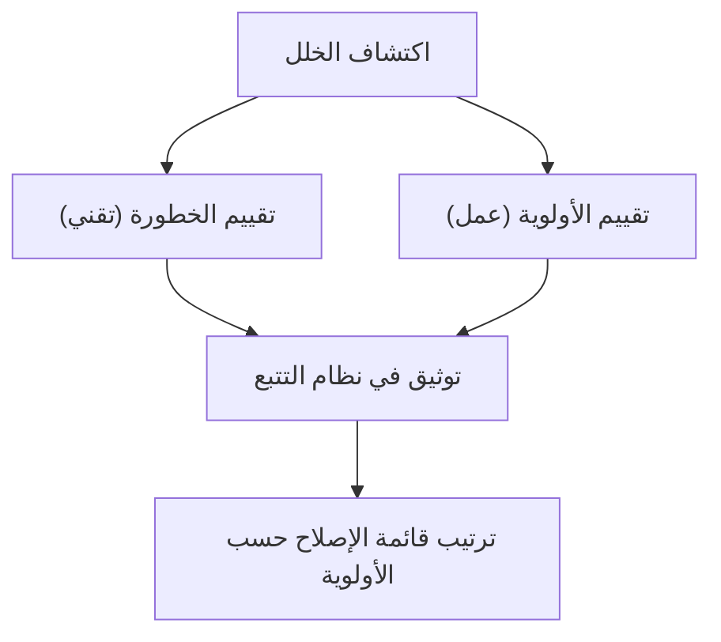

# الخطورة مقابل الأولوية (Severity vs Priority)
> [!info] تعريف مختصر
> **الخطورة (Severity)** تقيس مدى تأثير الخلل التقني على النظام نفسه، بينما **الأولوية (Priority)** تقيس مدى استعجال إصلاحه من منظور العمل. الاثنان مختلفان تمامًا وقد لا يتطابقان.

## الشرح العلمي والاحترافي
عند اكتشاف خلل (Bug/Defect)، يجب الإجابة عن سؤالين منفصلين:
1. **ما مدى خطورته تقنيًا؟ (Severity)** هل يُعطّل النظام كليًا (Critical)، أم يُعطّل ميزة رئيسية (High)، أم خطأ بسيط في العرض (Low)؟ يحدَّده عادة فريق الاختبار أو التطوير بناءً على السلوك الفعلي للنظام.
2. **ما مدى استعجال إصلاحه؟ (Priority)** هل يجب إصلاحه الآن قبل أي شيء آخر (Urgent)، أم يمكن تأجيله لإصدار لاحق (Low)؟ يحدَّده عادة مدير المنتج أو صاحب المنتج بناءً على تأثير العمل والعملاء.

الفرق الجوهري: خلل قد يكون **شديد الخطورة تقنيًا** لكنه **منخفض الأولوية** لأنه يؤثر على ميزة نادرة الاستخدام. وعلى العكس، خلل قد يكون **بسيط الخطورة تقنيًا** (مثل خطأ إملائي في شعار العلامة التجارية) لكنه **أولوية عالية جدًا** لأنه يضر بسمعة الشركة أمام كل الزوار.

فهم هذا الفرق ضروري لتفادي الجدل بين الفرق التقنية وفرق العمل حول "أيّ خلل يُصلَح أولًا"، ولضمان أن قرارات الإصلاح تعكس أولويات العمل الحقيقية وليس فقط شدة الخلل التقنية.

## أين ومتى يُستخدم
- عند تصنيف كل خلل جديد في نظام تتبع الأخطاء (Bug Tracker مثل Jira).
- في اجتماعات فرز الأخطاء (Bug Triage) لتحديد ما يُصلَح في الإصدار الحالي.
- في مرحلة [[UAT]] و[[Regression Testing]] عند تقييم جاهزية الإطلاق.
- عند اتخاذ قرار [[Go or No-Go Decision]] قبل الإطلاق.

## مثال وسيناريو تطبيقي
> [!example]
> في تطبيق توصيل طعام "وجبة سريعة"، ظهر خللان يوم الإثنين:
> 1. **خلل أ**: صفحة "من نحن" (نادرة الزيارة) تعرض نصًا متداخلًا على الجوال. **الخطورة**: منخفضة (لا يعطّل أي وظيفة). **الأولوية**: منخفضة أيضًا (يمكن تأجيله لإصدار الأسبوع القادم).
> 2. **خلل ب**: زر "تأكيد الطلب" يعمل بشكل صحيح، لكن شعار الشركة في أعلى الصفحة يظهر مقلوبًا بسبب خطأ في ملف الصورة. **الخطورة**: منخفضة تقنيًا (لا يعطّل أي وظيفة). لكن **الأولوية**: عالية جدًا، لأن مدير المنتج "خالد" رأى أن هذا يضر بصورة العلامة التجارية أمام آلاف المستخدمين يوميًا، فطلب إصلاحه فورًا خلال ساعتين رغم أن خطورته التقنية منخفضة.
>
> هذا يوضّح كيف يمكن لخلل منخفض الخطورة أن يكون عالي الأولوية، والعكس صحيح.

## خطوات أو مخطّط
1. عند تسجيل الخلل، يحدّد فريق الاختبار درجة الخطورة (Blocker / Critical / Major / Minor / Trivial).
2. يراجع صاحب المنتج أو مدير المشروع الخلل ويحدّد الأولوية (Urgent / High / Medium / Low) بناءً على تأثير العمل.
3. تُرتَّب قائمة الأخطاء حسب الأولوية أولًا لتحديد ما يُصلَح في السباق الحالي (Sprint).
4. تُستخدم الخطورة لتوثيق حجم الخطر التقني حتى لو لم يُصلَح فورًا.

## ⚠️ مفاهيم خاطئة شائعة
> [!warning]
> - **"الخطورة والأولوية نفس الشيء"**: خطأ شائع جدًا، فهما بعدان مستقلان تمامًا كما وضّحنا أعلاه.
> - **"الخلل عالي الخطورة يُصلَح دائمًا أولًا"**: ليس صحيحًا بالضرورة؛ القرار النهائي بالترتيب يعتمد على الأولوية التي يحدّدها صاحب المنتج.
> - **"فريق التطوير هو من يحدّد الأولوية"**: عادة الأولوية قرار عمل (Business Decision) يتخذه صاحب المنتج أو العميل، لا المطوّر.

## ❌ ممارسات خاطئة في المشاريع
> [!failure]
> - خلط الحقلين في نظام واحد (مثلًا استخدام حقل "Priority" فقط دون "Severity")؛ الحل فصل الحقلين بوضوح في أداة تتبع الأخطاء.
> - ترك فريق الاختبار يحدّد الأولوية دون استشارة صاحب المنتج؛ الحل عقد اجتماع فرز أخطاء (Triage) دوري يضم الطرفين.
> - تصنيف كل الأخطاء "عالية الأولوية" خوفًا من التجاهل، مما يُفقد التصنيف معناه؛ الحل الالتزام بتعريف واضح ومعايير محددة لكل مستوى.

## 🔗 مصطلحات ومفاهيم ذات صلة
[[QA vs QC]] | [[Risk-Based Testing]] | [[Regression Testing]] | [[UAT]] | [[Reopen]] | [[Escaped Defect Rate]] | [[Rework Percentage]] | [[Go or No-Go Decision]] | [[20 - Quality Management]]
