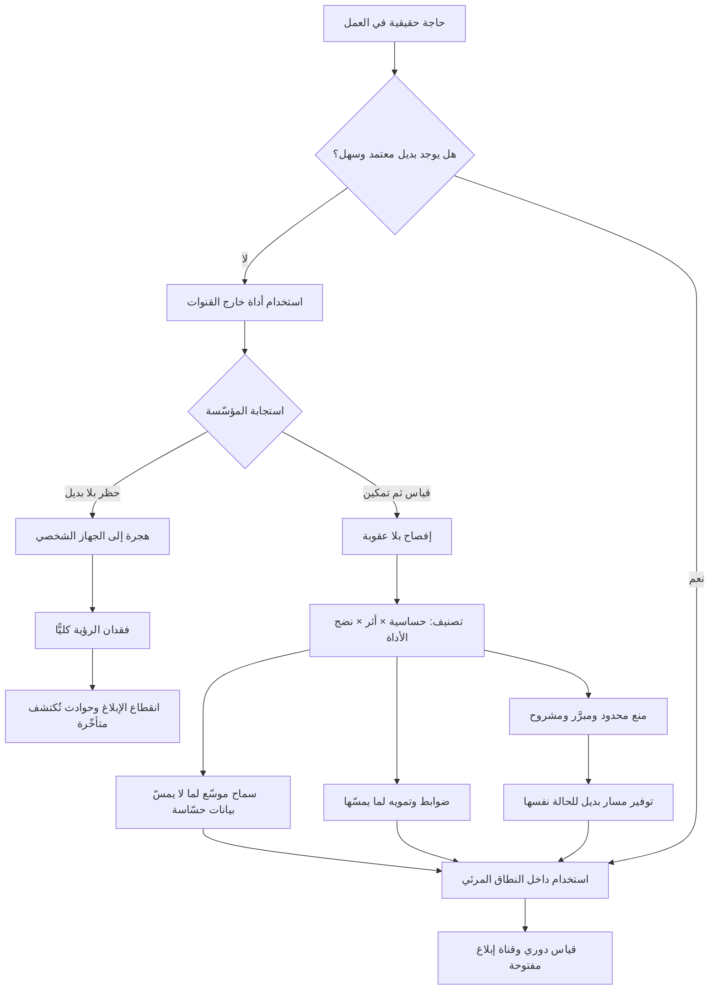

# الذكاء الاصطناعي الظلّي (Shadow AI)

> [!info] تعريف مختصر
> استخدام الموظّفين لأدوات ذكاء اصطناعي خارج القنوات المعتمدة رسميًّا في المؤسّسة: حساب شخصي على منصّة عامّة، أو إضافة متصفّح، أو أداة مجانية لتلخيص الاجتماعات، أو نموذج مدمج في تطبيق لم تراجعه أي جهة. المصطلح امتداد لمفهوم أقدم هو **تقنية المعلومات الظلّية (Shadow IT)**، لكنه أشدّ خطرًا منه في بُعد واحد حاسم: تقنية المعلومات الظلّية تعني عادةً **تخزين** بيانات في مكان غير معتمد، أما الذكاء الاصطناعي الظلّي فيعني **تصدير** بيانات المؤسّسة إلى طرف ثالث ومعالجتها هناك — وقد تدخل في تحسين نماذجه. والمفارقة المركزية: الذكاء الاصطناعي الظلّي **مؤشّر على حاجة حقيقية غير ملبّاة** أكثر منه مؤشّرًا على تهاون؛ ولهذا فإن المنع وحده لا يعالجه بل يدفعه إلى العمق.

## الشرح العلمي والاحترافي
- **السبب الجذري ليس سوء النيّة بل فجوة القدرة**: الموظّف يستخدم أداة غير معتمدة لأنها تحلّ مشكلة يواجهها اليوم، والبديل المعتمد إمّا غير موجود، أو أضعف، أو يستغرق طلبه ستة أسابيع من الموافقات. حين تُعالَج الظاهرة بوصفها مشكلة انضباط تُفوَّت المعلومة الأهم التي تحملها: **خريطة دقيقة لما يحتاجه الناس فعلًا في عملهم**، مجمّعة مجانًا وبلا استبيان.
- **لماذا المنع وحده يزيده — الآلية بالتفصيل**: حين تصدر سياسة حظر بلا بديل، لا تختفي الحاجة بل يتغيّر **مسار تلبيتها** نحو ما هو أبعد عن الرقابة:
  ① **الهجرة إلى الجهاز الشخصي**: يُحجب الموقع على شبكة المؤسّسة، فينسخ الموظّف النصّ إلى هاتفه الشخصي. النتيجة: البيانات خرجت كما كانت، لكن المؤسّسة فقدت آخر ما تبقّى لها من رؤية.
  ② **انقطاع قناة الإبلاغ**: بعد الحظر يصير الاستخدام مخالفة تأديبية، فمن يلاحظ خطأ نتج عن أداة غير معتمدة لن يبلّغ لأنه سيدين نفسه. فتتحوّل الأخطاء الصغيرة القابلة للتصحيح إلى حوادث تُكتشف متأخّرة ومن الخارج.
  ③ **فقدان القدرة على القياس**: المؤسّسة التي تحظر لا تعرف حجم استخدامها الفعلي، فتظنّ أن المخاطرة صفر بينما هي فقط غير مرئية — وهذا أسوأ من مخاطرة معلومة.
  ④ **تصلّب الفجوة التنافسية**: بينما تُدار السياسة، يتراكم لدى المنافس تعلّم مؤسّسي حقيقي عن أين ينفع الذكاء الاصطناعي وأين لا ينفع.
  ⑤ **الحظر غير قابل للإنفاذ أصلًا**: النماذج مدمجة اليوم داخل أدوات معتمدة سلفًا — محرّرات النصوص، ومنصّات الاجتماعات، ومتصفّحات، وأنظمة إدارة العلاقات. فحظر «مواقع الذكاء الاصطناعي» يمنع ما هو ظاهر ويترك ما هو مدمج.
- **الأخطار الحقيقية — ويجب ألّا تُهوَّن**: لصق عقد أو قائمة عملاء أو شيفرة مملوكة في أداة عامة قد يشكّل نقل بيانات إلى معالج غير مصرّح له بموجب [[PDPL]] و[[GDPR]]، ويخالف ضوابط [[Data Residency]] إن عولجت خارج النطاق الجغرافي المسموح، ولا يظهر في [[ROPA]]، ولا تحكمه اتفاقية معالجة ولا [[Standard Contractual Clauses]]. يضاف إلى ذلك خطر تسرّب الملكية الفكرية، وخطر بناء قرارات على مخرجات غير مؤرَّضة ([[Grounding]]) تتضمّن [[Hallucination]] لا يراجعها أحد.
- **الطيف لا الثنائية**: معالجة الظاهرة كخيار بين "مسموح" و"ممنوع" تنتج سياسات لا تُحترَم. التصنيف العملي ثلاثي المحاور: **حساسية البيانات** (عامة / داخلية / شخصية / سرّية)، و**أثر المخرَج** (مسودّة يراجعها إنسان / قرار مباشر / محتوى يواجه العميل)، و**نضج الأداة** (معتمدة بعقد / مسموحة بشروط / محظورة). وتقاطع المحاور يعطي مصفوفة قابلة للتطبيق بدل قاعدة واحدة عمياء.
- **الفارق بين "معتمد" و"صالح للاستخدام"**: كثير من المؤسّسات تعتمد أداة رسميًّا ثم يستمرّ الاستخدام الظلّي لأن الأداة المعتمدة أبطأ أو محجوبة عن بعض الفرق أو تتطلّب تذكرة لكل طلب. الاعتماد الرسمي لا يقتل الظلّ؛ **جودة التجربة** هي التي تقتله. القاعدة العملية: البديل المعتمد يجب أن يكون **أسهل** من غير المعتمد لا مساويًا له.
- **البُعد التعاقدي المحدّد**: الفارق الجوهري بين حساب مؤسّسي وحساب شخصي مجاني ليس النموذج غالبًا، بل **الشروط**: هل تُستخدم المدخلات في التدريب؟ ما مدّة الاحتفاظ؟ أين تُعالَج جغرافيًّا؟ من يملك حقّ التدقيق؟ ما التزامات الإخطار عند الاختراق؟ وهذه أسئلة تُحسم في [[Vendor Management]] قبل أي نقاش تقني.
- **علاقته بحوكمة الوكلاء**: الموجة التالية من الظاهرة ليست محادثات، بل **وكلاء ظلّيون**: موظّف يربط أداة أتمتة بحسابه على نظام المؤسّسة عبر [[MCP]] أو واجهة برمجية، فيصير هناك فاعل برمجي يعمل بصلاحياته دون علم أحد. وهذا أخطر بكثير من نسخ نصّ، لأنه يمنح طرفًا خارجيًّا **قدرة تنفيذ مستمرّة** داخل الأنظمة ([[Least Privilege]]).

## أين ومتى يُستخدم
- **في تقييم مخاطر الخصوصية والامتثال**: يُرصد الاستخدام غير المعتمد بوصفه تدفّق بيانات غير موثّق يخالف [[PDPL]] ويغيب عن [[ROPA]]، ويُدرج في [[Risk Register]] بمالك محدّد.
- **عند صياغة سياسة استخدام الذكاء الاصطناعي ([[Explicit Policies]] و[[SOP]])**: تُبنى السياسة على مصفوفة حساسية وأثر، لا على قائمة مواقع محظورة تتقادم خلال أسابيع.
- **في تخطيط برنامج تبنّي الذكاء الاصطناعي ([[Adoption]] و[[ADKAR Model]])**: خريطة الاستخدام الظلّي هي أدقّ مدخل لتحديد أول حالات الاستخدام التي تستحقّ الاستثمار.
- **في مراجعات المشتريات والموردين ([[Vendor Management]] و[[TCO]])**: تُقارن كلفة ترخيص مؤسّسي بكلفة المخاطرة القائمة فعلًا، لا بكلفة الصفر المفترضة.
- **في التدقيق الأمني وحوكمة الوصول**: يُبحث تحديدًا عن مفاتيح واجهات برمجية أنشأها موظّفون لأدوات خارجية، وعن تكاملات غير مسجّلة.
- **في قياس أثر برامج التمكين**: انخفاض الاستخدام الظلّي مؤشّر نجاح للبديل المعتمد، ويُرصد ضمن [[KPI]] البرنامج.

## مثال وسيناريو تطبيقي
> [!example] شركة استشارات سعودية متوسّطة (240 موظّفًا). أصدرت الإدارة في يناير تعميمًا بحظر «استخدام أدوات الذكاء الاصطناعي التوليدي في أعمال الشركة»، بعد حادثة في السوق تناقلتها الأخبار. طُبِّق الحظر بحجب النطاقات المعروفة على شبكة المكتب، ووُقِّع إقرار من الجميع.
> بعد خمسة أشهر أجرى فريق الالتزام مراجعة استعدادًا لتدقيق عميل حكومي. النتائج المرصودة: ① 61% ممّن شملهم مسح مجهول الهوية أقرّوا باستخدام أداة توليدية في عمل يخصّ الشركة خلال الشهر السابق. ② المسار الأشيع كان **الهاتف الشخصي** — تصوير الشاشة أو نسخ النصّ ثم لصقه. ③ ثلاثة موظّفين أنشأوا مفاتيح واجهة برمجية على أدوات خارجية وربطوها بمجلّدات مشاريع مشتركة لتلخيصها آليًّا، وظلّت تعمل بلا علم أحد. ④ وُجدت حالة واحدة لُصق فيها نصّ عقد عميل مع بيانات تعريفية كاملة في أداة تلخيص مجانية شروطها تسمح باستخدام المدخلات في التحسين.
> والملاحظة الأهم: **صفر بلاغات داخلية** خلال الأشهر الخمسة. حين سُئل الموظّفون في جلسات مغلقة، كان الجواب متكرّرًا: الإبلاغ عن خطأ يعني الاعتراف بمخالفة موقَّعة.
> ما فعلته الشركة بعد ذلك — بترتيب متعمَّد: ① رفعت الحظر مؤقّتًا وأعلنت **فترة إفصاح بلا عقوبة** مدّتها ثلاثة أسابيع، فجُمعت 40 حالة استخدام حقيقية من الموظّفين أنفسهم. ② صنّفت الحالات على مصفوفة حساسية وأثر، فتبيّن أن 27 منها لا تمسّ بيانات شخصية ولا سرّية إطلاقًا (صياغة، تلخيص عام، مسودّات تسويقية) وكان يمكن السماح بها من البداية. ③ تعاقدت على حساب مؤسّسي بشروط تمنع استخدام المدخلات في التدريب وتحدّد مدّة الاحتفاظ، وأتاحته **لكل الموظّفين في الأسبوع نفسه** بلا طلب ولا تذكرة. ④ حصرت المنع في فئة واحدة واضحة: بيانات العملاء الشخصية والعقود غير المنشورة، مع تدريب قصير على ما يُعدّ كذلك و**أداة تمويه** معتمدة لمن يحتاج تحليل بيانات حقيقية ([[Anonymization]]). ⑤ ألغت جميع مفاتيح الواجهات البرمجية الشخصية وأنشأت مسار طلب رسميًّا مدّته يومان.
> النتيجة بعد ربع: انخفضت نسبة من يستخدم أدوات خارج الحساب المؤسّسي إلى 14%، وارتفع عدد البلاغات الطوعية عن أخطاء ومخرجات مشكوك فيها من صفر إلى 23 بلاغًا — وهو ما اعتبره فريق الالتزام **مؤشّر النجاح الأول**، لأن كل بلاغ نقطة كانت خفيّة تمامًا قبل شهر.

## خطوات أو مخطّط
1. ابدأ بالقياس لا بالسياسة: مسح مجهول الهوية، وفحص حركة الشبكة، وجرد التكاملات ومفاتيح الواجهات البرمجية القائمة.
2. أعلن فترة إفصاح بلا عقوبة، واجعل غرضها المعلن جمع حالات الاستخدام لا تحديد المخالفين.
3. صنّف الحالات على مصفوفة: حساسية البيانات × أثر المخرَج × نضج الأداة.
4. افصل ما يمكن السماح به فورًا (وهو الأغلب عادةً) عمّا يستوجب ضوابط، عمّا يجب منعه فعلًا.
5. وفّر بديلًا معتمدًا **أسهل** من غير المعتمد: وصول فوري بلا طلب، وأداء لا يقلّ، وتغطية للجميع لا لفريق تجريبي.
6. اجعل شروط التعاقد صريحة ومنشورة للموظّفين: هل تُستخدم المدخلات في التدريب؟ ما مدّة الاحتفاظ؟ أين تُعالَج؟
7. اكتب سياسة قصيرة قابلة للحفظ تحدّد ما لا يجوز لصقه بأمثلة ملموسة، لا بمصطلحات قانونية عامّة.
8. وفّر أدوات تمكين لا حظر فقط: تمويه بيانات، وقوالب جاهزة، ومساحات عمل معتمدة لكل فريق.
9. أبقِ قناة الإبلاغ مفتوحة وبلا عقاب، واعتبر ارتفاع البلاغات مؤشّر صحّة لا مؤشّر تدهور.
10. أعد القياس دوريًّا، وعامل بقاء الاستخدام الظلّي كإخفاق في البديل المعتمد لا كإخفاق في الانضباط.

## ⚠️ مفاهيم خاطئة شائعة
> [!warning]
> - **«الظاهرة مشكلة انضباط وثقافة امتثال.»** هي في الأساس مشكلة عرض وطلب: طلب حقيقي على قدرة، وعرض داخلي غائب أو بطيء. التصحيح: عامل كل حالة استخدام ظلّي كطلب منتج غير ملبّى، وابدأ من سؤال «ما الذي كان يحاول إنجازه؟».
> - **«حجب المواقع يحلّ المسألة.»** الحجب يعالج الشكل الأظهر ويترك الهاتف الشخصي، والنماذج المدمجة في أدوات معتمدة سلفًا، والتكاملات عبر الواجهات البرمجية. التصحيح: انتقل من ضبط **الأداة** إلى ضبط **البيانات**: ما الذي يجوز أن يخرج، بصرف النظر عن الوجهة.
> - **«الاستخدام الظلّي كله عالي المخاطرة.»** الأغلب الأعمّ منه صياغة وتلخيص ومسودّات لا تمسّ بيانات حسّاسة، ومعاملته بالخطورة نفسها يهدر الرقابة على ما يستحقّها ويفقد السياسة مصداقيتها. التصحيح: درّج المخاطرة، وركّز الضوابط على الفئة الحسّاسة فعلًا.
> - **«توقيع إقرار السياسة يحقّق الامتثال.»** الإقرار ينقل المسؤولية القانونية ولا يغيّر السلوك، وقد يضرّ إذ يحوّل الاستخدام إلى مخالفة موقَّعة فيقطع الإبلاغ. التصحيح: اقرن كل قيد ببديل عملي متاح فورًا، وقِس السلوك لا التوقيعات.
> - **«اعتمدنا أداة رسميًّا فانتهت الظاهرة.»** يستمرّ الظلّ إن كان المعتمد أبطأ أو محدود الوصول أو يتطلّب طلبًا لكل استخدام. التصحيح: قِس معدّل الاستخدام الفعلي للبديل المعتمد، واعتبر ضعفه عيبًا في التجربة لا في المستخدمين.
> - **«المخاطرة تنحصر في تسريب البيانات.»** ثمّة مخاطرة موازية في **جودة القرار**: مخرجات غير مؤرَّضة تدخل في مستندات ومقترحات دون مراجعة أو ذكر لمصدرها. التصحيح: أضف إلى السياسة قاعدة إفصاح عن استخدام الأداة في المخرجات المهنية، وحدًّا أدنى للمراجعة البشرية.

## ❌ ممارسات خاطئة في المشاريع
> [!failure]
> - **إصدار الحظر قبل إجراء أي قياس.** الخطأ: تعميم منع ردّ فعل على خبر أو حادثة في السوق. لماذا يضرّ: يُفقد المؤسّسة خط الأساس الذي يُقاس عليه أي تحسّن لاحق، ويدفع الاستخدام إلى مسارات غير مرئية قبل أن تعرف حجمه. الحل: اجعل القياس المجهول الخطوة الأولى دائمًا، وأجّل السياسة حتى تعرف ما تنظّمه.
> - **معاقبة أول من يبلّغ عن حادثة.** الخطأ: تحقيق تأديبي مع موظّف أفصح طوعًا عن لصق بيانات في أداة خارجية. لماذا يضرّ: يرسل إشارة واحدة واضحة لكل الفريق — لا تبلّغ — فتُدفن الحوادث حتى تنفجر من الخارج. الحل: افصل الإفصاح الطوعي عن المسار التأديبي صراحةً وبإعلان مكتوب، وابنِ [[Psychological Safety]].
> - **كتابة سياسة بلغة قانونية عامّة لا يفهمها المستخدم.** الخطأ: «يُحظر إدخال أي بيانات ذات طبيعة سرّية أو خاضعة للتنظيم». لماذا يضرّ: لا يعرف الموظّف ما ينطبق على حالته، فيجتهد ويخطئ أو يتجاهل السياسة كليًّا. الحل: اكتب أمثلة ملموسة لما يجوز وما لا يجوز من واقع أعمال الفريق نفسه، في صفحة واحدة.
> - **إتاحة البديل المعتمد لفريق تجريبي صغير لأشهر.** الخطأ: برنامج تجريبي بطيء بينما البقية ممنوعون. لماذا يضرّ: يترك أغلب المؤسّسة أمام خيارين: التعطّل أو الظلّ، فيختارون الثاني ويترسّخ. الحل: وسّع الوصول الأساسي سريعًا وقيّد حالات الاستخدام الحسّاسة بدل تقييد الأشخاص.
> - **إغفال التكاملات ومفاتيح الواجهات البرمجية في الجرد.** الخطأ: التركيز على المحادثات وتجاهل الوكلاء والأتمتة التي ربطها موظّفون بأنظمة الشركة. لماذا يضرّ: هذه أخطر بكثير لأنها تمنح طرفًا خارجيًّا قدرة وصول وتنفيذ مستمرّة لا لحظة نسخ ولصق. الحل: أدرج جرد المفاتيح والتكاملات في المراجعة الدورية للصلاحيات ([[Least Privilege]]).
> - **قصر البرنامج على الجانب الأمني وإغفال قيمة التعلّم.** الخطأ: معالجة الملف بوصفه ملف مخاطر فقط. لماذا يضرّ: تُهدر أثمن نتيجة للظاهرة وهي خريطة حالات الاستخدام التي أثبت الموظّفون بأنفسهم قيمتها. الحل: مرّر الحالات المُفصَح عنها إلى مسار [[Product Discovery]] لتحديد أولويات الأتمتة والتمكين.
> - **قياس نجاح السياسة بعدد المخالفات المرصودة.** الخطأ: مؤشّر «انخفاض البلاغات» كدليل نجاح. لماذا يضرّ: انخفاض البلاغات قد يعني انخفاض الثقة لا انخفاض المخاطرة. الحل: قِس معدّل استخدام البديل المعتمد ونسبة التغطية، واعتبر ارتفاع البلاغات في البداية مؤشّرًا إيجابيًّا.

## 🔗 مصطلحات ومفاهيم ذات صلة
[[Least Privilege]] | [[Anonymization]] | [[Re-identification]] | [[Prompt Injection]] | [[Grounding]] | [[PDPL]] | [[GDPR]] | [[Data Residency]] | [[Governance]] | [[Explicit Policies]] | [[Vendor Management]] | [[ROPA]] | [[Adoption]] | [[Psychological Safety]]
