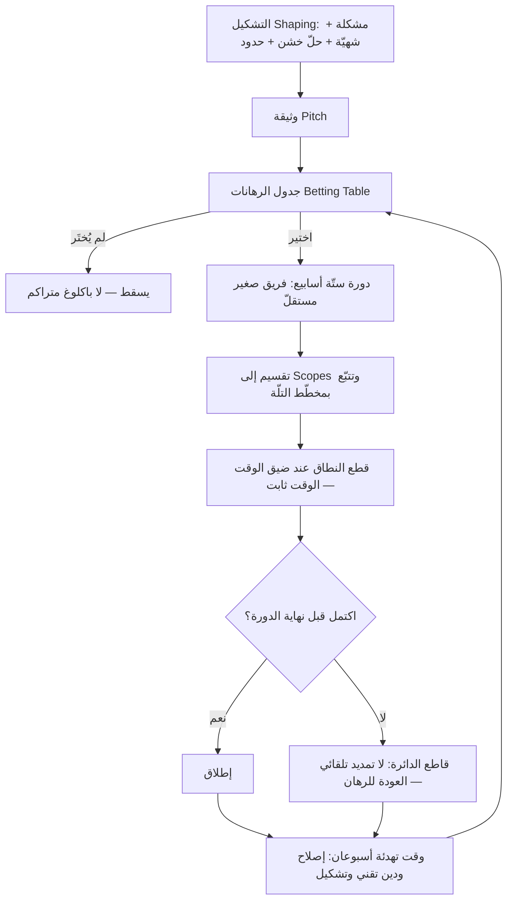

# منهجية Shape Up (Shape Up)

> [!info] تعريف مختصر
> **Shape Up** منهجية لتطوير المنتجات نشرتها شركة **Basecamp** في كتاب مفتوح متاح مجّانًا على الإنترنت بالاسم نفسه، بقلم Ryan Singer، وهي توثيق للطريقة التي تعمل بها الشركة داخليًّا. تقوم المنهجية على **دورات ثابتة من ستّة أسابيع** يتبعها **وقت تهدئة (Cool-down)**، وعلى استبدال التقدير الزمني بـ**الشهيّة (Appetite)**، والباكلوغ المتراكم بـ**جدول رهانات (Betting Table)**، مع **تشكيل (Shaping)** مسبق للعمل على مستوى تجريد متوسّط، و**قاطع دائرة (Circuit Breaker)** يمنع تمديد الأعمال المتعثّرة تلقائيًّا. تُقدَّم Shape Up صراحةً بوصفها **بديلًا مطروحًا لسكرم**، لا امتدادًا له ولا طبقة فوقه.

## الشرح العلمي والاحترافي
المنهجية مبنية على تشخيص محدّد: أكثر ما يُهدر في تطوير المنتجات لا يأتي من بطء التنفيذ، بل من مشاريع مفتوحة النهاية تتمدّد بلا حدّ، ومن قوائم انتظار تتضخّم بما لن يُنجَز أبدًا، ومن أعمال تُسلَّم للفريق إمّا فضفاضة جدًّا (فكرة في جملة) أو محدّدة جدًّا (تصميم مكتمل بالبكسل). عناصر المنهجية كما هي منشورة:

### 1) الدورات الثابتة ووقت التهدئة
- الوحدة الزمنية الأساسية **دورة من ستّة أسابيع**. اختيرت هذه المدّة لأنها طويلة بما يكفي لإنجاز شيء ذي معنى من طرفه إلى طرفه، وقصيرة بما يكفي ليبقى موعد النهاية مرئيًّا منذ اليوم الأوّل فيضغط على القرارات.
- تعقب كلّ دورة فترة **تهدئة (Cool-down)** من أسبوعين، لا تُخطَّط مسبقًا: يستخدمها الفريق لإصلاح ما ظهر، وسداد ديون تقنية، واستكشاف أفكار، والتقاط الأنفاس. هذه الفترة ليست فائضًا يُملأ عند الضغط، بل جزء بنيوي من الإيقاع؛ وإلغاؤها يُسقط أهمّ ما يميّز المنهجية عمليًّا. راجع [[Sustainable Pace]].
- خلال الدورة **لا تُقطع أعمال الفريق ولا يُعاد ترتيب أولوياته**؛ الالتزام محميّ لكامل الستّة أسابيع.

### 2) الشهيّة (Appetite) بدل التقدير
- السؤال التقليدي "كم سيستغرق هذا؟" يُستبدَل بسؤال **"كم من الوقت يستحقّ هذا؟"**. الجواب — أسبوعان (Small Batch) أو ستّة أسابيع (Big Batch) — يُتَّخذ قرارًا تجاريًّا مسبقًا لا تنبّؤًا هندسيًّا.
- الأثر البنيوي: **الوقت ثابت والنطاق متغيّر**. هذا انعكاس مباشر للمثلّث الحديدي: بدل تثبيت النطاق والتفاوض على الوقت، تُثبَّت المدّة ويُقتطع من النطاق ما يلزم. راجع [[Timeboxing]] و[[Iron Triangle]] و[[Original Estimate]].
- يترتّب على ذلك أن **قطع النطاق (Scope Hammering)** ممارسة يومية مشروعة لا استثناء طارئًا، والفريق نفسه هو من يمارسها لأنه الوحيد الذي يرى تكلفة كل جزء.

### 3) التشكيل (Shaping)
- **التشكيل** عمل يسبق الدورة، يقوم به عدد قليل من الأشخاص ذوي الخبرة بالمنتج والتقنية، وينتج وثيقة تُسمّى **Pitch**.
- جوهره العمل عند **مستوى تجريد متوسّط**: أعلى من التصميم المكتمل، وأدنى من الفكرة الفضفاضة. الفكرة الفضفاضة ("لنحسّن التقارير") تترك الفريق بلا اتجاه وتضمن التمدّد؛ والتصميم المكتمل يسلب الفريق قرارات التنفيذ ويقتل قدرته على قطع النطاق حين يضيق الوقت.
- عناصر الـ Pitch كما تُوصف في الكتاب: **المشكلة**، **الشهيّة**، **الحلّ المُشكَّل** (مرسوم بمخطّطات خشنة مثل Breadboards وFat Marker Sketches)، **مخاطر ومنحدرات (Rabbit Holes)** يجب تفاديها، و**حدود صريحة (No-gos)** لما لن يُنجَز.
- الغرض من الرسوم الخشنة مقصود: أن تكون **غير مكتملة عمدًا** حتى تبقى مساحة قرار حقيقية للفريق المنفِّذ.

### 4) الرهان (Betting) بدل الباكلوغ
- **لا باكلوغ متراكم**. المنهجية ترفض قائمة الانتظار الأبدية بوصفها مصدر عبء إداري وذنب دائم، وتراهن على أن ما هو مهمّ حقًّا سيعود للظهور من تلقاء نفسه.
- قبل كل دورة يجتمع من يملكون القرار في **جدول رهانات**، يستعرضون وثائق الـ Pitch المتاحة ويختارون ما ستُموَّل به الدورة القادمة. ما لا يُختار **يسقط** ولا يُحفَظ في قائمة انتظار.
- كلمة "رهان" مقصودة: القرار استثمار محدود المخاطرة (ستّة أسابيع كحدّ أقصى للخسارة) لا وعد بالتسليم.
- المقارنة مع [[13 - Backlog|الباكلوغ]] التقليدي جوهرية: هنا لا يوجد ترتيب أولويات دائم يُعاد تنقيحه أسبوعيًّا، بل قرار تمويل دوري يُتَّخذ من صفر كل ستّة أسابيع.

### 5) قاطع الدائرة (Circuit Breaker)
- إن لم يكتمل العمل خلال الدورة، **لا يُمدَّد تلقائيًّا**. ينتهي وقته، ويعود إن أُريد استئنافه إلى جدول الرهانات ليتنافس من جديد مع كل ما هو مطروح.
- الوظيفة الاقتصادية للقاعدة: منع "مغالطة التكلفة الغارقة" (Sunk Cost) من تحويل المشروع المتعثّر إلى التزام مفتوح. والقاعدة تضغط أيضًا على جودة التشكيل، لأن سوء التشكيل يظهر سريعًا وبتكلفة معلومة سلفًا.
- التمديد الاستثنائي ممكن، لكنه **قرار واعٍ يُتَّخذ في جدول الرهانات**، لا انزلاق افتراضي.

### 6) الفرق الصغيرة المستقلّة
- تشكيلة الفريق المعتادة: مطوّر واحد أو اثنان مع مصمّم واحد، تعمل على مشروع واحد كامل خلال الدورة.
- الفريق يتسلّم **المشروع كاملًا** لا مهامًّا مقسّمة سلفًا؛ وهو من يقسّم العمل بنفسه إلى ما يسمّيه الكتاب **Scopes** — أجزاء رأسية قابلة للإنجاز والاختبار — ويتتبّع التقدّم بـ**تلّة (Hill Chart)** تُظهر مرحلة "الاستكشاف/عدم اليقين" في الصعود ومرحلة "التنفيذ المعلوم" في الهبوط، بدل نسبة إنجاز مئوية مضلّلة.
- لا اجتماعات يومية إلزامية ولا تقديرات نقاط ولا لوحات مهام مفروضة؛ المسؤولية عن النطاق والتقدّم تقع على الفريق. راجع [[Self-Organizing Team]] و[[Empowerment]].

## أين ومتى يُستخدم
- **متى تصلح**: أنسب ما تكون لـ**منتجات ناضجة** ذات ملكية داخلية ومسار إصدار يتحكّم فيه الفريق، ولـ**فرق مُمكَّنة** تملك صلاحية اختيار الحلّ وقطع النطاق، وفي مؤسّسات يمكنها حماية الفريق من المقاطعة ستّة أسابيع متّصلة، ولديها نضج كافٍ ([[Product Maturity]]) لتقبل أن يسقط عمل لم يكتمل بدل تمديده.
- **متى لا تصلح أو تصعب**: في بيئات **الالتزامات التعاقدية** ذات النطاق والتاريخ المتّفق عليهما مسبقًا مع عميل خارجي، حيث لا يمكن قطع النطاق من طرف واحد؛ وفي أنظمة كثيرة **الاعتماديات الخارجية** التي تعطّل الفريق بما لا يملك التحكّم فيه؛ وفي عمل تشغيلي متقلّب يغلب عليه الدعم والحوادث ولا يحتمل تجميد الأولويات ستّة أسابيع (كانبان أنسب هنا)؛ وفي المنتجات المنظَّمة الخاضعة لموافقات امتثال طويلة؛ وفي مؤسّسات المستوى الأدنى من النضج حيث سيتحوّل جدول الرهانات إلى مجرّد اسم جديد لتوزيع أوامر من الأعلى.
- **الاستخدام الجزئي**: كثير من الفرق تتبنّى عناصر منفردة دون المنهجية كاملة — أشيعها **الشهيّة** بدل التقدير، و**التشكيل** كمرحلة إعداد قبل التنفيذ، و**وقت التهدئة** كإيقاع ثابت. هذا التبنّي الجزئي مشروع عمليًّا، لكن يجب الانتباه إلى أن قوّة المنهجية تأتي من ترابط عناصرها: الشهيّة بلا صلاحية قطع نطاق تتحوّل إلى موعد نهائي قاسٍ، وقاطع الدائرة بلا وقت تهدئة يتحوّل إلى ضغط دائم.
- **علاقتها بسكرم**: المنهجية تُطرح **بديلًا** لا امتدادًا. الفروق الجوهرية: دورة ستّة أسابيع بدل سباقات قصيرة متتابعة؛ لا باكلوغ دائم؛ لا تقديرات نسبية ولا [[Velocity|سرعة]]؛ لا أدوار سكرم الثلاثة؛ ولا مراجعة/استرجاع إلزاميين بعد كل سباق. من ثمّ فمحاولة "دمجها مع سكرم" غالبًا تُفرغ الاثنين من معناهما. راجع [[02 - Scrum]].

## مثال وسيناريو تطبيقي
> [!example] فريق منتج داخلي من مصمّمة ومطوّرَين يعمل على أداة تقارير في منصّة اشتراكات. الطلب الوارد: "نظام تنبيهات متكامل" — عبارة فضفاضة تخفي وراءها احتمال ستّة أشهر من العمل.
> **التشكيل**: بدل تحويل الطلب مباشرة إلى بنود باكلوغ، جلست مديرة المنتج مع مهندس أوّل أسبوعًا وأنتجا وثيقة Pitch من صفحتين: المشكلة (العملاء يكتشفون تجاوز الحصّة متأخّرين فيتضرّرون)، الشهيّة (ستّة أسابيع، لا أكثر)، الحلّ المُشكَّل (نوع تنبيه واحد فقط عند بلوغ عتبة استهلاك، عبر البريد، بإعداد على مستوى الحساب)، المنحدرات المحتملة (بناء محرّك قواعد عام، ونظام قنوات متعدّدة)، والحدود الصريحة (لا رسائل نصّية، لا تنبيهات لكل مستخدم، لا محرّر شروط مخصّص).
> **الرهان**: عُرضت الوثيقة في جدول الرهانات مع ثلاث وثائق أخرى، واختير اثنتان فقط للدورة. الوثيقتان الأخريان لم تُنقلا إلى قائمة انتظار — أُسقطتا، على أن يعيد أصحابهما طرحهما إن بقيتا مهمّتين.
> **التنفيذ**: الفريق قسّم العمل بنفسه إلى ثلاثة Scopes: حساب الاستهلاك، وإرسال البريد، وشاشة الإعداد. في الأسبوع الرابع اتّضح أن حساب الاستهلاك اللحظي مكلف على قاعدة البيانات؛ فبدل طلب تمديد، قطع الفريق النطاق: تقييم دوري كل ساعة بدل لحظي — قرار لم يكن ممكنًا لو سُلّم للفريق تصميم مكتمل يفرض السلوك اللحظي.
> **النهاية**: أُطلقت الميزة في الأسبوع السادس بنطاق أصغر ممّا تخيّله الطالب الأصلي، لكنها حلّت المشكلة المذكورة في الوثيقة. تلا ذلك أسبوعا تهدئة عالج فيهما الفريق ملاحظات ما بعد الإطلاق وسدّد دينًا تقنيًّا مؤجَّلًا. وحين عاد طلب "قنوات متعدّدة" لاحقًا، دخل جدول الرهانات كوثيقة جديدة تُقارَن بغيرها بدل أن يكون امتدادًا تلقائيًّا لعمل سابق.

## خطوات أو مخطّط
1. **التشكيل قبل الدورة**: يحدّد فريق صغير المشكلة، ويقرّر الشهيّة، ويرسم حلًّا خشنًا عند مستوى تجريد متوسّط، ويسمّي المنحدرات والحدود، في وثيقة Pitch.
2. **جدول الرهانات**: يجتمع أصحاب القرار قبل كل دورة، يستعرضون الوثائق المتاحة، ويراهنون على ما يُموَّل. ما لا يُختار يسقط.
3. **التسليم للفريق**: يتسلّم الفريق المشروع كاملًا بلا مهامّ مقسّمة سلفًا، ومعه صلاحية اختيار طريقة التنفيذ.
4. **التقسيم إلى Scopes**: يقسّم الفريق العمل بنفسه إلى أجزاء رأسية قابلة للإنجاز، ويتتبّع التقدّم بمخطّط التلّة.
5. **قطع النطاق أثناء الدورة**: كلّما ضاق الوقت، يُقتطع من النطاق لا من الجودة ولا من الموعد — فالوقت ثابت.
6. **نهاية الدورة**: إمّا إطلاق، أو تفعيل قاطع الدائرة: ينتهي الوقت ولا يُمدَّد تلقائيًّا، ويعود العمل — إن أُريد — إلى جدول الرهانات.
7. **وقت التهدئة**: أسبوعان غير مخطَّطين للإصلاحات والدين التقني والاستكشاف وتشكيل وثائق الدورة القادمة.
8. **إعادة الدورة**: يبدأ رهان جديد من صفر، بلا قائمة انتظار موروثة.

## ⚠️ مفاهيم خاطئة شائعة
> [!warning]
> - **اعتبار Shape Up "سكرم بسباقات أطول"**: الفارق ليس في طول الدورة بل في بنية القرار: لا باكلوغ دائم، ولا تقديرات، ولا تعهّد بنطاق ثابت، ولا أدوار سكرم. المقارنة الصحيحة هي أنها بديل مطروح لسكرم لا نسخة منه.
> - **فهم "الشهيّة" على أنها تقدير مموّه**: التقدير محاولة تنبّؤ بالمجهول؛ أمّا الشهيّة فقرار تجاري بحدّ الاستثمار المقبول. الأولى تُشتقّ من العمل، والثانية تُفرض عليه فيتشكّل العمل تبعًا لها.
> - **الظنّ أن "لا باكلوغ" يعني تجاهل ملاحظات العملاء**: الملاحظات تُجمَع وتُقرأ، لكنها لا تُحوَّل إلى قائمة التزامات مرتّبة. الرهان أن ما يهمّ حقًّا سيتكرّر ظهوره، وأن قائمة انتظار من مئات البنود لا تُدار أصلًا بل تُهمَل ببطء.
> - **الاعتقاد بأن ستّة أسابيع رقم مقدّس**: الكتاب يشرح لماذا اختيرت هذه المدّة لدى Basecamp، ويُترك للفريق ملاءمتها لسياقه؛ لكنّ العنصر الجوهري هو **ثبات المدّة** ووجود التهدئة بعدها، لا الرقم ذاته.
> - **إسقاط وقت التهدئة عند الضغط**: أكثر تشويه شائع عند التبنّي. حذف التهدئة يحوّل المنهجية إلى سلسلة مواعيد نهائية متلاحقة، ويُلغي المساحة التي يُسدَّد فيها [[Technical Debt|الدين التقني]] وتُشكَّل فيها الدورة القادمة.
> - **الظنّ أن قاطع الدائرة عقوبة للفريق**: هو أداة لحماية المؤسّسة من الالتزامات المفتوحة، ومسؤوليته تقع غالبًا على **جودة التشكيل** لا على أداء المنفّذين.
> - **افتراض أن تسليم الفريق مشروعًا كاملًا يعني غياب الرقابة**: الرقابة موجودة لكنها تقع عند **بوّابة الرهان** لا أثناء التنفيذ اليومي؛ والمقايضة صريحة: تحكّم أكبر في ما يُموَّل مقابل تحكّم أقلّ في كيفية إنجازه.

## ❌ ممارسات خاطئة في المشاريع
> [!failure]
> - **تثبيت الوقت والنطاق معًا**: تبنّي الدورة الثابتة مع الإصرار على تسليم كامل ما ورد في الوثيقة يُلغي المبدأ الأساسي ويحوّل المنهجية إلى شلّال مضغوط ينتهي بجودة متدهورة وفريق منهك. الحل: اجعل قطع النطاق صلاحية معلنة للفريق، ووثّق الحدود (No-gos) في الوثيقة نفسها كي يكون القطع مشروعًا مسبقًا.
> - **تشكيل مفرط في التفصيل (تصميم مكتمل)**: تسليم الفريق تصميمًا بالبكسل يسلبه القرارات التي يحتاجها لمقايضة النطاق بالوقت، ويعيده إلى دور المنفّذ. الحل: التزم بالمستوى المتوسّط من التجريد — مخطّطات خشنة تحدّد العناصر والعلاقات لا الشكل النهائي.
> - **تشكيل ناقص (فكرة في جملة واحدة)**: الطرف المقابل من الخطأ نفسه؛ الفريق يقضي نصف الدورة في تعريف المشكلة، فيتعثّر ثم يُلام على عدم الإنجاز. الحل: لا يُطرح أي عمل في جدول الرهانات قبل أن يتضمّن مشكلة محدّدة وشهيّة وحدودًا صريحة.
> - **تمديد الدورة تلقائيًّا عند عدم الاكتمال**: تعطيل قاطع الدائرة يعيد المؤسّسة إلى المشاريع المفتوحة النهاية، ويُبقي التكلفة الغارقة تقود القرار. الحل: اجعل التمديد قرارًا صريحًا في جدول الرهانات، مسجَّلًا بمبرّره، لا سلوكًا افتراضيًّا.
> - **مقاطعة الفريق أثناء الدورة بطلبات عاجلة**: كل مقاطعة تستهلك من ميزانية ثابتة لا يمكن تعويضها، وتُفقد الشهيّة معناها. الحل: قناة منفصلة للعمل التشغيلي العاجل (فريق مناوبة أو مسار كانبان مستقلّ)، وحماية صريحة لدورة الفريق.
> - **الاحتفاظ بباكلوغ تقليدي بجانب جدول الرهانات**: يُنتج نظامَي أولويات متنافسين، ويعود الشعور بالذنب تجاه قائمة لا تنتهي. الحل: احسم أيّ الآليّتين تحكم قرار التمويل، ولا تُشغّل الاثنتين معًا.
> - **تبنّي المنهجية في بيئة عقود ذات نطاق ثابت دون تكييف**: تعارض مباشر بين "النطاق متغيّر" والالتزام التعاقدي، ينتهي بخلاف مع العميل. الحل: قصر الاستخدام على أجزاء المنتج المملوكة داخليًّا، أو تفاوض على عقود بشهيّة زمنية ونطاق مرن ([[Scope Freeze]] عند الحاجة فقط).
> - **قياس أداء الفرق بعدد الدورات المكتملة**: تحويل الإيقاع إلى مقياس إنتاجية يعيد إنتاج [[Feature Factory|مصنع الميزات]] بأدوات جديدة. الحل: قيّم بالأثر المُتحقّق ([[Outcome vs Output]]) وبجودة قرارات الرهان، لا بعدد الدورات المُنجزة.

## 🔗 مصطلحات ومفاهيم ذات صلة
[[02 - Scrum]] | [[Timeboxing]] | [[13 - Backlog]] | [[MVP]] | [[Scope Freeze]] | [[Sustainable Pace]] | [[Self-Organizing Team]] | [[Original Estimate]]
