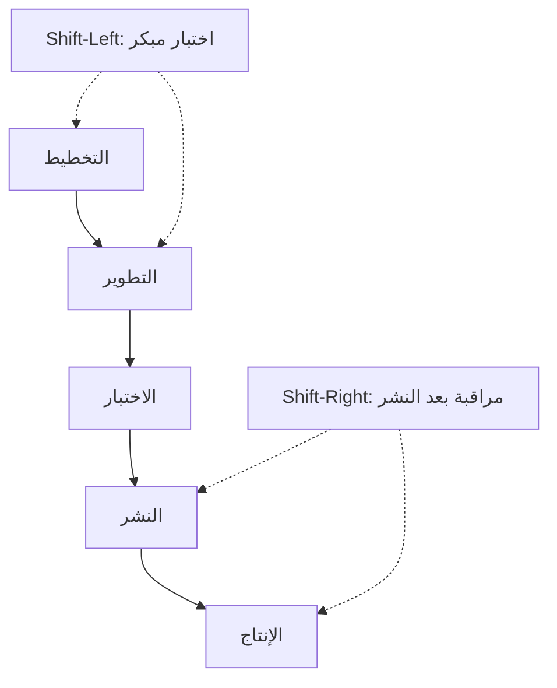

# التحوّل يسارًا ويمينًا (Shift-Left and Shift-Right)
> [!info] تعريف مختصر
> **التحوّل يسارًا (Shift-Left)** يعني نقل أنشطة الاختبار والجودة إلى مراحل مبكرة من دورة التطوير، أما **التحوّل يمينًا (Shift-Right)** فيعني مراقبة الجودة واختبارها بعد الإطلاق في بيئة الإنتاج الفعلية.

## الشرح العلمي والاحترافي
يُنظر عادة إلى دورة تطوير البرمجيات كخط زمني: تخطيط ← تصميم ← تطوير ← اختبار ← نشر ← تشغيل. "اليسار" يمثّل البداية (التخطيط والتطوير)، و"اليمين" يمثّل النهاية (النشر والتشغيل في الإنتاج).

**Shift-Left**: بدلًا من انتظار انتهاء التطوير الكامل ثم البدء بالاختبار، يبدأ الاختبار مبكرًا جدًا:
- كتابة الاختبارات الآلية (Unit Tests) أثناء كتابة الكود نفسه، وليس بعده.
- مراجعة المتطلبات وحالات الاستخدام بحثًا عن الغموض قبل بدء البرمجة (ربط بـ [[Definition of Ready]]).
- دمج فحوصات الجودة والأمان في خط [[CI and CD]] بحيث تعمل مع كل Commit.
الفائدة: اكتشاف الأخطاء وهي رخيصة الإصلاح، لأن تكلفة إصلاح خلل تتضاعف كلما تأخر اكتشافه (مفهوم [[Cost-of-Change Curve]]).

**Shift-Right**: الاعتراف بأن بعض المشاكل (الأداء تحت حمل حقيقي، سلوك المستخدمين الفعلي، حالات نادرة) لا تظهر إلا في الإنتاج، لذلك:
- مراقبة حية للنظام بعد النشر (Monitoring, Observability) عبر مؤشرات مثل [[SLI]] و[[SLO]].
- اختبار A/B وإطلاق تدريجي (Canary Release, [[Pilot Launch]]) لمجموعة صغيرة من المستخدمين أولًا.
- جمع بيانات حقيقية من الإنتاج لتحسين الاختبارات المستقبلية.

الفكرة الحديثة (خصوصًا في ثقافة [[SRE]] و[[ITIL 4]]) أن الجودة الحقيقية تحتاج الاثنين معًا: الوقاية المبكرة (يسارًا) + المراقبة المستمرة بعد الإطلاق (يمينًا)، وليس أحدهما فقط.

## أين ومتى يُستخدم
- **Shift-Left**: في فرق DevOps وAgile التي تعتمد التكامل والنشر المستمر، ومنذ أول Sprint في المشروع.
- **Shift-Right**: في الأنظمة عالية الحمل (تطبيقات ذات ملايين المستخدمين) حيث المراقبة بعد الإطلاق جزء أساسي من ضمان الجودة، وفي ممارسات [[SRE]].
- كلاهما معًا في فرق النضج العالي (DevOps الناضج) كاستراتيجية جودة شاملة تغطي كامل دورة الحياة.

## مثال وسيناريو تطبيقي
> [!example]
> شركة "سوق بلس" للتجارة الإلكترونية طبّقت الاستراتيجيتين معًا عند بناء ميزة "الدفع عند الاستلام":
> - **يسارًا**: قبل كتابة أي كود، جلس المطوّر "عمر" مع محلل الأعمال لمراجعة كل حالة استخدام (عنوان غير صحيح، مبلغ غير مطابق)، وكتب اختبارات وحدة (Unit Tests) لكل حالة قبل تطوير الميزة فعليًا. اكتُشف نقص في المتطلبات (ماذا لو رفض العميل الاستلام؟) في اجتماع المراجعة، أي قبل أن يُكتب سطر كود واحد.
> - **يمينًا**: بعد الإطلاق، أطلق الفريق الميزة تدريجيًا (Canary) لـ 5% من المستخدمين في مدينة جدة فقط، وراقب لوحة المراقبة الحية طوال 48 ساعة. اكتشفوا أن 2% من الطلبات تفشل عند اختيار "الدفع عند الاستلام" مع عنوان يحتوي رمزًا بريديًا فارغًا، وهي حالة لم تظهر في أي اختبار مسبق. أصلحوا المشكلة قبل توسيع الإطلاق لبقية المستخدمين.

## خطوات أو مخطّط
**Shift-Left:**
1. مراجعة المتطلبات وكتابة معايير القبول مبكرًا (ربط بـ [[Given When Then]]).
2. كتابة الاختبارات الآلية مع الكود مباشرة.
3. تشغيل فحوصات الجودة والأمان في كل Commit عبر [[CI and CD]].

**Shift-Right:**
1. إطلاق تدريجي لعينة محدودة من المستخدمين.
2. مراقبة مؤشرات حية ([[SLI]]/[[SLO]]) وتنبيهات تلقائية.
3. جمع الملاحظات وتحليل السلوك الفعلي وتغذيتها راجعة إلى فريق التطوير.

## ⚠️ مفاهيم خاطئة شائعة
> [!warning]
> - **"Shift-Left يعني إلغاء الاختبار بعد التطوير"**: خطأ، هو إضافة اختبار مبكر، وليس بديلًا عن اختبار الفريق لاحقًا.
> - **"Shift-Right يعني الإطلاق دون اختبار مسبق والاعتماد على المستخدمين لاكتشاف الأخطاء"**: خطأ فادح؛ الهدف هو مراقبة إضافية، لا استبدال الاختبار الأساسي بالكامل.
> - **"يجب اختيار أحدهما فقط"**: في الواقع أفضل الفرق تطبّق الاثنين معًا كاستراتيجية متكاملة.

## ❌ ممارسات خاطئة في المشاريع
> [!failure]
> - تطبيق Shift-Left شكليًا (كتابة اختبارات ضعيفة فقط لرفع نسبة التغطية) دون فهم الغرض الحقيقي؛ الحل التركيز على جودة الاختبارات لا كميتها فقط.
> - إطلاق ميزات حساسة (مثل المدفوعات) مباشرة لكل المستخدمين دون إطلاق تدريجي (Shift-Right)؛ الحل استخدام [[Pilot Launch]] دائمًا للميزات عالية الخطورة.
> - عدم ربط بيانات المراقبة من الإنتاج (يمينًا) بخطة الاختبار المستقبلية (يسارًا)، فتتكرر نفس الأخطاء؛ الحل إغلاق الحلقة عبر [[Feedback Loop]] بين فريق العمليات وفريق التطوير.

## 🔗 مصطلحات ومفاهيم ذات صلة
[[CI and CD]] | [[SRE]] | [[SLI]] | [[SLO]] | [[Pilot Launch]] | [[Cost-of-Change Curve]] | [[Regression Testing]] | [[Risk-Based Testing]] | [[Feedback Loop]] | [[ITIL 4]]
