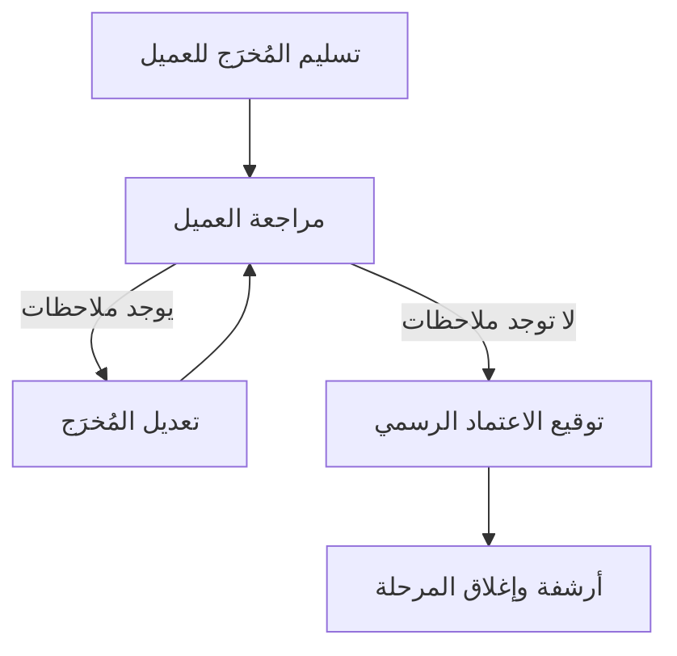

# الاعتماد الرسمي (Sign-off)
> [!info] تعريف مختصر
> الاعتماد الرسمي (Sign-off) هو موافقة مكتوبة وموثّقة من صاحب القرار أو العميل على أن مُخرَجاً معيّناً (وثيقة، مرحلة، تسليم نهائي) مقبول ومطابق للمتفق عليه. بعد الحصول عليه يصبح من الصعب الرجوع فيه دون طلب تغيير رسمي.

## الشرح العلمي والاحترافي
- الاعتماد الرسمي هو نقطة تحوّل قانونية وإدارية: قبل الحصول عليه يظل العمل قابلاً للنقاش، وبعده يُعتبر "نهائياً" ومرجعاً يُحتكم إليه عند أي خلاف.
- يختلف عن الموافقة الشفهية أو الإيماءة في الاجتماع؛ الاعتماد الرسمي يتطلّب دليلاً ملموساً: توقيع على مستند، رد بريد إلكتروني صريح، أو نقرة "موافقة" في نظام إدارة المشاريع.
- يُستخدم عادة على وثيقة [[SOW]] (نطاق العمل)، على [[BRD]]، على [[Definition of Done]] لمرحلة كاملة، أو على نتائج [[UAT]] قبل الإطلاق.
- من الناحية القانونية، الاعتماد الرسمي يحمي الطرفين: يحمي المزوّد من اتهامات لاحقة بعدم التسليم، ويحمي العميل بإثبات أنه راجع العمل فعلاً قبل الموافقة عليه.
- يرتبط عادة بمرحلة الدفع؛ كثير من العقود تربط [[Milestone-based Payment]] بوجود اعتماد رسمي موقّع لكل مرحلة.

## أين ومتى يُستخدم
- في منهجية Waterfall ([[04 - Waterfall]]): في نهاية كل مرحلة (تحليل، تصميم، تنفيذ، اختبار) قبل الانتقال للمرحلة التالية.
- في المشاريع الرشيقة (Agile): أقل شيوعاً كخطوة رسمية صارمة، لكنه يظهر عند [[09 - Sprint Review]] الكبرى أو عند تسليم [[Increment]] نهائي للعميل.
- عند [[Closure vs Handover]]: الاعتماد الرسمي شرط أساسي لإغلاق المشروع رسمياً وتسليمه للتشغيل.
- عند الموافقة على [[Change Request]] كبير يغيّر الميزانية أو الجدول الزمني.

## مثال وسيناريو تطبيقي
> [!example] شركة "نتاج ديجيتال" طوّرت تطبيق حجوزات لعميلها "مطاعم الواحة". بعد انتهاء اختبار القبول ([[UAT]])، أرسل مدير المشروع محمد رسالة بريد إلكتروني للعميل تتضمن: قائمة الميزات المكتملة، نتائج الاختبار، ورابط "نموذج اعتماد التسليم النهائي". وقّع مدير تقنية المعلومات لدى العميل، سارة، النموذج إلكترونياً بتاريخ 15 يوليو. من تلك اللحظة، أي طلب تعديل على التطبيق يُعامَل كـ [[Change Request]] جديد بميزانية إضافية، وليس جزءاً من العقد الأصلي.

## خطوات أو مخطّط
1. تجهيز المُخرَج النهائي (وثيقة أو منتج) للمراجعة.
2. إرسال المُخرَج مع معايير قبول واضحة (مرتبطة بـ [[Definition of Done]] أو [[Acceptance Criteria]]).
3. منح العميل مهلة محددة للمراجعة والملاحظات.
4. تعديل المُخرَج بناءً على الملاحظات إن وُجدت.
5. طلب توقيع أو موافقة موثّقة رسمياً.
6. أرشفة الاعتماد كجزء من سجلات المشروع.

## ⚠️ مفاهيم خاطئة شائعة
> [!warning]
> - الاعتقاد بأن "الموافقة الشفهية" في اجتماع تكفي كاعتماد رسمي؛ في الواقع تحتاج توثيقاً كتابياً.
> - الظن بأن الاعتماد الرسمي يعني أن المنتج "خالٍ من الأخطاء تماماً"؛ هو فقط يعني أنه استوفى المعايير المتفق عليها وقت التسليم.
> - الخلط بين الاعتماد الرسمي وبين [[Sign-off|"القبول النهائي للمشروع"]] الكامل؛ قد يكون اعتماداً جزئياً لمرحلة واحدة فقط.

## ❌ ممارسات خاطئة في المشاريع
> [!failure]
> - طلب الاعتماد الرسمي دون معايير قبول مكتوبة مسبقاً، مما يفتح الباب لخلافات لاحقة حول معنى "مكتمل". تجنّبها بتحديد [[Definition of Done]] قبل التسليم.
> - الاستمرار في العمل على مرحلة تالية دون انتظار الاعتماد الرسمي للمرحلة السابقة، مما يضاعف مخاطر إعادة العمل. تجنّبها بجعل الاعتماد بوابة (Gate) فعلية في خطة المشروع.
> - قبول اعتماد شفهي "غير رسمي" تحت ضغط الوقت، ثم مواجهة نزاع لاحقاً لعدم وجود دليل. تجنّبها بجعل التوثيق الإلكتروني إجراءً إلزامياً دائماً.

## 🔗 مصطلحات ومفاهيم ذات صلة
[[SOW]] · [[BRD]] · [[UAT]] · [[Definition of Done]] · [[Milestone-based Payment]] · [[Closure vs Handover]] · [[Change Request]] · [[Go or No-Go Decision]] · [[04 - Waterfall]]
