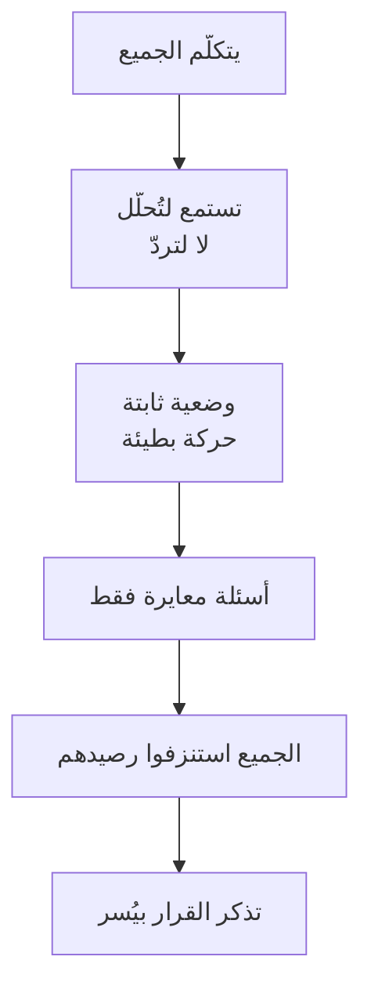

# القيادة الصامتة (Silent Leadership)
> [!info] تعريف مختصر
> القيادة الصامتة هي إدارة النقاش بأقلّ قدر من الكلام وأكبر قدر من الحضور: تجلس ثابتًا، وتستمع **لتُحلّل لا لتردّ**، وتترك الجميع يُفرّغون ما لديهم — ثم تذكر القرار في النهاية فيُسمَع بلا مقاومة.

## الشرح العلمي والاحترافي
الفكرة المركزية أنّ الإنصات هنا **استراتيجية سيطرة لا فضيلة أخلاقية** — والفرق بين الصياغتين يُنتج سلوكين:

| | **يستمع ليردّ** | **يستمع ليُحلّل** |
|---|---|---|
| أين انتباهه | في صياغة ردّه | في محتوى كلام المتحدّث |
| متى يعرف ردّه | بعد ثلاث جُمَل | بعد أن يُفرغ الجميع |
| ما يفوته | كلّ ما قيل بعد أن كوّن ردّه | لا شيء |
| موقعه في النهاية | استنزف رصيده وكشف أوراقه | يملك المعلومات والطاقة |

**والآلية اقتصادية:** لكلّ مشارك رصيد محدود من الطاقة والانتباه؛ ومن أنفقه في الكلام يصل إلى نهاية الاجتماع مُنهَكًا؛ ومن أنفقه في الاستماع يصل بمعلومات أكثر — **فتكون كلمته الأخيرة هي المسموعة.**

**وأربعة عناصر تُكوّن الحضور:** ① **الوضعية** — ظهر مستقيم، رأس مرفوع قليلًا ثقةً لا كِبْرًا، يدان ممدودتان ظاهرتان، هاتف بعيد. ② **الحركة** — أبطأ من الطبيعي؛ فالبطء النسبي يُقرأ سيطرةً والسرعة تُقرأ استجابةً لضغط. ③ **النظر** — بين الحاجبين حين يتكلّم، و50/50 بينه وبين الغرفة حين تتكلّم أنت. ④ **اللغة** — بلا حشو («يعني»، «الموضوع أنّ») وبلا إفراط في التأكيد («تمام، تمام») — وكلاهما يُآكل الهيبة.

**وله تأصيل نظري** عند **إدوين فريدمان (Edwin Friedman)** في *A Failure of Nerve* (2007) باسم **الحضور غير القلق (Non-Anxious Presence)**: القدرة على البقاء متّصلًا بالمنظومة بلا أن تبتلعك حالتها.

## أين ومتى يُستخدم
- اجتماعات متعدّدة الأطراف يتنازع فيها أكثر من صوت.
- لحظات الأزمة التي يبحث فيها الفريق عن نقطة ثبات.
- المفاوضات — حيث [[Tactical Silence|الصمت]] مورد تفاوضي.
- كلّ موقف تُنفَّذ فيه [[Labeling|تسمية]] أو [[Mirroring|مرآة]]؛ فهي **حزمة**: صياغة بلا حضور مطابق تُبطل نفسها.

## مثال وسيناريو تطبيقي
> [!example] اجتماع طارئ فيه ستّة أشخاص، كلٌّ يدفع باتّجاه. مدير التسليم لا يُقاطع أحدًا ولا يُدافع؛ يجلس بظهر مستقيم ويدين ظاهرتين، ينظر إلى كلّ متحدّث بثبات، ويعدّ ثلاث ثوانٍ بعد صمت كلٍّ منهم قبل أن ينتقل. مرّت خمس وأربعون دقيقة **قال فيها ثلاث جُمَل فقط** — كلّها أسئلة. وفي النهاية، وقد أنهك الجميع أنفسهم، قال جملتين: تلخيصًا لما اتُّفق عليه ضمنًا، وبندًا إجرائيًّا. **لم يعترض أحد** — لأنّ ما قاله كان مستخلَصًا من كلامهم هم، ولأنّ رصيد الاعتراض لدى الجميع كان قد نفد.

## خطوات أو مخطّط
1. **قبل الاجتماع:** حدّد ما تريد الخروج به، وحضّر تسميتين وسؤالًا معايَرًا بالنصّ.
2. **اجلس** بالوضعية المفتوحة، والهاتف خارج الطاولة.
3. **لا تُقاطع ولو فهمت** — فأنت تفهم المضمون لا الدافع ولا ما لم يُقَل بعد.
4. **عُدّ ثلاث ثوانٍ** بعد صمت المتحدّث قبل أن تتكلّم.
5. **ردّ في عشرين ثانية**: خلاصة ← سبب في جملة ← طلب ← صمت.
6. **اذكر القرار في النهاية** بعد أن يُفرّغ الجميع.

## ⚠️ مفاهيم خاطئة شائعة
> [!warning]
> - **الصمت ليس عجزًا ولا انسحابًا.** الفارق في الوضعية: صمت + وضعية مفتوحة + نظر ثابت = حضور؛ وصمت + ذراعان مطويتان أو نظر إلى الأرض = انسحاب يرفع استثارة الغرفة.
> - **ليس امتناعًا عن الحسم.** القائد الصامت يحسم — لكنّه يحسم **في النهاية** وببند إجرائي، لا في الدقيقة الأولى.
> - **«وضعيات القوّة» ادّعاء لم يصمد.** الزعم بأنّ الوضعية المفتوحة ترفع هرمونات الثقة (Carney, Cuddy & Yap, 2010) **فشل تكراره** وتراجعت المؤلّفة الأولى عنه عام 2016. والذي صمد أضيق وكافٍ: أثر على **شعورك** وعلى **كيفية إدراك الآخرين لك**.

## ❌ ممارسات خاطئة في المشاريع
> [!failure]
> - **الإفراط في التأكيد** («تمام… صحيح… أكيد») أثناء كلام غيرك — يُآكل الهيبة. الحل: إيماءة بطيئة واحدة.
> - **اللغة الإسفنجية** — «يعني»، «الموضوع أنّ»، والتبرير المتكرّر. والبديل ليس الهجوم: **الوضوح** («اتّفقنا على العاشر؛ اليوم الخامس عشر ولم يصلني تحديث») لا الهجوم («أنت لم تُسلّم — هل هذا مقبول؟»).
> - **الحضور المُصمَّم بالكامل** — «تدرّب على ألّا تكون عفويًّا» له ثمن: يُقرأ بعد فترة **أداءً لا شخصية**، ويظهر الفرق في اللحظات غير المُخطَّطة. الحد: اضبط **الاستجابة تحت الضغط** لا الشخصية كلّها.
> - **إتقان الحضور في بيئة سامّة** — يُتقن صاحبه الظهور بالثبات فيُطيل بقاءه فيها ويُخفي عن المنظّمة إشارة الخلل. **الحضور يُدير اللحظة؛ والنظام يُنتج اللحظات.**

## 🔗 مصطلحات ومفاهيم ذات صلة
[[Tactical Silence]] | [[Active Listening]] | [[Labeling]] | [[Mirroring]] | [[Emotional Contagion]] | [[Biological Leadership]] | [[Servant Leadership]] | [[Facilitator]] | [[Emotional Intelligence]]

> [!tip] 💡 إثراء عملي — كورس لعبة العقل
> هندسة الجلوس والنظر، وقاعدة العشرين ثانية، واستعارة «الجبل في العاصفة»: [[10 - كاريزما القائد الصامت والقيادة البيولوجية]].
