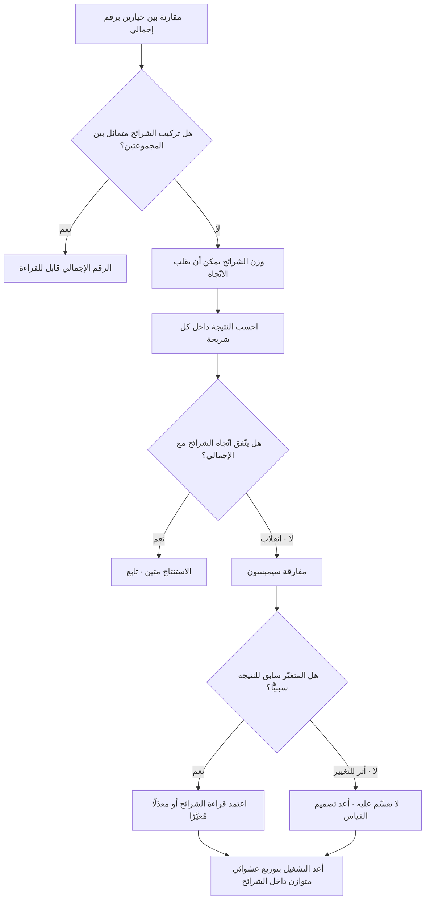

# مفارقة سيمبسون (Simpson's Paradox)

> [!info] تعريف مختصر
> ظاهرة إحصائية ينقلب فيها اتّجاه النتيجة عند تجميع البيانات: خيار يتفوّق على منافسه **في كل شريحة على حدة**، ثم يخسر أمامه **في الإجمالي** — أو العكس. ليست خطأً حسابيًّا ولا خللًا في البيانات؛ الطرفان صحيحان رياضيًّا، والانقلاب ينشأ من أن التجميع يخلط النسب بأوزان مختلفة: الشريحة التي يتركّز فيها أحد الخيارين قد تكون شريحة صعبة بطبيعتها، فيُجرّ متوسّطه لأسفل رغم تفوّقه داخلها. الدرس العملي أن **المتوسّط الكلّي ليس تلخيصًا محايدًا للواقع، بل نتيجة لتركيب العيّنة (Mix)**، وأن قراءة أي مقياس دون تقسيمه على أهمّ متغيّر مربك قد تقلب القرار رأسًا على عقب.

## الشرح العلمي والاحترافي
- **الأصل والتسمية.** نُشرت المعالجة التي حملت الاسم لاحقًا على يد الإحصائي البريطاني **إدوارد سيمبسون (Edward H. Simpson)** عام 1951 في ورقة عن تفسير التفاعل في جداول التوافق. غير أن الظاهرة نفسها كانت ملحوظة قبله بعقود في أعمال **كارل بيرسون (Karl Pearson)** نحو 1899 و**أودني يول (Udny Yule)** نحو 1903، ولذلك تُسمّى أحيانًا **أثر يول–سيمبسون**. أما تسميتها «مفارقة سيمبسون» بهذا اللفظ فقد شاعت عبر ورقة للإحصائي **كولن بلايث (Colin Blyth)** عام 1972.
- **الآلية الرياضية في سطر واحد.** النسبة الإجمالية ليست متوسّطًا بسيطًا لنسب الشرائح، بل **متوسّط مرجَّح بأحجامها**. فإذا اختلف توزيع الأحجام بين المجموعتين المقارَنتين، أمكن للأوزان أن تتغلّب على الفروق داخل الشرائح. شرطان لازمان لحدوث الانقلاب: ① وجود **متغيّر مُربِك (Confounder)** يؤثّر في النتيجة (مثل نوع الجهاز أو صعوبة الحالة)، ② **عدم تناسب التوزيع** عليه بين المجموعتين. غياب أحدهما يمنع الانقلاب.
- **المفارقة في الاسم لا في الرياضيات.** لا تعارض هنا؛ ما يصدم هو أن الحدس يفترض أن «الأفضل في كل جزء أفضل في الكلّ»، وهو افتراض صحيح للمجاميع وخاطئ للنسب. النسب لا تُجمَع، بل تُرجَّح.
- **أشهر الحالات المنشورة علنًا.** الحالة الأكثر تداولًا في الكتب هي تحليل **قبول الدراسات العليا في جامعة كاليفورنيا بيركلي لعام 1973**، الذي نُشر في دورية Science سنة 1975: أظهرت الأرقام الإجمالية نسبة قبول أعلى للرجال، بينما تبيّن عند التقسيم على الأقسام أن نسب القبول لم تكن متحيّزة ضدّ النساء داخل معظم الأقسام؛ الفارق نشأ من أن النساء تقدّمن بنسب أعلى إلى أقسام معدّلات قبولها منخفضة أصلًا للجميع. وحالة أخرى مشهورة في الأدبيات الطبية هي مقارنة علاجين لحصوات الكلى، حيث تفوّق أحدهما في الحالات الصغيرة وفي الحالات الكبيرة معًا، وخسر في المجموع لأنه كان يُستعمل غالبًا في الحالات الأصعب. تُذكر الحالتان هنا بوصفهما توضيحين منشورين على نطاق واسع لمنطق الانقلاب.
- **لماذا هي شائعة جدًّا في بيانات المنتج.** التوزيع غير المتناسب هو **الحالة الطبيعية** لا الاستثناء: الإطلاق التدريجي يبدأ بمنصّة واحدة أو سوق واحد، والحملات التسويقية تجلب تركيبًا مختلفًا من المستخدمين، والميزة الجديدة يتبنّاها أولًا المستخدمون الأكثر نشاطًا. كل ذلك يخلق فروق أوزان بين ما نقارنه، وهي البيئة المثالية للانقلاب.
- **الالتباس المصاحب: أي تقسيم هو الصحيح؟** المفارقة لا تُحلّ بقاعدة «قسّم دائمًا»، لأن التقسيم على متغيّر خاطئ قد يُضلّل أيضًا. القاعدة السليمة سببية لا حسابية: **قسّم على ما يسبق النتيجة سببيًّا ويؤثّر في اختيار المجموعة** (الجهاز، السوق، نوع الخطّة، صعوبة الحالة)، و**لا تقسّم على ما هو نفسه أثرٌ للتغيير** — لأن التقسيم على نتيجة وسيطة يفتح بابًا لتحيّز آخر ويُفسد المقارنة.
- **الوقاية البنيوية: العشوائية والتوازن.** أفضل حماية ليست تحليلية بل تصميمية: توزيع عشوائي متوازن بين المجموعتين يجعل تركيب الشرائح متماثلًا فيختفي شرط الانقلاب. ولذلك تُفحص **صحّة التوزيع (Sample Ratio Mismatch)** قبل قراءة أي نتيجة تجربة: إن كان التوزيع 50/50 مقصودًا وجاء 62/38، فالنتيجة لا تُقرأ أصلًا مهما بدت واضحة.
- **قريبها المباشر: مفارقة التركيب في السلاسل الزمنية.** المتوسّط الكلّي قد يهبط بينما يتحسّن كل شريحة، لمجرّد أن حصّة شريحة ضعيفة كبرت. هذا هو المنطق نفسه الذي يجعل [[Cohort Analysis]] ضرورة لا رفاهية: احتفاظ إجمالي مستقرّ فوق أفواج منهارة هو حالة تركيب صريحة.

## أين ومتى يُستخدم
- **في قراءة نتائج التجارب والإطلاقات التدريجية ([[Pilot Launch]])**: للتحقّق من توازن المجموعات قبل إعلان فائز، ولمنع اعتماد نتيجة مقلوبة.
- **في تحليل التحويل عبر [[Funnel Analysis]]**: حيث اختلاف نسب المرور بين الهاتف وسطح المكتب من أكثر مصادر الانقلاب شيوعًا.
- **في قراءة [[KPI]] التشغيلية عبر الفرق والمناطق**: قد يتحسّن أداء كل فريق ويسوء المتوسّط لأن حصّة الفريق الأكبر عبئًا ارتفعت.
- **في مقارنة الموردين ([[Vendor Management]])**: مورّد يتفوّق في كل فئة تعقيد وقد يبدو أسوأ إجماليًّا لأنه يُسنَد إليه العمل الأصعب.
- **في مؤشّرات الجودة مثل [[Escaped Defect Rate]] و[[Rework Percentage]]**: تغيّر تركيبة المشاريع بين ربعين يحرّك المتوسّط بلا تغيّر حقيقي في الأداء.
- **مع [[Percentiles and Median vs Average]]**: كلا المفهومين تحذير من الرقم الملخِّص الواحد، أحدهما من التجميع عبر الشرائح والآخر من التلخيص داخل التوزيع.
- **في تقارير الإدارة و[[Project Health Report]]**: أي رقم إجمالي يُعرض للقرار يحتاج سؤالًا واحدًا مرافقًا: على أي شريحة قد ينقلب هذا؟
- **قبل اعتماد أي [[North Star Metric]]**: لأن مقياسًا واحدًا على مستوى الشركة معرّض بنيويًّا لتغيّرات التركيب أكثر من أي مقياس فرعي.

## مثال وسيناريو تطبيقي
> [!example] منصّة حجز خدمات منزلية في السوق الخليجي اختبرت مسار دفع جديدًا (النسخة **ب**) مقابل المسار القائم (النسخة **أ**)، وقياس النجاح: نسبة إتمام الحجز. الإطلاق كان تدريجيًّا: بدأت النسخة **ب** على تطبيق الهاتف أولًا لأسباب هندسية، ثم امتدّت جزئيًّا إلى الويب على سطح المكتب.
> **النتيجة الإجمالية بعد أسبوعين:**
> | النسخة | الزوّار | الحجوزات | النسبة |
> |---|---|---|---|
> | أ (القائمة) | 1,200 | 210 | **17.5%** |
> | ب (الجديدة) | 1,200 | 104 | **8.7%** |
> القراءة الفورية: النسخة الجديدة كارثة، وتُلغى. لكن قبل الإلغاء قُسّمت البيانات على الجهاز:
> | الشريحة | النسخة | الزوّار | الحجوزات | النسبة |
> |---|---|---|---|---|
> | سطح المكتب | أ | 1,000 | 200 | 20.0% |
> | سطح المكتب | ب | 200 | 44 | **22.0%** |
> | الهاتف | أ | 200 | 10 | 5.0% |
> | الهاتف | ب | 1,000 | 60 | **6.0%** |
> النسخة **ب** تفوّقت على سطح المكتب (22.0% مقابل 20.0%) وتفوّقت على الهاتف (6.0% مقابل 5.0%) — أي **فازت في كل شريحة على حدة**، وخسرت في المجموع بفارق ضخم (8.7% مقابل 17.5%).
> **التفسير الحسابي:** سطح المكتب شريحة سهلة (نسبة إتمام ~20%) والهاتف شريحة صعبة (~5%). النسخة **أ** كان 83% من مرورها على سطح المكتب السهل، بينما النسخة **ب** كان 83% من مرورها على الهاتف الصعب. فالمتوسّط لم يقارن بين النسختين، بل قارن — عمليًّا — بين جمهور سهل وجمهور صعب. الجهاز هنا **متغيّر مُربِك**، والتوزيع غير المتناسب هو ما فتح باب الانقلاب.
> **القرار الصحيح:** لا يُعلَن فائز من الرقم الإجمالي مطلقًا في هذه الحالة، لأن التجربة كسرت شرط التوزيع المتوازن. أُعيد التشغيل بتوزيع عشوائي 50/50 داخل كل شريحة جهاز، فجاءت النتيجة نظيفة: **ب** أعلى بـ1.4 نقطة على سطح المكتب و1.1 نقطة على الهاتف، ووزنها الإجمالي موجب هذه المرّة.
> **درس إضافي مضادّ للحدس:** لو كانت النسخة **ب** قد أُطلقت أولًا على سطح المكتب لظهرت **متفوّقة** إجماليًّا حتى لو كانت أسوأ في كل شريحة — أي أن الخطأ نفسه كان سيمرّ بلا اعتراض لأن نتيجته أعجبت الجميع. ولهذا فحص التوازن يُجرى قبل رؤية النتيجة لا بعدها.

## خطوات أو مخطّط
1. قبل قراءة أي مقارنة، تحقّق من **تناسب أحجام المجموعات** على أهمّ المتغيّرات (الجهاز، السوق، القناة، الخطّة، صعوبة الحالة).
2. إن كان التوزيع مقصودًا متوازنًا وجاء غير متوازن، عامل النتيجة بوصفها **غير قابلة للقراءة** حتى يُصحَّح التوزيع.
3. اسرد المتغيّرات المُربِكة المحتملة **قبل** التحليل واكتبها في وثيقة التجربة، لتجنّب اختيار التقسيم الذي يوافق الهوى بعد النتيجة.
4. احسب النتيجة **داخل كل شريحة** بالإضافة إلى الإجمالي، واعرض الجدولين معًا لا الإجمالي وحده.
5. عند اختلاف الاتّجاه بين الشريحة والإجمالي، رجّح **قراءة الشرائح** إذا كان المتغيّر سابقًا للنتيجة سببيًّا؛ ولا تقسّم على متغيّر هو نفسه أثر للتغيير.
6. عند الحاجة إلى رقم واحد للمقارنة، استخدم **معدّلًا مُعيَّرًا (Standardized Rate)**: طبّق نسب كل مجموعة على تركيبة شرائح مرجعية واحدة مشتركة.
7. أعد تصميم القياس مستقبلًا بتوزيع عشوائي متوازن داخل الشرائح (Stratified Randomization) بدل التصحيح البَعدي.
8. اجعل عرض «الإجمالي + التقسيم على شريحتين أساسيّتين» قاعدة ثابتة في نموذج التقارير، لا جهدًا استثنائيًّا يُبذل عند الشكّ.

## ⚠️ مفاهيم خاطئة شائعة
> [!warning]
> - **«المفارقة خطأ في البيانات»**: الأرقام صحيحة تمامًا في الحالتين. الخطأ في **الاستنتاج** من رقم واحد مجمّع، لا في الحساب.
> - **«قراءة الشرائح هي الصحيحة دائمًا»**: ليست قاعدة مطلقة. التقسيم على متغيّر يقع **بعد** التغيير ويتأثّر به يُنتج تحيّزًا جديدًا. الحكم سببي: ما الذي أثّر في توزيع المجموعات ولم يتأثّر بالتغيير؟
> - **«التقسيم إلى شرائح أكثر يعطي حقيقة أدقّ»**: الإفراط في التقسيم يقود إلى خلايا صغيرة يهيمن عليها التذبذب العشوائي، فيولّد «اكتشافات» زائفة. التقسيم يُختار مسبقًا وبعدد محدود.
> - **«المفارقة نادرة»**: شائعة جدًّا في بيانات المنتج والعمليات، لأن عدم تناسب التوزيع هو الحالة الافتراضية في الإطلاقات التدريجية والحملات.
> - **«التوزيع العشوائي يعصم تلقائيًّا»**: العشوائية تحمي فقط إن نُفّذت فعلًا ووُزّعت متوازنة؛ وكثير من التجارب تنكسر عمليًّا (تخصيص معطّل، منصّة تُطلق أولًا، مستخدمون يتنقّلون بين الأجهزة).
> - **«ما دامت النتيجة الإجمالية مبهرة فلا داعي للتقسيم»**: النتيجة المبهرة في الاتّجاه المرغوب هي الأخطر، لأنها لا تستدعي تدقيقًا من أحد فتمرّ مقلوبة بلا اعتراض.
> - **«المفارقة تخصّ النسب المئوية فقط»**: تظهر أيضًا في المتوسّطات وفي معاملات الارتباط والانحدار، وبالمنطق نفسه: اختلاف أوزان المجموعات المكوِّنة.

## ❌ ممارسات خاطئة في المشاريع
> [!failure]
> - **الخطأ: إعلان فائز في تجربة من الرقم الإجمالي دون فحص توازن التوزيع.** لماذا يضرّ: قد يُلغى تحسين ناجح أو يُعتمَد تغيير ضارّ، والقرار يبدو مدعومًا بالبيانات فيصعب نقضه لاحقًا. الحل: اجعل فحص نسبة التوزيع بندًا إلزاميًّا في قائمة تدقيق ما قبل قراءة أي تجربة.
> - **الخطأ: الإطلاق التدريجي على منصّة أو سوق واحد ثم مقارنة النتيجة بالبقيّة.** لماذا يضرّ: يخلط أثر التغيير بأثر المنصّة خلطًا لا يُفكّ بعد وقوعه. الحل: وزّع التجربة داخل كل شريحة بنسب متساوية، أو اقصر المقارنة على الشريحة المُطلَق فيها فقط.
> - **الخطأ: اختيار التقسيم بعد رؤية النتائج.** لماذا يضرّ: يفتح باب انتقاء الشريحة التي تروي القصّة المرغوبة، وهو تحيّز تأكيدي بغطاء تحليلي ([[Confirmation Bias]]). الحل: اكتب قائمة التقسيمات المعتمدة في وثيقة التجربة قبل جمع البيانات.
> - **الخطأ: مقارنة أداء فرق أو مورّدين بمتوسّطات إجمالية دون تعيير الصعوبة.** لماذا يضرّ: يعاقب من يتولّى الأصعب ويكافئ من يتولّى الأسهل، فيتعلّم الجميع تجنّب العمل الصعب. الحل: قارن داخل فئات التعقيد، أو استخدم معدّلًا مُعيَّرًا على تركيبة مرجعية واحدة.
> - **الخطأ: تفسير تحرّك مقياس إجمالي على أنه تغيّر في السلوك.** لماذا يضرّ: كثير من الحركة سببها تغيّر تركيبة المستخدمين لا تغيّر أحد منهم، فتُطارَد أسباب وهمية. الحل: افحص تغيّر أوزان الشرائح أولًا، واقرأ الأثر فوجيًّا عبر [[Cohort Analysis]].
> - **الخطأ: بناء لوحة قيادة بأرقام مجمّعة فقط.** لماذا يضرّ: تُخفي بنيويًّا كل انقلاب محتمل وتجعل اكتشافه صدفة. الحل: اشترط لكل مقياس رئيس عرضًا مقسّمًا على شريحتين أو ثلاث في اللوحة نفسها.
> - **الخطأ: الاكتفاء بالتقسيم دون العودة إلى السبب.** لماذا يضرّ: معرفة أن الاتّجاه انقلب لا تكفي للقرار؛ فقد يكون الانقلاب إشارة إلى خلل في التصميم نفسه. الحل: اربط كل انقلاب بسؤال «لماذا اختلف التوزيع؟» وسجّل الإجابة في [[Decision Log]].

## 🔗 مصطلحات ومفاهيم ذات صلة
[[KPI]] | [[North Star Metric]] | [[Outcome vs Output]] | [[Percentiles and Median vs Average]] | [[Cohort Analysis]] | [[Funnel Analysis]] | [[Counter Metric]] | [[Vanity Metrics]] | [[Goodhart's Law]] | [[Leading and Lagging Indicators]] | [[Product Analytics]] | [[Confirmation Bias]] | [[Hypothesis]] | [[Pilot Launch]]
