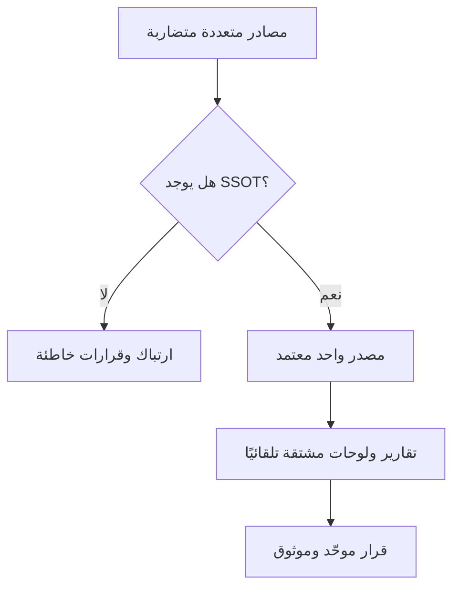

# مصدر واحد للحقيقة (Single Source of Truth)
> [!info] تعريف مختصر
> مصدر واحد للحقيقة (Single Source of Truth أو SSOT) هو مكان واحد موثوق يُخزَّن فيه أحدث نسخة صحيحة من معلومة أو بيانات معيّنة، بحيث يرجع إليه الجميع بدل الاعتماد على نسخ متفرقة قد تتعارض.

## الشرح العلمي والاحترافي
- الفكرة الأساسية: أي معلومة مهمة (متطلبات، حالة المهام، جدول زمني، إعدادات نظام) يجب أن يكون لها **مكان واحد** معتمَد يُحدَّث فيه، وكل الأماكن الأخرى إما تشير إليه أو تُستمَد منه تلقائيًا.
- بدون SSOT يحدث "انحراف البيانات" (Data Drift): فريق يعدّل نسخة في Excel، وآخر يعدّل نسخة في Confluence، وثالث يعتمد على بريد إلكتروني قديم، فتتضارب الحقائق.
- يهم لأن اتخاذ القرار السليم، والتقارير الدقيقة، وتفادي إعادة العمل، كلها تعتمد على أن الجميع ينظر إلى نفس الحقيقة في اللحظة نفسها.
- في السياق التقني الحديث يرتبط SSOT غالبًا بأدوات مثل نظام تتبع المهام (Jira)، مستودع الكود (Git)، أو قاعدة بيانات مركزية، حيث تُشتق كل التقارير ولوحات المتابعة من هذا المصدر بدل أن تُدخَل يدويًا في أماكن متعددة.

## أين ومتى يُستخدم
- في إدارة المتطلبات: وثيقة متطلبات واحدة معتمدة بدل نسخ متعددة متضاربة (انظر [[Software Requirements Specification]]).
- في إدارة المشاريع الرشيقة (Agile) وKanban: الـ Backlog في أداة واحدة (Jira/Azure DevOps) هو SSOT لحالة كل المهام.
- في DevOps: الكود في [[Docs as Code|مستودع Git]] يكون SSOT للتوثيق والتهيئة (Configuration as Code).
- عند وجود أطراف متعددة (عميل، مورّد، فرق داخلية) يحتاجون رؤية موحّدة لتفادي النزاعات حول "من قال ماذا".

## مثال وسيناريو تطبيقي
> [!example] في مشروع تطوير تطبيق جوّال لشركة "نجم"، كانت متطلبات الميزة الجديدة موزّعة بين: مستند Word أرسله العميل، ملاحظات اجتماع في بريد إلكتروني، وتعديلات شفهية في مكالمة. حدث خلاف بين المطوّر ومختبِر الجودة حول ما إذا كانت خاصية "الدفع بالتقسيط" مطلوبة في الإصدار الأول أم لا.
> الحل: أنشأ مدير المشروع صفحة واحدة في Confluence بعنوان "متطلبات الإصدار 1.0 — معتمدة"، نقل إليها كل القرارات، وأغلق كل المصادر الأخرى مع رسالة "يُرجى الرجوع فقط إلى هذه الصفحة". بعد ذلك اختفت الخلافات لأن الجميع رجع لنفس النسخة المحدَّثة تاريخ 2026-03-10.

## خطوات أو مخطّط
1. حدّد المعلومة الحرجة (متطلبات، حالة، إعدادات) التي تحتاج مصدرًا موحدًا.
2. اختر الأداة أو المكان الذي سيكون SSOT رسميًا (مثلًا: Jira للمهام، Git للكود).
3. أعلن للفريق بوضوح: "هذا هو المصدر الوحيد المعتمد" واذكر ذلك في وثيقة الحوكمة أو [[Team Working Agreement]].
4. امنع أو قلّل النسخ الموازية (ملفات Excel شخصية، صفحات قديمة)، أو اجعلها تُشتق تلقائيًا من SSOT فقط.
5. راجع دوريًا لضمان أن لا أحد يعدّل خارج المصدر المعتمد.

## ⚠️ مفاهيم خاطئة شائعة
> [!warning]
> - الاعتقاد أن SSOT يعني "نسخة واحدة فقط في كل مكان" — في الواقع يمكن أن تكون هناك نسخ معروضة متعددة (لوحة، تقرير) طالما أنها **مشتقة تلقائيًا** من نفس المصدر الأصلي.
> - الخلط بين SSOT و"النسخة الاحتياطية" (Backup)؛ SSOT خاص بالمرجعية والاعتماد وليس بالحفظ الاحتياطي.
> - الظن أن تطبيق SSOT يعني توثيق كل شيء في مكان واحد ضخم؛ الأصح تقسيمه حسب نوع المعلومة (مصدر للمتطلبات، ومصدر آخر للكود، وهكذا) بشرط وضوح أيهما الحاكم عند التعارض.

## ❌ ممارسات خاطئة في المشاريع
> [!failure]
> - ترك نسخ "مسودة" قديمة متاحة للفريق دون أرشفتها أو تمييزها بوضوح كـ"غير معتمدة"، فيرجع إليها البعض خطأً.
> - عدم تحديث SSOT فور حدوث تغيير (Change Request)، مما يجعله "مصدرًا للكذب" بدل الحقيقة. الحل: اربط كل [[Change Request]] بتحديث فوري للمصدر المعتمد.
> - الاعتماد على أداة يصعب الوصول إليها أو معقدة، فيهرب الفريق لنسخ بديلة أسهل؛ اختر أداة سهلة ومتاحة للجميع لضمان الالتزام بها.

## 🔗 مصطلحات ومفاهيم ذات صلة
[[Software Requirements Specification]] | [[RTM]] | [[Docs as Code]] | [[Organizational Process Assets]] | [[Baseline]] | [[Change Request]] | [[Sign-off]]
