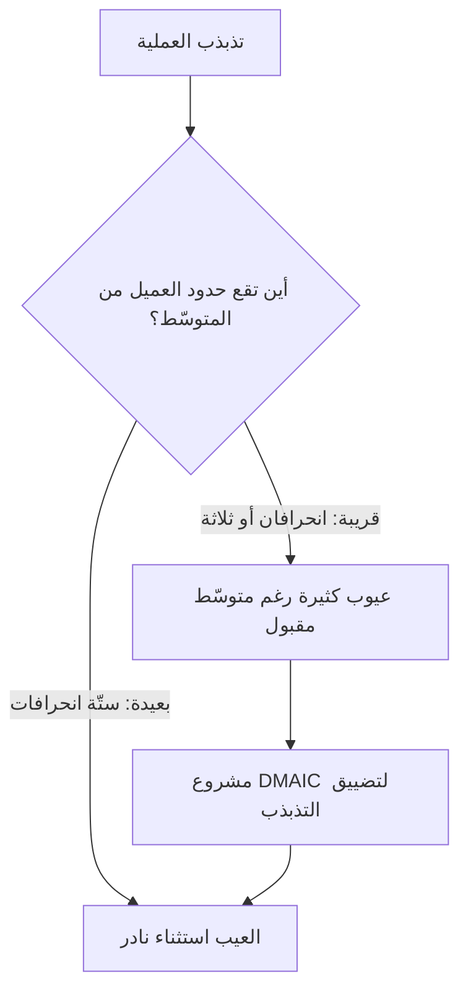

# ستّة سيجما (Six Sigma)

> [!info] تعريف مختصر
> **ستّة سيجما** منهجية لتحسين الجودة قوامها أن **عدوّ الجودة هو التذبذب (Variation) لا البطء**: فالعملية التي تُنجز مرّة في دقيقتين ومرّة في ساعتين لا يُعتمد عليها وإن كان متوسّطها مقبولًا. وتعالج ذلك بتضييق تذبذب العملية حتى تبعد حدود مواصفات العميل عن متوسّطها ستّة انحرافات معيارية (σ)، فيبلغ العيب المتوقّع **3.4 حالة في المليون فرصة**. وتُنفَّذ مشروعاتها بدورة [[DMAIC]]، وتُدار بهيكل أدوار معتمَد يُعرف بـ**الأحزمة (Belts)**.

## الشرح العلمي والاحترافي

**النشأة.** وُلدت المنهجية في **موتورولا سنة 1986** على يد المهندس **بيل سميث (Bill Smith)** ومعه ميكيل هاري، حين لاحظت الشركة أن المنتجات التي احتاجت إصلاحًا في خطّ التصنيع هي نفسها التي تعطب عند العميل. فالخلاصة التي بُني عليها كل ما بعدها: **العيب المكتشَف متأخّرًا عرَضٌ لتذبذب موجود مبكّرًا.** ثم عمّمتها **جنرال إلكتريك** تحت جاك ويلش سنة 1995 حتى صارت لغة إدارية عامّة خرجت من المصنع إلى الخدمات والبنوك.

**من أين جاء الاسم؟** الحرف σ في الإحصاء هو **الانحراف المعياري**، أي مقدار تشتّت النتائج حول متوسّطها. فأن تكون العملية «عند ستّة سيجما» يعني أن المسافة بين متوسّطها وأقرب حدٍّ من حدود ما يقبله العميل تساوي ستّة انحرافات — فلا يخرج عن الحدّ إلا ما شذّ شذوذًا بالغًا.

> [!info] إضافة مرجعية — من أين جاء الرقم 3.4؟
> الحساب المباشر لعملية مركزيّة عند ±6σ يعطي **حالتين في المليار** لا 3.4 في المليون. والفارق الهائل بينهما سببه **بدل الانزياح 1.5σ**: تقدير تجريبيّ اعتمده مهندسو موتورولا مؤدّاه أن متوسّط أي عملية حقيقية ينزاح على المدى الطويل بمقدار انحراف ونصف. فرقم 3.4 هو في حقيقته أداء **4.5σ** بعد خصم هذا الانزياح، لا أداء 6σ نظريًّا. وهذا التفصيل ليس تدقيقًا زائدًا: من جهله ظنّ الرقم قانونًا رياضيًّا، وهو **اصطلاح صناعيّ مبنيّ على فرضية تجريبية** قد لا تصدق على عمليته.

**الأحزمة.** رتّبت المنهجية أهلها مراتب مستعارة من فنون القتال، وهي من أسباب انتشارها المؤسّسي: **الحزام الأصفر** يفهم المبادئ ويشارك، و**الأخضر** يقود مشروعًا صغيرًا إلى جانب عمله، و**الأسود** يتفرّغ لقيادة مشروعات التحسين، و**الأسود الأكبر (Master Black Belt)** يدرّب ويشرف على المنهج نفسه، و**البطل (Champion)** راعٍ تنفيذيّ يزيل العوائق ويختار المشروعات.

**وستّة سيجما الرشيقة (Lean Six Sigma)** جمعٌ بين مدرستين متكاملتين لا متنافستين:

| | ما تهاجمه | سؤالها | أداتها الأشهر |
|---|---|---|---|
| **[[Lean Startup\|Lean]] والتفكير الرشيق** | **الهدر** — كل خطوة لا يدفع العميل ثمنها | لماذا تستغرق العملية هذا الوقت كلّه؟ | [[Value Stream Mapping\|خريطة تدفّق القيمة]] · [[DOWNTIME]] |
| **ستّة سيجما** | **التذبذب** — تفاوت النتيجة بين مرّة وأخرى | لماذا لا تُنتج العملية النتيجة نفسها في كل مرّة؟ | [[DMAIC]] · [[Control Chart\|مخطّطات التحكّم]] |

والجمع بينهما منطقيّ: فالسرعة بلا استقرار تُنتج عيوبًا أسرع، والاستقرار بلا سرعة يُنتج عملية موثوقة لا يحتاجها أحد.

**وأمّا تصميم الجديد** فله شعبة مستقلّة: **DFSS — التصميم من أجل ستّة سيجما**، ودورتها DMADV لا DMAIC، لأن ما لا وجود له لا يُقاس خطُّ أساسه.

## أين ومتى يُستخدم

- في **العمليات عالية التكرار** التي يُنتج فيها التذبذب كلفةً مباشرة: التصنيع، والخدمات اللوجستية، والتشغيل المصرفي، ومراكز الاتّصال، ومعالجة المطالبات.
- حيث تكون **كلفة العيب أعلى من كلفة التحسين** — كالقطاعات المنظَّمة نظاميًّا التي يترتّب على خطئها غرامة أو ضرر بالسلامة.
- في **المنظّمات الكبيرة** التي تحتاج لغةً وأدوارًا موحّدة للتحسين عبر إدارات متعدّدة، لا اجتهادًا فرديًّا في كل فريق.
- **ولا تناسب** عمل الاكتشاف والابتكار الذي لا تُعرف فيه المواصفة أصلًا، ولا الفرق الصغيرة التي تكلّفها المنهجية أكثر ممّا تعطيها — وتلك موضع [[Kaizen]] و[[PDCA]].

## مثال وسيناريو تطبيقي

> [!example] سيناريو ملموس
> مختبر تحاليل طبّية اسمه **«مختبر الشفاء»** يَعِد بنتيجة خلال 24 ساعة. والمتوسّط المُعلَن **19 ساعة** — رقمٌ يبدو مطمئنًا، والإدارة راضية عنه.
>
> لكن قراءة التوزيع تكشف صورة أخرى: **31%** من العيّنات تتجاوز الـ24 ساعة، بينما تُنجَز أخرى في ستّ ساعات. فالمشكلة **ليست في المتوسّط بل في التشتّت**، والعميل لا يعيش المتوسّط — إنما يعيش تجربته هو.
>
> ولذلك لا يُجدي هنا «تسريع المختبر»؛ إذ سيرتفع المتوسّط ويبقى ثلث المرضى متأخّرًا. فيُفتح مشروع [[DMAIC]] على مقياس واحد: **نسبة النتائج التي تتجاوز 24 ساعة**. فيتبيّن أن مصدر التشتّت الأكبر تحويلُ العيّنات بين الفرعين مساء الخميس، وأن كل عيّنة تمرّ بهذا التحويل تتضاعف مدّتها. فيُعالَج مسار واحد لا المختبر كلّه، فتنزل النسبة إلى **7%** والمتوسّط كما هو تقريبًا.
>
> **والدرس:** أن المتوسّط أخفى المشكلة، والتشتّت أظهرها. وهذا هو مبرّر وجود المنهجية كلّها.

## خطوات أو مخطّط

1. **اختر مشروعًا يستحقّ**: مشكلة مزمنة، ذات كلفة مُقدَّرة، وقابلة للقياس بمقياس واحد.
2. **عيّن راعيًا وقائدًا بحزام مناسب**، وحرّر وقته فعلًا لا اسمًا.
3. **ترجم مطلب العميل إلى حدّ رقميّ ([[CTQ|الحرج للجودة]])** — لا إلى وصف كيفيّ.
4. **نفّذ [[DMAIC]] بمراحله الخمس** بلا تخطّي بوّابة.
5. **سلّم المقياس إلى صاحب العملية** مع حدّ تصعيد، ثم أغلق المشروع واحسب المكسب ماليًّا.

## ⚠️ مفاهيم خاطئة شائعة

> [!warning]
> - **أنها منهجية «تسريع».** بل هي منهجية **تثبيت**: تجعل النتيجة متوقَّعة. والسرعة مطلب [[Lean Startup|المدرسة الرشيقة]] لا مطلبها هي، ومن خلط بينهما أخطأ الأداة.
> - **أن 3.4 في المليون نتيجة رياضية لـ6σ.** بل نتيجة 6σ مطروحًا منها **انزياح 1.5σ** مفترَض — كما في الإضافة المرجعية أعلاه.
> - **أن الأحزمة شهادات جودة شخصية.** هي **أدوار في نظام** لا أوسمة؛ والحزام الأسود بلا تفرّغ ولا راعٍ ولا مشروع ذي كلفة مُقدَّرة لقبٌ لا وظيفة.
> - **أنها تصلح لكل عمل.** تفترض عملية متكرّرة، ومواصفةً معروفة، وبياناتٍ كافية. وحيث تغيب هذه الثلاثة تكون كلفتها أكبر من عائدها.

## ❌ ممارسات خاطئة في المشاريع

> [!failure]
> - **مطاردة المتوسّط بدل التشتّت**: يُحتفى بتحسّن المتوسّط بينما تجربة ثُلث العملاء كما هي أو أسوأ. **التجنّب:** اجعل مقياس المشروع **نسبة الحالات الخارجة عن الحدّ**، لا المتوسّط.
> - **فرض المنهجية على العمل الاستكشافي**: وهذا نمط فشل موثَّق علنًا لا مفترَض — فقد ذكرت تقارير صحفية أوسعها *BusinessWeek* سنة 2007 أن انضباط ستّة سيجما في **3M** أثناء رئاسة جيمس مكنيرني (2001–2005) ضيّق على مختبرات البحث، فخفّف خلَفه جورج باكلي تطبيقها في البحث والتطوير مع إبقائها في التصنيع. **والدرس:** أنّ ما يضبط عملية معروفة قد يخنق عملًا لا يُعرف مخرَجه سلفًا.
> - **اختيار المشروعات بلا كلفة مُقدَّرة**: تمتلئ لوحة التحسين بمشروعات صغيرة تُنجَز ولا يُحسّ لها أثر في الميزانية، فيفقد البرنامج راعيه. **التجنّب:** بوّابة قبول تشترط تقدير الكلفة الحالية للمشكلة بالريال.
> - **الاكتفاء بالتدريب**: تُدرَّب مئات على الأحزمة الخضراء ولا يُفرَّغ أحد لمشروع، فيصير البرنامج نشاطًا تدريبيًّا. **التجنّب:** لا حزام بلا مشروع مُسنَد وتاريخ إغلاق.

## 🔗 مصطلحات ومفاهيم ذات صلة

[[DMAIC]] | [[CTQ]] | [[Statistical Significance]] | [[PDCA]] | [[Kaizen]] | [[Control Chart]] | [[Quality Assurance]] | [[Value Stream Mapping]] | [[DOWNTIME]] | [[Toyota Production System]] | [[Root Cause Analysis]] | [[Escaped Defect Rate]] | [[Pareto Principle]] | [[Theory of Constraints]]
