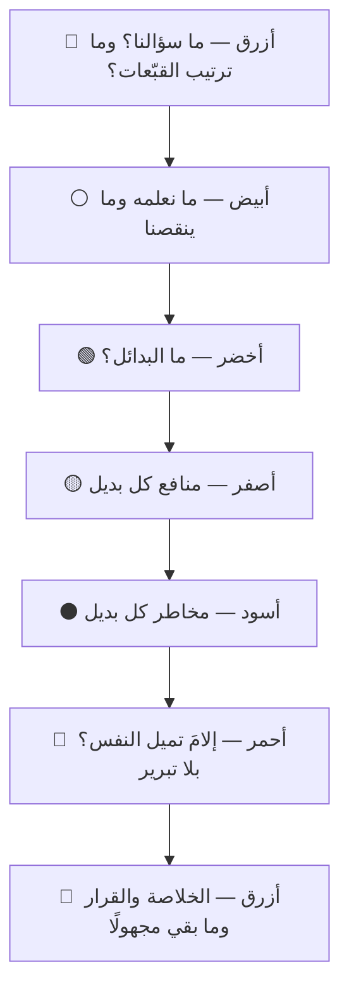

# القبّعات الستّ للتفكير (Six Thinking Hats)

> [!info] تعريف مختصر
> **القبّعات الستّ** طريقةٌ لإدارة النقاش الجماعي وضعها **إدوارد دي بونو** في كتاب بالاسم نفسه سنة 1985. تقوم على تقسيم التفكير ستّة أنماط، لكلٍّ لون: **الأبيض** للمعلومة · **الأحمر** للشعور · **الأسود** للحذر · **الأصفر** للمنفعة · **الأخضر** للبديل · **الأزرق** لإدارة التفكير نفسه.
> **وقاعدتها الحاكمة — وهي التي تُنسى أوّلًا —** أن **الجميع يلبس القبّعة نفسها في الوقت نفسه**. فليست توزيعًا للأدوار على الأشخاص، بل **تفكيرٌ متوازٍ (Parallel Thinking)**: ينظر الحاضرون كلّهم في اتّجاه واحد ثم يتحوّلون معًا، بدل النقاش الخصومي الذي يدافع فيه كلٌّ عن موقعه.

## الشرح العلمي والاحترافي

**والمشكلة التي وُضعت لها** هي أن الاجتماع المعتاد يخلط في اللحظة الواحدة أربعة أشياء: معلومةً، وشعورًا، ونقدًا، واقتراحًا. فيصير النقاش تفاوضًا على من يغلب، **ويلتصق الرأي بصاحبه**: من اعترض مرّتين صار «المعطِّل»، ومن حمس صار «غير الواقعي». فالطريقة تفصل الأنماط زمنيًّا حتى **يفكّر الجميع في النمط نفسه معًا**، فينفصل الرأي عن شخص قائله.

**والقبّعات الستّ:**

1. **البيضاء — المعلومة.** ما الحقائق والأرقام التي بين أيدينا؟ **وما الذي ينقصنا؟** ولا رأي فيها ولا تفسير؛ وأنفع سؤال فيها هو الثاني، إذ يكشف ما بُني عليه القرار وهو مجهول.
2. **الحمراء — الشعور والحدس.** يُقال **بلا تبرير**، وهذا شرطها لا نقصها: فالمشاعر موجودة في كل اجتماع، وإذا لم يُفسح لها موضع صريح تسلّلت متنكّرةً في صورة حجج. ودقيقتان تكفيان.
3. **السوداء — الحذر.** لماذا قد لا ينجح؟ وأين المخاطر ومواضع عدم المطابقة؟ وهي **أنفع القبّعات وأكثرها إساءة استعمال** بشهادة دي بونو نفسه: نافعة لأنها تحمي من الخطأ، ومُساءٌ استعمالها لأنها القبّعة التي يسهل لبسها طول الوقت.
4. **الصفراء — المنفعة.** لماذا قد ينجح؟ وما القيمة إن نجح؟ **بمنطق مسبَّب لا بتفاؤل عامّ** — وهي أصعب القبّعات على أكثر الفرق، لأن التماس أسباب النجاح يحتاج جهدًا لا يحتاجه التماس أسباب الفشل.
5. **الخضراء — البديل.** ما الاحتمالات الأخرى؟ ولا نقد فيها، فالنقد يقتل الاقتراح في مهده.
6. **الزرقاء — إدارة التفكير.** وهي القبّعة التي تفكّر في التفكير: ترتّب تتابع القبّعات، وتردّ من خرج عن القبّعة الجارية، وتلخّص عند الانتقال. ويلبسها الميسّر غالبًا، وله أن يدعو الجميع إليها.

**وترتيب القبّعات يُصمَّم قبل الجلسة** لا يُترك للمصادفة، ولكل غرضٍ ترتيبه. ومن الترتيبات المتداولة لتقييم مقترح: أزرق (تحديد السؤال) ← أبيض (المعلوم والمجهول) ← أخضر (البدائل) ← أصفر (منافع كلٍّ) ← أسود (مخاطره) ← أحمر (ما تميل إليه النفس) ← أزرق (الخلاصة والقرار).

**ولماذا تنجح؟** لأنها تعالج ثلاثة أعطال في وقت واحد:

- **تفصل الأنا عن الرأي.** فمن ينتقد وهو لابسٌ القبّعة السوداء ينتقد بأمر الجلسة لا بطبعه، ولا يُقرأ نقده موقفًا شخصيًّا.
- **تُخرج المشاعر من التخفّي.** فالاعتراض الذي مصدره ارتياب لا حجّة يُقال في وقته صراحةً بدل أن يُلبَس ثوب حجّة تقنية يصعب دحضها لأنها ليست هي السبب أصلًا.
- **تضمن أن يُطرق كل نمط.** فالفريق المتفائل بطبعه يلزمه أن يجلس مع السوداء دقائق، والفريق الحذر يلزمه أن يجلس مع الصفراء.

> [!info] إضافة مرجعية — على قدر ما تحتمله الطريقة
> الطريقة **ممارسة ذائعة لا نتيجة بحث تجريبي**؛ فما نُشر من تقويم لها أكثره تقارير تجربة لا دراسات محكَّمة، وكتب دي بونو تعرض أثرها بالحكاية لا بالقياس. **والنافع منها آليّتها لا دعواها:** أن فصل الأنماط زمنيًّا يقلّل الخصومة ويوسّع التغطية — وهذا ما يشهد به من جرّبها. فتُستعمل أداةَ تيسير، ولا يُبنى عليها ادّعاء علمي لم يقم دليله.

## أين ومتى يُستخدم

- **في تقييم مقترح واحد** يريد الفريق أن يحكم عليه من كل وجه قبل القرار.
- **في اجتماع استقطب فيه الرأي فريقين** — وهذا أنفع مواضعها: فالخصومة تنحلّ حين يُطلب من الطرفين أن ينتقدا معًا ثم يتفاءلا معًا.
- **في [[Retrospective|الاسترجاع]]** حين يميل إلى الشكوى: فالقبّعة الصفراء ثم الخضراء تنقلانه من التشخيص إلى التغيير.
- **مع الفرق الجديدة أو المختلطة ثقافيًّا**، إذ تعطي إذنًا صريحًا بالنقد لمن لا يجرؤ عليه، وحدًّا صريحًا لمن لا يكفّ عنه.
- **في اجتماع فيه من يهاب الاعتراض على الأعلى منصبًا:** فالنقد تحت القبّعة السوداء مطلوبٌ من الجميع، فيسقط ثمنه الاجتماعي.

> [!warning] متى لا تُستخدَم؟
> - **في قرار عاجل** لا يحتمل جولات؛ ولها في العجلة صورة مختصرة: أبيض ← أسود ← أصفر، دقيقتان لكلٍّ.
> - **في مسألة تقنية محضة** لها جواب صحيح واحد يعرفه أهله؛ فالتصويت على المعلوم عبث.
> - **مع فريق لا يرى فيها إلا طقسًا**، فالطريقة تحتاج قبولًا صريحًا؛ وفرضها بلا شرحٍ لعلّتها يجعلها مادّة تندّر تُضعف كل تيسير بعدها.

## مثال وسيناريو تطبيقي

> [!example] «شركة نُهى» — اجتماعان عن القرار نفسه
> **القرار:** أنعيد بناء تطبيق الهاتف أم نرمّم القائم؟
> **الاجتماع الأوّل (بلا طريقة):** ساعة وأربعون دقيقة. انقسم الحاضرون في الدقيقة الخامسة فريقين، وصار كل جديد يُقال دعمًا لموقعٍ سابق. وخرجوا بلا قرار، وبانطباع أن قائد الهندسة «يقاوم التغيير» — وهو في حقيقته كان قلقًا من موعد نهائي لم يذكره أحد.
> **الاجتماع الثاني (بالقبّعات):** خمسون دقيقة، بترتيب معلن مسبقًا.
> - **الأبيض (8 د):** ظهر أن أحدًا لا يعرف كم نسبة المستخدمين على النسخ القديمة. فأُوقفت الجلسة وجُلب الرقم: 31٪.
> - **الأخضر (10 د):** ظهر خيار ثالث لم يُطرح قبلها — إعادة بناء الطبقة الأثقل وحدها.
> - **الأصفر (8 د):** التزم قائد الهندسة — وهو المعارض — بذكر منافع إعادة البناء، فذكر ثلاثًا لم يذكرها أنصارها.
> - **الأسود (8 د):** ذكر أشدّ المتحمّسين خطرًا لم ينتبه له أحد: تعارض النسخة الجديدة مع تكامل قائم عند عميل كبير.
> - **الأحمر (3 د):** قال قائد الهندسة إن قلقه من الموعد النهائي لا من التقنية. وهذا وحده غيّر النقاش.
> - **الأزرق (5 د):** اعتُمد الخيار الثالث، بمراجعة بعد ستّة أسابيع.
> **الدرس:** ما غيّر النتيجة ليس أن أحدًا اقتنع، بل أن **كلّ واحد اضطُرّ إلى التفكير من الموضع الذي يتجنّبه** — والخيار الفائز لم يكن مطروحًا في الاجتماع الأوّل أصلًا.

## خطوات أو مخطّط

1. **صُغ سؤال الجلسة في جملة واحدة** (قبّعة زرقاء)، فالقبّعات لا تنفع سؤالًا مبهمًا.
2. **صمّم التتابع مسبقًا** وأعلنه، وحدّد مدّة كل قبّعة.
3. **ذكّر بالقاعدة:** الجميع في القبّعة نفسها، ومن خرج عنها ذُكِّر بلا لوم.
4. **دوّن تحت كل قبّعة على حدة**، فالخلط في التدوين يعيد الخلط في التفكير.
5. **اختم بالزرقاء:** ما الذي تقرّر؟ وما الذي بقي مجهولًا؟ ومن يتابعه؟
6. **افصل الحمراء عن الأخيرة** — تُقال قبل الخلاصة لا بعدها، حتى لا يظهر الميل بعد أن أُقفل القرار.

## ⚠️ مفاهيم خاطئة شائعة

> [!warning]
> - **توزيع القبّعات على الأشخاص.** «أنت القبّعة السوداء» نقضٌ للطريقة من أصلها لا تبسيطٌ لها: فهي وُضعت لتُخرج الرأي من الشخص، وهذا يعيده إليه ويلصق به لقبًا دائمًا. وقد نبّه دي بونو على ذلك صراحةً.
> - **حسبان السوداء قبّعةً سلبية.** هي قبّعة **الحذر المنطقي** لا التشاؤم؛ ومنعها يُنتج قرارات لا تصمد. والمشكلة في طول لبسها لا في لبسها.
> - **الظنّ بأن الحمراء ترف.** هي التي تمنع المشاعر من التنكّر حججًا — وأكثر الاعتراضات التي لا تُحلّ بالحجّة مصدرها هذه القبّعة لا السوداء.
> - **عدّها أداة إبداع.** الأخضر وحده للإبداع، والخمس الباقية لتنظيم الحكم. فمن أرادها لتوليد الأفكار وحدها استعمل سُدسها.
> - **الخلط بينها وبين تقنية توليد الأفكار كـ[[SCAMPER]].** تلك تولّد بدائل لشيء قائم، وهذه **تدير نقاشًا** حول بدائل مطروحة.
> - **الظنّ بأنها للاجتماعات الكبيرة.** تعمل جيّدًا مع اثنين، بل ومع فردٍ يفكّر وحده في قرار.

## ❌ ممارسات خاطئة في المشاريع

> [!failure]
> - **إعطاء السوداء ضعف وقت غيرها** — فيخرج الفريق بقائمة مخاطر بلا خيار. **الحلّ:** وقت متساوٍ معلن، والالتزام به من الميسّر.
> - **بدء الجلسة بالأخضر بلا أبيض** — فتُولَّد بدائل على معلومة ناقصة. **الحلّ:** المعلومة أوّلًا، وسؤال «ما الذي لا نعرفه؟» جزء منها.
> - **استعمالها لتمرير قرار متّخذ سلفًا** — فتصير طقسًا يُكسب القرارَ شرعيةً بلا مراجعة. **الحلّ:** إن كان القرار متّخذًا فقل ذلك، واستعمل الجلسة لكشف مخاطره لا للتظاهر بالتشاور.
> - **إهمال الأزرق** — فتنتهي الجلسة بأفكار كثيرة بلا قرار ولا مسؤول. **الحلّ:** لكل جلسة خلاصة مكتوبة في [[Decision Log|سجلّ القرارات]].
> - **تكرارها في كل اجتماع** — فتفقد أثرها وتصير عبئًا. **الحلّ:** تُستعمل حيث يكون القرار متشعّبًا أو النقاش مستقطبًا، لا حيث يكفي عشر دقائق.

## 🔗 مصطلحات ومفاهيم ذات صلة

[[SCAMPER]] | [[Oblique Strategies]] | [[Facilitator]] | [[Retrospective]] | [[Decision Log]] | [[Psychological Safety]] | [[Cognitive Bias]] | [[Confirmation Bias]] | [[Pre-mortem]] | [[Design Thinking]] | [[Nonviolent Communication]]
