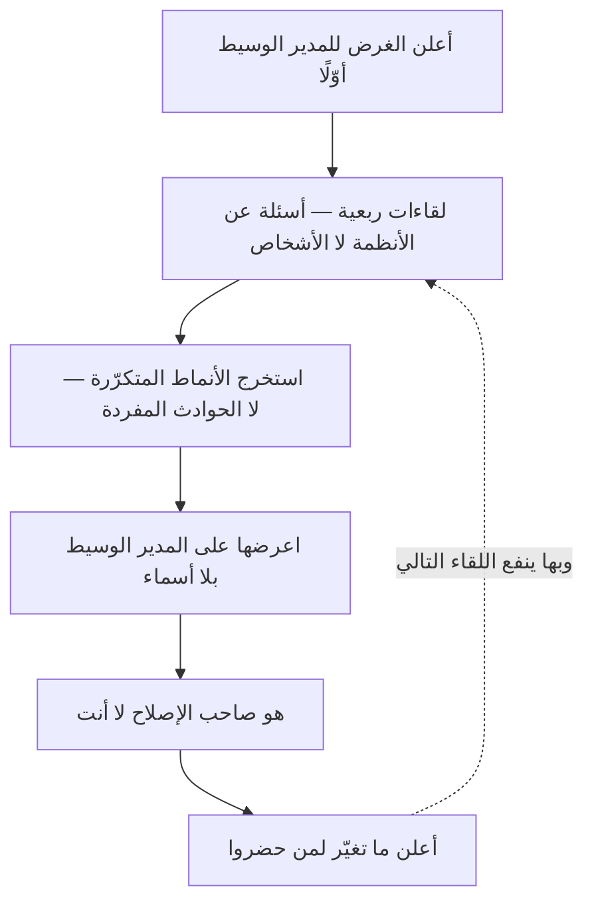

# اجتماع تخطّي المستوى (Skip-Level Meeting)

> [!info] تعريف مختصر
> **اجتماع تخطّي المستوى** لقاءٌ بين المدير و**من يعمل تحت مديرٍ يتبعه** — أي مع الطبقة التي تلي مرؤوسيه المباشرين. وغايته أن تصل القيادةَ إشاراتٌ **لا يمكن بطبيعتها أن تصل عبر السلسلة الإدارية**: ما يخصّ المدير الوسيط نفسه، وما تُصفّيه كل طبقة بحسن نيّة حتى يبلغ الأعلى مصقولًا.
> **وشرطه الحاسم أنه ليس تفتيشًا.** فإن فُهم رقابةً على المدير الوسيط أفسد ما جاء ليصلحه: تقلّ ثقة الطبقة الوسطى، ويحترس من يحضر، فلا يُقال فيه إلا ما يُقال في غيره.

## الشرح العلمي والاحترافي

**والمشكلة التي وُجد لها معروفة في نظم المعلومات**: أن المعلومة تُصقَل كلّما صعدت طبقة. **ولا يقتضي هذا سوء نيّة**؛ فكل مدير يلخّص، ويؤجّل ما يظنّ أنه سيُحلّ، ويُسقط ما يراه تفصيلًا. فيصل الأعلى خبرٌ صحيح في كل جملة، ناقصٌ في مجموعه — **وأوّل ما يسقط في الطريق هو ما يخصّ الطبقة الوسطى نفسها**، إذ لا يُتوقّع من أحد أن ينقل عن نفسه ما لا يُحمَد.

**وثلاثة أشياء يكشفها ولا يكشفها غيره:**

1. **جودة الإدارة الوسطى** كما يعيشها من تحتها لا كما تُعرض من فوقها.
2. **الفجوة بين الاستراتيجية المعلنة وما يُفهم منها** بعد أن تمرّ بطبقتين — وهي أوسع ممّا تظنّ القيادة دائمًا.
3. **العوائق النظامية المزمنة** التي تعوّد الناس عليها فلم يعودوا يذكرونها: أداة بطيئة، وموافقة تستغرق أسبوعين، وعملية يعرف الجميع أنها بلا فائدة.

**وأربع قواعد تحفظه من الانقلاب إلى ضدّه:**

1. **يُعلَن للمدير الوسيط قبله لا بعده**، ويُبيَّن غرضه. **والمفاجأة وحدها كافية لإفساده.**
2. **لا يُنقَل عنه اسم.** يُنقل النمط: «ثلاثة ذكروا بطء بيئة الاختبار» لا «قال فلان».
3. **لا يُتّخذ فيه قرار يلتفّ على المدير الوسيط.** فما ظهر منه يُعالَج **معه** لا من فوقه، وإلّا فقدَ سلطته أمام فريقه وفقدتَ أنت وسيطًا نافعًا.
4. **دوريّته متباعدة** — كل ربع أو نصف سنة — فهو أداة استشعار لا قناة إدارة يومية. **وتقريبه يجعله سلسلةً إدارية موازية**، وهي أسوأ من غيابه.

**وأسئلته تُصاغ على الأنظمة لا على الأشخاص:** «ما الذي يبطّئك ولم يُحلّ منذ ثلاثة أشهر؟» · «ما الذي تظنّ أنّا في القيادة لا نراه؟» · «لو ملكتَ تغيير شيء واحد في طريقة عملنا، فماذا؟». **أمّا «كيف ترى مديرك؟» فسؤال يُفسد اللقاء** — لأنه يعلن أن اللقاء عن الشخص، فيصمت من كان سيتكلّم عن النظام.

## أين ومتى يُستخدم

- **في المنظّمات التي تجاوزت طبقتين إداريتين**، حيث تبدأ الإشارة تنقطع فعلًا (وهذا يلتقي بحدّ [[Dunbar's Number|عدد دنبار]]).
- **بعد إعادة تنظيم أو تغيير قيادة**، فالفهم المشترك للاتّجاه يكون حينها أضعف ما يكون.
- **حين تتباين الأرقام عن الانطباع:** المؤشّرات خضراء والدوران مرتفع، أو الاسترجاعات هادئة والتسليم متعثّر.
- **قبل قرار كبير يمسّ طريقة العمل**، لسماع من سينفّذه لا من سيعرضه.

> [!warning] متى لا يُستخدَم؟
> - **في منظّمة صغيرة** ليس فيها إلا طبقة واحدة — فلا مستوى يُتخطّى، والاجتماع الفردي يكفي.
> - **بديلًا عن [[One-on-One|الاجتماع الفردي]]**: ذاك أسبوعيّ ووظيفته العائق والنموّ، وهذا ربعيّ ووظيفته الإشارة.
> - **حين تكون الثقة بالإدارة الوسطى منهارة أصلًا.** فالمشكلة حينها ليست في الإشارة بل في القرار، ولن يعالجها اجتماع.
> - **إن كنت لا تنوي التصرّف.** فالاستماع الذي لا يُتبَع بشيء يُعلّم الناس ألّا يقولوا — ويُفقدك القناة التي فتحتها.

## مثال وسيناريو تطبيقي

> [!example] «شركة نُهى» — الأرقام خضراء والمهندسون يغادرون
> **الوضع:** ثلاث طبقات، والتقارير الشهرية الصاعدة إيجابية، ومعدّل مغادرة المهندسين 22٪ في السنة.
> **ما ظهر في ستّة لقاءات ربعية** (بلا حضور المديرين الوسطاء، وبعلمهم وموافقتهم):
> - **خمسة من الستّة ذكروا الشيء نفسه:** أن نشر أيّ تغيير يحتاج موافقة يدوية تستغرق ثلاثة أيام. **ولم يرد ذلك في تقرير واحد**، لأن الفرق تعوّدت عليه فصار جزءًا من «الطبيعي».
> - **واثنان ذكرا** أن الأولويات تتبدّل بين السبرنت والآخر — وهو ما كان يصل الأعلى في صورة «مرونة عالية».
> **ما فُعل — وهو موضع الفرق:** لم يُتّخذ قرار في اللقاءات. عُرض النمط على المديرين الوسطاء بلا أسماء، **وقادوا هم الإصلاح**: أُتمتت الموافقة، وثُبّتت الأولويات داخل السبرنت.
> **النتيجة بعد ستّة أشهر:** زمن النشر من ثلاثة أيام إلى ساعتين، والمغادرة إلى 9٪.
> **والدرس:** ما كشفه الاجتماع كان **عائقًا نظاميًّا لا خللًا في أحد**. ولو نُقل بأسماء أو عُولج من فوق الوسطاء لأنتج خصومةً بدل إصلاح — **ولما تكرّر مرّة ثانية**.

## خطوات أو مخطّط

1. **أعلن الغرض للمدير الوسيط أوّلًا**، واطلب رأيه في من تلقاهم.
2. **أعلنه لمن سيحضر** أيضًا: أن غرضه الأنظمة لا التقييم، وأنه لا يُنقل باسم.
3. **اسأل عن الأنظمة والعوائق**، لا عن الأشخاص.
4. **اجمع ثلاثة إلى ستّة لقاءات** ثم استخرج **الأنماط المتكرّرة** — فالإشارة تتكوّن من التكرار لا من الحادثة الواحدة.
5. **اعرض النمط على المدير الوسيط بلا أسماء**، واجعله صاحب الإصلاح.
6. **أعلن ما تغيّر** لمن حضروا. **فهذه الخطوة وحدها هي التي تجعل اللقاء الثاني ينفع**.

## ⚠️ مفاهيم خاطئة شائعة

> [!warning]
> - **حسبانه أداة رقابة على المديرين.** هو أداة **استشعار للأنظمة**؛ ومن استعمله رقابةً أفسد قناته من أوّل جولة.
> - **الظنّ بأنه يغني عن الاجتماع الفردي.** الوظيفتان مختلفتان والدوريّتان مختلفتان.
> - **عقده بلا علم المدير الوسيط.** المفاجأة تُقرأ ارتيابًا، وتُفقدك وسيطًا كنت تحتاجه أكثر ممّا تحتاج الاجتماع.
> - **التصرّف بناءً على شكوى واحدة.** الإشارة نمطٌ متكرّر؛ والحادثة المفردة قد تكون خلافًا شخصيًّا.
> - **إجراؤه شهريًّا.** فيصير سلسلة إدارة موازية تُضعف الوسطاء وتربك من يتبع من.

## ❌ ممارسات خاطئة في المشاريع

> [!failure]
> - **السؤال المباشر عن المدير** («كيف ترى مديرك؟») — فيصمت من كان سيتكلّم عن النظام. **الحلّ:** أسئلة عن العوائق، والحكم على الإدارة يخرج ضمنًا.
> - **نقل الكلام بأسماء** — فينقطع كل قول بعدها. **الحلّ:** النمط لا القائل، ولو استُشكل ذلك.
> - **إصلاح ما ظهر من فوق الوسيط** — فيفقد سلطته ويُقرأ اللقاء التفافًا. **الحلّ:** هو صاحب الإصلاح ومُعلِنه.
> - **الاكتفاء بالاستماع** — فيتعلّم الناس أن الكلام بلا ثمرة. **الحلّ:** أعلن ما تغيّر ولو كان يسيرًا.
> - **اختيار من يحضر بالمعرفة الشخصية** — فتسمع صدى نفسك. **الحلّ:** عيّنة تشمل من لا تلقاه عادةً، والملتحقين الجدد خاصّةً فهم أحدّ الناس نظرًا لما تعوّده غيرهم.

## 🔗 مصطلحات ومفاهيم ذات صلة

[[One-on-One]] | [[Psychological Safety]] | [[Leadership at Every Level]] | [[Command and Control]] | [[Micromanagement]] | [[Radical Transparency]] | [[Dunbar's Number]] | [[Black Box Syndrome]] | [[Servant Leadership]] | [[Active Listening]] | [[Empowerment]]
